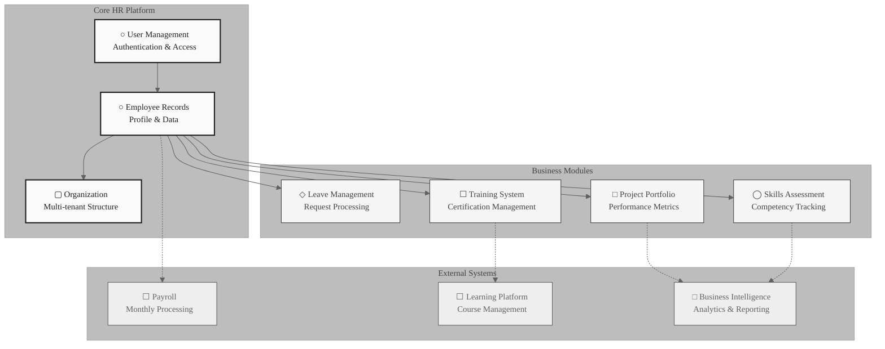

# Current User Status Full Report
## AI-HRMS-2025 System - Standard Template v1.0

---

### ☐ Executive Summary
**Generated:** [DATE]
**Subject:** [FULL_NAME]
**Position:** [POSITION]
**Organization:** [ORGANIZATION]
**Profile Completeness:** [PERCENTAGE]%

---

## ① Core User Information

| Field | Value |
|-------|-------|
| **User ID** | `[USER_ID]` |
| **Full Name** | [FULL_NAME] |
| **Email** | [EMAIL] |
| **System Role** | [ROLE] |
| **Account Status** | [STATUS_ICON] [STATUS] |
| **Employment Status** | [EMPLOYMENT_STATUS] |
| **Created** | [CREATED_DATE] |
| **Last Updated** | [UPDATED_DATE] |

### ☐ Security Information
- **Password:** [PASSWORD_STATUS]
- **2FA Enabled:** [2FA_STATUS]
- **Last Login:** [LAST_LOGIN]
- **Failed Attempts:** [FAILED_ATTEMPTS]

---

## ② Organization & Employment

### ▢ Company Details
| Field | Value |
|-------|-------|
| **Organization** | [ORGANIZATION] |
| **Industry** | [INDUSTRY] |
| **Company Size** | [SIZE] |
| **Location** | [LOCATION] |
| **Domain** | [DOMAIN] |

### ○ Employment Profile
| Field | Value |
|-------|-------|
| **Position** | [POSITION] |
| **Department** | [DEPARTMENT] |
| **Start Date** | [START_DATE] |
| **Employment Type** | [EMPLOYMENT_TYPE] |
| **Work Mode** | [WORK_MODE] |
| **Reports To** | [REPORTS_TO] |

---

## ③ Compensation & Benefits

### ○ Compensation Package
```
Base Salary:        [BASE_SALARY] per annum
Bonus Target:       [BONUS_PERCENTAGE]% of base ([BONUS_AMOUNT])
Total Target Comp:  [TOTAL_COMP]
```

### ▢ Benefits
- **Health Insurance:** [HEALTH_PLAN]
- **Retirement:** [RETIREMENT_PLAN]
- **Car Allowance:** [CAR_ALLOWANCE]
- **Phone Allowance:** [PHONE_ALLOWANCE]
- **Vacation Days:** [VACATION_DAYS] days/year
- **Sick Leave:** [SICK_DAYS] days/year

---

## ④ Leave Management

### □ Current Balances
| Leave Type | Available | Used | Remaining |
|------------|-----------|------|-----------|
| **Vacation** | [VACATION_AVAILABLE] days | [VACATION_USED] | [VACATION_REMAINING] days |
| **Sick Leave** | [SICK_AVAILABLE] days | [SICK_USED] | [SICK_REMAINING] days |
| **Total** | [TOTAL_AVAILABLE] days | [TOTAL_USED] | [TOTAL_REMAINING] days |

### ↗ Leave Usage Visualization


#### □ Leave Usage Analytics

```mermaid
%%{init: {'theme':'base', 'themeVariables': { 'xyChart': { 'backgroundColor': '#FAFAFA', 'titleColor': '#212121', 'xAxisTextColor': '#424242', 'yAxisTextColor': '#424242', 'plotColorPalette': '#E3F2FD,#F3E5F5,#E8F5E8,#FFF3E0' }, 'fontFamily': 'Exo 2, sans-serif'}}}%%
xychart-beta
    title "Leave Usage Analysis: Current vs Target"
    x-axis ["Vacation Days", "Sick Leave", "Personal Days", "Training Days"]
    y-axis "Days Allocated" 0 --> 30
    bar [CURRENT_VALUES]
    line [TARGET_VALUES]
```

---

## ⑤ Organizational Hierarchy

### ○ Reporting Structure

```mermaid
graph TD
    [HIERARCHY_STRUCTURE]
```

### ○ Team Metrics
- **Direct Reports:** [DIRECT_REPORTS] managers
- **Total Team Size:** [TEAM_SIZE] employees
- **Span of Control:** [SPAN_CONTROL] (average)

---

## ⑥ Skills & Competencies

### ◯ Core Competencies

| Skill | Proficiency Level |
|-------|------------------|
[SKILLS_TABLE]

### ▢ Education & Certifications
[EDUCATION_LIST]

### □ Skills Assessment Radar


#### ◯ Detailed Skills Matrix

| Competency Area | Proficiency Level | Score | Assessment |
|-----------------|------------------|-------|------------|
[SKILLS_MATRIX]

---

## ⑦ Goals & Performance

### ◯ [YEAR] Objectives

| Quarter | Goal | Status |
|---------|------|--------|
[GOALS_TABLE]

### ○ Performance Metrics
- **Last Review:** [LAST_REVIEW]
- **Performance Rating:** [RATING]
- **Next Review Due:** [NEXT_REVIEW]

---

## ⑧ System Access & Permissions

### ○ Access Rights

| Module | Access Level | Permissions |
|--------|--------------|-------------|
[ACCESS_RIGHTS_TABLE]

### ◇ Security Compliance
- **GDPR Consent:** [GDPR_STATUS]
- **Data Retention:** [RETENTION_POLICY]
- **Access Audit:** [AUDIT_STATUS]
- **IP Restrictions:** [IP_RESTRICTIONS]

---

## ⑨ Training & Development

### ○ Required Certifications
| Certification | Status | Expiry Date | Renewal Due |
|---------------|--------|-------------|-------------|
[CERTIFICATIONS_TABLE]

### ◇ Compliance Status
| Area | Status | Risk Level | Action Required |
|------|--------|------------|-----------------|
[COMPLIANCE_TABLE]

### ○ Development Plan
| Development Area | Priority | Target Date | Status |
|------------------|----------|-------------|--------|
[DEVELOPMENT_TABLE]

---

## ⑩ Project Assignments & Responsibilities

### □ Active Projects
| Project Name | Role | Start Date | Progress | Priority |
|--------------|------|------------|----------|----------|
[PROJECTS_TABLE]

### ○ Project Statistics
| Metric | Value | Status |
|--------|-------|--------|
[PROJECT_STATS_TABLE]

#### ○ Portfolio Performance Metrics

```mermaid
%%{init: {'theme':'base', 'themeVariables': { 'xyChart': { 'backgroundColor': '#FAFAFA', 'titleColor': '#212121', 'xAxisTextColor': '#424242', 'yAxisTextColor': '#424242', 'plotColorPalette': '#E3F2FD,#F3E5F5,#E8F5E8,#FFF3E0' }, 'fontFamily': 'Exo 2, sans-serif'}}}%%
xychart-beta
    title "Project Completion & Resource Allocation"
    x-axis [PROJECT_NAMES]
    y-axis "Completion %" 0 --> 100
    bar [PROJECT_VALUES]
```

---

## ⑪ Emergency Contacts

### ○ Emergency Information
| Contact Type | Name | Relationship | Phone | Status |
|--------------|------|--------------|-------|--------|
[EMERGENCY_CONTACTS_TABLE]

### ▢ Medical Information
| Information | Status | Notes |
|-------------|--------|-------|
[MEDICAL_INFO_TABLE]

---

## ⑫ Communication & Contact

### ○ Contact Information

| Channel | Details |
|---------|---------|
[CONTACT_INFO_TABLE]

### ◇ Collaboration Tools
[COLLABORATION_TOOLS_LIST]

### ▢ Preferences
[PREFERENCES_LIST]

---

## ⑬ Documents & Compliance

### ☐ Employment Documents

| Document | Status | Date |
|----------|--------|------|
[EMPLOYMENT_DOCS_TABLE]

### ○ Personal Documents

| Document | Status | Expiry |
|----------|--------|--------|
[PERSONAL_DOCS_TABLE]

---

## ⑭ Data Relationships

### ◇ System Integration Architecture



---

## ⑮ Audit Trail

### ○ Recent Activity Log

| Date | Action | Details | By |
|------|--------|---------|-----|
[AUDIT_LOG_TABLE]

### ◇ Compliance Tracking
- **Last Security Review:** [LAST_SECURITY_REVIEW]
- **Next Review Due:** [NEXT_REVIEW_DATE]
- **Data Classification:** [DATA_CLASSIFICATION]
- **Retention Period:** [RETENTION_PERIOD]

---

## ○ Profile Completeness Analysis

**Overall Completeness:** [COMPLETENESS_PERCENTAGE]%


#### ○ Profile Completeness Radar Analysis


#### ○ Completeness Trends & Targets

```mermaid
%%{init: {'theme':'base', 'themeVariables': { 'xyChart': { 'backgroundColor': '#FAFAFA', 'titleColor': '#212121', 'xAxisTextColor': '#424242', 'yAxisTextColor': '#424242', 'plotColorPalette': '#4CAF50,#2196F3,#FF9800,#F44336,#9C27B0,#00BCD4,#795548' }, 'fontFamily': 'Exo 2, sans-serif'}}}%%
xychart-beta
    title "Profile Completion Status vs Targets"
    x-axis ["Personal", "Employment", "Skills", "Emergency", "Performance", "Docs", "Access"]
    y-axis "Completion %" 0 --> 100
    bar [CURRENT_BARS]
    line [TARGET_LINES]
```

#### ○ Data Quality Scorecard

| Profile Category | Current | Target | Status | Priority | Action Required |
|------------------|---------|---------|---------|----------|-----------------|
[DATA_QUALITY_TABLE]

### ✅ Complete ([COMPLETE_PCT]%)
[COMPLETE_ITEMS_LIST]

### ❌ Missing/Incomplete ([INCOMPLETE_PCT]%)
[INCOMPLETE_ITEMS_LIST]

---

## ○ Recommended Actions

1. **Immediate (This Week)**
   [IMMEDIATE_ACTIONS]

2. **Short-term (This Month)**
   [SHORT_TERM_ACTIONS]

3. **Long-term (This Quarter)**
   [LONG_TERM_ACTIONS]

---

## ◇ Data Privacy Notice

> **CONFIDENTIAL**: This user folder contains sensitive personal and employment information. Access is restricted to authorized personnel only. Any unauthorized access, distribution, or modification is strictly prohibited.

**Data Protection Officer:** [DPO_EMAIL]
**Last Updated:** [UPDATE_DATE]
**Version:** [VERSION]

---

## ◯ Executive Dashboard

### □ Key Performance Indicators

```mermaid
%%{init: {'theme':'base', 'themeVariables': { 'xyChart': { 'backgroundColor': '#FAFAFA', 'titleColor': '#212121', 'xAxisTextColor': '#424242', 'yAxisTextColor': '#424242', 'plotColorPalette': '#E3F2FD,#F3E5F5,#E8F5E8,#FFF3E0,#FFE0E6,#E0F2E7' }, 'fontFamily': 'Exo 2, sans-serif'}}}%%
xychart-beta
    title "Executive Performance Scorecard - [FULL_NAME]"
    x-axis ["Skills Mastery", "Project Delivery", "Goal Achievement", "Training Progress", "Compliance Score", "Team Engagement"]
    y-axis "Performance Index" 0 --> 100
    bar [KPI_CURRENT_VALUES]
    line [KPI_TARGET_VALUES]
```

#### ○ Performance Metrics Overview

| KPI Category | Current Score | Target | Trend | Status | Action Required |
|--------------|---------------|--------|-------|---------|-----------------|
[KPI_METRICS_TABLE]

### ○ Strategic Objectives Dashboard

#### [PERIOD] Executive Goals

| Strategic Goal | Progress | Target Date | Risk Level | Owner | Dependencies |
|----------------|----------|-------------|------------|-------|--------------|
[STRATEGIC_GOALS_TABLE]

### ○ Action Items & Strategic Priorities

#### Immediate Focus (Next 30 Days)
[IMMEDIATE_FOCUS_LIST]

#### Strategic Initiatives (Next Quarter)
[STRATEGIC_INITIATIVES_LIST]

### 🏅 Recognition & Achievements

#### Recent Executive Accomplishments
[ACHIEVEMENTS_LIST]

---

### ○ Attachments Available
[ATTACHMENTS_LIST]

### ○ Related Systems
[RELATED_SYSTEMS_LIST]

---

*This document is automatically generated from the AI-HRMS-2025 database. For corrections or updates, please contact HR at [HR_EMAIL]*

---

## TEMPLATE CONFIGURATION NOTES

### Icon Legend (Material Design Outline Monochrome)
- ☐ : Empty checkbox (sections/headers)
- ○ : Circle outline (primary items)
- ◇ : Diamond outline (special items)
- □ : Square outline (standard items)
- ▢ : Rectangle outline (company/org items)
- ◯ : Large circle outline (major sections)
- ① ② ③ ④ ⑤ ⑥ ⑦ ⑧ ⑨ ⑩ ⑪ ⑫ ⑬ ⑭ ⑮ : Section numbers

### Chart Configuration Standards
1. **Pie Charts**: Pale colors with labels showing percentages
2. **Radar Charts**: Use `radar-beta` syntax with legend
3. **XY Charts**: Multi-color palette for bars
4. **Font Family**: Exo 2, sans-serif throughout
5. **Color Palette**: Material Design colors (pale variants preferred)

### Data Presentation Standards
- Tables use markdown format with clear headers
- Numerical data includes units and formatting
- Status indicators: ✅ (complete), ❌ (missing), ⚠️ (warning), 🟢 (good), 🟡 (caution), 🔴 (critical)
- Progress bars and percentages for completeness metrics

### Version Control
- Template Version: 1.0
- Last Updated: September 17, 2025
- Maintained by: AI-HRMS-2025 Development Team