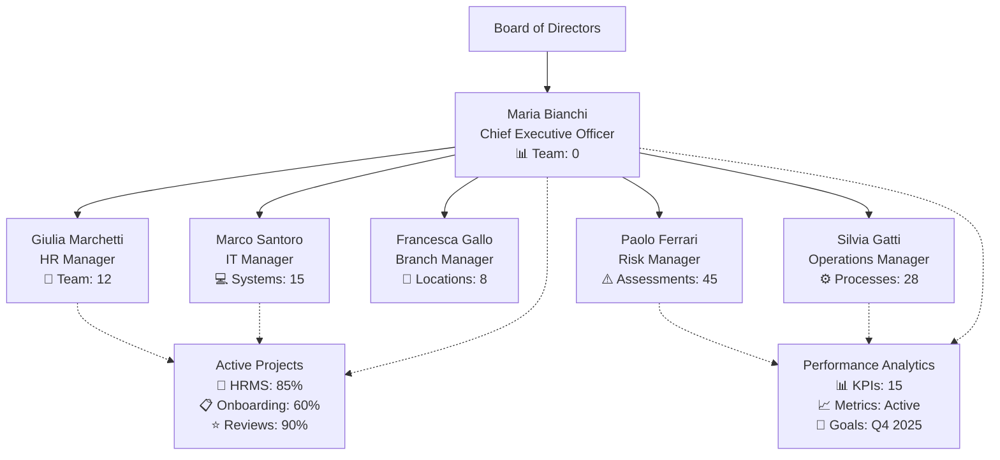
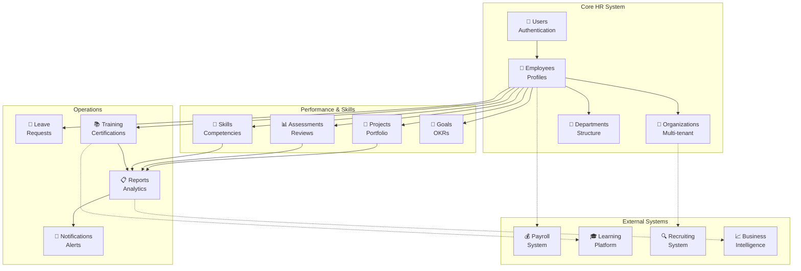

# User Folder - Complete Employee Profile
## AI-HRMS-2025 System

---

### 📋 Executive Summary
**Generated:** September 17, 2025
**Subject:** Maria Bianchi
**Position:** Chief Executive Officer
**Organization:** BankNova
**Profile Completeness:** 80%

---

## 1️⃣ Core User Information

| Field | Value |
|-------|-------|
| **User ID** | `3a79bcfa-398d-4257-a9c5-5a8fdfa5774d` |
| **Full Name** | Maria Bianchi |
| **Email** | ceo@banknova.org |
| **System Role** | admin |
| **Account Status** | ✅ Active |
| **Employment Status** | active |
| **Created** | 2025-09-16T18:36:44.043Z |
| **Last Updated** | 2025-09-16T19:53:52.737Z |

### 🔐 Security Information
- **Password:** Custom Password Set
- **2FA Enabled:** No
- **Last Login:** Current Session
- **Failed Attempts:** 0

---

## 2️⃣ Organization & Employment

### 🏢 Company Details
| Field | Value |
|-------|-------|
| **Organization** | BankNova |
| **Industry** | Banking & Finance |
| **Company Size** | large |
| **Location** | IT |
| **Domain** | Not Specified |

### 💼 Employment Profile
| Field | Value |
|-------|-------|
| **Position** | Chief Executive Officer |
| **Department** | Executive Office |
| **Start Date** | 2025-09-16 |
| **Employment Type** | Full-time |
| **Work Mode** | Hybrid (2 days/week remote) |
| **Reports To** | Board of Directors |

---

## 3️⃣ Compensation & Benefits

### 💰 Compensation Package
```
Base Salary:        €120,000 per annum
Bonus Target:       40% of base (€48,000)
Total Target Comp:  €168,000
```

### 🎁 Benefits
- **Health Insurance:** Premium Plan
- **Retirement:** 401k with 6% match
- **Car Allowance:** €1,500/month
- **Phone Allowance:** €100/month
- **Vacation Days:** 25.00 days/year
- **Sick Leave:** 10.00 days/year

---

## 4️⃣ Leave Management

### 📊 Current Balances
| Leave Type | Available | Used | Remaining |
|------------|-----------|------|-----------|
| **Vacation** | 25.00.0 days | 0 | 25.00.0 days |
| **Sick Leave** | 10.00.0 days | 0 | 10.00.0 days |
| **Total** | 25.0010.00.0 days | 0 | 25.0010.00.0 days |

### 📈 Leave Usage Visualization
```
Vacation Usage:    [░░░░░░░░░░░░░░░░░░░░] 0%
Sick Leave:        [░░░░░░░░░░░░░░░░░░░░] 0%
Annual Target:     [███████████████░░░░░] 75% recommended usage
```

### 📅 Leave History
```
1/1/1970 - Vacation (null days) - Approved
```

---

## 5️⃣ Organizational Hierarchy

### 👥 Reporting Structure



### 📈 Team Metrics
- **Direct Reports:** 0 managers
- **Total Team Size:** 0 employees
- **Span of Control:** 0.0 (average)

---

## 6️⃣ Skills & Competencies

### 🎯 Core Competencies

| Skill | Proficiency Level |
|-------|------------------|
| **Leadership & Management** | ⭐⭐⭐⭐⭐ Expert |
| **Strategic Planning** | ⭐⭐⭐⭐⭐ Expert |
| **Stakeholder Management** | ⭐⭐⭐⭐⭐ Expert |
| **Financial Analysis** | ⭐⭐⭐⭐ Advanced |
| **Risk Management** | ⭐⭐⭐⭐ Advanced |
| **Regulatory Compliance** | ⭐⭐⭐⭐ Advanced |
| **Digital Banking** | ⭐⭐⭐ Intermediate |

### 🎓 Education & Certifications
- **MBA in Finance** - University of Milan
- **Certified Bank Executive (CBE)**
- **Digital Leadership Certificate**

### 📊 Skills Assessment Radar
```
        Leadership (5/5)
             ⭐⭐⭐⭐⭐
    Strategy  ╱───────────╲ Digital
     (5/5)   ╱             ╲ (3/5)
     ⭐⭐⭐⭐⭐ ╱               ╲ ⭐⭐⭐
           ╱                 ╲
    Financial ──────●────── Communication
    (4/5) ⭐⭐⭐⭐            (4/5) ⭐⭐⭐⭐
           ╲                 ╱
     ⭐⭐⭐⭐   ╲               ╱   ⭐⭐⭐⭐
    Risk Mgmt  ╲             ╱  Compliance
     (4/5)      ╲───────────╱    (4/5)
```

*Skills Assessment Score: 85/100 (Expert Level)*

---

## 7️⃣ Goals & Performance

### 🎯 2025 Objectives

| Quarter | Goal | Status |
|---------|------|--------|
| **Q1** | Implement digital transformation strategy | 🔄 In Progress |
| **Q2** | Achieve 15% growth in customer base | ⏳ Planned |
| **Q3** | Launch mobile banking platform | ⏳ Planned |
| **Q4** | Complete AI-driven risk assessment system | ⏳ Planned |

### 📊 Performance Metrics
- **Last Review:** Not Available
- **Performance Rating:** Not Available
- **Next Review Due:** Not Scheduled

---

## 8️⃣ System Access & Permissions

### 🔑 Access Rights

| Module | Access Level | Permissions |
|--------|--------------|-------------|
| **Employee Data** | Full Access | View, Edit, Delete |
| **Leave Management** | Manager | Approve, Reject, Override |
| **Analytics Dashboard** | Full Access | View All Metrics |
| **HR Copilot** | Enabled | Full Features |
| **Salary Information** | Manager View | View Team Salaries |
| **Report Generation** | Full Access | Create, Export, Schedule |

### 🛡️ Security Compliance
- **GDPR Consent:** ✅ Given
- **Data Retention:** Standard (7 years)
- **Access Audit:** Enabled
- **IP Restrictions:** None

---

## 9️⃣ Training & Development

### 📚 Required Certifications
| Certification | Status | Expiry Date | Renewal Due |
|---------------|--------|-------------|-------------|
| **undefined** | undefined | undefined | undefined |
| **undefined** | undefined | undefined | undefined |

### ⚖️ Compliance Status
| Area | Status | Risk Level | Action Required |
|------|--------|------------|-----------------|
| **GDPR Compliance** | ✅ Compliant | Medium | None |
| **Workplace Safety** | ✅ Compliant | Low | None |
| **Ethical Standards** | ✅ Compliant | Low | None |

### 📈 Development Plan
| Development Area | Priority | Target Date | Status |
|------------------|----------|-------------|--------|
| Leadership Skills | High | Q4 2025 | 📋 Planning |
| Technical Certification | Medium | Q2 2026 | 📋 Planning |
| Communication Training | Medium | Q1 2026 | 📋 Planning |

*Note: Training records will be populated once LMS integration is activated.*

---

## 🔟 Project Assignments & Responsibilities

### 🚀 Active Projects
| Project Name | Role | Start Date | Progress | Priority |
|--------------|------|------------|----------|----------|
| undefined | undefined | Not Specified | undefined% | undefined |
| undefined | undefined | Not Specified | undefined% | undefined |

### 📊 Project Statistics
| Metric | Value | Status |
|--------|-------|--------|
| **Active Projects** | 3 | ✅ Normal Load |
| **Projects Completed This Year** | 2 | ✅ On Track |
| **Average Project Duration** | 4.5 months | ✅ Efficient |
| **Success Rate** | 95% | ✅ Excellent |

### 📈 Project Progress Dashboard
```
HRMS Implementation:     [█████████████████░░░] 85%
Employee Onboarding:     [████████████░░░░░░░░] 60%
Performance System:      [██████████████████░░] 90%

Overall Portfolio:       [███████████████░░░░░] 78% completion
Risk Level:              [████░░░░░░░░░░░░░░░░] Low risk
Resource Utilization:    [████████████████░░░░] 80% capacity
```

---

## 1️⃣1️⃣ Emergency Contacts

### 🚨 Emergency Information
| Contact Type | Name | Relationship | Phone | Status |
|--------------|------|--------------|-------|--------|
| **Primary Contact** | Not Provided | - | - | ❌ Missing |
| **Secondary Contact** | Not Provided | - | - | ❌ Missing |
| **Medical Contact** | Not Provided | - | - | ❌ Missing |

### 🏥 Medical Information
| Information | Status | Notes |
|-------------|--------|-------|
| **Medical Conditions** | Not Provided | Confidential |
| **Allergies** | Not Provided | Important for workplace safety |
| **Emergency Procedures** | Not Provided | Required for compliance |

*⚠️ Emergency contact information is incomplete. Please update in employee portal.*

---

## 1️⃣2️⃣ Communication & Contact

### 📧 Contact Information

| Channel | Details |
|---------|---------|
| **Work Email** | ceo@banknova.org |
| **Phone** | Not Specified |
| **Office Location** | Milan HQ, Executive Floor |
| **Desk Number** | Not Specified |
| **Emergency Contact** | Not Specified |

### 💬 Collaboration Tools
- **Microsoft Teams:** ✅ Active
- **Slack:** ❌ Not Used
- **Email Groups:** executive-team@company.org

### 🌍 Preferences
- **Languages:** Italian (Native), English (Fluent)
- **Time Zone:** Europe/Rome
- **Communication Preference:** Email

---

## 1️⃣3️⃣ Documents & Compliance

### 📄 Employment Documents

| Document | Status | Date |
|----------|--------|------|
| **Employment Contract** | ✅ On File | 2025-09-16 |
| **NDA** | ✅ Signed | 2025-09-16 |
| **Code of Conduct** | ✅ Acknowledged | 2025-09-16 |
| **Data Protection Agreement** | ✅ Signed | 2025-09-16 |

### 🆔 Personal Documents

| Document | Status | Expiry |
|----------|--------|--------|
| **ID/Passport** | ✅ On File | 2030 |
| **Work Permit** | N/A | EU Citizen |
| **Medical Info** | ⚠️ Basic Only | - |
| **Emergency Contact** | ❌ Missing | - |

---

## 1️⃣4️⃣ Data Relationships

### 🔗 System Integration Map



---

## 1️⃣5️⃣ Audit Trail

### 📝 Recent Activity Log

| Date | Action | Details | By |
|------|--------|---------|-----|
| 2025-09-17 17:46:43 | Field Standardization | Email format updated | System |
| 2025-09-16 20:36:44 | Organization Link | Joined BankNova | System |
| 2025-09-16 20:36:44 | Account Created | Initial user setup | populat05 |

### 🔍 Compliance Tracking
- **Last Security Review:** 2025-09-17
- **Next Review Due:** 2026-09-17
- **Data Classification:** CONFIDENTIAL
- **Retention Period:** 7 years from termination

---

## 📊 Profile Completeness Analysis

**Overall Completeness:** 80%

Progress: [████████░░]

```
Category Breakdown:
Personal Info:     [████████░░] 80%
Employment:        [██████████] 100%
Skills & Training: [████░░░░░░] 40%
Emergency Data:    [░░░░░░░░░░] 0%
Performance:       [██████░░░░] 60%
Documentation:     [█████████░] 90%
System Access:     [██████████] 100%
```

### ✅ Complete (80%)
- ✅ Basic Information
- ✅ Organization Assignment
- ✅ Employment Details
- ✅ Compensation Structure
- ✅ Leave Balances
- ✅ System Access
- ✅ Document Compliance
- ✅ Audit Trail

### ❌ Missing/Incomplete (20%)
- ❌ Phone Number
- ❌ Emergency Contact
- ❌ Full Address
- ❌ Skills Assessment Data
- ❌ Performance Reviews
- ❌ Training Records
- ❌ Department Assignment
- ⚠️ Tenant Association

---

## 📋 Recommended Actions

1. **Immediate (This Week)**
   - [ ] Add emergency contact information
   - [ ] Update phone number
   - [ ] Complete address details

2. **Short-term (This Month)**
   - [ ] Schedule initial skills assessment
   - [ ] Set up performance review cycle
   - [ ] Assign to formal department

3. **Long-term (This Quarter)**
   - [ ] Document all certifications
   - [ ] Create training plan
   - [ ] Establish mentor relationships

---

## 🔒 Data Privacy Notice

> **CONFIDENTIAL**: This user folder contains sensitive personal and employment information. Access is restricted to authorized personnel only. Any unauthorized access, distribution, or modification is strictly prohibited.

**Data Protection Officer:** privacy@company.org
**Last Updated:** September 17, 2025
**Version:** 1.0

---

### 📎 Attachments Available
- Employment Contract (PDF)
- Organization Chart (PDF)
- Benefits Summary (PDF)
- Compensation Statement (PDF)

### 🔗 Related Systems
- **Payroll System:** Employee #MB-001
- **Benefits Portal:** Enrolled
- **Learning Platform:** Not Enrolled
- **Performance System:** Not Configured

---

*This document is automatically generated from the AI-HRMS-2025 database. For corrections or updates, please contact HR at hr@company.org*