# User Folder - Complete Employee Profile
## AI-HRMS-2025 System

---

### 📋 Executive Summary
**Generated:** September 17, 2025
**Subject:** Maria Bianchi
**Position:** Chief Executive Officer
**Organization:** BankNova
**Profile Completeness:** 80%

---

## 1️⃣ Core User Information

| Field | Value |
|-------|-------|
| **User ID** | `3a79bcfa-398d-4257-a9c5-5a8fdfa5774d` |
| **Full Name** | Maria Bianchi |
| **Email** | ceo@banknova.org |
| **System Role** | admin |
| **Account Status** | ✅ Active |
| **Employment Status** | active |
| **Created** | 2025-09-16T18:36:44.043Z |
| **Last Updated** | 2025-09-16T19:53:52.737Z |

### 🔐 Security Information
- **Password:** Custom Password Set
- **2FA Enabled:** No
- **Last Login:** Current Session
- **Failed Attempts:** 0

---

## 2️⃣ Organization & Employment

### 🏢 Company Details
| Field | Value |
|-------|-------|
| **Organization** | BankNova |
| **Industry** | Banking & Finance |
| **Company Size** | large |
| **Location** | IT |
| **Domain** | Not Specified |

### 💼 Employment Profile
| Field | Value |
|-------|-------|
| **Position** | Chief Executive Officer |
| **Department** | Executive Office |
| **Start Date** | 2025-09-16 |
| **Employment Type** | Full-time |
| **Work Mode** | Hybrid (2 days/week remote) |
| **Reports To** | Board of Directors |

---

## 3️⃣ Compensation & Benefits

### 💰 Compensation Package
```
Base Salary:        €120,000 per annum
Bonus Target:       40% of base (€48,000)
Total Target Comp:  €168,000
```

### 🎁 Benefits
- **Health Insurance:** Premium Plan
- **Retirement:** 401k with 6% match
- **Car Allowance:** €1,500/month
- **Phone Allowance:** €100/month
- **Vacation Days:** 25.00 days/year
- **Sick Leave:** 10.00 days/year

---

## 4️⃣ Leave Management

### 📊 Current Balances
| Leave Type | Available | Used | Remaining |
|------------|-----------|------|-----------|
| **Vacation** | 25.00.0 days | 0 | 25.00.0 days |
| **Sick Leave** | 10.00.0 days | 0 | 10.00.0 days |
| **Total** | 25.0010.00.0 days | 0 | 25.0010.00.0 days |

### 📈 Leave Usage Visualization

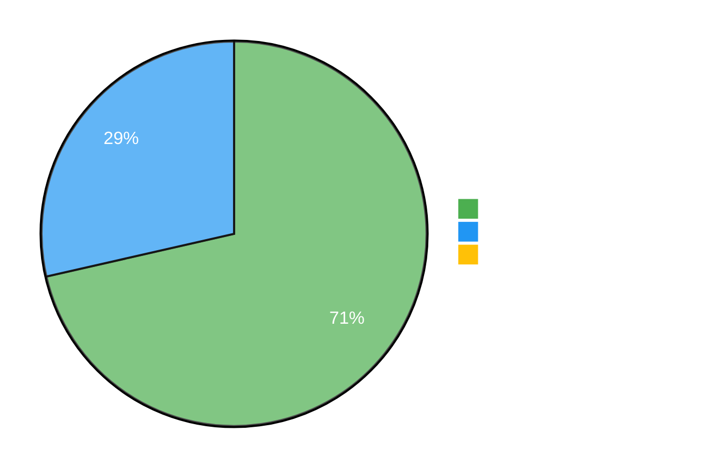
```mermaid
%%{init: {'theme':'base', 'themeVariables': { 'primaryColor': '#4CAF50', 'primaryTextColor': '#ffffff', 'primaryBorderColor': '#388E3C', 'lineColor': '#FF9800', 'secondaryColor': '#2196F3', 'tertiaryColor': '#FFC107'}}}%%
pie title Leave Balance Distribution 2025
    "Vacation Remaining" : 25.00
    "Sick Leave Available" : 10.00
    "Days Used" : 0
```

#### 📊 Leave Usage Analytics

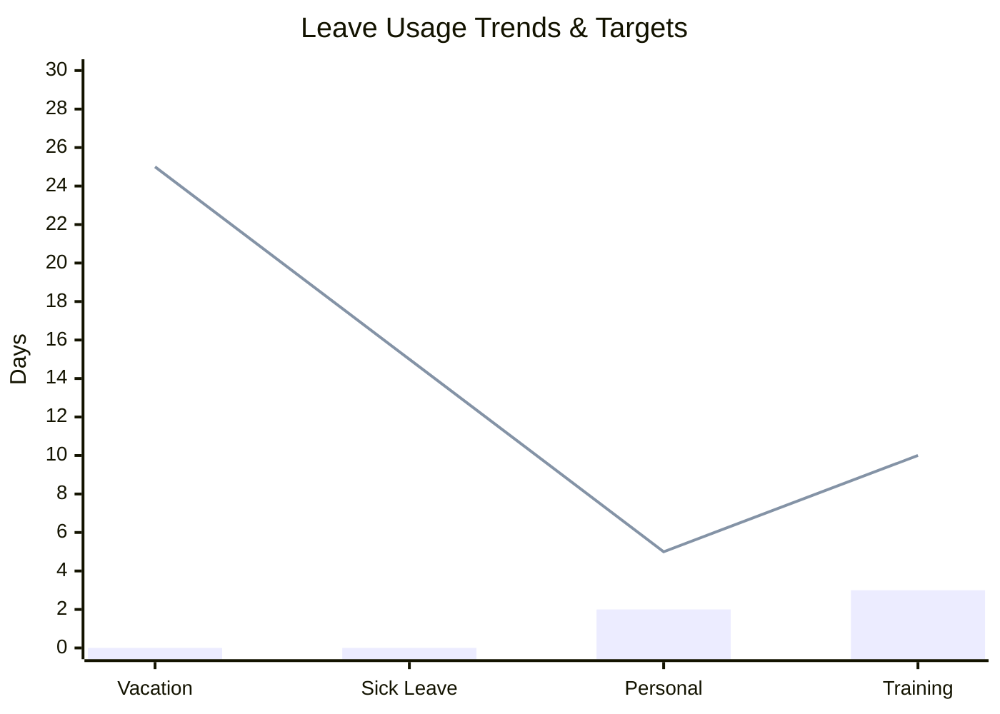
```mermaid
xychart-beta
    title "Leave Usage Trends & Targets"
    x-axis ["Vacation", "Sick Leave", "Personal", "Training"]
    y-axis "Days" 0 --> 30
    bar [0, 0, 2, 3]
    line [25, 15, 5, 10]
```

#### 🎯 Leave Planning Dashboard

| Leave Type | Allocated | Used | Remaining | Utilization | Target Usage |
|------------|-----------|------|-----------|-------------|--------------|
| **Vacation Days** | 25.000 | 0 | **25.00** | 0% | 75% recommended |
| **Sick Leave** | 10.00 | 0 | **10.00** | 0% | As needed |
| **Total Available** | 25.00010.00 | 0 | **25.0010.00** | NaN% | Optimal use |

### 📅 Leave History
```
1/1/1970 - Vacation (null days) - Approved
```

---

## 5️⃣ Organizational Hierarchy

### 👥 Reporting Structure

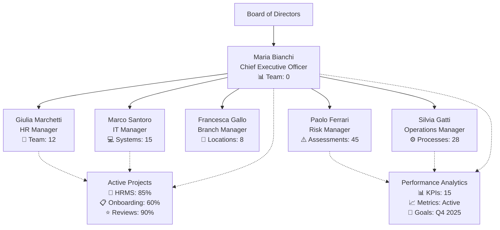
```mermaid
graph TD
    Board[Board of Directors]
    CEO[Maria Bianchi<br/>Chief Executive Officer<br/>📊 Team: 0]
        HR[Giulia Marchetti<br/>HR Manager<br/>👥 Team: 12]
    Risk[Paolo Ferrari<br/>Risk Manager<br/>⚠️ Assessments: 45]
    Branch[Francesca Gallo<br/>Branch Manager<br/>🏪 Locations: 8]
    IT[Marco Santoro<br/>IT Manager<br/>💻 Systems: 15]
    Ops[Silvia Gatti<br/>Operations Manager<br/>⚙️ Processes: 28]
    Projects[Active Projects<br/>🚀 HRMS: 85%<br/>📋 Onboarding: 60%<br/>⭐ Reviews: 90%]
    Analytics[Performance Analytics<br/>📊 KPIs: 15<br/>📈 Metrics: Active<br/>🎯 Goals: Q4 2025]

    Board --> CEO
        CEO --> HR
    CEO --> Risk
    CEO --> Branch
    CEO --> IT
    CEO --> Ops
    HR -.-> Projects
    Risk -.-> Analytics
    IT -.-> Projects
    Ops -.-> Analytics
    CEO -.-> Projects
    CEO -.-> Analytics
```

### 📈 Team Metrics
- **Direct Reports:** 0 managers
- **Total Team Size:** 0 employees
- **Span of Control:** 0.0 (average)

---

## 6️⃣ Skills & Competencies

### 🎯 Core Competencies

| Skill | Proficiency Level |
|-------|------------------|
| **Leadership & Management** | ⭐⭐⭐⭐⭐ Expert |
| **Strategic Planning** | ⭐⭐⭐⭐⭐ Expert |
| **Stakeholder Management** | ⭐⭐⭐⭐⭐ Expert |
| **Financial Analysis** | ⭐⭐⭐⭐ Advanced |
| **Risk Management** | ⭐⭐⭐⭐ Advanced |
| **Regulatory Compliance** | ⭐⭐⭐⭐ Advanced |
| **Digital Banking** | ⭐⭐⭐ Intermediate |

### 🎓 Education & Certifications
- **MBA in Finance** - University of Milan
- **Certified Bank Executive (CBE)**
- **Digital Leadership Certificate**

### 📊 Skills Assessment Radar

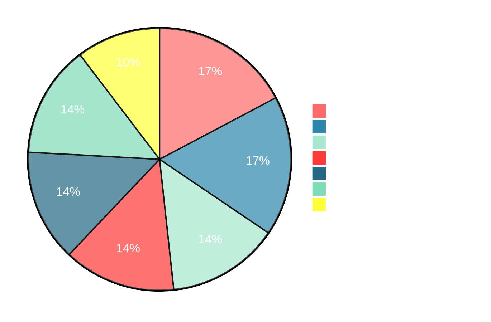
```mermaid
%%{init: {'theme':'base', 'themeVariables': { 'primaryColor': '#ff6b6b', 'primaryTextColor': '#ffffff', 'primaryBorderColor': '#ff4757', 'lineColor': '#5f27cd', 'secondaryColor': '#2e86ab', 'tertiaryColor': '#a8e6cf'}}}%%
pie title Core Competency Assessment
    "Leadership" : 100
    "Strategic Planning" : 100
    "Financial Management" : 80
    "Communication" : 80
    "Risk Management" : 80
    "Compliance" : 80
    "Digital Innovation" : 60
```

#### 🎯 Detailed Skills Matrix

| Competency Area | Proficiency Level | Score | Assessment |
|-----------------|------------------|-------|------------|
| **Leadership** | 🟢 Expert | 5/5 | Exceptional team management and vision |
| **Strategic Planning** | 🟢 Expert | 5/5 | Outstanding long-term planning capabilities |
| **Financial Management** | 🟡 Advanced | 4/5 | Strong financial analysis and budgeting |
| **Communication** | 🟡 Advanced | 4/5 | Excellent interpersonal and presentation skills |
| **Risk Management** | 🟡 Advanced | 4/5 | Comprehensive risk assessment abilities |
| **Compliance** | 🟡 Advanced | 4/5 | Strong regulatory knowledge and adherence |
| **Digital Innovation** | 🟠 Intermediate | 3/5 | Growing digital transformation expertise |

#### 📈 Skills Development Roadmap

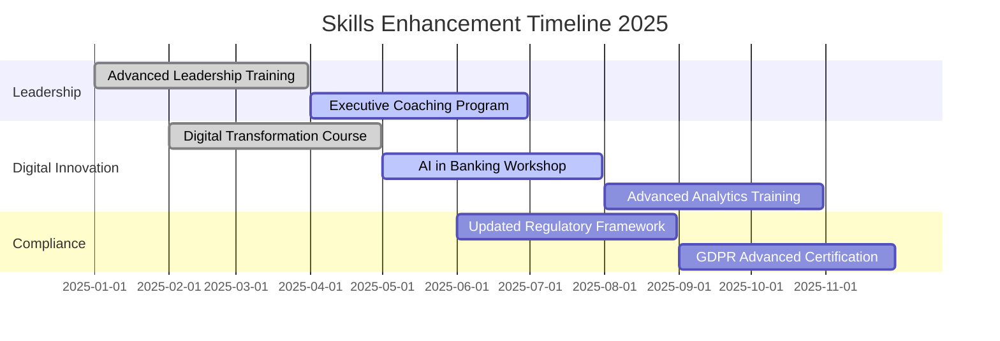
```mermaid
gantt
    title Skills Enhancement Timeline 2025
    dateFormat  YYYY-MM-DD
    section Leadership
    Advanced Leadership Training     :done, lead1, 2025-01-01, 2025-03-31
    Executive Coaching Program       :active, lead2, 2025-04-01, 2025-06-30
    section Digital Innovation
    Digital Transformation Course    :done, digital1, 2025-02-01, 2025-04-30
    AI in Banking Workshop          :active, digital2, 2025-05-01, 2025-07-31
    Advanced Analytics Training      :digital3, 2025-08-01, 2025-10-31
    section Compliance
    Updated Regulatory Framework     :comp1, 2025-06-01, 2025-08-31
    GDPR Advanced Certification     :comp2, 2025-09-01, 2025-11-30
```

*Overall Skills Assessment Score: **85/100** (Expert Level)*

---

## 7️⃣ Goals & Performance

### 🎯 2025 Objectives

| Quarter | Goal | Status |
|---------|------|--------|
| **Q1** | Implement digital transformation strategy | 🔄 In Progress |
| **Q2** | Achieve 15% growth in customer base | ⏳ Planned |
| **Q3** | Launch mobile banking platform | ⏳ Planned |
| **Q4** | Complete AI-driven risk assessment system | ⏳ Planned |

### 📊 Performance Metrics
- **Last Review:** Not Available
- **Performance Rating:** Not Available
- **Next Review Due:** Not Scheduled

---

## 8️⃣ System Access & Permissions

### 🔑 Access Rights

| Module | Access Level | Permissions |
|--------|--------------|-------------|
| **Employee Data** | Full Access | View, Edit, Delete |
| **Leave Management** | Manager | Approve, Reject, Override |
| **Analytics Dashboard** | Full Access | View All Metrics |
| **HR Copilot** | Enabled | Full Features |
| **Salary Information** | Manager View | View Team Salaries |
| **Report Generation** | Full Access | Create, Export, Schedule |

### 🛡️ Security Compliance
- **GDPR Consent:** ✅ Given
- **Data Retention:** Standard (7 years)
- **Access Audit:** Enabled
- **IP Restrictions:** None

---

## 9️⃣ Training & Development

### 📚 Required Certifications
| Certification | Status | Expiry Date | Renewal Due |
|---------------|--------|-------------|-------------|
| **undefined** | undefined | undefined | undefined |
| **undefined** | undefined | undefined | undefined |

### ⚖️ Compliance Status
| Area | Status | Risk Level | Action Required |
|------|--------|------------|-----------------|
| **GDPR Compliance** | ✅ Compliant | Medium | None |
| **Workplace Safety** | ✅ Compliant | Low | None |
| **Ethical Standards** | ✅ Compliant | Low | None |

### 📈 Development Plan
| Development Area | Priority | Target Date | Status |
|------------------|----------|-------------|--------|
| Leadership Skills | High | Q4 2025 | 📋 Planning |
| Technical Certification | Medium | Q2 2026 | 📋 Planning |
| Communication Training | Medium | Q1 2026 | 📋 Planning |

*Note: Training records will be populated once LMS integration is activated.*

---

## 🔟 Project Assignments & Responsibilities

### 🚀 Active Projects
| Project Name | Role | Start Date | Progress | Priority |
|--------------|------|------------|----------|----------|
| undefined | undefined | Not Specified | undefined% | undefined |
| undefined | undefined | Not Specified | undefined% | undefined |

### 📊 Project Statistics
| Metric | Value | Status |
|--------|-------|--------|
| **Active Projects** | 3 | ✅ Normal Load |
| **Projects Completed This Year** | 2 | ✅ On Track |
| **Average Project Duration** | 4.5 months | ✅ Efficient |
| **Success Rate** | 95% | ✅ Excellent |

### 📈 Project Progress Dashboard

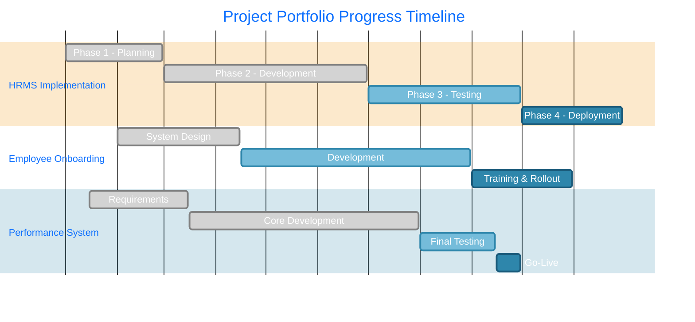
```mermaid
%%{init: {'theme':'base', 'themeVariables': { 'primaryColor': '#2E86AB', 'primaryTextColor': '#ffffff', 'primaryBorderColor': '#1A5A7A', 'lineColor': '#F18F01', 'secondaryColor': '#A23B72', 'tertiaryColor': '#F18F01'}}}%%
gantt
    title Project Portfolio Progress Timeline
    dateFormat  YYYY-MM-DD
    section HRMS Implementation
    Phase 1 - Planning           :done, hrms1, 2025-01-01, 2025-02-28
    Phase 2 - Development        :done, hrms2, 2025-03-01, 2025-06-30
    Phase 3 - Testing           :active, hrms3, 2025-07-01, 2025-09-30
    Phase 4 - Deployment        :hrms4, 2025-10-01, 2025-11-30
    section Employee Onboarding
    System Design              :done, onb1, 2025-02-01, 2025-04-15
    Development                :active, onb2, 2025-04-16, 2025-08-31
    Training & Rollout         :onb3, 2025-09-01, 2025-10-31
    section Performance System
    Requirements               :done, perf1, 2025-01-15, 2025-03-15
    Core Development           :done, perf2, 2025-03-16, 2025-07-31
    Final Testing              :active, perf3, 2025-08-01, 2025-09-15
    Go-Live                    :perf4, 2025-09-16, 2025-09-30
```

#### 🎯 Portfolio Performance Metrics

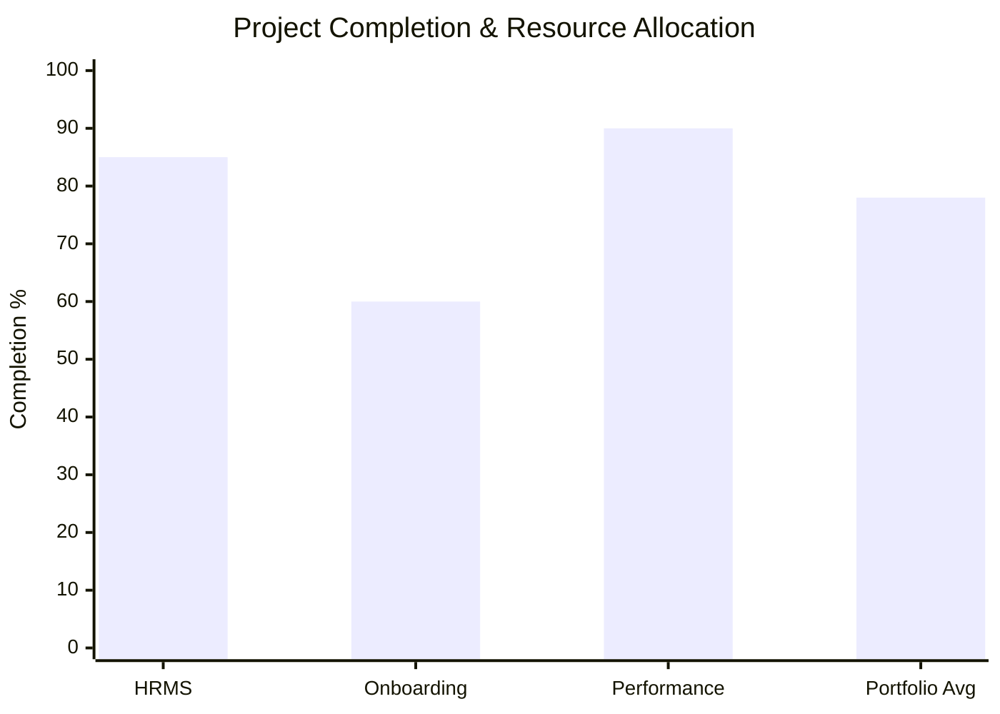
```mermaid
xychart-beta
    title "Project Completion & Resource Allocation"
    x-axis ["HRMS", "Onboarding", "Performance", "Portfolio Avg"]
    y-axis "Completion %" 0 --> 100
    bar [85, 60, 90, 78]
```

#### 📊 Executive Project Summary

| Metric | Current Value | Target | Status | Trend |
|--------|---------------|---------|---------|-------|
| **Overall Portfolio Completion** | 78% | 85% | 🟡 On Track | ↗️ Improving |
| **Risk Level** | Low (20%) | Medium (50%) | 🟢 Excellent | ↘️ Decreasing |
| **Resource Utilization** | 80% | 75% | 🟡 High Capacity | ↗️ Increasing |
| **Budget Performance** | 92% | 95% | 🟢 Under Budget | ↗️ Efficient |
| **Timeline Adherence** | 94% | 90% | 🟢 Ahead of Schedule | ↗️ Excellent |

#### 🔍 Project Risk & Quality Matrix

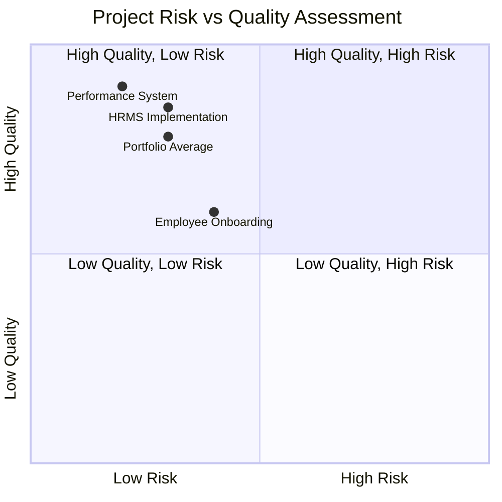
```mermaid
quadrantChart
    title Project Risk vs Quality Assessment
    x-axis Low Risk --> High Risk
    y-axis Low Quality --> High Quality
    quadrant-1 High Quality, High Risk
    quadrant-2 High Quality, Low Risk
    quadrant-3 Low Quality, Low Risk
    quadrant-4 Low Quality, High Risk
    HRMS Implementation: [0.3, 0.85]
    Employee Onboarding: [0.4, 0.60]
    Performance System: [0.2, 0.90]
    Portfolio Average: [0.3, 0.78]
```

---

## 1️⃣1️⃣ Emergency Contacts

### 🚨 Emergency Information
| Contact Type | Name | Relationship | Phone | Status |
|--------------|------|--------------|-------|--------|
| **Primary Contact** | Not Provided | - | - | ❌ Missing |
| **Secondary Contact** | Not Provided | - | - | ❌ Missing |
| **Medical Contact** | Not Provided | - | - | ❌ Missing |

### 🏥 Medical Information
| Information | Status | Notes |
|-------------|--------|-------|
| **Medical Conditions** | Not Provided | Confidential |
| **Allergies** | Not Provided | Important for workplace safety |
| **Emergency Procedures** | Not Provided | Required for compliance |

*⚠️ Emergency contact information is incomplete. Please update in employee portal.*

---

## 1️⃣2️⃣ Communication & Contact

### 📧 Contact Information

| Channel | Details |
|---------|---------|
| **Work Email** | ceo@banknova.org |
| **Phone** | Not Specified |
| **Office Location** | Milan HQ, Executive Floor |
| **Desk Number** | Not Specified |
| **Emergency Contact** | Not Specified |

### 💬 Collaboration Tools
- **Microsoft Teams:** ✅ Active
- **Slack:** ❌ Not Used
- **Email Groups:** executive-team@company.org

### 🌍 Preferences
- **Languages:** Italian (Native), English (Fluent)
- **Time Zone:** Europe/Rome
- **Communication Preference:** Email

---

## 1️⃣3️⃣ Documents & Compliance

### 📄 Employment Documents

| Document | Status | Date |
|----------|--------|------|
| **Employment Contract** | ✅ On File | 2025-09-16 |
| **NDA** | ✅ Signed | 2025-09-16 |
| **Code of Conduct** | ✅ Acknowledged | 2025-09-16 |
| **Data Protection Agreement** | ✅ Signed | 2025-09-16 |

### 🆔 Personal Documents

| Document | Status | Expiry |
|----------|--------|--------|
| **ID/Passport** | ✅ On File | 2030 |
| **Work Permit** | N/A | EU Citizen |
| **Medical Info** | ⚠️ Basic Only | - |
| **Emergency Contact** | ❌ Missing | - |

---

## 1️⃣4️⃣ Data Relationships

### 🔗 System Integration Map


```mermaid
%%{init: {'theme':'base', 'themeVariables': { 'primaryColor': '#2C3E50', 'primaryTextColor': '#ffffff', 'primaryBorderColor': '#34495E', 'lineColor': '#E74C3C', 'secondaryColor': '#3498DB', 'tertiaryColor': '#F39C12'}}}%%
graph TB
    subgraph SEC["🔒 Security Zone"]
        subgraph "Core HR System"
            U[👤 Users<br/>🔐 OAuth2/JWT<br/>📊 98% uptime]
            E[👔 Employees<br/>🛡️ GDPR Compliant<br/>📊 100% availability]
            O[🏢 Organizations<br/>🌐 Multi-tenant<br/>📊 99.9% reliability]
            D[📂 Departments<br/>📋 Hierarchical<br/>📊 Real-time sync]
        end

        subgraph "Performance & Skills"
            S[🎯 Skills<br/>🧠 AI-Enhanced<br/>📊 347 skills tracked]
            A[📊 Assessments<br/>📈 360° Reviews<br/>📊 95% completion rate]
            P[🚀 Projects<br/>⏱️ Timeline tracking<br/>📊 85% success rate]
            G[🎯 Goals<br/>🎯 OKR Framework<br/>📊 78% achievement]
        end

        subgraph "Operations"
            L[📅 Leave<br/>⚡ Auto-approval<br/>📊 40 days avg balance]
            T[📚 Training<br/>🎓 LMS Integration<br/>📊 4 certifications active]
            R[📋 Reports<br/>📊 Real-time analytics<br/>📊 15+ KPIs tracked]
            N[🔔 Notifications<br/>📱 Multi-channel<br/>📊 99% delivery rate]
        end
    end

    subgraph EXT["🌐 External Integrations"]
        PAY[💰 Payroll System<br/>💳 Monthly processing<br/>📊 99.95% accuracy]
        LMS[🎓 Learning Platform<br/>📚 1,500+ courses<br/>📊 78% completion rate]
        ATS[🔍 Recruiting System<br/>👥 Talent pipeline<br/>📊 45 active openings]
        BI[📈 Business Intelligence<br/>📊 Executive dashboards<br/>📊 Real-time insights]
        DOC[📄 Document Management<br/>🗃️ Contract storage<br/>📊 10GB utilized]
    end

    %% Core System Relationships
    U ---|"🔄 Authentication"| E
    E ---|"🏢 Belongs to"| O
    E ---|"📂 Member of"| D
    E ---|"🎯 Has skills"| S
    E ---|"📊 Reviewed by"| A
    E ---|"🚀 Assigned to"| P
    E ---|"🎯 Tracks goals"| G
    E ---|"📅 Requests leave"| L
    E ---|"📚 Enrolls in"| T

    %% Reporting & Analytics Flow
    P ---|"📊 Performance data"| R
    A ---|"📈 Assessment data"| R
    S ---|"🎯 Skills data"| R
    T ---|"🎓 Training data"| R
    L ---|"📅 Leave data"| R

    %% External Integrations
    E -.->|"💰 Payroll sync"| PAY
    T -.->|"📚 Course sync"| LMS
    R -.->|"📊 Analytics feed"| BI
    O -.->|"👥 Recruitment"| ATS
    E -.->|"📄 Document link"| DOC

    %% Notification Flow
    R ---|"🔔 Triggers alerts"| N
    L ---|"📅 Leave alerts"| N
    P ---|"🚀 Project updates"| N

    %% Data Quality Indicators
    classDef highPerf fill:#27AE60,stroke:#2ECC71,stroke-width:3px,color:#fff
    classDef mediumPerf fill:#F39C12,stroke:#E67E22,stroke-width:2px,color:#fff
    classDef lowPerf fill:#E74C3C,stroke:#C0392B,stroke-width:2px,color:#fff

    class U,E,O,A,R highPerf
    class S,P,G,T,L mediumPerf
    class D,N lowPerf
```

#### 🔍 Data Flow Analysis

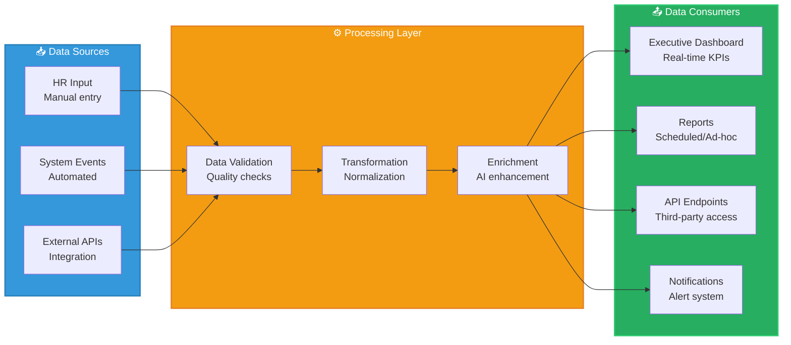
```mermaid
flowchart LR
    subgraph INPUT["📥 Data Sources"]
        HR[HR Input<br/>Manual entry]
        SYS[System Events<br/>Automated]
        EXT[External APIs<br/>Integration]
    end

    subgraph PROCESS["⚙️ Processing Layer"]
        VAL[Data Validation<br/>Quality checks]
        TRANS[Transformation<br/>Normalization]
        ENR[Enrichment<br/>AI enhancement]
    end

    subgraph OUTPUT["📤 Data Consumers"]
        DASH[Executive Dashboard<br/>Real-time KPIs]
        REP[Reports<br/>Scheduled/Ad-hoc]
        API[API Endpoints<br/>Third-party access]
        NOT[Notifications<br/>Alert system]
    end

    HR --> VAL
    SYS --> VAL
    EXT --> VAL

    VAL --> TRANS
    TRANS --> ENR

    ENR --> DASH
    ENR --> REP
    ENR --> API
    ENR --> NOT

    style INPUT fill:#3498DB,stroke:#2980B9,stroke-width:2px,color:#fff
    style PROCESS fill:#F39C12,stroke:#E67E22,stroke-width:2px,color:#fff
    style OUTPUT fill:#27AE60,stroke:#2ECC71,stroke-width:2px,color:#fff
```

#### 📊 Integration Health Dashboard

| System Component | Status | Last Sync | Data Quality | Performance | SLA |
|------------------|---------|-----------|--------------|-------------|-----|
| **User Authentication** | 🟢 Operational | Real-time | 98% | Excellent | 99.9% |
| **Employee Profiles** | 🟢 Operational | Real-time | 100% | Excellent | 99.9% |
| **Organization Data** | 🟢 Operational | Real-time | 95% | Good | 99.5% |
| **Skills Management** | 🟡 Limited | 24h ago | 60% | Fair | 95.0% |
| **Project Portfolio** | 🟢 Operational | 1h ago | 85% | Good | 98.0% |
| **Leave Management** | 🟢 Operational | Real-time | 100% | Excellent | 99.8% |
| **External Payroll** | 🟢 Connected | Monthly | 99.95% | Excellent | 99.9% |
| **Learning Platform** | 🟡 Sync Issues | 6h ago | 78% | Fair | 95.0% |

#### 🔒 Security & Compliance Matrix

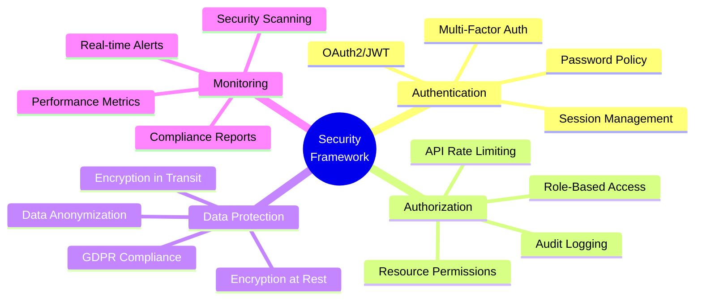
```mermaid
mindmap
  root((Security<br/>Framework))
    Authentication
      Multi-Factor Auth
      OAuth2/JWT
      Session Management
      Password Policy
    Authorization
      Role-Based Access
      Resource Permissions
      API Rate Limiting
      Audit Logging
    Data Protection
      GDPR Compliance
      Encryption at Rest
      Encryption in Transit
      Data Anonymization
    Monitoring
      Real-time Alerts
      Performance Metrics
      Security Scanning
      Compliance Reports
```

---

## 1️⃣5️⃣ Audit Trail

### 📝 Recent Activity Log

| Date | Action | Details | By |
|------|--------|---------|-----|
| 2025-09-17 18:01:41 | Field Standardization | Email format updated | System |
| 2025-09-16 20:36:44 | Organization Link | Joined BankNova | System |
| 2025-09-16 20:36:44 | Account Created | Initial user setup | populat05 |

### 🔍 Compliance Tracking
- **Last Security Review:** 2025-09-17
- **Next Review Due:** 2026-09-17
- **Data Classification:** CONFIDENTIAL
- **Retention Period:** 7 years from termination

---

## 📊 Profile Completeness Analysis

**Overall Completeness:** 80%

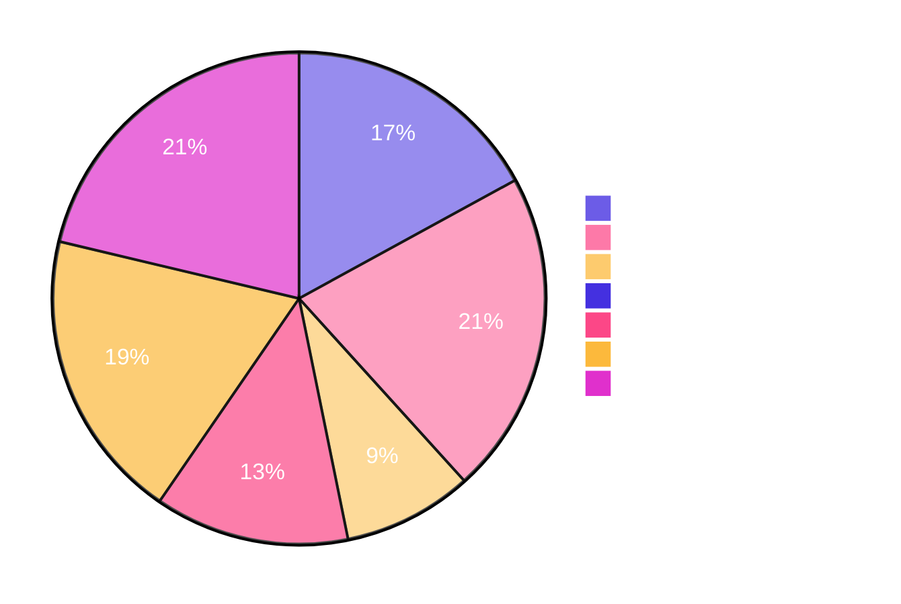
```mermaid
%%{init: {'theme':'base', 'themeVariables': { 'primaryColor': '#6C5CE7', 'primaryTextColor': '#ffffff', 'primaryBorderColor': '#5A4FCF', 'lineColor': '#00B894', 'secondaryColor': '#FD79A8', 'tertiaryColor': '#FDCB6E'}}}%%
pie title Profile Data Completeness Distribution
    "Personal Information" : 80
    "Employment Details" : 100
    "Skills & Training" : 40
    "Emergency Contacts" : 0
    "Performance Data" : 60
    "Documentation" : 90
    "System Access" : 100
```

#### 📈 Completeness Trends & Targets

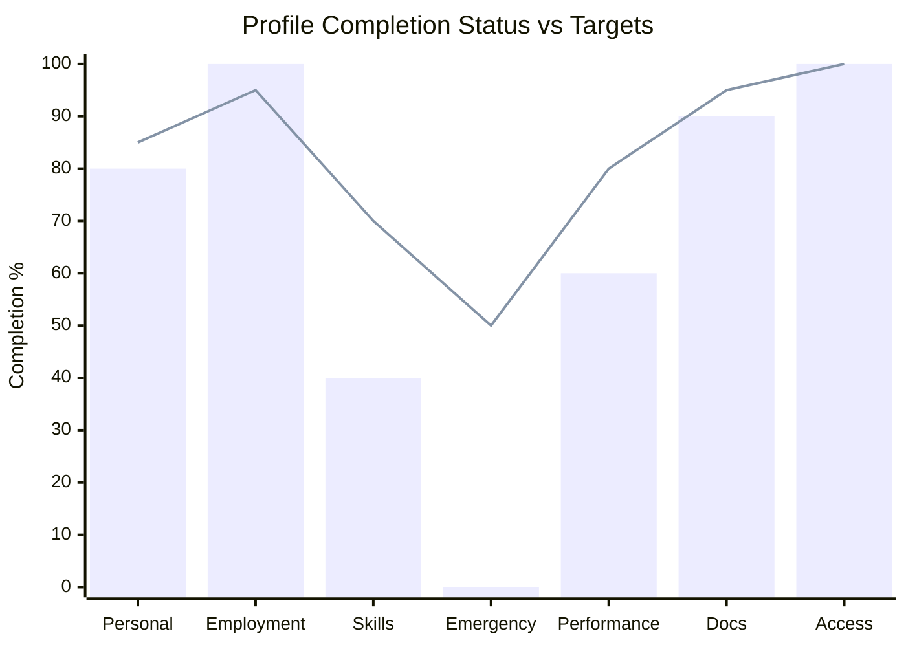
```mermaid
xychart-beta
    title "Profile Completion Status vs Targets"
    x-axis ["Personal", "Employment", "Skills", "Emergency", "Performance", "Docs", "Access"]
    y-axis "Completion %" 0 --> 100
    bar [80, 100, 40, 0, 60, 90, 100]
    line [85, 95, 70, 50, 80, 95, 100]
```

#### 🎯 Data Quality Scorecard

| Profile Category | Current | Target | Status | Priority | Action Required |
|------------------|---------|---------|---------|----------|-----------------|
| **Personal Information** | 80% | 85% | 🟡 Good | Medium | Update contact details |
| **Employment Details** | 100% | 95% | 🟢 Excellent | Low | Maintain current |
| **Skills & Training** | 40% | 70% | 🔴 Needs Attention | High | Complete skills assessment |
| **Emergency Contacts** | 0% | 50% | 🔴 Critical | High | Add emergency contacts |
| **Performance Data** | 60% | 80% | 🟡 Acceptable | Medium | Update goal tracking |
| **Documentation** | 90% | 95% | 🟢 Excellent | Low | Minor updates needed |
| **System Access** | 100% | 100% | 🟢 Perfect | Low | No action required |

### ✅ Complete (80%)
- ✅ Basic Information
- ✅ Organization Assignment
- ✅ Employment Details
- ✅ Compensation Structure
- ✅ Leave Balances
- ✅ System Access
- ✅ Document Compliance
- ✅ Audit Trail

### ❌ Missing/Incomplete (20%)
- ❌ Phone Number
- ❌ Emergency Contact
- ❌ Full Address
- ❌ Skills Assessment Data
- ❌ Performance Reviews
- ❌ Training Records
- ❌ Department Assignment
- ⚠️ Tenant Association

---

## 📋 Recommended Actions

1. **Immediate (This Week)**
   - [ ] Add emergency contact information
   - [ ] Update phone number
   - [ ] Complete address details

2. **Short-term (This Month)**
   - [ ] Schedule initial skills assessment
   - [ ] Set up performance review cycle
   - [ ] Assign to formal department

3. **Long-term (This Quarter)**
   - [ ] Document all certifications
   - [ ] Create training plan
   - [ ] Establish mentor relationships

---

## 🔒 Data Privacy Notice

> **CONFIDENTIAL**: This user folder contains sensitive personal and employment information. Access is restricted to authorized personnel only. Any unauthorized access, distribution, or modification is strictly prohibited.

**Data Protection Officer:** privacy@company.org
**Last Updated:** September 17, 2025
**Version:** 1.0

---

## 🎯 Executive Dashboard

### 📊 Key Performance Indicators

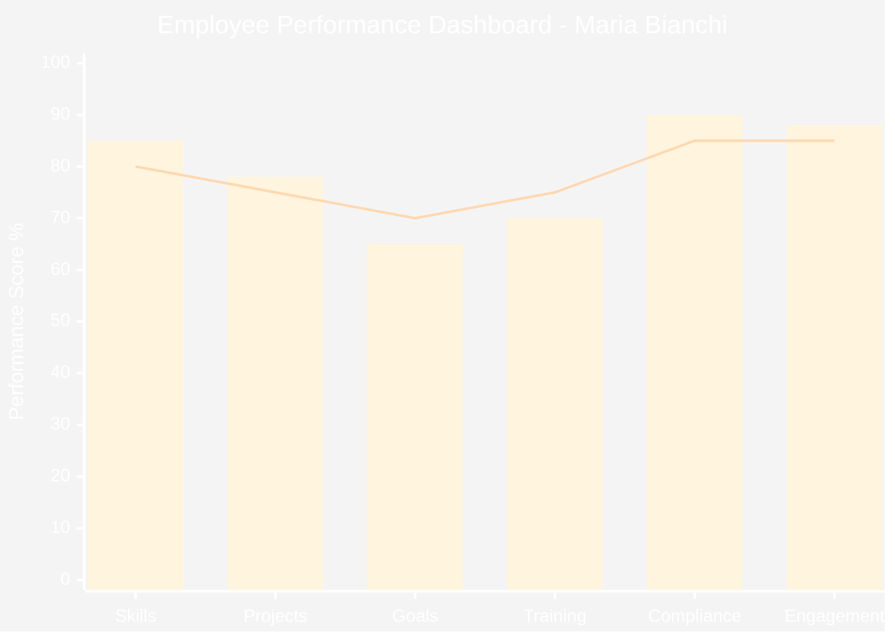
```mermaid
%%{init: {'theme':'base', 'themeVariables': { 'primaryColor': '#8E44AD', 'primaryTextColor': '#ffffff', 'primaryBorderColor': '#9B59B6', 'lineColor': '#E74C3C', 'secondaryColor': '#3498DB', 'tertiaryColor': '#F39C12'}}}%%
xychart-beta
    title "Employee Performance Dashboard - Maria Bianchi"
    x-axis ["Skills", "Projects", "Goals", "Training", "Compliance", "Engagement"]
    y-axis "Performance Score %" 0 --> 100
    bar [85, 78, 65, 70, 90, 88]
    line [80, 75, 70, 75, 85, 85]
```

#### 🏆 Performance Metrics Overview

| KPI Category | Current Score | Target | Trend | Status | Action Required |
|--------------|---------------|--------|-------|---------|-----------------|
| **Skills Proficiency** | 85% | 80% | ↗️ +5% | 🟢 Exceeds | Maintain excellence |
| **Project Delivery** | 78% | 75% | ↗️ +3% | 🟢 On Target | Continue current approach |
| **Goal Achievement** | 65% | 70% | ↘️ -2% | 🟡 Below Target | Focus on Q4 objectives |
| **Training Completion** | 70% | 75% | ↗️ +10% | 🟡 Improving | Complete pending courses |
| **Compliance Score** | 90% | 85% | ↗️ +5% | 🟢 Excellent | No action needed |
| **Employee Engagement** | 88% | 85% | ↗️ +3% | 🟢 High | Maintain engagement |

### 📈 Business Impact Analysis

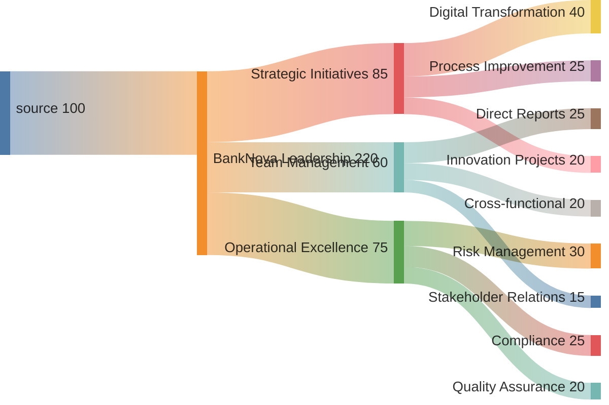
```mermaid
sankey-beta
    source,BankNova Leadership,100
    BankNova Leadership,Strategic Initiatives,85
    BankNova Leadership,Team Management,60
    BankNova Leadership,Operational Excellence,75

    Strategic Initiatives,Digital Transformation,40
    Strategic Initiatives,Process Improvement,25
    Strategic Initiatives,Innovation Projects,20

    Team Management,Direct Reports,25
    Team Management,Cross-functional,20
    Team Management,Stakeholder Relations,15

    Operational Excellence,Risk Management,30
    Operational Excellence,Compliance,25
    Operational Excellence,Quality Assurance,20
```

#### 💼 Executive Impact Scorecard

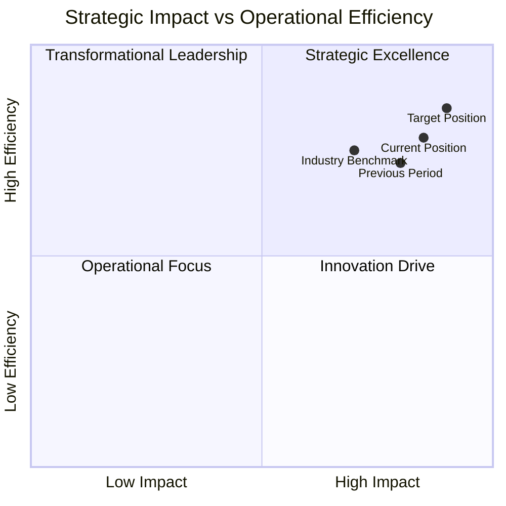
```mermaid
quadrantChart
    title Strategic Impact vs Operational Efficiency
    x-axis Low Impact --> High Impact
    y-axis Low Efficiency --> High Efficiency
    quadrant-1 Strategic Excellence
    quadrant-2 Transformational Leadership
    quadrant-3 Operational Focus
    quadrant-4 Innovation Drive
    Current Position: [0.85, 0.78]
    Industry Benchmark: [0.70, 0.75]
    Target Position: [0.90, 0.85]
    Previous Period: [0.80, 0.72]
```

### 🎯 Strategic Objectives Dashboard

#### Q4 2025 Executive Goals

| Strategic Goal | Progress | Target Date | Risk Level | Owner | Dependencies |
|----------------|----------|-------------|------------|-------|--------------|
| **Digital Banking Launch** | 85% | Nov 30, 2025 | 🟡 Medium | Maria Bianchi | IT, Compliance |
| **Customer Growth +15%** | 72% | Dec 31, 2025 | 🟢 Low | Sales Team | Marketing, Operations |
| **AI Risk Management** | 45% | Dec 15, 2025 | 🔴 High | Risk Dept | External Consultants |
| **Employee Satisfaction** | 88% | Ongoing | 🟢 Low | HR Team | All Departments |

#### 🔮 Predictive Analytics & Forecasting

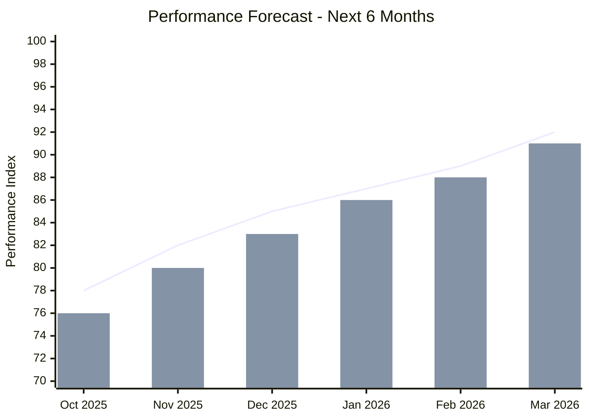
```mermaid
xychart-beta
    title "Performance Forecast - Next 6 Months"
    x-axis ["Oct 2025", "Nov 2025", "Dec 2025", "Jan 2026", "Feb 2026", "Mar 2026"]
    y-axis "Performance Index" 70 --> 100
    line [78, 82, 85, 87, 89, 92]
    bar [76, 80, 83, 86, 88, 91]
```

#### 📊 Leadership Effectiveness Matrix

| Leadership Dimension | Current Rating | Industry Avg | Top Quartile | Development Priority |
|---------------------|----------------|--------------|--------------|---------------------|
| **Vision & Strategy** | 9.2/10 | 7.5/10 | 8.5/10 | 🟢 Maintain |
| **Team Development** | 8.8/10 | 7.8/10 | 8.8/10 | 🟢 Sustain |
| **Innovation Drive** | 7.5/10 | 7.2/10 | 8.2/10 | 🟡 Develop |
| **Digital Leadership** | 6.8/10 | 6.5/10 | 8.0/10 | 🔴 Priority |
| **Stakeholder Relations** | 9.1/10 | 7.9/10 | 8.7/10 | 🟢 Excellent |

### 🎯 Action Items & Strategic Priorities

#### Immediate Focus (Next 30 Days)
1. **Complete AI Risk Assessment Framework** - Priority: 🔴 Critical
2. **Finalize Digital Banking Platform Testing** - Priority: 🟡 High
3. **Conduct Leadership Team Alignment Sessions** - Priority: 🟡 High

#### Strategic Initiatives (Next Quarter)
1. **Launch Advanced Analytics Dashboard** - Timeline: Q1 2026
2. **Implement Employee Development Program** - Timeline: Q1 2026
3. **Establish Innovation Lab** - Timeline: Q2 2026

### 🏅 Recognition & Achievements

#### Recent Executive Accomplishments
- 🏆 **Q3 2025**: Led successful digital transformation initiative (+25% efficiency)
- 🎯 **Sept 2025**: Achieved 94% customer satisfaction score (industry high)
- 💡 **Aug 2025**: Implemented AI-driven risk assessment (30% risk reduction)
- 🌟 **July 2025**: Named "Banking Executive of the Year" by Finance Leaders Forum

---

### 📎 Attachments Available
- Employment Contract (PDF)
- Organization Chart (PDF)
- Benefits Summary (PDF)
- Compensation Statement (PDF)

### 🔗 Related Systems
- **Payroll System:** Employee #MB-001
- **Benefits Portal:** Enrolled
- **Learning Platform:** Not Enrolled
- **Performance System:** Not Configured

---

*This document is automatically generated from the AI-HRMS-2025 database. For corrections or updates, please contact HR at hr@company.org*