# AI-HRMS-2025 Web GUI Implementation Plan 🚀

> **Comprehensive Web Interface Design and Implementation Strategy**
> **Version**: 1.0 | **Sprint Planning**: Q1 2025 | **Target**: Enterprise Multi-Tenant HR Management

---

## 📋 **Executive Summary**

This document provides a comprehensive implementation plan for creating rich web GUI interfaces for the AI-HRMS-2025 system. Based on extensive database analysis and UX design principles, this plan outlines user permissions, workflows, and interface specifications for each organizational level from platform administration to individual employees.

### **🎯 Project Objectives**
- **User-Centric Design**: Intuitive interfaces respecting complex permission hierarchies
- **Multi-Tenant Architecture**: Seamless experience across organizational boundaries
- **Role-Based Access**: Dynamic UI adaptation based on user permissions
- **Enterprise Security**: Comprehensive audit trails and access controls
- **Mobile-First Approach**: Responsive design for modern workforce needs

---

## 🏛️ **System Architecture Overview**

### **Multi-Level Hierarchy System**


### **Permission Inheritance Flow**

```mermaid
graph LR
    Platform[Platform Admin<br/>🔧 Global Access] --> Tenant[Tenant Admin<br/>🏢 Multi-Org Access]
    Tenant --> Org[Organization Admin<br/>🏛️ Full Org Access]
    Org --> Manager[Manager<br/>👥 Team Access]
    Manager --> Employee[Employee<br/>👤 Self Access]

    style Platform fill:#ff9999
    style Tenant fill:#99ccff
    style Org fill:#99ff99
    style Manager fill:#ffcc99
    style Employee fill:#ffff99
```


---

## 👤 **User Types & Permission Matrix**

### **1. Platform Administrator** 🔧
**Access Level**: Global System Control
**Security Clearance**: Maximum
**Primary Domain**: System Infrastructure

#### **Core Permissions**
- ✅ **Global System Configuration**: All platform settings and infrastructure
- ✅ **Tenant Lifecycle Management**: Create, modify, suspend, delete tenants
- ✅ **Cross-Tenant Analytics**: System-wide performance and usage metrics
- ✅ **Security & Compliance**: Global security policies and audit oversight
- ✅ **System Monitoring**: Real-time infrastructure health and performance
- ✅ **User Account Management**: Emergency access and account recovery
- ✅ **Data Migration & Backup**: Global data operations and disaster recovery

#### **Workflow Capabilities**
```typescript
interface PlatformAdminWorkflows {
  systemManagement: {
    tenantProvisioning: boolean;        // ✅ Create new tenant instances
    globalConfiguration: boolean;       // ✅ System-wide settings
    performanceMonitoring: boolean;     // ✅ Real-time system metrics
    securityOversight: boolean;         // ✅ Global security policies
  };

  dataOperations: {
    crossTenantReporting: boolean;      // ✅ System-wide analytics
    dataBackupRestore: boolean;         // ✅ Disaster recovery operations
    migrationTools: boolean;            // ✅ Data migration utilities
    auditTrailAccess: boolean;          // ✅ Global audit access
  };

  emergencyOperations: {
    systemShutdown: boolean;            // ✅ Emergency system controls
    accountRecovery: boolean;           // ✅ User account recovery
    dataRecovery: boolean;              // ✅ Emergency data recovery
    securityIncidentResponse: boolean;  // ✅ Security breach response
  };
}
```

#### **UI Dashboard Components**
- **🔍 System Health Monitor**: Real-time infrastructure metrics
- **🏢 Tenant Overview Grid**: Multi-tenant status and analytics
- **🚨 Security Alert Center**: Global security notifications and threats
- **📊 Performance Analytics**: Cross-tenant performance metrics
- **⚙️ Global Configuration Panel**: System-wide settings management
- **📋 Audit Trail Explorer**: Comprehensive system audit logs

---

### **2. Tenant Owner/Administrator** 🏢
**Access Level**: Tenant-Wide Control
**Security Clearance**: High
**Primary Domain**: Multi-Organization Management

#### **Core Permissions**
- ✅ **Organization Management**: Create, modify, manage all organizations within tenant
- ✅ **User Provisioning**: Add, remove, modify users across organizations
- ✅ **Billing & Subscription**: Manage tenant billing and feature subscriptions
- ✅ **Cross-Org Reporting**: Analytics across all tenant organizations
- ✅ **Security Policies**: Tenant-level security configuration
- ✅ **Integration Management**: Third-party integrations and APIs
- ❌ **Other Tenant Access**: Cannot access other tenant data
- ❌ **Global System Config**: Cannot modify platform-level settings

#### **Workflow Capabilities**
```typescript
interface TenantAdminWorkflows {
  organizationManagement: {
    createOrganizations: boolean;       // ✅ New organization setup
    configureHierarchy: boolean;       // ✅ Org structure management
    manageUsers: boolean;               // ✅ Cross-org user management
    assignPermissions: boolean;        // ✅ Role and permission assignment
  };

  businessOperations: {
    crossOrgReporting: boolean;         // ✅ Tenant-wide analytics
    billingManagement: boolean;         // ✅ Subscription and billing
    integrationSetup: boolean;          // ✅ Third-party integrations
    complianceMonitoring: boolean;      // ✅ Regulatory compliance
  };

  dataManagement: {
    dataGovernance: boolean;            // ✅ Data policies and governance
    backupConfiguration: boolean;       // ✅ Tenant backup settings
    dataRetention: boolean;             // ✅ Data retention policies
    privacyControls: boolean;           // ✅ Privacy and GDPR compliance
  };
}
```

#### **UI Dashboard Components**
- **🏛️ Organization Hierarchy Map**: Interactive org structure visualization
- **👥 Cross-Org User Management**: Centralized user administration
- **💰 Billing & Usage Dashboard**: Subscription and cost management
- **📈 Tenant Analytics Hub**: Cross-organizational metrics and KPIs
- **🔐 Security Policy Center**: Tenant-wide security configuration
- **🔗 Integration Management Panel**: Third-party service connections

---

### **3. Organization Owner/Administrator** 🏛️
**Access Level**: Organization-Wide Control
**Security Clearance**: High
**Primary Domain**: Single Organization Management

#### **Core Permissions**
- ✅ **Employee Lifecycle**: Full employee management within organization
- ✅ **Department Management**: Create, modify department structures
- ✅ **Policy Configuration**: Organization-specific HR policies
- ✅ **Performance Management**: Organization-wide performance systems
- ✅ **Recruitment & ATS**: Hiring processes and applicant tracking
- ✅ **Skills & Training**: Learning and development programs
- ✅ **Leave Management**: Organization leave policies and approvals
- ❌ **Other Org Access**: Cannot access other organization data
- ❌ **Tenant-Wide Settings**: Cannot modify tenant-level configurations

#### **Workflow Capabilities**
```typescript
interface OrganizationAdminWorkflows {
  employeeManagement: {
    employeeOnboarding: boolean;        // ✅ New hire processes
    performanceReviews: boolean;        // ✅ Performance management
    careerDevelopment: boolean;         // ✅ Employee growth planning
    disciplinaryActions: boolean;      // ✅ HR disciplinary processes
  };

  organizationalDesign: {
    departmentStructure: boolean;       // ✅ Department management
    roleDefinitions: boolean;           // ✅ Job role and position management
    hierarchyManagement: boolean;       // ✅ Reporting structure
    teamComposition: boolean;           // ✅ Team formation and management
  };

  hrOperations: {
    recruitmentManagement: boolean;     // ✅ Hiring and ATS
    leaveManagement: boolean;           // ✅ Leave policies and approvals
    skillsAssessment: boolean;          // ✅ Skills evaluation and tracking
    trainingPrograms: boolean;          // ✅ Learning and development
  };
}
```

#### **UI Dashboard Components**
- **👥 Employee Management Hub**: Comprehensive employee administration
- **🏗️ Org Structure Designer**: Interactive organization chart builder
- **📋 HR Policy Manager**: Policy creation and enforcement tools
- **📊 Performance Analytics**: Employee and team performance metrics
- **🎯 Recruitment Pipeline**: ATS and hiring workflow management
- **🎓 Learning & Development**: Training programs and skill tracking

---

### **4. Manager/Supervisor** 👥
**Access Level**: Team/Department Control
**Security Clearance**: Medium
**Primary Domain**: Team Leadership

#### **Core Permissions**
- ✅ **Direct Report Management**: Full access to direct report data
- ✅ **Team Performance**: Monitor and evaluate team performance
- ✅ **Leave Approvals**: Approve/deny team member leave requests
- ✅ **Goal Setting**: Set and track team and individual goals
- ✅ **Task Assignment**: Assign work and track progress
- ✅ **Performance Reviews**: Conduct reviews for direct reports
- ✅ **Time Management**: Approve timesheets and schedules
- ❌ **Other Team Access**: Cannot access other managers' team data
- ❌ **Organization Policies**: Cannot modify org-wide policies

#### **Workflow Capabilities**
```typescript
interface ManagerWorkflows {
  teamLeadership: {
    performanceManagement: boolean;     // ✅ Team performance tracking
    goalSetting: boolean;               // ✅ Objective setting and tracking
    oneOnOneMeetings: boolean;          // ✅ Regular check-ins
    feedbackDelivery: boolean;          // ✅ Performance feedback
  };

  operationalManagement: {
    leaveApprovals: boolean;            // ✅ Time-off approvals
    scheduleManagement: boolean;        // ✅ Team scheduling
    taskAssignment: boolean;            // ✅ Work distribution
    resourceAllocation: boolean;        // ✅ Resource planning
  };

  developmentActivities: {
    skillAssessment: boolean;           // ✅ Individual skill evaluation
    careerCoaching: boolean;            // ✅ Career development guidance
    trainingRecommendations: boolean;   // ✅ Learning path suggestions
    successionPlanning: boolean;        // ✅ Talent pipeline development
  };
}
```

#### **UI Dashboard Components**
- **👥 Team Dashboard**: Real-time team status and performance
- **✅ Approval Center**: Pending requests and decision workflows
- **📋 Task Management**: Work assignment and progress tracking
- **📊 Performance Insights**: Team analytics and individual metrics
- **📅 Schedule Coordinator**: Team calendar and resource planning
- **🎯 Goal Tracker**: Objective setting and progress monitoring

---

### **5. Regular Employee** 👤
**Access Level**: Personal Data Only
**Security Clearance**: Basic
**Primary Domain**: Self-Service

#### **Core Permissions**
- ✅ **Personal Profile**: View and edit own employee information
- ✅ **Leave Requests**: Submit and track leave applications
- ✅ **Timesheet Management**: Record work hours and attendance
- ✅ **Goal Tracking**: View and update personal objectives
- ✅ **Training Access**: Access assigned learning materials
- ✅ **Performance Data**: View own performance reviews and feedback
- ✅ **Team Information**: View basic team member information
- ❌ **Other Employee Data**: Cannot access other employees' personal data
- ❌ **System Administration**: No administrative capabilities

#### **Workflow Capabilities**
```typescript
interface EmployeeWorkflows {
  selfService: {
    profileManagement: boolean;         // ✅ Personal information updates
    leaveRequests: boolean;             // ✅ Time-off submissions
    timesheetEntry: boolean;            // ✅ Work hour logging
    expenseSubmission: boolean;         // ✅ Expense report filing
  };

  performanceActivities: {
    goalTracking: boolean;              // ✅ Personal objective monitoring
    skillAssessment: boolean;           // ✅ Self-evaluation tools
    feedbackViewing: boolean;           // ✅ Performance review access
    developmentPlanning: boolean;       // ✅ Career development planning
  };

  collaborativeTools: {
    teamCommunication: boolean;         // ✅ Team messaging and updates
    projectParticipation: boolean;      // ✅ Project task completion
    knowledgeSharing: boolean;          // ✅ Internal knowledge base access
    socialFeatures: boolean;            // ✅ Employee social features
  };
}
```

#### **UI Dashboard Components**
- **👤 Personal Dashboard**: Individual productivity and task overview
- **📋 Self-Service Portal**: Personal HR transactions and requests
- **📊 Performance Summary**: Individual goals and achievement tracking
- **📚 Learning Hub**: Training materials and skill development
- **📅 Personal Calendar**: Schedule and meeting management
- **💬 Team Communication**: Collaboration tools and team updates

---

## 🎨 **Visual Design System & Components**

### **Design Principles**
1. **Clarity First**: Information hierarchy with progressive disclosure
2. **Consistency**: Unified design language across all user levels
3. **Accessibility**: WCAG 2.1 AA compliance with inclusive design
4. **Responsiveness**: Mobile-first approach with desktop enhancement
5. **Performance**: Optimized for enterprise-scale data handling

### **Color Coding System**
```css
:root {
  /* Role-based color scheme */
  --platform-admin: #ff6b6b;    /* Red - High authority */
  --tenant-admin: #4ecdc4;      /* Teal - Tenant scope */
  --org-admin: #45b7d1;         /* Blue - Organization scope */
  --manager: #96ceb4;           /* Green - Team scope */
  --employee: #ffeaa7;          /* Yellow - Individual scope */

  /* Status indicators */
  --success: #00b894;
  --warning: #fdcb6e;
  --error: #e17055;
  --info: #74b9ff;

  /* Neutral palette */
  --primary: #2d3436;
  --secondary: #636e72;
  --background: #f8f9fa;
  --surface: #ffffff;
}
```

### **Component Library Structure**
```typescript
interface ComponentLibrary {
  // Layout Components
  dashboardLayouts: {
    PlatformAdminLayout: React.FC;
    TenantAdminLayout: React.FC;
    OrganizationAdminLayout: React.FC;
    ManagerLayout: React.FC;
    EmployeeLayout: React.FC;
  };

  // Navigation Components
  navigation: {
    RoleBasedNavigation: React.FC<NavigationProps>;
    TenantSwitcher: React.FC<TenantSwitcherProps>;
    BreadcrumbNavigation: React.FC<BreadcrumbProps>;
    ContextualActions: React.FC<ActionProps>;
  };

  // Data Components
  dataVisualization: {
    HierarchyChart: React.FC<HierarchyProps>;
    PerformanceMetrics: React.FC<MetricsProps>;
    AnalyticsDashboard: React.FC<AnalyticsProps>;
    RealtimeUpdates: React.FC<UpdateProps>;
  };

  // Form Components
  forms: {
    EmployeeForm: React.FC<EmployeeFormProps>;
    PermissionForm: React.FC<PermissionFormProps>;
    PolicyForm: React.FC<PolicyFormProps>;
    ApprovalForm: React.FC<ApprovalFormProps>;
  };
}
```

---

## 🔧 **Technical Implementation Strategy**

### **Frontend Architecture**
```typescript
interface FrontendArchitecture {
  framework: 'React 19 + TypeScript';
  stateManagement: '@reduxjs/toolkit + React Query';
  uiLibrary: 'Material-UI v6 + Custom Components';
  routing: 'React Router v7 + Role-based Guards';
  authentication: 'JWT + Refresh Token Strategy';
  realtime: 'Socket.IO + Optimistic Updates';
}
```

### **Backend Integration Strategy**
```typescript
interface BackendIntegration {
  apiClient: {
    authentication: JWTAuthService;
    authorization: RBACPermissionEngine;
    caching: RedisQueryCache;
    errorHandling: GlobalErrorBoundary;
  };

  realTimeFeatures: {
    notifications: SocketIONotificationService;
    liveUpdates: OptimisticUpdateStrategy;
    collaboration: RealTimeCollaborationEngine;
    presence: UserPresenceIndicator;
  };

  performance: {
    codesplitting: LazyComponentLoading;
    virtualization: VirtualizedLists;
    memoization: SmartMemoization;
    bundleOptimization: WebpackOptimization;
  };
}
```

### **Security Implementation**
```typescript
interface SecurityImplementation {
  authentication: {
    multiFactorAuth: boolean;
    sessionManagement: SecureSessionStrategy;
    tokenRefresh: AutomaticTokenRefresh;
    biometricAuth: BiometricAuthSupport;
  };

  authorization: {
    roleBasedAccess: GranularRBACEngine;
    permissionCaching: PermissionCacheStrategy;
    auditLogging: ComprehensiveAuditTrail;
    dataFiltering: ContextAwareDataFiltering;
  };

  dataProtection: {
    encryption: ClientSideEncryption;
    privacyControls: GDPRComplianceTools;
    dataMinimization: FieldLevelAccessControl;
    anonymization: DataAnonymizationTools;
  };
}
```

---

## 📱 **Mobile-First Design Strategy**

### **Responsive Breakpoints**
```scss
$breakpoints: (
  mobile: 320px,    // Mobile phones
  tablet: 768px,    // Tablets
  desktop: 1024px,  // Desktop
  wide: 1440px      // Large displays
);
```

### **Mobile-Optimized Workflows**
```typescript
interface MobileOptimization {
  touchOptimized: {
    buttonSizes: '44px minimum touch target';
    gestureSupport: SwipeNavigationSupport;
    scrollOptimization: InfiniteScrollWithVirtualization;
    hapticFeedback: TactileFeedbackSupport;
  };

  offlineCapabilities: {
    dataSync: OfflineFirstDataStrategy;
    caching: ServiceWorkerCaching;
    queuedActions: OfflineActionQueue;
    conflictResolution: DataConflictResolution;
  };

  fieldWorkerFeatures: {
    geolocation: LocationTrackingService;
    camera: DocumentScanningIntegration;
    voiceInput: SpeechToTextIntegration;
    barcode: BarcodeQRScanningSupport;
  };
}
```

---

## 🚀 **Implementation Roadmap**

### **Phase 1: Core Infrastructure (Weeks 1-4)**
#### **Week 1-2: Foundation Setup**
- [ ] **Authentication System**: JWT implementation with role-based access
- [ ] **Route Protection**: Role-based route guards and permission checking
- [ ] **Base Layout System**: Responsive layout components for each user type
- [ ] **Navigation Framework**: Role-aware navigation with tenant context

#### **Week 3-4: Core Components**
- [ ] **User Management Interface**: User creation, editing, and role assignment
- [ ] **Permission Management**: Dynamic role and permission assignment UI
- [ ] **Dashboard Framework**: Customizable dashboard system for each user type
- [ ] **Notification System**: Real-time notifications and alert management

### **Phase 2: User-Specific Interfaces (Weeks 5-8)**
#### **Week 5: Platform & Tenant Admin**
- [ ] **Platform Admin Dashboard**: System monitoring and tenant management
- [ ] **Tenant Management Interface**: Organization creation and configuration
- [ ] **System Analytics**: Cross-tenant reporting and performance metrics
- [ ] **Security Management**: Audit trails and security configuration

#### **Week 6: Organization Admin**
- [ ] **Employee Management System**: Comprehensive employee administration
- [ ] **Organization Structure Manager**: Hierarchy and department management
- [ ] **HR Policy Configuration**: Policy creation and enforcement tools
- [ ] **Recruitment & ATS Interface**: Hiring workflow and applicant tracking

#### **Week 7: Manager Interface**
- [ ] **Team Dashboard**: Team performance and status monitoring
- [ ] **Approval Workflows**: Leave requests and decision management
- [ ] **Performance Management**: Goal setting and review interfaces
- [ ] **Resource Planning**: Schedule and resource allocation tools

#### **Week 8: Employee Self-Service**
- [ ] **Personal Dashboard**: Individual productivity and task overview
- [ ] **Self-Service Portal**: Personal HR transactions and requests
- [ ] **Performance Tracking**: Personal goals and achievement monitoring
- [ ] **Learning & Development**: Training and skill development interface

### **Phase 3: Advanced Features (Weeks 9-12)**
#### **Week 9-10: Data Visualization & Analytics**
- [ ] **Advanced Analytics Dashboard**: Interactive charts and metrics
- [ ] **Custom Report Builder**: Drag-and-drop report creation
- [ ] **Real-time Data Updates**: Live dashboard updates and notifications
- [ ] **Export & Integration**: Data export and third-party integrations

#### **Week 11-12: Mobile & Performance Optimization**
- [ ] **Mobile Interface Optimization**: Touch-optimized mobile experience
- [ ] **Offline Capability**: Progressive Web App with offline support
- [ ] **Performance Optimization**: Code splitting and performance tuning
- [ ] **Accessibility Compliance**: WCAG 2.1 AA accessibility implementation

### **Phase 4: Testing & Deployment (Weeks 13-16)**
#### **Week 13-14: Testing & Quality Assurance**
- [ ] **Unit Testing**: Comprehensive component and function testing
- [ ] **Integration Testing**: End-to-end workflow testing
- [ ] **Performance Testing**: Load testing and optimization
- [ ] **Security Testing**: Penetration testing and vulnerability assessment

#### **Week 15-16: Deployment & Launch**
- [ ] **Production Deployment**: Containerized deployment setup
- [ ] **User Training**: Documentation and training material creation
- [ ] **Monitoring Setup**: Application monitoring and alerting
- [ ] **Launch Support**: Go-live support and issue resolution

---

## 📊 **Success Metrics & KPIs**

### **User Experience Metrics**
```typescript
interface UXMetrics {
  usability: {
    taskCompletionRate: number;     // Target: >95%
    timeToComplete: number;         // Target: <30% reduction from current
    userSatisfactionScore: number;  // Target: >4.5/5
    errorRate: number;              // Target: <2%
  };

  performance: {
    pageLoadTime: number;           // Target: <2 seconds
    timeToInteractive: number;      // Target: <3 seconds
    mobilePerformanceScore: number; // Target: >90
    accessibilityScore: number;     // Target: 100% WCAG AA
  };

  adoption: {
    userOnboardingTime: number;     // Target: <15 minutes
    featureAdoptionRate: number;    // Target: >80%
    mobileUsageRate: number;        // Target: >60%
    supportTicketReduction: number; // Target: >50% reduction
  };
}
```

### **Business Impact Metrics**
```typescript
interface BusinessMetrics {
  efficiency: {
    hrProcessingTime: number;       // Target: 40% reduction
    dataAccuracyImprovement: number;// Target: 25% improvement
    reportGenerationTime: number;   // Target: 60% reduction
    adminTaskAutomation: number;    // Target: 70% automation
  };

  compliance: {
    auditTrailCompleteness: number; // Target: 100%
    gdprComplianceScore: number;    // Target: 100%
    securityIncidentReduction: number; // Target: 80% reduction
    dataGovernanceScore: number;    // Target: >95%
  };

  scalability: {
    concurrentUsers: number;        // Target: 10,000+ users
    multiTenantEfficiency: number;  // Target: <5% overhead
    databasePerformance: number;    // Target: <100ms queries
    systemUptime: number;           // Target: 99.9% uptime
  };
}
```

---

## 🔍 **Risk Assessment & Mitigation**

### **Technical Risks**
| Risk | Probability | Impact | Mitigation Strategy |
|------|-------------|--------|-------------------|
| **Complex Permission System Performance** | Medium | High | Implement permission caching and materialized views |
| **Multi-Tenant Context Switching** | High | Medium | Design efficient context management with user feedback |
| **Mobile Performance with Complex UI** | Medium | Medium | Progressive enhancement and code splitting |
| **Real-time Update Conflicts** | Low | High | Implement optimistic updates with conflict resolution |

### **User Experience Risks**
| Risk | Probability | Impact | Mitigation Strategy |
|------|-------------|--------|-------------------|
| **Role Confusion and UI Complexity** | Medium | High | Clear role indicators and progressive disclosure |
| **Information Overload** | High | Medium | Customizable dashboards and smart defaults |
| **Learning Curve for Admin Users** | Medium | Medium | Comprehensive onboarding and training materials |
| **Accessibility Compliance Gaps** | Low | High | Early accessibility testing and expert consultation |

### **Business Risks**
| Risk | Probability | Impact | Mitigation Strategy |
|------|-------------|--------|-------------------|
| **User Adoption Resistance** | Medium | High | Extensive user research and iterative design |
| **Integration Complexity** | Medium | Medium | Modular design with standardized APIs |
| **Compliance Requirement Changes** | Low | High | Flexible architecture with configurable compliance rules |
| **Scalability Limitations** | Low | High | Performance testing and scalable architecture design |

---

## 🎯 **Next Steps & Action Items**

### **Immediate Actions (Next 2 Weeks)**
1. **✅ Finalize Technical Stack**: Confirm React 19 + Material-UI setup
2. **✅ Design System Creation**: Establish component library and design tokens
3. **✅ Authentication Implementation**: JWT-based auth with role management
4. **✅ Database Schema Validation**: Ensure UI aligns with database structure

### **Short-term Goals (Next Month)**
1. **🔄 User Research & Validation**: Conduct user interviews for each role type
2. **🔄 Prototype Development**: Create interactive prototypes for key workflows
3. **🔄 Accessibility Audit**: Initial accessibility compliance assessment
4. **🔄 Performance Baseline**: Establish performance benchmarks

### **Medium-term Objectives (Next Quarter)**
1. **📋 Full Implementation**: Complete all Phase 1-3 deliverables
2. **📋 User Testing**: Comprehensive usability testing across all user types
3. **📋 Security Assessment**: Full security audit and penetration testing
4. **📋 Documentation**: Complete user documentation and training materials

---

## 📚 **Resources & References**

### **Design Resources**
- **Material-UI Design System**: [mui.com/design-kits](https://mui.com/design-kits)
- **Enterprise UX Patterns**: [Enterprise Design Patterns Library](#)
- **Accessibility Guidelines**: [WCAG 2.1 AA Compliance](#)
- **Mobile-First Design**: [Responsive Design Patterns](#)

### **Technical Documentation**
- **React 19 Documentation**: [react.dev](https://react.dev)
- **Material-UI Components**: [mui.com/components](https://mui.com/components)
- **TypeScript Best Practices**: [typescript-eslint.io](https://typescript-eslint.io)
- **Performance Optimization**: [web.dev/performance](https://web.dev/performance)

### **Security & Compliance**
- **JWT Security Best Practices**: [jwt.io/introduction](https://jwt.io/introduction)
- **OWASP Security Guidelines**: [owasp.org](https://owasp.org)
- **GDPR Compliance Framework**: [gdpr.eu](https://gdpr.eu)
- **Enterprise Security Standards**: [NIST Cybersecurity Framework](#)

---

## 🏁 **Conclusion**

This comprehensive implementation plan provides a roadmap for creating enterprise-grade web GUI interfaces for the AI-HRMS-2025 system. The plan respects the complex multi-tenant, hierarchical permission system while delivering intuitive, accessible, and performant user experiences across all organizational levels.

**Key Success Factors:**
- **User-Centric Design**: Interfaces tailored to specific user needs and workflows
- **Security-First Approach**: Comprehensive security and compliance integration
- **Scalable Architecture**: Built for enterprise-scale deployment and growth
- **Accessibility Compliance**: Inclusive design for all users and abilities
- **Performance Optimization**: Fast, responsive interfaces for productivity

The phased implementation approach ensures manageable development cycles with continuous validation and iteration based on user feedback and business requirements.

---

**📝 Document Status**: Ready for Review and Approval
**👥 Stakeholders**: Development Team, UX/UI Designers, Product Management, Security Team
**📅 Last Updated**: $(date)
**🔄 Next Review**: Bi-weekly sprint planning sessions

*Building the future of enterprise HR management through innovative technology and user-centered design.*