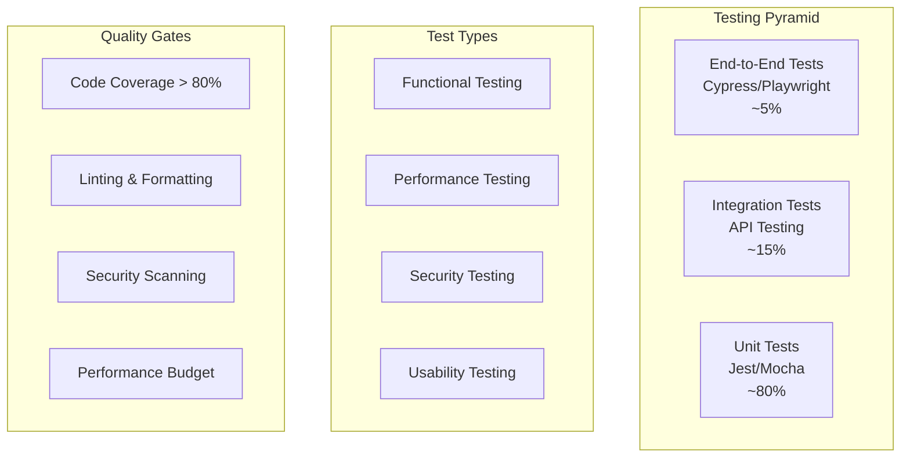

# Testing and Quality Assurance - AI-HRMS-2025

## Overview

The AI-HRMS-2025 project implements comprehensive testing strategies across all layers of the application, ensuring reliability, performance, and security through automated testing, quality assurance processes, and continuous monitoring.

## Testing Strategy

### Testing Pyramid


## Unit Testing

### Jest Configuration
```javascript
// jest.config.js
module.exports = {
  testEnvironment: 'node',
  coverageDirectory: 'coverage',
  collectCoverageFrom: [
    'src/**/*.js',
    'models/**/*.js',
    'services/**/*.js',
    '!src/**/*.test.js',
    '!src/**/*.spec.js',
    '!src/config/**',
    '!node_modules/**'
  ],
  testMatch: [
    '**/__tests__/**/*.js',
    '**/?(*.)+(spec|test).js'
  ],
  setupFilesAfterEnv: ['<rootDir>/tests/jest.setup.js'],
  coverageReporters: ['text', 'lcov', 'html', 'json'],
  coverageThreshold: {
    global: {
      branches: 80,
      functions: 80,
      lines: 80,
      statements: 80
    }
  },
  testTimeout: 10000,
  verbose: true,
  detectOpenHandles: true,
  forceExit: true
};
```

### Test Utilities and Helpers
```javascript
// tests/helpers/testUtils.js
const { sequelize } = require('../../models');
const bcrypt = require('bcrypt');

class TestUtils {
  static async createTestUser(overrides = {}) {
    const defaultUser = {
      firstName: 'Test',
      lastName: 'User',
      email: 'test@example.com',
      password: await bcrypt.hash('password123', 10),
      role: 'employee',
      isEmailVerified: true
    };

    return { ...defaultUser, ...overrides };
  }

  static async createTestOrganization(overrides = {}) {
    const defaultOrg = {
      name: 'Test Organization',
      domain: 'test.com',
      settings: {
        allowRegistration: true,
        requireEmailVerification: false
      }
    };

    return { ...defaultOrg, ...overrides };
  }

  static async createTestEmployee(userId, organizationId, overrides = {}) {
    const defaultEmployee = {
      userId,
      organizationId,
      employeeId: `EMP${Date.now()}`,
      position: 'Software Developer',
      hireDate: new Date(),
      status: 'active',
      skills: ['JavaScript', 'Node.js', 'React']
    };

    return { ...defaultEmployee, ...overrides };
  }

  static async cleanDatabase() {
    const models = Object.keys(sequelize.models);

    // Disable foreign key checks
    await sequelize.query('SET FOREIGN_KEY_CHECKS = 0');

    // Truncate all tables
    for (const model of models) {
      await sequelize.models[model].destroy({
        where: {},
        truncate: true,
        cascade: true
      });
    }

    // Re-enable foreign key checks
    await sequelize.query('SET FOREIGN_KEY_CHECKS = 1');
  }

  static generateJWT(userId, organizationId) {
    const jwt = require('jsonwebtoken');
    return jwt.sign(
      { userId, organizationId },
      process.env.JWT_SECRET || 'test-secret',
      { expiresIn: '1h' }
    );
  }

  static mockRequest(overrides = {}) {
    return {
      headers: {},
      params: {},
      query: {},
      body: {},
      user: null,
      ...overrides
    };
  }

  static mockResponse() {
    const res = {};
    res.status = jest.fn().mockReturnValue(res);
    res.json = jest.fn().mockReturnValue(res);
    res.send = jest.fn().mockReturnValue(res);
    res.cookie = jest.fn().mockReturnValue(res);
    res.clearCookie = jest.fn().mockReturnValue(res);
    return res;
  }
}

module.exports = TestUtils;
```

### Model Testing Examples
```javascript
// tests/models/user.test.js
const { User, Organization } = require('../../models');
const TestUtils = require('../helpers/testUtils');

describe('User Model', () => {
  let organization;

  beforeEach(async () => {
    await TestUtils.cleanDatabase();
    organization = await Organization.create(
      await TestUtils.createTestOrganization()
    );
  });

  describe('User Creation', () => {
    test('should create a user with valid data', async () => {
      const userData = await TestUtils.createTestUser({
        organizationId: organization.id
      });

      const user = await User.create(userData);

      expect(user.id).toBeDefined();
      expect(user.email).toBe(userData.email);
      expect(user.firstName).toBe(userData.firstName);
      expect(user.password).toBeDefined();
      expect(user.organizationId).toBe(organization.id);
    });

    test('should hash password before saving', async () => {
      const plainPassword = 'password123';
      const userData = await TestUtils.createTestUser({
        organizationId: organization.id,
        password: plainPassword
      });

      const user = await User.create(userData);

      expect(user.password).not.toBe(plainPassword);
      expect(user.password.length).toBeGreaterThan(20);
    });

    test('should validate email format', async () => {
      const userData = await TestUtils.createTestUser({
        organizationId: organization.id,
        email: 'invalid-email'
      });

      await expect(User.create(userData)).rejects.toThrow();
    });

    test('should enforce unique email per organization', async () => {
      const userData = await TestUtils.createTestUser({
        organizationId: organization.id
      });

      await User.create(userData);

      await expect(User.create(userData)).rejects.toThrow();
    });
  });

  describe('User Methods', () => {
    let user;

    beforeEach(async () => {
      const userData = await TestUtils.createTestUser({
        organizationId: organization.id
      });
      user = await User.create(userData);
    });

    test('should validate correct password', async () => {
      const isValid = await user.validatePassword('password123');
      expect(isValid).toBe(true);
    });

    test('should reject incorrect password', async () => {
      const isValid = await user.validatePassword('wrongpassword');
      expect(isValid).toBe(false);
    });

    test('should return user without password in toJSON', () => {
      const userJSON = user.toJSON();
      expect(userJSON.password).toBeUndefined();
      expect(userJSON.email).toBeDefined();
    });
  });
});
```

### Service Testing Examples
```javascript
// tests/services/authService.test.js
const AuthService = require('../../services/authService');
const { User, Organization } = require('../../models');
const TestUtils = require('../helpers/testUtils');

describe('AuthService', () => {
  let organization;

  beforeEach(async () => {
    await TestUtils.cleanDatabase();
    organization = await Organization.create(
      await TestUtils.createTestOrganization()
    );
  });

  describe('register', () => {
    test('should register a new user successfully', async () => {
      const userData = {
        firstName: 'John',
        lastName: 'Doe',
        email: 'john@test.com',
        password: 'password123',
        organizationId: organization.id
      };

      const result = await AuthService.register(userData);

      expect(result.success).toBe(true);
      expect(result.user).toBeDefined();
      expect(result.token).toBeDefined();
      expect(result.user.email).toBe(userData.email);
    });

    test('should fail with duplicate email', async () => {
      const userData = await TestUtils.createTestUser({
        organizationId: organization.id
      });

      await User.create(userData);

      const result = await AuthService.register(userData);

      expect(result.success).toBe(false);
      expect(result.error).toContain('already exists');
    });

    test('should fail with invalid organization', async () => {
      const userData = {
        firstName: 'John',
        lastName: 'Doe',
        email: 'john@test.com',
        password: 'password123',
        organizationId: 99999
      };

      const result = await AuthService.register(userData);

      expect(result.success).toBe(false);
      expect(result.error).toContain('Organization not found');
    });
  });

  describe('login', () => {
    let user;

    beforeEach(async () => {
      const userData = await TestUtils.createTestUser({
        organizationId: organization.id
      });
      user = await User.create(userData);
    });

    test('should login with valid credentials', async () => {
      const result = await AuthService.login(
        user.email,
        'password123'
      );

      expect(result.success).toBe(true);
      expect(result.user).toBeDefined();
      expect(result.token).toBeDefined();
      expect(result.user.id).toBe(user.id);
    });

    test('should fail with invalid email', async () => {
      const result = await AuthService.login(
        'nonexistent@test.com',
        'password123'
      );

      expect(result.success).toBe(false);
      expect(result.error).toContain('Invalid credentials');
    });

    test('should fail with invalid password', async () => {
      const result = await AuthService.login(
        user.email,
        'wrongpassword'
      );

      expect(result.success).toBe(false);
      expect(result.error).toContain('Invalid credentials');
    });
  });
});
```

## Integration Testing

### API Integration Tests
```javascript
// tests/integration/employeeRoutes.test.js
const request = require('supertest');
const app = require('../../server');
const { User, Employee, Organization } = require('../../models');
const TestUtils = require('../helpers/testUtils');

describe('Employee Routes Integration', () => {
  let organization, user, authToken;

  beforeEach(async () => {
    await TestUtils.cleanDatabase();

    organization = await Organization.create(
      await TestUtils.createTestOrganization()
    );

    const userData = await TestUtils.createTestUser({
      organizationId: organization.id,
      role: 'admin'
    });
    user = await User.create(userData);

    authToken = TestUtils.generateJWT(user.id, organization.id);
  });

  describe('POST /api/employees', () => {
    test('should create a new employee', async () => {
      const newUserData = await TestUtils.createTestUser({
        email: 'newemployee@test.com',
        organizationId: organization.id
      });

      const employeeData = {
        ...newUserData,
        position: 'Senior Developer',
        departmentId: null,
        hireDate: '2024-01-15'
      };

      const response = await request(app)
        .post('/api/employees')
        .set('Authorization', `Bearer ${authToken}`)
        .send(employeeData)
        .expect(201);

      expect(response.body.employee).toBeDefined();
      expect(response.body.employee.position).toBe(employeeData.position);
      expect(response.body.employee.user).toBeDefined();
      expect(response.body.employee.user.email).toBe(employeeData.email);
    });

    test('should fail without authentication', async () => {
      const employeeData = {
        firstName: 'John',
        lastName: 'Doe',
        email: 'john@test.com'
      };

      await request(app)
        .post('/api/employees')
        .send(employeeData)
        .expect(401);
    });

    test('should fail with invalid data', async () => {
      const invalidData = {
        firstName: 'John'
        // Missing required fields
      };

      const response = await request(app)
        .post('/api/employees')
        .set('Authorization', `Bearer ${authToken}`)
        .send(invalidData)
        .expect(400);

      expect(response.body.error).toBeDefined();
    });
  });

  describe('GET /api/employees', () => {
    beforeEach(async () => {
      // Create test employees
      for (let i = 1; i <= 5; i++) {
        const userData = await TestUtils.createTestUser({
          email: `employee${i}@test.com`,
          organizationId: organization.id
        });
        const createdUser = await User.create(userData);

        await Employee.create(
          await TestUtils.createTestEmployee(
            createdUser.id,
            organization.id,
            { position: `Developer ${i}` }
          )
        );
      }
    });

    test('should return paginated employees', async () => {
      const response = await request(app)
        .get('/api/employees?page=1&limit=3')
        .set('Authorization', `Bearer ${authToken}`)
        .expect(200);

      expect(response.body.employees).toHaveLength(3);
      expect(response.body.pagination).toBeDefined();
      expect(response.body.pagination.total).toBe(5);
      expect(response.body.pagination.pages).toBe(2);
    });

    test('should filter employees by search term', async () => {
      const response = await request(app)
        .get('/api/employees?search=Developer 1')
        .set('Authorization', `Bearer ${authToken}`)
        .expect(200);

      expect(response.body.employees).toHaveLength(1);
      expect(response.body.employees[0].position).toBe('Developer 1');
    });

    test('should respect organization isolation', async () => {
      // Create another organization and employee
      const otherOrg = await Organization.create({
        name: 'Other Org',
        domain: 'other.com'
      });

      const otherUserData = await TestUtils.createTestUser({
        email: 'other@other.com',
        organizationId: otherOrg.id
      });
      const otherUser = await User.create(otherUserData);

      await Employee.create(
        await TestUtils.createTestEmployee(
          otherUser.id,
          otherOrg.id
        )
      );

      const response = await request(app)
        .get('/api/employees')
        .set('Authorization', `Bearer ${authToken}`)
        .expect(200);

      // Should only return employees from user's organization
      expect(response.body.employees).toHaveLength(5);
      response.body.employees.forEach(employee => {
        expect(employee.organizationId).toBe(organization.id);
      });
    });
  });
});
```

### Database Integration Tests
```javascript
// tests/integration/database.test.js
const { sequelize } = require('../../models');
const { QueryTypes } = require('sequelize');

describe('Database Integration', () => {
  beforeAll(async () => {
    await sequelize.authenticate();
  });

  describe('Row Level Security', () => {
    test('should enforce organization isolation in queries', async () => {
      // This test would verify RLS policies work correctly
      const query = `
        SELECT COUNT(*) as count
        FROM employees
        WHERE organization_id = :orgId
      `;

      const result = await sequelize.query(query, {
        replacements: { orgId: 1 },
        type: QueryTypes.SELECT
      });

      expect(result).toBeDefined();
      expect(Array.isArray(result)).toBe(true);
    });
  });

  describe('Performance', () => {
    test('should execute queries within performance budget', async () => {
      const startTime = Date.now();

      await sequelize.query(
        'SELECT * FROM employees LIMIT 100',
        { type: QueryTypes.SELECT }
      );

      const duration = Date.now() - startTime;
      expect(duration).toBeLessThan(1000); // Should complete within 1 second
    });
  });

  afterAll(async () => {
    await sequelize.close();
  });
});
```

## End-to-End Testing

### Playwright Configuration
```javascript
// playwright.config.js
const { defineConfig, devices } = require('@playwright/test');

module.exports = defineConfig({
  testDir: './tests/e2e',
  fullyParallel: true,
  forbidOnly: !!process.env.CI,
  retries: process.env.CI ? 2 : 0,
  workers: process.env.CI ? 1 : undefined,
  reporter: [
    ['html'],
    ['json', { outputFile: 'test-results/results.json' }]
  ],
  use: {
    baseURL: 'http://localhost:3000',
    trace: 'on-first-retry',
    screenshot: 'only-on-failure',
    video: 'retain-on-failure'
  },

  projects: [
    {
      name: 'chromium',
      use: { ...devices['Desktop Chrome'] }
    },
    {
      name: 'firefox',
      use: { ...devices['Desktop Firefox'] }
    },
    {
      name: 'webkit',
      use: { ...devices['Desktop Safari'] }
    },
    {
      name: 'Mobile Chrome',
      use: { ...devices['Pixel 5'] }
    }
  ],

  webServer: {
    command: 'npm run start:test',
    port: 3000,
    reuseExistingServer: !process.env.CI
  }
});
```

### E2E Test Examples
```javascript
// tests/e2e/auth.spec.js
const { test, expect } = require('@playwright/test');

test.describe('Authentication Flow', () => {
  test.beforeEach(async ({ page }) => {
    await page.goto('/');
  });

  test('should login with valid credentials', async ({ page }) => {
    // Navigate to login page
    await page.click('text=Login');
    await expect(page).toHaveURL('/login');

    // Fill login form
    await page.fill('[data-testid="email-input"]', 'test@example.com');
    await page.fill('[data-testid="password-input"]', 'password123');

    // Submit form
    await page.click('[data-testid="login-button"]');

    // Should redirect to dashboard
    await expect(page).toHaveURL('/dashboard');
    await expect(page.locator('text=Welcome back')).toBeVisible();
  });

  test('should show error with invalid credentials', async ({ page }) => {
    await page.click('text=Login');

    await page.fill('[data-testid="email-input"]', 'test@example.com');
    await page.fill('[data-testid="password-input"]', 'wrongpassword');

    await page.click('[data-testid="login-button"]');

    // Should show error message
    await expect(page.locator('[data-testid="error-message"]')).toBeVisible();
    await expect(page.locator('[data-testid="error-message"]'))
      .toContainText('Invalid credentials');
  });

  test('should logout successfully', async ({ page }) => {
    // Login first
    await page.click('text=Login');
    await page.fill('[data-testid="email-input"]', 'test@example.com');
    await page.fill('[data-testid="password-input"]', 'password123');
    await page.click('[data-testid="login-button"]');

    // Wait for dashboard
    await expect(page).toHaveURL('/dashboard');

    // Logout
    await page.click('[data-testid="user-menu"]');
    await page.click('text=Logout');

    // Should redirect to home
    await expect(page).toHaveURL('/');
  });
});
```

### Employee Management E2E Tests
```javascript
// tests/e2e/employees.spec.js
const { test, expect } = require('@playwright/test');

test.describe('Employee Management', () => {
  test.beforeEach(async ({ page }) => {
    // Login as admin
    await page.goto('/login');
    await page.fill('[data-testid="email-input"]', 'admin@test.com');
    await page.fill('[data-testid="password-input"]', 'password123');
    await page.click('[data-testid="login-button"]');

    // Navigate to employees page
    await page.click('text=Employees');
    await expect(page).toHaveURL('/employees');
  });

  test('should display employee list', async ({ page }) => {
    // Wait for employees to load
    await expect(page.locator('[data-testid="employee-table"]')).toBeVisible();

    // Check if employees are displayed
    const employeeRows = page.locator('[data-testid="employee-row"]');
    await expect(employeeRows).toHaveCountGreaterThan(0);
  });

  test('should create new employee', async ({ page }) => {
    // Click add employee button
    await page.click('[data-testid="add-employee-button"]');

    // Fill employee form
    await page.fill('[data-testid="firstName-input"]', 'John');
    await page.fill('[data-testid="lastName-input"]', 'Doe');
    await page.fill('[data-testid="email-input"]', 'john.doe@test.com');
    await page.fill('[data-testid="position-input"]', 'Software Developer');

    // Submit form
    await page.click('[data-testid="save-employee-button"]');

    // Should show success message
    await expect(page.locator('[data-testid="success-message"]')).toBeVisible();

    // Should close dialog
    await expect(page.locator('[data-testid="employee-dialog"]')).not.toBeVisible();

    // New employee should appear in list
    await expect(page.locator('text=John Doe')).toBeVisible();
  });

  test('should search employees', async ({ page }) => {
    // Enter search term
    await page.fill('[data-testid="search-input"]', 'John');

    // Wait for search results
    await page.waitForTimeout(500); // Debounce

    // Should filter results
    const visibleRows = page.locator('[data-testid="employee-row"]:visible');
    await expect(visibleRows).toHaveCountLessThanOrEqual(10);

    // All visible rows should contain search term
    const count = await visibleRows.count();
    for (let i = 0; i < count; i++) {
      const row = visibleRows.nth(i);
      await expect(row).toContainText('John', { ignoreCase: true });
    }
  });

  test('should edit employee', async ({ page }) => {
    // Click edit button for first employee
    await page.click('[data-testid="employee-row"]:first-child [data-testid="edit-button"]');

    // Update position
    await page.fill('[data-testid="position-input"]', 'Senior Developer');

    // Save changes
    await page.click('[data-testid="save-employee-button"]');

    // Should show success message
    await expect(page.locator('[data-testid="success-message"]')).toBeVisible();

    // Should update in list
    await expect(page.locator('text=Senior Developer')).toBeVisible();
  });
});
```

## Performance Testing

### Load Testing with Artillery
```yaml
# tests/performance/load-test.yml
config:
  target: 'http://localhost:3000'
  phases:
    - duration: 60
      arrivalRate: 5
      name: "Warm up"
    - duration: 300
      arrivalRate: 10
      rampTo: 50
      name: "Ramp up load"
    - duration: 600
      arrivalRate: 50
      name: "Sustained load"
  processor: "./test-functions.js"

scenarios:
  - name: "Employee API Load Test"
    weight: 70
    flow:
      - post:
          url: "/api/auth/login"
          json:
            email: "test@example.com"
            password: "password123"
          capture:
            - json: "$.token"
              as: "authToken"
      - get:
          url: "/api/employees"
          headers:
            Authorization: "Bearer {{ authToken }}"
      - get:
          url: "/api/employees/{{ $randomInt(1, 100) }}"
          headers:
            Authorization: "Bearer {{ authToken }}"

  - name: "Dashboard Load Test"
    weight: 30
    flow:
      - post:
          url: "/api/auth/login"
          json:
            email: "test@example.com"
            password: "password123"
          capture:
            - json: "$.token"
              as: "authToken"
      - get:
          url: "/api/dashboard/analytics"
          headers:
            Authorization: "Bearer {{ authToken }}"
```

### Performance Testing Utilities
```javascript
// tests/performance/test-functions.js
const { performance } = require('perf_hooks');

module.exports = {
  // Custom function to measure response times
  measureResponseTime: (requestParams, response, context, ee, next) => {
    const startTime = performance.now();

    response.on('end', () => {
      const endTime = performance.now();
      const responseTime = endTime - startTime;

      // Log slow responses
      if (responseTime > 1000) {
        console.log(`Slow response: ${requestParams.url} took ${responseTime}ms`);
      }

      ee.emit('counter', 'response_time', responseTime);
    });

    return next();
  },

  // Generate realistic test data
  generateEmployeeData: (requestParams, context, ee, next) => {
    context.vars.employeeData = {
      firstName: `TestUser${Math.floor(Math.random() * 1000)}`,
      lastName: `LastName${Math.floor(Math.random() * 1000)}`,
      email: `test${Math.floor(Math.random() * 10000)}@example.com`,
      position: 'Software Developer'
    };

    return next();
  }
};
```

## Security Testing

### Security Test Suite
```javascript
// tests/security/security.test.js
const request = require('supertest');
const app = require('../../server');

describe('Security Tests', () => {
  describe('SQL Injection Protection', () => {
    test('should prevent SQL injection in login', async () => {
      const maliciousPayload = {
        email: "admin@test.com'; DROP TABLE users; --",
        password: "password"
      };

      const response = await request(app)
        .post('/api/auth/login')
        .send(maliciousPayload);

      expect(response.status).toBe(401);
      expect(response.body.error).not.toContain('DROP TABLE');
    });

    test('should prevent SQL injection in search', async () => {
      const authToken = 'valid-jwt-token'; // Mock token

      const response = await request(app)
        .get('/api/employees?search=\'; DROP TABLE employees; --')
        .set('Authorization', `Bearer ${authToken}`);

      expect(response.status).not.toBe(500);
    });
  });

  describe('XSS Protection', () => {
    test('should sanitize input data', async () => {
      const xssPayload = {
        firstName: '<script>alert("xss")</script>',
        lastName: 'Test',
        email: 'test@example.com',
        password: 'password123'
      };

      const response = await request(app)
        .post('/api/auth/register')
        .send(xssPayload);

      if (response.status === 201) {
        expect(response.body.user.firstName).not.toContain('<script>');
      }
    });
  });

  describe('Rate Limiting', () => {
    test('should limit login attempts', async () => {
      const loginData = {
        email: 'test@example.com',
        password: 'wrongpassword'
      };

      // Make multiple failed login attempts
      const promises = Array(11).fill().map(() =>
        request(app)
          .post('/api/auth/login')
          .send(loginData)
      );

      const responses = await Promise.all(promises);

      // Should start returning 429 after rate limit is hit
      const rateLimitedResponses = responses.filter(r => r.status === 429);
      expect(rateLimitedResponses.length).toBeGreaterThan(0);
    });
  });

  describe('JWT Security', () => {
    test('should reject invalid JWT tokens', async () => {
      const response = await request(app)
        .get('/api/employees')
        .set('Authorization', 'Bearer invalid-token');

      expect(response.status).toBe(401);
    });

    test('should reject expired JWT tokens', async () => {
      // Create an expired token
      const jwt = require('jsonwebtoken');
      const expiredToken = jwt.sign(
        { userId: 1, organizationId: 1 },
        process.env.JWT_SECRET || 'test-secret',
        { expiresIn: '-1h' } // Expired 1 hour ago
      );

      const response = await request(app)
        .get('/api/employees')
        .set('Authorization', `Bearer ${expiredToken}`);

      expect(response.status).toBe(401);
    });
  });

  describe('Data Validation', () => {
    test('should validate email format', async () => {
      const invalidData = {
        firstName: 'Test',
        lastName: 'User',
        email: 'invalid-email',
        password: 'password123'
      };

      const response = await request(app)
        .post('/api/auth/register')
        .send(invalidData);

      expect(response.status).toBe(400);
      expect(response.body.error).toContain('email');
    });

    test('should enforce password requirements', async () => {
      const weakPasswordData = {
        firstName: 'Test',
        lastName: 'User',
        email: 'test@example.com',
        password: '123' // Too weak
      };

      const response = await request(app)
        .post('/api/auth/register')
        .send(weakPasswordData);

      expect(response.status).toBe(400);
      expect(response.body.error).toContain('password');
    });
  });
});
```

## TestSprite Integration

### TestSprite Configuration
```javascript
// testsprite.config.js
module.exports = {
  projects: [
    {
      name: 'ai-hrms-backend',
      type: 'backend',
      testDir: './tests',
      buildCommand: 'npm run build',
      testCommand: 'npm test',
      port: 3000,
      healthCheck: '/api/health',
      coverage: {
        enabled: true,
        threshold: 80,
        exclude: ['tests/**', 'coverage/**']
      }
    },
    {
      name: 'ai-hrms-frontend',
      type: 'frontend',
      testDir: './frontend/tests',
      buildCommand: 'npm run build',
      testCommand: 'npm run test:e2e',
      port: 3001,
      healthCheck: '/',
      browsers: ['chromium', 'firefox']
    }
  ],
  ai: {
    enabled: true,
    testGeneration: true,
    bugDetection: true,
    performanceAnalysis: true
  },
  reporting: {
    formats: ['html', 'json', 'junit'],
    outputDir: './test-reports'
  }
};
```

### TestSprite Integration Tests
```javascript
// tests/testsprite.integration.test.js
const TestSprite = require('@testsprite/node');

describe('TestSprite Integration', () => {
  let testsprite;

  beforeAll(async () => {
    testsprite = new TestSprite({
      apiKey: process.env.TESTSPRITE_API_KEY,
      projectId: process.env.TESTSPRITE_PROJECT_ID
    });

    await testsprite.initialize();
  });

  test('should run AI-generated tests', async () => {
    const testResults = await testsprite.runAITests({
      target: 'http://localhost:3000',
      scenarios: ['employee-management', 'authentication'],
      depth: 'comprehensive'
    });

    expect(testResults.success).toBe(true);
    expect(testResults.testCases.length).toBeGreaterThan(0);
    expect(testResults.coverage).toBeGreaterThan(70);
  });

  test('should detect performance issues', async () => {
    const performanceReport = await testsprite.analyzePerformance({
      urls: [
        '/api/employees',
        '/api/dashboard/analytics',
        '/api/organizations'
      ],
      loadPatterns: ['normal', 'peak', 'stress']
    });

    expect(performanceReport.issues.length).toBeLessThan(5);
    performanceReport.recommendations.forEach(rec => {
      expect(rec).toHaveProperty('severity');
      expect(rec).toHaveProperty('description');
      expect(rec).toHaveProperty('solution');
    });
  });

  afterAll(async () => {
    await testsprite.cleanup();
  });
});
```

This comprehensive testing and QA documentation ensures robust quality assurance processes across all aspects of the AI-HRMS-2025 application.