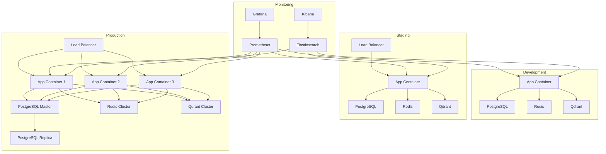

# Deployment Infrastructure - AI-HRMS-2025

## Overview

The AI-HRMS-2025 system is designed for enterprise-grade deployment with support for multiple environments, containerization, cloud platforms, and automated CI/CD pipelines. This document covers comprehensive deployment strategies and infrastructure management.

## Deployment Architecture

### Multi-Environment Strategy


## Containerization

### Dockerfile for Production
```dockerfile
# Dockerfile
FROM node:18-alpine AS builder

WORKDIR /app

# Copy package files
COPY package*.json ./

# Install dependencies
RUN npm ci --only=production && npm cache clean --force

# Create non-root user
RUN addgroup -g 1001 -S nodejs
RUN adduser -S nodejs -u 1001

# Copy source code
COPY --chown=nodejs:nodejs . .

# Build application
RUN npm run build

FROM node:18-alpine AS runner

WORKDIR /app

# Install dumb-init for proper signal handling
RUN apk add --no-cache dumb-init

# Create non-root user
RUN addgroup -g 1001 -S nodejs
RUN adduser -S nodejs -u 1001

# Copy built application
COPY --from=builder --chown=nodejs:nodejs /app/node_modules ./node_modules
COPY --from=builder --chown=nodejs:nodejs /app/package.json ./package.json
COPY --from=builder --chown=nodejs:nodejs /app/src ./src
COPY --from=builder --chown=nodejs:nodejs /app/models ./models
COPY --from=builder --chown=nodejs:nodejs /app/migrations ./migrations
COPY --from=builder --chown=nodejs:nodejs /app/config ./config
COPY --from=builder --chown=nodejs:nodejs /app/server.js ./server.js

# Set user
USER nodejs

# Expose port
EXPOSE 3000

# Health check
HEALTHCHECK --interval=30s --timeout=3s --start-period=5s --retries=3 \
  CMD node healthcheck.js

# Start application with dumb-init
ENTRYPOINT ["dumb-init", "--"]
CMD ["node", "server.js"]
```

### Multi-stage Build for Development
```dockerfile
# Dockerfile.dev
FROM node:18-alpine

WORKDIR /app

# Install dependencies for development
RUN apk add --no-cache \
    git \
    python3 \
    make \
    g++

# Copy package files
COPY package*.json ./

# Install all dependencies (including dev dependencies)
RUN npm install

# Copy source code
COPY . .

# Expose port
EXPOSE 3000

# Start development server with hot reload
CMD ["npm", "run", "dev"]
```

### Docker Compose for Local Development
```yaml
# docker-compose.yml
version: '3.8'

services:
  app:
    build:
      context: .
      dockerfile: Dockerfile.dev
    ports:
      - "3000:3000"
    environment:
      - NODE_ENV=development
      - DB_HOST=postgres
      - DB_PORT=5432
      - DB_NAME=ai_hrms_dev
      - DB_USER=hrms_user
      - DB_PASSWORD=secure_password
      - REDIS_URL=redis://redis:6379
      - QDRANT_URL=http://qdrant:6333
    volumes:
      - .:/app
      - /app/node_modules
    depends_on:
      - postgres
      - redis
      - qdrant
    networks:
      - ai-hrms-network

  postgres:
    image: postgres:15-alpine
    environment:
      POSTGRES_DB: ai_hrms_dev
      POSTGRES_USER: hrms_user
      POSTGRES_PASSWORD: secure_password
    ports:
      - "5432:5432"
    volumes:
      - postgres_data:/var/lib/postgresql/data
      - ./scripts/init-db.sql:/docker-entrypoint-initdb.d/init-db.sql
    networks:
      - ai-hrms-network

  redis:
    image: redis:7-alpine
    command: redis-server --appendonly yes
    ports:
      - "6379:6379"
    volumes:
      - redis_data:/data
    networks:
      - ai-hrms-network

  qdrant:
    image: qdrant/qdrant:latest
    ports:
      - "6333:6333"
      - "6334:6334"
    environment:
      QDRANT__SERVICE__HTTP_PORT: 6333
      QDRANT__SERVICE__GRPC_PORT: 6334
    volumes:
      - qdrant_data:/qdrant/storage
    networks:
      - ai-hrms-network

  ollama:
    image: ollama/ollama:latest
    ports:
      - "11434:11434"
    volumes:
      - ollama_data:/root/.ollama
    networks:
      - ai-hrms-network

  nginx:
    image: nginx:alpine
    ports:
      - "80:80"
      - "443:443"
    volumes:
      - ./nginx/nginx.conf:/etc/nginx/nginx.conf
      - ./nginx/ssl:/etc/nginx/ssl
    depends_on:
      - app
    networks:
      - ai-hrms-network

volumes:
  postgres_data:
  redis_data:
  qdrant_data:
  ollama_data:

networks:
  ai-hrms-network:
    driver: bridge
```

### Production Docker Compose
```yaml
# docker-compose.prod.yml
version: '3.8'

services:
  app:
    image: ai-hrms:${TAG:-latest}
    deploy:
      replicas: 3
      update_config:
        parallelism: 1
        delay: 10s
        failure_action: rollback
      rollback_config:
        parallelism: 1
        delay: 5s
      restart_policy:
        condition: on-failure
        delay: 5s
        max_attempts: 3
    environment:
      - NODE_ENV=production
      - DB_HOST=postgres-master
      - REDIS_URL=redis://redis-cluster:6379
      - QDRANT_URL=http://qdrant-cluster:6333
    secrets:
      - db_password
      - jwt_secret
      - openai_api_key
    networks:
      - ai-hrms-network
    healthcheck:
      test: ["CMD", "node", "healthcheck.js"]
      interval: 30s
      timeout: 10s
      retries: 3
      start_period: 40s

  nginx:
    image: nginx:alpine
    ports:
      - "80:80"
      - "443:443"
    volumes:
      - ./nginx/nginx.prod.conf:/etc/nginx/nginx.conf
      - ./nginx/ssl:/etc/nginx/ssl
      - static_files:/app/static
    depends_on:
      - app
    networks:
      - ai-hrms-network

secrets:
  db_password:
    external: true
  jwt_secret:
    external: true
  openai_api_key:
    external: true

networks:
  ai-hrms-network:
    driver: overlay
    attachable: true

volumes:
  static_files:
```

## Kubernetes Deployment

### Kubernetes Manifests
```yaml
# k8s/namespace.yaml
apiVersion: v1
kind: Namespace
metadata:
  name: ai-hrms
  labels:
    name: ai-hrms
---
# k8s/configmap.yaml
apiVersion: v1
kind: ConfigMap
metadata:
  name: ai-hrms-config
  namespace: ai-hrms
data:
  NODE_ENV: "production"
  DB_HOST: "postgres-service"
  DB_PORT: "5432"
  DB_NAME: "ai_hrms_prod"
  REDIS_URL: "redis://redis-service:6379"
  QDRANT_URL: "http://qdrant-service:6333"
---
# k8s/secret.yaml
apiVersion: v1
kind: Secret
metadata:
  name: ai-hrms-secrets
  namespace: ai-hrms
type: Opaque
data:
  db_password: <base64-encoded-password>
  jwt_secret: <base64-encoded-jwt-secret>
  openai_api_key: <base64-encoded-api-key>
  anthropic_api_key: <base64-encoded-api-key>
---
# k8s/deployment.yaml
apiVersion: apps/v1
kind: Deployment
metadata:
  name: ai-hrms-app
  namespace: ai-hrms
  labels:
    app: ai-hrms
spec:
  replicas: 3
  strategy:
    type: RollingUpdate
    rollingUpdate:
      maxUnavailable: 1
      maxSurge: 1
  selector:
    matchLabels:
      app: ai-hrms
  template:
    metadata:
      labels:
        app: ai-hrms
    spec:
      containers:
      - name: ai-hrms
        image: ai-hrms:latest
        ports:
        - containerPort: 3000
        env:
        - name: NODE_ENV
          valueFrom:
            configMapKeyRef:
              name: ai-hrms-config
              key: NODE_ENV
        - name: DB_HOST
          valueFrom:
            configMapKeyRef:
              name: ai-hrms-config
              key: DB_HOST
        - name: DB_PASSWORD
          valueFrom:
            secretKeyRef:
              name: ai-hrms-secrets
              key: db_password
        - name: JWT_SECRET
          valueFrom:
            secretKeyRef:
              name: ai-hrms-secrets
              key: jwt_secret
        - name: OPENAI_API_KEY
          valueFrom:
            secretKeyRef:
              name: ai-hrms-secrets
              key: openai_api_key
        resources:
          requests:
            memory: "256Mi"
            cpu: "250m"
          limits:
            memory: "512Mi"
            cpu: "500m"
        livenessProbe:
          httpGet:
            path: /health
            port: 3000
          initialDelaySeconds: 30
          periodSeconds: 10
          timeoutSeconds: 5
          failureThreshold: 3
        readinessProbe:
          httpGet:
            path: /ready
            port: 3000
          initialDelaySeconds: 5
          periodSeconds: 5
          timeoutSeconds: 3
          failureThreshold: 3
      imagePullSecrets:
      - name: regcred
---
# k8s/service.yaml
apiVersion: v1
kind: Service
metadata:
  name: ai-hrms-service
  namespace: ai-hrms
spec:
  selector:
    app: ai-hrms
  ports:
  - protocol: TCP
    port: 80
    targetPort: 3000
  type: ClusterIP
---
# k8s/ingress.yaml
apiVersion: networking.k8s.io/v1
kind: Ingress
metadata:
  name: ai-hrms-ingress
  namespace: ai-hrms
  annotations:
    kubernetes.io/ingress.class: nginx
    cert-manager.io/cluster-issuer: letsencrypt-prod
    nginx.ingress.kubernetes.io/rate-limit: "100"
    nginx.ingress.kubernetes.io/rate-limit-window: "1m"
spec:
  tls:
  - hosts:
    - ai-hrms.example.com
    secretName: ai-hrms-tls
  rules:
  - host: ai-hrms.example.com
    http:
      paths:
      - path: /
        pathType: Prefix
        backend:
          service:
            name: ai-hrms-service
            port:
              number: 80
---
# k8s/hpa.yaml
apiVersion: autoscaling/v2
kind: HorizontalPodAutoscaler
metadata:
  name: ai-hrms-hpa
  namespace: ai-hrms
spec:
  scaleTargetRef:
    apiVersion: apps/v1
    kind: Deployment
    name: ai-hrms-app
  minReplicas: 3
  maxReplicas: 10
  metrics:
  - type: Resource
    resource:
      name: cpu
      target:
        type: Utilization
        averageUtilization: 70
  - type: Resource
    resource:
      name: memory
      target:
        type: Utilization
        averageUtilization: 80
```

### Helm Chart Structure
```yaml
# helm/ai-hrms/Chart.yaml
apiVersion: v2
name: ai-hrms
description: AI-powered Human Resource Management System
type: application
version: 1.0.0
appVersion: "1.0.0"
dependencies:
  - name: postgresql
    version: 12.1.9
    repository: https://charts.bitnami.com/bitnami
  - name: redis
    version: 17.4.3
    repository: https://charts.bitnami.com/bitnami
---
# helm/ai-hrms/values.yaml
replicaCount: 3

image:
  repository: ai-hrms
  pullPolicy: IfNotPresent
  tag: "latest"

nameOverride: ""
fullnameOverride: ""

serviceAccount:
  create: true
  annotations: {}
  name: ""

podAnnotations: {}

podSecurityContext:
  fsGroup: 1001

securityContext:
  allowPrivilegeEscalation: false
  runAsNonRoot: true
  runAsUser: 1001

service:
  type: ClusterIP
  port: 80

ingress:
  enabled: true
  className: "nginx"
  annotations:
    cert-manager.io/cluster-issuer: letsencrypt-prod
    nginx.ingress.kubernetes.io/rate-limit: "100"
  hosts:
    - host: ai-hrms.example.com
      paths:
        - path: /
          pathType: Prefix
  tls:
    - secretName: ai-hrms-tls
      hosts:
        - ai-hrms.example.com

resources:
  limits:
    cpu: 500m
    memory: 512Mi
  requests:
    cpu: 250m
    memory: 256Mi

autoscaling:
  enabled: true
  minReplicas: 3
  maxReplicas: 10
  targetCPUUtilizationPercentage: 70
  targetMemoryUtilizationPercentage: 80

nodeSelector: {}

tolerations: []

affinity: {}

postgresql:
  enabled: true
  auth:
    postgresPassword: "secure_password"
    username: "hrms_user"
    password: "secure_password"
    database: "ai_hrms_prod"
  primary:
    persistence:
      enabled: true
      size: 100Gi

redis:
  enabled: true
  auth:
    enabled: false
  master:
    persistence:
      enabled: true
      size: 20Gi
```

## CI/CD Pipeline

### GitHub Actions Workflow
```yaml
# .github/workflows/deploy.yml
name: Deploy AI-HRMS

on:
  push:
    branches: [main]
    tags: ['v*']
  pull_request:
    branches: [main]

env:
  REGISTRY: ghcr.io
  IMAGE_NAME: ${{ github.repository }}

jobs:
  test:
    runs-on: ubuntu-latest
    services:
      postgres:
        image: postgres:15
        env:
          POSTGRES_PASSWORD: postgres
          POSTGRES_DB: test_db
        options: >-
          --health-cmd pg_isready
          --health-interval 10s
          --health-timeout 5s
          --health-retries 5
      redis:
        image: redis:7
        options: >-
          --health-cmd "redis-cli ping"
          --health-interval 10s
          --health-timeout 5s
          --health-retries 5

    steps:
    - name: Checkout code
      uses: actions/checkout@v4

    - name: Setup Node.js
      uses: actions/setup-node@v4
      with:
        node-version: '18'
        cache: 'npm'

    - name: Install dependencies
      run: npm ci

    - name: Run linter
      run: npm run lint

    - name: Run tests
      run: npm run test:coverage
      env:
        NODE_ENV: test
        DB_HOST: localhost
        DB_PASSWORD: postgres
        REDIS_URL: redis://localhost:6379

    - name: Upload coverage reports
      uses: codecov/codecov-action@v3

  build:
    needs: test
    runs-on: ubuntu-latest
    outputs:
      image: ${{ steps.meta.outputs.tags }}
      digest: ${{ steps.build.outputs.digest }}

    steps:
    - name: Checkout code
      uses: actions/checkout@v4

    - name: Setup Docker Buildx
      uses: docker/setup-buildx-action@v3

    - name: Log in to Container Registry
      uses: docker/login-action@v3
      with:
        registry: ${{ env.REGISTRY }}
        username: ${{ github.actor }}
        password: ${{ secrets.GITHUB_TOKEN }}

    - name: Extract metadata
      id: meta
      uses: docker/metadata-action@v5
      with:
        images: ${{ env.REGISTRY }}/${{ env.IMAGE_NAME }}
        tags: |
          type=ref,event=branch
          type=ref,event=pr
          type=semver,pattern={{version}}
          type=semver,pattern={{major}}.{{minor}}

    - name: Build and push Docker image
      id: build
      uses: docker/build-push-action@v5
      with:
        context: .
        platforms: linux/amd64,linux/arm64
        push: true
        tags: ${{ steps.meta.outputs.tags }}
        labels: ${{ steps.meta.outputs.labels }}
        cache-from: type=gha
        cache-to: type=gha,mode=max

  deploy-staging:
    needs: build
    runs-on: ubuntu-latest
    if: github.ref == 'refs/heads/main'
    environment: staging

    steps:
    - name: Checkout code
      uses: actions/checkout@v4

    - name: Setup kubectl
      uses: azure/setup-kubectl@v3
      with:
        version: 'latest'

    - name: Configure kubectl
      run: |
        echo "${{ secrets.KUBE_CONFIG }}" | base64 -d > kubeconfig
        export KUBECONFIG=kubeconfig

    - name: Deploy to staging
      run: |
        helm upgrade --install ai-hrms-staging ./helm/ai-hrms \
          --namespace ai-hrms-staging \
          --create-namespace \
          --set image.tag=${{ github.sha }} \
          --set ingress.hosts[0].host=staging.ai-hrms.example.com \
          --wait --timeout=600s

    - name: Run health check
      run: |
        kubectl wait --for=condition=ready pod \
          -l app.kubernetes.io/name=ai-hrms \
          -n ai-hrms-staging \
          --timeout=300s

  deploy-production:
    needs: [build, deploy-staging]
    runs-on: ubuntu-latest
    if: startsWith(github.ref, 'refs/tags/v')
    environment: production

    steps:
    - name: Checkout code
      uses: actions/checkout@v4

    - name: Setup kubectl
      uses: azure/setup-kubectl@v3
      with:
        version: 'latest'

    - name: Configure kubectl
      run: |
        echo "${{ secrets.PROD_KUBE_CONFIG }}" | base64 -d > kubeconfig
        export KUBECONFIG=kubeconfig

    - name: Deploy to production
      run: |
        helm upgrade --install ai-hrms ./helm/ai-hrms \
          --namespace ai-hrms \
          --create-namespace \
          --set image.tag=${{ github.ref_name }} \
          --set ingress.hosts[0].host=ai-hrms.example.com \
          --wait --timeout=600s

    - name: Verify deployment
      run: |
        kubectl rollout status deployment/ai-hrms \
          -n ai-hrms \
          --timeout=600s

  security-scan:
    needs: build
    runs-on: ubuntu-latest

    steps:
    - name: Run Trivy vulnerability scanner
      uses: aquasecurity/trivy-action@master
      with:
        image-ref: ${{ needs.build.outputs.image }}
        format: 'sarif'
        output: 'trivy-results.sarif'

    - name: Upload Trivy scan results
      uses: github/codeql-action/upload-sarif@v2
      with:
        sarif_file: 'trivy-results.sarif'
```

## Cloud Platform Deployments

### AWS ECS Deployment
```json
{
  "family": "ai-hrms-task",
  "networkMode": "awsvpc",
  "requiresCompatibilities": ["FARGATE"],
  "cpu": "1024",
  "memory": "2048",
  "executionRoleArn": "arn:aws:iam::account:role/ecsTaskExecutionRole",
  "taskRoleArn": "arn:aws:iam::account:role/ecsTaskRole",
  "containerDefinitions": [
    {
      "name": "ai-hrms",
      "image": "ai-hrms:latest",
      "portMappings": [
        {
          "containerPort": 3000,
          "protocol": "tcp"
        }
      ],
      "environment": [
        {
          "name": "NODE_ENV",
          "value": "production"
        }
      ],
      "secrets": [
        {
          "name": "DB_PASSWORD",
          "valueFrom": "arn:aws:secretsmanager:region:account:secret:db-password"
        },
        {
          "name": "JWT_SECRET",
          "valueFrom": "arn:aws:secretsmanager:region:account:secret:jwt-secret"
        }
      ],
      "logConfiguration": {
        "logDriver": "awslogs",
        "options": {
          "awslogs-group": "/aws/ecs/ai-hrms",
          "awslogs-region": "us-east-1",
          "awslogs-stream-prefix": "ecs"
        }
      },
      "healthCheck": {
        "command": ["CMD-SHELL", "node healthcheck.js"],
        "interval": 30,
        "timeout": 5,
        "retries": 3,
        "startPeriod": 60
      }
    }
  ]
}
```

### Terraform Infrastructure
```hcl
# terraform/main.tf
provider "aws" {
  region = var.aws_region
}

# VPC Configuration
module "vpc" {
  source = "terraform-aws-modules/vpc/aws"

  name = "ai-hrms-vpc"
  cidr = "10.0.0.0/16"

  azs             = ["${var.aws_region}a", "${var.aws_region}b", "${var.aws_region}c"]
  private_subnets = ["10.0.1.0/24", "10.0.2.0/24", "10.0.3.0/24"]
  public_subnets  = ["10.0.101.0/24", "10.0.102.0/24", "10.0.103.0/24"]

  enable_nat_gateway = true
  enable_vpn_gateway = true

  tags = {
    Environment = var.environment
    Project     = "ai-hrms"
  }
}

# RDS Instance
resource "aws_db_instance" "postgres" {
  identifier = "ai-hrms-postgres"

  allocated_storage     = 100
  max_allocated_storage = 1000
  storage_type          = "gp2"
  storage_encrypted     = true

  engine         = "postgres"
  engine_version = "15.4"
  instance_class = var.db_instance_class

  db_name  = "ai_hrms_prod"
  username = "hrms_user"
  password = var.db_password

  vpc_security_group_ids = [aws_security_group.rds.id]
  db_subnet_group_name   = aws_db_subnet_group.postgres.name

  backup_retention_period = 7
  backup_window          = "03:00-04:00"
  maintenance_window     = "sun:04:00-sun:05:00"

  skip_final_snapshot = false
  deletion_protection = true

  tags = {
    Environment = var.environment
    Project     = "ai-hrms"
  }
}

# ElastiCache Redis
resource "aws_elasticache_subnet_group" "redis" {
  name       = "ai-hrms-cache-subnet"
  subnet_ids = module.vpc.private_subnets
}

resource "aws_elasticache_replication_group" "redis" {
  replication_group_id         = "ai-hrms-redis"
  description                  = "Redis cluster for AI-HRMS"

  node_type                    = var.redis_node_type
  port                         = 6379
  parameter_group_name         = "default.redis7"

  num_cache_clusters           = 2
  automatic_failover_enabled   = true
  multi_az_enabled            = true

  subnet_group_name           = aws_elasticache_subnet_group.redis.name
  security_group_ids          = [aws_security_group.redis.id]

  at_rest_encryption_enabled  = true
  transit_encryption_enabled  = true

  tags = {
    Environment = var.environment
    Project     = "ai-hrms"
  }
}

# ECS Cluster
resource "aws_ecs_cluster" "main" {
  name = "ai-hrms-cluster"

  setting {
    name  = "containerInsights"
    value = "enabled"
  }

  tags = {
    Environment = var.environment
    Project     = "ai-hrms"
  }
}

# ECS Service
resource "aws_ecs_service" "ai_hrms" {
  name            = "ai-hrms-service"
  cluster         = aws_ecs_cluster.main.id
  task_definition = aws_ecs_task_definition.ai_hrms.arn
  launch_type     = "FARGATE"
  desired_count   = var.app_count

  network_configuration {
    security_groups  = [aws_security_group.ecs_tasks.id]
    subnets          = module.vpc.private_subnets
    assign_public_ip = false
  }

  load_balancer {
    target_group_arn = aws_lb_target_group.ai_hrms.arn
    container_name   = "ai-hrms"
    container_port   = 3000
  }

  depends_on = [aws_lb_listener.ai_hrms]

  tags = {
    Environment = var.environment
    Project     = "ai-hrms"
  }
}

# Application Load Balancer
resource "aws_lb" "main" {
  name               = "ai-hrms-alb"
  internal           = false
  load_balancer_type = "application"
  security_groups    = [aws_security_group.lb.id]
  subnets            = module.vpc.public_subnets

  enable_deletion_protection = true

  tags = {
    Environment = var.environment
    Project     = "ai-hrms"
  }
}
```

## Monitoring and Observability

### Prometheus Configuration
```yaml
# prometheus.yml
global:
  scrape_interval: 15s
  evaluation_interval: 15s

rule_files:
  - "rules/*.yml"

scrape_configs:
  - job_name: 'ai-hrms'
    static_configs:
      - targets: ['localhost:3000']
    metrics_path: /metrics
    scrape_interval: 10s

  - job_name: 'postgres'
    static_configs:
      - targets: ['postgres-exporter:9187']

  - job_name: 'redis'
    static_configs:
      - targets: ['redis-exporter:9121']

  - job_name: 'node-exporter'
    static_configs:
      - targets: ['node-exporter:9100']

alerting:
  alertmanagers:
    - static_configs:
        - targets:
          - alertmanager:9093
```

### Grafana Dashboard
```json
{
  "dashboard": {
    "title": "AI-HRMS Monitoring",
    "panels": [
      {
        "title": "Request Rate",
        "type": "graph",
        "targets": [
          {
            "expr": "rate(http_requests_total[5m])",
            "legendFormat": "{{method}} {{status}}"
          }
        ]
      },
      {
        "title": "Response Time",
        "type": "graph",
        "targets": [
          {
            "expr": "histogram_quantile(0.95, rate(http_request_duration_seconds_bucket[5m]))",
            "legendFormat": "95th percentile"
          }
        ]
      },
      {
        "title": "Database Connections",
        "type": "graph",
        "targets": [
          {
            "expr": "pg_stat_database_numbackends",
            "legendFormat": "Active connections"
          }
        ]
      }
    ]
  }
}
```

This comprehensive deployment infrastructure documentation provides enterprise-grade deployment strategies for the AI-HRMS-2025 system across various platforms and environments.