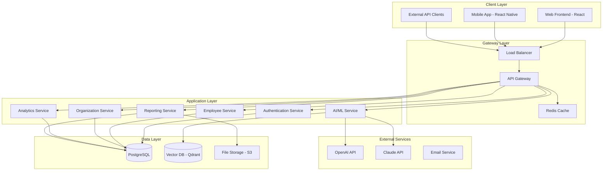

# Architecture Patterns - AI-HRMS-2025

## System Architecture Overview

The AI-HRMS-2025 follows a multi-tier, microservices-inspired architecture with multi-tenant SaaS capabilities, designed for scalability, maintainability, and enterprise-grade performance.

## High-Level Architecture



## Multi-Tenant Architecture

### Tenant Isolation Strategy

#### 1. Database-Level Isolation
```javascript
// Tenant context middleware
const setTenantContext = async (req, res, next) => {
    if (req.user && req.user.organizationId) {
        // Set tenant context for all database queries
        await sequelize.query(
            `SET LOCAL app.current_organization_id = ${req.user.organizationId}`
        );

        // Add to request context
        req.tenant = {
            organizationId: req.user.organizationId,
            tenantConfig: await getTenantConfig(req.user.organizationId)
        };
    }
    next();
};
```

#### 2. Row-Level Security Implementation
```sql
-- Enable RLS on all tenant tables
ALTER TABLE employees ENABLE ROW LEVEL SECURITY;
ALTER TABLE organizations ENABLE ROW LEVEL SECURITY;
ALTER TABLE departments ENABLE ROW LEVEL SECURITY;

-- Create tenant isolation policies
CREATE POLICY tenant_isolation_employees ON employees
    FOR ALL TO application_users
    USING (organization_id = current_setting('app.current_organization_id')::INTEGER);

-- Create hierarchical access policy for managers
CREATE POLICY manager_access_employees ON employees
    FOR SELECT TO application_users
    USING (
        organization_id = current_setting('app.current_organization_id')::INTEGER
        AND (
            manager_id = (
                SELECT id FROM employees
                WHERE user_id = current_setting('app.current_user_id')::INTEGER
            )
            OR id = (
                SELECT id FROM employees
                WHERE user_id = current_setting('app.current_user_id')::INTEGER
            )
        )
    );
```

## Microservices Design Patterns

### Service Layer Architecture
```javascript
// Base service class with common patterns
class BaseService {
    constructor(model) {
        this.model = model;
        this.cache = require('./cacheService');
        this.logger = require('./loggerService');
    }

    async findById(id, options = {}) {
        const cacheKey = `${this.model.name}:${id}`;

        // Try cache first
        let result = await this.cache.get(cacheKey);

        if (!result) {
            result = await this.model.findByPk(id, {
                ...options,
                where: {
                    ...options.where,
                    organizationId: options.organizationId
                }
            });

            if (result) {
                await this.cache.set(cacheKey, result, 300); // 5 minutes
            }
        }

        return result;
    }

    async create(data, options = {}) {
        const transaction = await sequelize.transaction();

        try {
            const result = await this.model.create({
                ...data,
                organizationId: options.organizationId
            }, { transaction });

            await this.invalidateCache(result.id);
            await transaction.commit();

            // Emit event for other services
            this.eventBus.emit(`${this.model.name}.created`, result);

            return result;
        } catch (error) {
            await transaction.rollback();
            throw error;
        }
    }

    async invalidateCache(id) {
        const cacheKey = `${this.model.name}:${id}`;
        await this.cache.del(cacheKey);
    }
}

// Employee service implementation
class EmployeeService extends BaseService {
    constructor() {
        super(Employee);
    }

    async getEmployeeHierarchy(employeeId, organizationId) {
        const cacheKey = `hierarchy:${organizationId}:${employeeId}`;

        let hierarchy = await this.cache.get(cacheKey);

        if (!hierarchy) {
            // Build hierarchy tree
            hierarchy = await this.buildHierarchyTree(employeeId, organizationId);
            await this.cache.set(cacheKey, hierarchy, 600); // 10 minutes
        }

        return hierarchy;
    }

    async buildHierarchyTree(employeeId, organizationId) {
        const employee = await Employee.findByPk(employeeId, {
            include: [
                {
                    model: Employee,
                    as: 'DirectReports',
                    include: ['User']
                },
                {
                    model: Employee,
                    as: 'Manager',
                    include: ['User']
                }
            ],
            where: { organizationId }
        });

        return this.formatHierarchy(employee);
    }
}
```

### Event-Driven Architecture
```javascript
// Event bus implementation
class EventBus {
    constructor() {
        this.listeners = new Map();
        this.redis = new Redis(process.env.REDIS_URL);
    }

    on(event, handler) {
        if (!this.listeners.has(event)) {
            this.listeners.set(event, []);
        }
        this.listeners.get(event).push(handler);
    }

    async emit(event, data) {
        // Local event handling
        const handlers = this.listeners.get(event) || [];
        const promises = handlers.map(handler => handler(data));

        // Distributed event handling via Redis
        await this.redis.publish(`events:${event}`, JSON.stringify(data));

        return Promise.allSettled(promises);
    }

    async subscribe(pattern) {
        const subscriber = this.redis.duplicate();

        subscriber.psubscribe(`events:${pattern}`);

        subscriber.on('pmessage', (pattern, channel, message) => {
            const event = channel.replace('events:', '');
            const data = JSON.parse(message);

            this.emit(event, data);
        });
    }
}

// Usage in services
const eventBus = new EventBus();

// Employee service events
eventBus.on('employee.created', async (employee) => {
    // Update analytics
    await analyticsService.recordEmployeeCreation(employee);

    // Send welcome email
    await emailService.sendWelcomeEmail(employee);

    // Update org statistics
    await organizationService.updateStatistics(employee.organizationId);
});
```

## Domain-Driven Design

### Domain Model Structure
```javascript
// Domain entities with rich business logic
class Employee {
    constructor(data) {
        this.id = data.id;
        this.firstName = data.firstName;
        this.lastName = data.lastName;
        this.position = data.position;
        this.department = data.department;
        this.skills = data.skills || [];
        this.performanceHistory = data.performanceHistory || [];
    }

    get fullName() {
        return `${this.firstName} ${this.lastName}`;
    }

    calculatePerformanceScore() {
        if (this.performanceHistory.length === 0) return null;

        const totalScore = this.performanceHistory.reduce(
            (sum, review) => sum + review.score, 0
        );

        return totalScore / this.performanceHistory.length;
    }

    hasSkill(skillName) {
        return this.skills.some(skill =>
            skill.name.toLowerCase() === skillName.toLowerCase()
        );
    }

    getSkillLevel(skillName) {
        const skill = this.skills.find(s =>
            s.name.toLowerCase() === skillName.toLowerCase()
        );

        return skill ? skill.level : 0;
    }

    canBePromotedTo(position) {
        const requiredSkills = PositionRequirements.getSkills(position);

        return requiredSkills.every(req => {
            const userLevel = this.getSkillLevel(req.skill);
            return userLevel >= req.minimumLevel;
        });
    }
}

// Repository pattern for data access
class EmployeeRepository {
    constructor(database) {
        this.db = database;
    }

    async findById(id, organizationId) {
        const data = await this.db.Employee.findOne({
            where: { id, organizationId },
            include: ['Skills', 'PerformanceReviews', 'Department']
        });

        return data ? new Employee(data) : null;
    }

    async findBySkill(skillName, organizationId) {
        const employees = await this.db.Employee.findAll({
            where: {
                organizationId,
                skills: {
                    [Op.contains]: [{ name: skillName }]
                }
            }
        });

        return employees.map(emp => new Employee(emp));
    }

    async save(employee) {
        const data = employee.toPlainObject();

        if (employee.id) {
            await this.db.Employee.update(data, {
                where: { id: employee.id }
            });
        } else {
            const created = await this.db.Employee.create(data);
            employee.id = created.id;
        }

        return employee;
    }
}
```

### Aggregate Design
```javascript
// Organization aggregate root
class Organization {
    constructor(data) {
        this.id = data.id;
        this.name = data.name;
        this.departments = data.departments || [];
        this.employees = data.employees || [];
        this.settings = data.settings || {};
        this.domainEvents = [];
    }

    addDepartment(departmentData) {
        const department = new Department({
            ...departmentData,
            organizationId: this.id
        });

        this.departments.push(department);

        this.addDomainEvent('department.added', {
            organizationId: this.id,
            department: department
        });

        return department;
    }

    addEmployee(employeeData) {
        const employee = new Employee({
            ...employeeData,
            organizationId: this.id
        });

        // Business rule: Employee must be assigned to existing department
        const department = this.departments.find(d => d.id === employeeData.departmentId);
        if (!department) {
            throw new Error('Employee must be assigned to an existing department');
        }

        this.employees.push(employee);
        department.addEmployee(employee);

        this.addDomainEvent('employee.added', {
            organizationId: this.id,
            employee: employee,
            department: department
        });

        return employee;
    }

    calculateOrgChart() {
        const chart = {
            ceo: null,
            departments: {},
            totalEmployees: this.employees.length
        };

        // Find CEO (employee with no manager)
        chart.ceo = this.employees.find(emp => !emp.managerId);

        // Group employees by department
        this.departments.forEach(dept => {
            chart.departments[dept.name] = {
                manager: this.employees.find(emp => emp.id === dept.managerId),
                employees: this.employees.filter(emp => emp.departmentId === dept.id)
            };
        });

        return chart;
    }

    addDomainEvent(eventType, data) {
        this.domainEvents.push({
            type: eventType,
            data: data,
            timestamp: new Date()
        });
    }

    getDomainEvents() {
        return [...this.domainEvents];
    }

    clearDomainEvents() {
        this.domainEvents = [];
    }
}
```

## CQRS Pattern Implementation

### Command and Query Separation
```javascript
// Command handlers
class CreateEmployeeCommand {
    constructor(data) {
        this.firstName = data.firstName;
        this.lastName = data.lastName;
        this.email = data.email;
        this.departmentId = data.departmentId;
        this.organizationId = data.organizationId;
    }
}

class CreateEmployeeCommandHandler {
    constructor(employeeRepository, eventBus) {
        this.employeeRepository = employeeRepository;
        this.eventBus = eventBus;
    }

    async handle(command) {
        // Validate command
        await this.validateCommand(command);

        // Create employee
        const employee = new Employee({
            firstName: command.firstName,
            lastName: command.lastName,
            email: command.email,
            departmentId: command.departmentId,
            organizationId: command.organizationId
        });

        // Save to repository
        const savedEmployee = await this.employeeRepository.save(employee);

        // Publish events
        await this.eventBus.emit('employee.created', savedEmployee);

        return savedEmployee;
    }

    async validateCommand(command) {
        // Check if email already exists
        const existing = await this.employeeRepository.findByEmail(
            command.email,
            command.organizationId
        );

        if (existing) {
            throw new Error('Employee with this email already exists');
        }

        // Validate department exists
        const department = await this.departmentRepository.findById(
            command.departmentId
        );

        if (!department) {
            throw new Error('Department not found');
        }
    }
}

// Query handlers
class GetEmployeeQuery {
    constructor(employeeId, organizationId) {
        this.employeeId = employeeId;
        this.organizationId = organizationId;
    }
}

class GetEmployeeQueryHandler {
    constructor(readModel) {
        this.readModel = readModel;
    }

    async handle(query) {
        return await this.readModel.getEmployee(
            query.employeeId,
            query.organizationId
        );
    }
}

// Read model for optimized queries
class EmployeeReadModel {
    constructor(database) {
        this.db = database;
    }

    async getEmployee(id, organizationId) {
        // Optimized query with all necessary joins
        return await this.db.query(`
            SELECT
                e.*,
                u.email,
                u.first_name,
                u.last_name,
                d.name as department_name,
                m.first_name as manager_first_name,
                m.last_name as manager_last_name
            FROM employees e
            JOIN users u ON e.user_id = u.id
            LEFT JOIN departments d ON e.department_id = d.id
            LEFT JOIN employees me ON e.manager_id = me.id
            LEFT JOIN users m ON me.user_id = m.id
            WHERE e.id = :id AND e.organization_id = :organizationId
        `, {
            replacements: { id, organizationId },
            type: QueryTypes.SELECT
        });
    }

    async getEmployeesByDepartment(departmentId, organizationId) {
        // Cached query for frequently accessed data
        const cacheKey = `employees:dept:${departmentId}:${organizationId}`;

        let result = await cache.get(cacheKey);

        if (!result) {
            result = await this.db.query(`
                SELECT e.*, u.first_name, u.last_name, u.email
                FROM employees e
                JOIN users u ON e.user_id = u.id
                WHERE e.department_id = :departmentId
                AND e.organization_id = :organizationId
                AND e.status = 'active'
                ORDER BY u.last_name, u.first_name
            `, {
                replacements: { departmentId, organizationId },
                type: QueryTypes.SELECT
            });

            await cache.set(cacheKey, result, 300); // 5 minutes
        }

        return result;
    }
}
```

## Performance Patterns

### Caching Strategy
```javascript
// Multi-level caching implementation
class CacheService {
    constructor() {
        this.redis = new Redis(process.env.REDIS_URL);
        this.memoryCache = new Map();
        this.maxMemoryItems = 1000;
    }

    async get(key) {
        // L1: Memory cache
        if (this.memoryCache.has(key)) {
            return this.memoryCache.get(key);
        }

        // L2: Redis cache
        const redisValue = await this.redis.get(key);
        if (redisValue) {
            const parsed = JSON.parse(redisValue);
            this.setMemoryCache(key, parsed);
            return parsed;
        }

        return null;
    }

    async set(key, value, ttl = 3600) {
        // Set in both caches
        this.setMemoryCache(key, value);
        await this.redis.setex(key, ttl, JSON.stringify(value));
    }

    setMemoryCache(key, value) {
        // LRU eviction
        if (this.memoryCache.size >= this.maxMemoryItems) {
            const firstKey = this.memoryCache.keys().next().value;
            this.memoryCache.delete(firstKey);
        }

        this.memoryCache.set(key, value);
    }

    async invalidate(pattern) {
        // Clear memory cache
        for (const key of this.memoryCache.keys()) {
            if (key.includes(pattern)) {
                this.memoryCache.delete(key);
            }
        }

        // Clear Redis cache
        const keys = await this.redis.keys(`*${pattern}*`);
        if (keys.length > 0) {
            await this.redis.del(...keys);
        }
    }
}
```

This architecture provides a solid foundation for the AI-HRMS-2025 system with proper separation of concerns, scalability patterns, and enterprise-grade design principles.