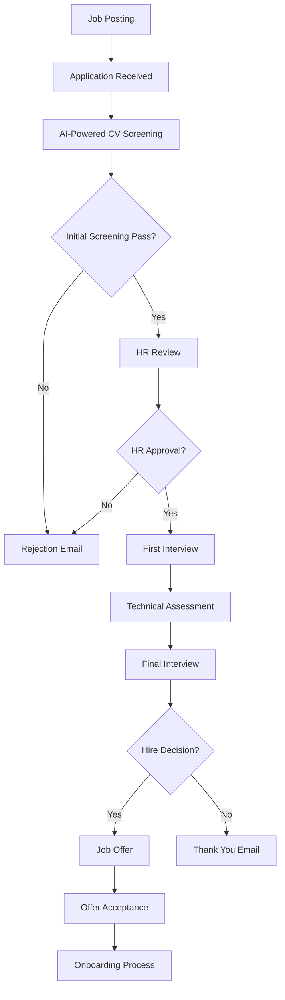

# Business Workflows - AI-HRMS-2025

## Overview

The AI-HRMS-2025 system implements comprehensive HR business workflows covering the complete employee lifecycle, from recruitment and onboarding to performance management and offboarding.

## Employee Lifecycle Management

### 1. Recruitment Process


### 2. Onboarding Workflow
```javascript
// Onboarding workflow implementation
class OnboardingWorkflow {
    constructor(employeeId, organizationId) {
        this.employeeId = employeeId;
        this.organizationId = organizationId;
        this.steps = [
            'document_collection',
            'system_access_setup',
            'orientation_scheduling',
            'equipment_assignment',
            'mentor_assignment',
            'initial_training',
            'probation_setup'
        ];
        this.currentStep = 0;
    }

    async executeStep(stepName) {
        switch (stepName) {
            case 'document_collection':
                return await this.collectDocuments();
            case 'system_access_setup':
                return await this.setupSystemAccess();
            case 'orientation_scheduling':
                return await this.scheduleOrientation();
            // ... other steps
        }
    }

    async collectDocuments() {
        const requiredDocs = [
            'identity_proof',
            'address_proof',
            'education_certificates',
            'previous_employment',
            'bank_details'
        ];

        // Send document collection email
        await emailService.sendDocumentRequest(this.employeeId, requiredDocs);

        // Create document tracking
        return await DocumentTracker.create({
            employeeId: this.employeeId,
            requiredDocuments: requiredDocs,
            status: 'pending'
        });
    }
}
```

## Performance Management

### Performance Review Cycle
```javascript
// Performance review workflow
class PerformanceReviewCycle {
    constructor(organizationId, cycle) {
        this.organizationId = organizationId;
        this.cycle = cycle; // quarterly, half-yearly, yearly
        this.phases = [
            'goal_setting',
            'self_assessment',
            'manager_review',
            'peer_feedback',
            'final_rating',
            'development_planning'
        ];
    }

    async initiateReviewCycle() {
        const employees = await Employee.findAll({
            where: { 
                organizationId: this.organizationId,
                status: 'active'
            }
        });

        for (const employee of employees) {
            await this.createReviewInstance(employee);
        }
    }

    async createReviewInstance(employee) {
        const review = await PerformanceReview.create({
            employeeId: employee.id,
            reviewerId: employee.managerId,
            cycle: this.cycle,
            status: 'goal_setting',
            startDate: new Date(),
            dueDate: this.calculateDueDate()
        });

        // Send notification to employee and manager
        await this.sendReviewNotifications(review);

        return review;
    }

    async processGoalSetting(reviewId, goals) {
        const review = await PerformanceReview.findByPk(reviewId);

        await review.update({
            goals: goals,
            status: 'self_assessment'
        });

        // AI-powered goal analysis
        const goalAnalysis = await aiService.analyzeGoals(goals);

        await GoalAnalysis.create({
            reviewId: reviewId,
            analysis: goalAnalysis,
            suggestions: goalAnalysis.suggestions
        });
    }
}
```

## Leave Management

### Leave Request Workflow
```javascript
// Leave management system
class LeaveManagement {
    static async submitLeaveRequest(employeeId, leaveData) {
        const employee = await Employee.findByPk(employeeId);
        const leavePolicy = await this.getLeavePolicy(employee.organizationId);

        // Validate leave request
        const validation = await this.validateLeaveRequest(employee, leaveData, leavePolicy);
        
        if (!validation.valid) {
            throw new Error(validation.reason);
        }

        // Create leave request
        const leaveRequest = await LeaveRequest.create({
            employeeId: employeeId,
            leaveType: leaveData.leaveType,
            startDate: leaveData.startDate,
            endDate: leaveData.endDate,
            reason: leaveData.reason,
            status: 'pending',
            appliedDate: new Date()
        });

        // Auto-approval for certain leave types
        if (leavePolicy.autoApprovalTypes.includes(leaveData.leaveType)) {
            return await this.approveLeave(leaveRequest.id, 'system');
        }

        // Send approval request to manager
        await this.sendApprovalRequest(leaveRequest);

        return leaveRequest;
    }

    static async approveLeave(leaveRequestId, approverId) {
        const leaveRequest = await LeaveRequest.findByPk(leaveRequestId);

        await leaveRequest.update({
            status: 'approved',
            approvedBy: approverId,
            approvedDate: new Date()
        });

        // Update leave balance
        await this.updateLeaveBalance(leaveRequest);

        // Send confirmation emails
        await this.sendLeaveConfirmation(leaveRequest);

        return leaveRequest;
    }

    static async validateLeaveRequest(employee, leaveData, policy) {
        // Check leave balance
        const balance = await this.getLeaveBalance(employee.id, leaveData.leaveType);
        const requestedDays = this.calculateLeaveDays(leaveData.startDate, leaveData.endDate);

        if (balance < requestedDays) {
            return {
                valid: false,
                reason: 'Insufficient leave balance'
            };
        }

        // Check minimum notice period
        const noticeGiven = this.calculateNoticeDays(new Date(), leaveData.startDate);
        if (noticeGiven < policy.minimumNotice) {
            return {
                valid: false,
                reason: `Minimum ${policy.minimumNotice} days notice required`
            };
        }

        return { valid: true };
    }
}
```

## Payroll Processing

### Payroll Workflow
```javascript
// Payroll processing system
class PayrollProcessor {
    constructor(organizationId, payPeriod) {
        this.organizationId = organizationId;
        this.payPeriod = payPeriod;
    }

    async processPayroll() {
        const employees = await this.getActiveEmployees();
        const payrollResults = [];

        for (const employee of employees) {
            const payrollData = await this.calculateEmployeePayroll(employee);
            payrollResults.push(payrollData);
        }

        // Generate payroll summary
        const summary = await this.generatePayrollSummary(payrollResults);

        // Send for approval
        await this.sendForApproval(summary, payrollResults);

        return { summary, payrollResults };
    }

    async calculateEmployeePayroll(employee) {
        const baseSalary = employee.salary;
        const workingDays = await this.calculateWorkingDays(employee.id);
        const leaves = await this.getLeaveDeductions(employee.id);
        const overtime = await this.calculateOvertime(employee.id);
        const bonuses = await this.getBonuses(employee.id);

        // Basic calculations
        const grossSalary = this.calculateGrossSalary(
            baseSalary, workingDays, overtime, bonuses
        );

        const deductions = await this.calculateDeductions(employee, grossSalary);
        const netSalary = grossSalary - deductions.total;

        return {
            employeeId: employee.id,
            grossSalary,
            deductions,
            netSalary,
            payPeriod: this.payPeriod
        };
    }

    async calculateDeductions(employee, grossSalary) {
        const taxRate = await this.getTaxRate(employee.organizationId);
        const insurance = await this.getInsuranceDeduction(employee.id);

        return {
            tax: grossSalary * taxRate,
            insurance: insurance,
            providentFund: grossSalary * 0.12, // 12% PF
            total: 0 // calculated sum
        };
    }
}
```

## Organization Management

### Department Hierarchy
```javascript
// Organization structure management
class OrganizationStructure {
    static async createDepartment(organizationId, departmentData) {
        // Validate parent department exists
        if (departmentData.parentDepartmentId) {
            const parent = await Department.findByPk(departmentData.parentDepartmentId);
            if (!parent || parent.organizationId !== organizationId) {
                throw new Error('Invalid parent department');
            }
        }

        const department = await Department.create({
            ...departmentData,
            organizationId: organizationId
        });

        // Update organization hierarchy cache
        await this.updateHierarchyCache(organizationId);

        return department;
    }

    static async getOrganizationHierarchy(organizationId) {
        const cacheKey = `org_hierarchy:${organizationId}`;
        let hierarchy = await cache.get(cacheKey);

        if (!hierarchy) {
            hierarchy = await this.buildHierarchy(organizationId);
            await cache.set(cacheKey, hierarchy, 3600); // 1 hour
        }

        return hierarchy;
    }

    static async buildHierarchy(organizationId) {
        const departments = await Department.findAll({
            where: { organizationId },
            include: ['Employees', 'Manager']
        });

        // Build tree structure
        const hierarchy = this.buildDepartmentTree(departments);

        return hierarchy;
    }

    static buildDepartmentTree(departments) {
        const deptMap = new Map();
        const roots = [];

        // Create department map
        departments.forEach(dept => {
            deptMap.set(dept.id, {
                ...dept.toJSON(),
                children: []
            });
        });

        // Build tree
        departments.forEach(dept => {
            if (dept.parentDepartmentId) {
                const parent = deptMap.get(dept.parentDepartmentId);
                if (parent) {
                    parent.children.push(deptMap.get(dept.id));
                }
            } else {
                roots.push(deptMap.get(dept.id));
            }
        });

        return roots;
    }
}
```

## Compliance and Reporting

### Compliance Monitoring
```javascript
// Compliance monitoring system
class ComplianceMonitor {
    static async checkComplianceStatus(organizationId) {
        const checks = [
            this.checkEmployeeDocuments,
            this.checkPerformanceReviews,
            this.checkLeaveCompliance,
            this.checkPayrollCompliance,
            this.checkTrainingCompliance
        ];

        const results = {};

        for (const check of checks) {
            const checkName = check.name.replace('check', '').toLowerCase();
            results[checkName] = await check(organizationId);
        }

        return this.generateComplianceReport(results);
    }

    static async checkEmployeeDocuments(organizationId) {
        const employees = await Employee.findAll({
            where: { organizationId, status: 'active' }
        });

        const incompleteCount = await Promise.all(
            employees.map(async emp => {
                const docs = await Document.findAll({
                    where: { employeeId: emp.id }
                });

                const requiredDocs = ['identity', 'address', 'education'];
                const submittedTypes = docs.map(d => d.type);

                return requiredDocs.every(type => submittedTypes.includes(type)) ? 0 : 1;
            })
        ).then(results => results.reduce((sum, val) => sum + val, 0));

        return {
            status: incompleteCount === 0 ? 'compliant' : 'non-compliant',
            totalEmployees: employees.length,
            incompleteDocuments: incompleteCount,
            compliancePercentage: ((employees.length - incompleteCount) / employees.length) * 100
        };
    }

    static async generateComplianceReport(results) {
        const overallCompliance = Object.values(results).every(
            result => result.status === 'compliant'
        );

        return {
            overallStatus: overallCompliance ? 'compliant' : 'non-compliant',
            lastChecked: new Date(),
            details: results,
            recommendations: this.generateRecommendations(results)
        };
    }
}
```

## Analytics and Insights

### HR Analytics
```javascript
// HR analytics and insights
class HRAnalytics {
    static async generateInsights(organizationId, timeframe = '1y') {
        const insights = {};

        // Employee turnover analysis
        insights.turnover = await this.analyzeTurnover(organizationId, timeframe);

        // Performance trends
        insights.performance = await this.analyzePerformance(organizationId, timeframe);

        // Recruitment analytics
        insights.recruitment = await this.analyzeRecruitment(organizationId, timeframe);

        // Skills gap analysis
        insights.skillsGap = await this.analyzeSkillsGap(organizationId);

        return insights;
    }

    static async analyzeTurnover(organizationId, timeframe) {
        const startDate = this.getStartDate(timeframe);

        const [totalEmployees, departures] = await Promise.all([
            Employee.count({
                where: { organizationId, status: 'active' }
            }),
            Employee.count({
                where: {
                    organizationId,
                    status: 'terminated',
                    updatedAt: { [Op.gte]: startDate }
                }
            })
        ]);

        const turnoverRate = (departures / totalEmployees) * 100;

        return {
            rate: turnoverRate,
            totalEmployees,
            departures,
            benchmarkComparison: await this.getTurnoverBenchmark()
        };
    }

    static async analyzeSkillsGap(organizationId) {
        // Get all employees with their skills
        const employees = await Employee.findAll({
            where: { organizationId },
            attributes: ['skills', 'position', 'departmentId']
        });

        // Get required skills for each position
        const positionRequirements = await PositionRequirement.findAll({
            where: { organizationId }
        });

        // Analyze gaps
        const skillsGap = this.calculateSkillsGap(employees, positionRequirements);

        return skillsGap;
    }
}
```

This comprehensive business workflow documentation covers all major HR processes and provides a solid foundation for implementing the AI-HRMS-2025 system's business logic.
