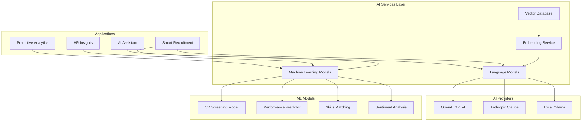

# AI and ML Integration - AI-HRMS-2025

## Overview

The AI-HRMS-2025 system integrates advanced artificial intelligence and machine learning capabilities to enhance HR processes, provide intelligent insights, and automate decision-making across the human resource management lifecycle.

## AI Service Architecture

### Core AI Components


## Language Model Integration

### OpenAI Integration
```javascript
// services/aiService.js
const OpenAI = require('openai');

class OpenAIService {
    constructor() {
        this.client = new OpenAI({
            apiKey: process.env.OPENAI_API_KEY
        });
        this.defaultModel = 'gpt-4-turbo-preview';
    }

    async generateText(prompt, options = {}) {
        try {
            const response = await this.client.chat.completions.create({
                model: options.model || this.defaultModel,
                messages: [
                    { role: 'system', content: options.systemPrompt || 'You are an HR assistant.' },
                    { role: 'user', content: prompt }
                ],
                max_tokens: options.maxTokens || 1000,
                temperature: options.temperature || 0.7
            });

            return {
                text: response.choices[0].message.content,
                usage: response.usage,
                model: response.model
            };
        } catch (error) {
            console.error('OpenAI API error:', error);
            throw new Error(`AI service unavailable: ${error.message}`);
        }
    }

    async analyzeCV(cvText, jobDescription) {
        const prompt = `
            Analyze this CV against the job description and provide:
            1. Overall match score (0-100)
            2. Key strengths
            3. Potential concerns
            4. Skills match analysis
            5. Experience relevance

            Job Description:
            ${jobDescription}

            CV Content:
            ${cvText}
        `;

        const systemPrompt = `You are an expert HR recruiter. Provide objective, unbiased analysis
        focusing on qualifications, skills, and experience. Return response in JSON format.`;

        return await this.generateText(prompt, {
            systemPrompt,
            temperature: 0.3,
            maxTokens: 1500
        });
    }

    async generateJobDescription(position, requirements) {
        const prompt = `
            Create a comprehensive job description for: ${position}

            Requirements:
            ${requirements.join('\n')}

            Include:
            - Job summary
            - Key responsibilities
            - Required qualifications
            - Preferred qualifications
            - Benefits overview
        `;

        return await this.generateText(prompt, {
            systemPrompt: 'You are an expert HR professional creating job descriptions.',
            temperature: 0.5
        });
    }

    async performanceInsights(employeeData) {
        const prompt = `
            Analyze employee performance data and provide insights:

            Employee Data:
            ${JSON.stringify(employeeData, null, 2)}

            Provide:
            1. Performance trends
            2. Strengths and improvement areas
            3. Development recommendations
            4. Goal suggestions
        `;

        return await this.generateText(prompt, {
            systemPrompt: 'You are an HR analytics expert providing performance insights.',
            temperature: 0.4
        });
    }
}
```

### Claude Integration
```javascript
// services/claudeService.js
const Anthropic = require('@anthropic-ai/sdk');

class ClaudeService {
    constructor() {
        this.client = new Anthropic({
            apiKey: process.env.ANTHROPIC_API_KEY
        });
        this.defaultModel = 'claude-3-opus-20240229';
    }

    async generateResponse(prompt, options = {}) {
        try {
            const response = await this.client.messages.create({
                model: options.model || this.defaultModel,
                max_tokens: options.maxTokens || 1000,
                temperature: options.temperature || 0.7,
                messages: [
                    { role: 'user', content: prompt }
                ]
            });

            return {
                text: response.content[0].text,
                usage: response.usage,
                model: response.model
            };
        } catch (error) {
            console.error('Claude API error:', error);
            throw new Error(`Claude service unavailable: ${error.message}`);
        }
    }

    async hrPolicyAnalysis(policyText, scenario) {
        const prompt = `
            As an HR policy expert, analyze this policy document and determine how it applies to the given scenario.

            Policy Document:
            ${policyText}

            Scenario:
            ${scenario}

            Provide:
            1. Applicable policy sections
            2. Interpretation and guidance
            3. Recommended actions
            4. Compliance considerations
        `;

        return await this.generateResponse(prompt, {
            temperature: 0.2,
            maxTokens: 1500
        });
    }

    async employeeFeedbackAnalysis(feedbackText) {
        const prompt = `
            Analyze this employee feedback and provide insights:

            Feedback:
            ${feedbackText}

            Extract:
            1. Sentiment analysis (positive/negative/neutral)
            2. Key themes and topics
            3. Actionable insights
            4. Priority level (high/medium/low)
            5. Suggested follow-up actions
        `;

        return await this.generateResponse(prompt, { temperature: 0.3 });
    }
}
```

## Vector Database and Embeddings

### Qdrant Integration
```javascript
// services/vectorService.js
const { QdrantClient } = require('@qdrant/js-client-rest');
const OpenAI = require('openai');

class VectorService {
    constructor() {
        this.qdrant = new QdrantClient({
            url: process.env.QDRANT_URL,
            apiKey: process.env.QDRANT_API_KEY
        });
        this.openai = new OpenAI({ apiKey: process.env.OPENAI_API_KEY });
        this.collectionName = 'hr_documents';
    }

    async initializeCollection() {
        try {
            await this.qdrant.createCollection(this.collectionName, {
                vectors: {
                    size: 1536, // OpenAI embedding size
                    distance: 'Cosine'
                }
            });
        } catch (error) {
            console.log('Collection already exists or creation failed:', error.message);
        }
    }

    async generateEmbedding(text) {
        const response = await this.openai.embeddings.create({
            model: 'text-embedding-ada-002',
            input: text
        });

        return response.data[0].embedding;
    }

    async storeDocument(id, content, metadata = {}) {
        const embedding = await this.generateEmbedding(content);

        await this.qdrant.upsert(this.collectionName, {
            wait: true,
            points: [{
                id: id,
                vector: embedding,
                payload: {
                    content: content,
                    ...metadata,
                    timestamp: new Date().toISOString()
                }
            }]
        });
    }

    async searchSimilar(query, limit = 5, filter = null) {
        const queryEmbedding = await this.generateEmbedding(query);

        const searchResult = await this.qdrant.search(this.collectionName, {
            vector: queryEmbedding,
            limit: limit,
            filter: filter,
            with_payload: true
        });

        return searchResult.map(result => ({
            id: result.id,
            score: result.score,
            content: result.payload.content,
            metadata: result.payload
        }));
    }

    async findSimilarEmployees(skillsText, experienceText) {
        const query = `Skills: ${skillsText}\nExperience: ${experienceText}`;

        return await this.searchSimilar(query, 10, {
            must: [
                { key: 'type', match: { value: 'employee_profile' } }
            ]
        });
    }

    async findRelevantPolicies(scenario) {
        return await this.searchSimilar(scenario, 5, {
            must: [
                { key: 'type', match: { value: 'hr_policy' } }
            ]
        });
    }
}
```

## Machine Learning Models

### CV Screening Model
```javascript
// ml/cvScreening.js
class CVScreeningModel {
    constructor() {
        this.vectorService = new VectorService();
        this.skillsWeights = {
            technical: 0.4,
            experience: 0.3,
            education: 0.2,
            soft_skills: 0.1
        };
    }

    async scoreCV(cvText, jobRequirements) {
        const cvAnalysis = await this.extractCVFeatures(cvText);
        const jobAnalysis = await this.extractJobFeatures(jobRequirements);

        const scores = {
            technical: this.calculateTechnicalMatch(cvAnalysis.skills, jobAnalysis.required_skills),
            experience: this.calculateExperienceMatch(cvAnalysis.experience, jobAnalysis.experience_required),
            education: this.calculateEducationMatch(cvAnalysis.education, jobAnalysis.education_required),
            soft_skills: this.calculateSoftSkillsMatch(cvAnalysis.soft_skills, jobAnalysis.soft_skills)
        };

        const overallScore = Object.entries(scores).reduce((total, [category, score]) => {
            return total + (score * this.skillsWeights[category]);
        }, 0);

        return {
            overall_score: Math.round(overallScore * 100),
            category_scores: scores,
            details: this.generateScoreExplanation(scores, cvAnalysis, jobAnalysis)
        };
    }

    async extractCVFeatures(cvText) {
        const features = {
            skills: await this.extractSkills(cvText),
            experience: await this.extractExperience(cvText),
            education: await this.extractEducation(cvText),
            soft_skills: await this.extractSoftSkills(cvText)
        };

        return features;
    }

    async extractSkills(text) {
        // Use NLP to extract technical skills
        const skillPatterns = [
            /\b(JavaScript|Python|Java|React|Node\.js|SQL|AWS|Docker)\b/gi,
            /\b(Machine Learning|AI|Data Science|Analytics)\b/gi,
            /\b(Project Management|Agile|Scrum|Leadership)\b/gi
        ];

        const skills = [];
        skillPatterns.forEach(pattern => {
            const matches = text.match(pattern);
            if (matches) {
                skills.push(...matches.map(skill => skill.toLowerCase()));
            }
        });

        return [...new Set(skills)];
    }

    calculateTechnicalMatch(cvSkills, requiredSkills) {
        if (!requiredSkills || requiredSkills.length === 0) return 1;

        const matchedSkills = cvSkills.filter(skill =>
            requiredSkills.some(required =>
                required.toLowerCase().includes(skill.toLowerCase())
            )
        );

        return matchedSkills.length / requiredSkills.length;
    }

    calculateExperienceMatch(cvExperience, requiredExperience) {
        const cvYears = this.extractYearsOfExperience(cvExperience);
        const requiredYears = requiredExperience?.years || 0;

        if (cvYears >= requiredYears) return 1;
        return cvYears / requiredYears;
    }

    extractYearsOfExperience(experienceText) {
        const yearPatterns = [
            /(\d+)\+?\s*years?\s*of\s*experience/i,
            /(\d+)\+?\s*years?\s*experience/i,
            /experience:?\s*(\d+)\+?\s*years?/i
        ];

        for (const pattern of yearPatterns) {
            const match = experienceText.match(pattern);
            if (match) {
                return parseInt(match[1]);
            }
        }

        return 0;
    }
}
```

### Performance Prediction Model
```javascript
// ml/performancePrediction.js
class PerformancePredictionModel {
    constructor() {
        this.features = [
            'previous_performance_scores',
            'skill_assessments',
            'training_completion_rate',
            'peer_feedback_scores',
            'goal_achievement_rate',
            'tenure',
            'role_complexity'
        ];
    }

    async predictPerformance(employeeData) {
        const features = this.extractFeatures(employeeData);
        const prediction = await this.runModel(features);

        return {
            predicted_score: prediction.score,
            confidence: prediction.confidence,
            risk_factors: this.identifyRiskFactors(features),
            improvement_recommendations: this.generateRecommendations(features, prediction)
        };
    }

    extractFeatures(employeeData) {
        return {
            previous_performance_scores: this.normalizePerformanceScores(employeeData.performance_history),
            skill_assessments: this.calculateSkillAverage(employeeData.skill_assessments),
            training_completion_rate: employeeData.training_completion_rate || 0,
            peer_feedback_scores: this.averagePeerFeedback(employeeData.peer_feedback),
            goal_achievement_rate: employeeData.goal_achievement_rate || 0,
            tenure: this.calculateTenure(employeeData.hire_date),
            role_complexity: this.assessRoleComplexity(employeeData.position)
        };
    }

    async runModel(features) {
        // Simplified prediction model - in production, use trained ML model
        const weights = {
            previous_performance_scores: 0.3,
            skill_assessments: 0.2,
            training_completion_rate: 0.15,
            peer_feedback_scores: 0.15,
            goal_achievement_rate: 0.1,
            tenure: 0.05,
            role_complexity: 0.05
        };

        let weightedSum = 0;
        let totalWeight = 0;

        Object.entries(features).forEach(([feature, value]) => {
            if (value !== null && value !== undefined) {
                weightedSum += value * weights[feature];
                totalWeight += weights[feature];
            }
        });

        const score = totalWeight > 0 ? weightedSum / totalWeight : 0.5;
        const confidence = this.calculateConfidence(features);

        return { score, confidence };
    }

    identifyRiskFactors(features) {
        const risks = [];

        if (features.previous_performance_scores < 0.6) {
            risks.push({
                factor: 'declining_performance',
                severity: 'high',
                description: 'Recent performance scores below expectations'
            });
        }

        if (features.training_completion_rate < 0.7) {
            risks.push({
                factor: 'low_training_engagement',
                severity: 'medium',
                description: 'Low training completion rate may indicate disengagement'
            });
        }

        if (features.goal_achievement_rate < 0.6) {
            risks.push({
                factor: 'goal_underachievement',
                severity: 'high',
                description: 'Consistently missing performance goals'
            });
        }

        return risks;
    }

    generateRecommendations(features, prediction) {
        const recommendations = [];

        if (features.skill_assessments < 0.7) {
            recommendations.push({
                type: 'skill_development',
                priority: 'high',
                action: 'Enroll in targeted skill development programs',
                expected_impact: 'Improve technical competency and job performance'
            });
        }

        if (features.peer_feedback_scores < 0.6) {
            recommendations.push({
                type: 'team_collaboration',
                priority: 'medium',
                action: 'Participate in team-building activities and communication workshops',
                expected_impact: 'Enhance collaboration and interpersonal skills'
            });
        }

        if (prediction.score < 0.6) {
            recommendations.push({
                type: 'performance_improvement_plan',
                priority: 'high',
                action: 'Create structured performance improvement plan with clear milestones',
                expected_impact: 'Provide clear path for performance recovery'
            });
        }

        return recommendations;
    }
}
```

## AI-Powered HR Assistant

### Chatbot Implementation
```javascript
// services/hrChatbot.js
class HRChatbot {
    constructor() {
        this.openaiService = new OpenAIService();
        this.claudeService = new ClaudeService();
        this.vectorService = new VectorService();
        this.conversationHistory = new Map();
    }

    async processQuery(userId, message, context = {}) {
        const conversation = this.getConversation(userId);
        conversation.push({ role: 'user', content: message });

        // Determine intent
        const intent = await this.classifyIntent(message);

        let response;
        switch (intent.category) {
            case 'policy_question':
                response = await this.handlePolicyQuestion(message, context);
                break;
            case 'employee_lookup':
                response = await this.handleEmployeeLookup(message, context);
                break;
            case 'leave_request':
                response = await this.handleLeaveRequest(message, context);
                break;
            case 'performance_inquiry':
                response = await this.handlePerformanceInquiry(message, context);
                break;
            default:
                response = await this.handleGeneralQuery(message, conversation);
        }

        conversation.push({ role: 'assistant', content: response.text });
        this.updateConversation(userId, conversation);

        return {
            response: response.text,
            intent: intent,
            suggestions: response.suggestions || [],
            actions: response.actions || []
        };
    }

    async classifyIntent(message) {
        const prompt = `
            Classify the following HR-related message into one of these categories:
            - policy_question: Questions about HR policies, procedures, or guidelines
            - employee_lookup: Requests to find or get information about employees
            - leave_request: Questions about leave policies, requests, or status
            - performance_inquiry: Questions about performance reviews, goals, or feedback
            - general_query: General HR questions or other topics

            Message: "${message}"

            Return only the category name.
        `;

        const result = await this.openaiService.generateText(prompt, {
            temperature: 0.1,
            maxTokens: 50
        });

        return {
            category: result.text.trim().toLowerCase(),
            confidence: 0.8 // Simplified confidence score
        };
    }

    async handlePolicyQuestion(message, context) {
        // Search for relevant policies
        const relevantPolicies = await this.vectorService.findRelevantPolicies(message);

        const policyContext = relevantPolicies.map(policy =>
            `Policy: ${policy.metadata.title}\nContent: ${policy.content}`
        ).join('\n\n');

        const prompt = `
            Based on the following HR policies, answer the user's question:

            ${policyContext}

            User Question: ${message}

            Provide a helpful, accurate answer based on the policies. If the policies don't cover the topic, clearly state that and suggest who to contact.
        `;

        const response = await this.claudeService.generateResponse(prompt, {
            temperature: 0.3,
            maxTokens: 800
        });

        return {
            text: response.text,
            suggestions: [
                'Would you like me to find more specific policy information?',
                'Do you need help with a specific situation?'
            ],
            actions: relevantPolicies.length > 0 ? ['view_full_policy'] : []
        };
    }

    async handleEmployeeLookup(message, context) {
        if (!context.userRole || !this.hasEmployeeLookupPermission(context.userRole)) {
            return {
                text: 'I\'m sorry, but you don\'t have permission to look up employee information. Please contact HR directly for assistance.',
                suggestions: ['Contact HR department', 'Ask about policy questions instead']
            };
        }

        // Extract employee identifier from message
        const employeeInfo = await this.extractEmployeeIdentifier(message);

        if (!employeeInfo) {
            return {
                text: 'I couldn\'t identify which employee you\'re looking for. Please provide a name, employee ID, or email address.',
                suggestions: ['Try "Find John Smith"', 'Search by employee ID']
            };
        }

        // Lookup employee (implementation would depend on permissions)
        return {
            text: 'Employee lookup functionality would be implemented here with appropriate privacy controls.',
            actions: ['show_employee_details']
        };
    }

    async handleGeneralQuery(message, conversation) {
        const systemPrompt = `
            You are a helpful HR assistant for an organization. You can help with:
            - General HR policy questions
            - Leave and time-off information
            - Performance review processes
            - Benefits information
            - Workplace policies

            Be professional, helpful, and always direct users to HR personnel for sensitive matters.
            Keep responses concise but informative.
        `;

        return await this.openaiService.generateText(message, {
            systemPrompt,
            temperature: 0.7,
            maxTokens: 500
        });
    }

    getConversation(userId) {
        if (!this.conversationHistory.has(userId)) {
            this.conversationHistory.set(userId, []);
        }
        return this.conversationHistory.get(userId);
    }

    updateConversation(userId, conversation) {
        // Keep only last 10 messages to manage memory
        const trimmed = conversation.slice(-10);
        this.conversationHistory.set(userId, trimmed);
    }
}
```

## Analytics and Insights

### HR Analytics Engine
```javascript
// services/hrAnalytics.js
class HRAnalyticsEngine {
    constructor() {
        this.performanceModel = new PerformancePredictionModel();
        this.vectorService = new VectorService();
        this.aiService = new OpenAIService();
    }

    async generateOrganizationalInsights(organizationId, timeframe = '1y') {
        const [
            turnoverAnalysis,
            performanceTrends,
            skillsGapAnalysis,
            diversityMetrics,
            engagementAnalysis
        ] = await Promise.all([
            this.analyzeTurnover(organizationId, timeframe),
            this.analyzePerformanceTrends(organizationId, timeframe),
            this.analyzeSkillsGap(organizationId),
            this.analyzeDiversity(organizationId),
            this.analyzeEngagement(organizationId, timeframe)
        ]);

        const insights = {
            summary: await this.generateExecutiveSummary({
                turnover: turnoverAnalysis,
                performance: performanceTrends,
                skills: skillsGapAnalysis,
                diversity: diversityMetrics,
                engagement: engagementAnalysis
            }),
            detailed_analysis: {
                turnover: turnoverAnalysis,
                performance: performanceTrends,
                skills_gap: skillsGapAnalysis,
                diversity: diversityMetrics,
                engagement: engagementAnalysis
            },
            recommendations: await this.generateRecommendations({
                turnoverAnalysis,
                performanceTrends,
                skillsGapAnalysis,
                diversityMetrics,
                engagementAnalysis
            }),
            predicted_outcomes: await this.predictFutureOutcomes(organizationId)
        };

        return insights;
    }

    async generateExecutiveSummary(analysisData) {
        const prompt = `
            Create an executive summary based on this HR analytics data:

            Turnover Rate: ${analysisData.turnover.annual_rate}%
            Average Performance Score: ${analysisData.performance.average_score}
            Critical Skills Gaps: ${analysisData.skills.critical_gaps.join(', ')}
            Diversity Index: ${analysisData.diversity.overall_score}
            Employee Engagement: ${analysisData.engagement.average_score}%

            Provide:
            1. Key highlights (3-4 bullet points)
            2. Major concerns (if any)
            3. Overall organizational health assessment
            4. Top 3 priorities for leadership attention

            Keep it concise and executive-friendly.
        `;

        const result = await this.aiService.generateText(prompt, {
            systemPrompt: 'You are an HR analytics expert providing executive insights.',
            temperature: 0.4,
            maxTokens: 800
        });

        return result.text;
    }

    async predictEmployeeRetention(employeeId) {
        const employee = await Employee.findByPk(employeeId, {
            include: ['PerformanceReviews', 'Skills', 'TrainingRecords']
        });

        const features = {
            tenure: this.calculateTenure(employee.hireDate),
            performance_trend: this.calculatePerformanceTrend(employee.PerformanceReviews),
            salary_percentile: await this.calculateSalaryPercentile(employee),
            promotion_timeline: this.calculatePromotionTimeline(employee),
            training_engagement: this.calculateTrainingEngagement(employee.TrainingRecords),
            manager_rating: await this.getManagerRating(employee.managerId)
        };

        const retentionProbability = this.calculateRetentionProbability(features);
        const riskFactors = this.identifyRetentionRisks(features);

        return {
            retention_probability: retentionProbability,
            risk_level: this.categorizeRisk(retentionProbability),
            risk_factors: riskFactors,
            intervention_recommendations: this.generateRetentionRecommendations(features, riskFactors)
        };
    }

    calculateRetentionProbability(features) {
        // Simplified retention model
        const weights = {
            tenure: 0.1,
            performance_trend: 0.25,
            salary_percentile: 0.2,
            promotion_timeline: 0.15,
            training_engagement: 0.15,
            manager_rating: 0.15
        };

        let score = 0;
        Object.entries(features).forEach(([feature, value]) => {
            score += (value || 0) * weights[feature];
        });

        return Math.max(0, Math.min(1, score));
    }

    identifyRetentionRisks(features) {
        const risks = [];

        if (features.performance_trend < 0.6) {
            risks.push({
                factor: 'declining_performance',
                impact: 'high',
                description: 'Recent performance decline may indicate disengagement'
            });
        }

        if (features.salary_percentile < 0.4) {
            risks.push({
                factor: 'below_market_compensation',
                impact: 'high',
                description: 'Compensation below market average increases flight risk'
            });
        }

        if (features.promotion_timeline > 3) {
            risks.push({
                factor: 'career_stagnation',
                impact: 'medium',
                description: 'Long time since last promotion may cause frustration'
            });
        }

        return risks;
    }
}
```

This comprehensive AI and ML integration documentation provides the foundation for implementing intelligent HR capabilities in the AI-HRMS-2025 system, covering language models, machine learning, vector search, and analytics.