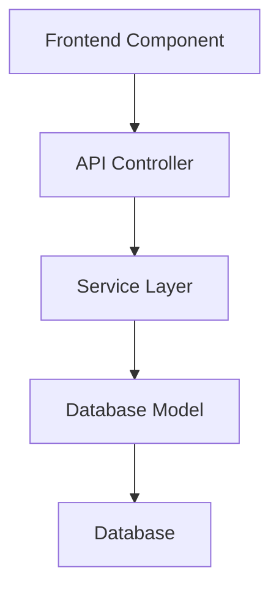

# [Feature Name] - AI-HRMS-2025

## Overview
Brief description of the feature, its purpose, and how it fits into the overall system.

## User Stories
- As a [user type], I want [functionality] so that [benefit]
- As a [user type], I want [functionality] so that [benefit]

## Technical Requirements

### Functional Requirements
- [ ] Requirement 1
- [ ] Requirement 2
- [ ] Requirement 3

### Non-Functional Requirements
- **Performance**: [specific performance requirements]
- **Security**: [security considerations and requirements]
- **Scalability**: [scalability requirements]
- **Accessibility**: [accessibility requirements]

## Architecture Overview

### Components


### Data Flow
1. User interaction with frontend
2. API request to backend
3. Service layer processing
4. Database operations
5. Response back to frontend

## Database Schema

### Tables Affected
- `table_name`: Description of changes
- `related_table`: Description of relationships

### Migration Scripts
```sql
-- Migration: Add feature_name support
-- Version: X.X.X
-- Date: YYYY-MM-DD

CREATE TABLE feature_table (
    id SERIAL PRIMARY KEY,
    -- Add column definitions with comments
    created_at TIMESTAMP WITH TIME ZONE DEFAULT CURRENT_TIMESTAMP,
    updated_at TIMESTAMP WITH TIME ZONE DEFAULT CURRENT_TIMESTAMP
);

-- Add indexes for performance
CREATE INDEX idx_feature_table_lookup ON feature_table(lookup_column);
```

## API Endpoints

### Authentication Required
All endpoints require valid JWT token in Authorization header:
```
Authorization: Bearer <token>
```

### Endpoints

#### GET /api/feature
**Description**: Retrieve feature data

**Parameters**:
- `page` (query, optional): Page number (default: 1)
- `limit` (query, optional): Items per page (default: 20)
- `filter` (query, optional): Filter criteria

**Response**:
```json
{
  "success": true,
  "data": [
    {
      "id": 1,
      "property": "value"
    }
  ],
  "pagination": {
    "page": 1,
    "limit": 20,
    "total": 100,
    "pages": 5
  }
}
```

#### POST /api/feature
**Description**: Create new feature item

**Request Body**:
```json
{
  "property1": "value1",
  "property2": "value2"
}
```

**Response**:
```json
{
  "success": true,
  "data": {
    "id": 1,
    "property1": "value1",
    "property2": "value2",
    "created_at": "2025-09-22T00:00:00Z"
  }
}
```

## Frontend Implementation

### Components
- `FeatureList`: Main listing component
- `FeatureForm`: Form for creating/editing
- `FeatureDetail`: Detail view component

### State Management
```javascript
// Redux/Context state structure
const featureState = {
  items: [],
  loading: false,
  error: null,
  filters: {},
  pagination: {
    page: 1,
    limit: 20,
    total: 0
  }
};
```

### Key Functions
```javascript
// Example of main feature function
const useFeature = () => {
  const [state, setState] = useState(initialState);

  const loadFeatures = useCallback(async (filters = {}) => {
    try {
      setState(prev => ({ ...prev, loading: true }));
      const response = await api.getFeatures(filters);
      setState(prev => ({
        ...prev,
        items: response.data,
        pagination: response.pagination,
        loading: false
      }));
    } catch (error) {
      setState(prev => ({
        ...prev,
        error: error.message,
        loading: false
      }));
    }
  }, []);

  return { ...state, loadFeatures };
};
```

## Backend Implementation

### Controller
```javascript
// controllers/featureController.js
class FeatureController {
  /**
   * Get all features with filtering and pagination
   */
  async getFeatures(req, res) {
    try {
      const { page = 1, limit = 20, ...filters } = req.query;
      const organizationId = req.user.organizationId;

      const result = await featureService.getFeatures({
        organizationId,
        filters,
        pagination: { page: parseInt(page), limit: parseInt(limit) }
      });

      res.json({
        success: true,
        data: result.items,
        pagination: result.pagination
      });
    } catch (error) {
      res.status(500).json({
        success: false,
        error: error.message
      });
    }
  }
}
```

### Service Layer
```javascript
// services/featureService.js
class FeatureService {
  async getFeatures({ organizationId, filters, pagination }) {
    // Build query with organization isolation
    const whereClause = {
      organization_id: organizationId,
      ...this.buildFilters(filters)
    };

    const { count, rows } = await Feature.findAndCountAll({
      where: whereClause,
      limit: pagination.limit,
      offset: (pagination.page - 1) * pagination.limit,
      order: [['created_at', 'DESC']]
    });

    return {
      items: rows,
      pagination: {
        page: pagination.page,
        limit: pagination.limit,
        total: count,
        pages: Math.ceil(count / pagination.limit)
      }
    };
  }
}
```

## Security Considerations

### Data Protection
- Multi-tenant data isolation enforced at database level
- Row-level security policies implemented
- Input validation and sanitization

### Access Control
- Role-based permissions:
  - **Admin**: Full CRUD access
  - **Manager**: Read and limited write access
  - **User**: Read-only access

### Validation
```javascript
// Joi validation schema
const featureValidation = {
  create: Joi.object({
    property1: Joi.string().required().max(100),
    property2: Joi.string().optional().max(255)
  }),

  update: Joi.object({
    property1: Joi.string().optional().max(100),
    property2: Joi.string().optional().max(255)
  })
};
```

## Testing

### Unit Tests
```javascript
// tests/feature.test.js
describe('Feature Service', () => {
  test('should create feature with valid data', async () => {
    const featureData = {
      property1: 'test value',
      organizationId: 1
    };

    const result = await featureService.createFeature(featureData);

    expect(result.success).toBe(true);
    expect(result.data.property1).toBe('test value');
  });

  test('should enforce organization isolation', async () => {
    const user1 = { organizationId: 1 };
    const user2 = { organizationId: 2 };

    // Create feature as user1
    await featureService.createFeature({
      property1: 'test',
      organizationId: user1.organizationId
    });

    // Try to access as user2
    const features = await featureService.getFeatures({
      organizationId: user2.organizationId
    });

    expect(features.items).toHaveLength(0);
  });
});
```

### Integration Tests
```javascript
// tests/integration/feature.integration.test.js
describe('Feature API Integration', () => {
  test('POST /api/feature should create feature', async () => {
    const token = await getAuthToken();

    const response = await request(app)
      .post('/api/feature')
      .set('Authorization', `Bearer ${token}`)
      .send({
        property1: 'test value'
      });

    expect(response.status).toBe(201);
    expect(response.body.success).toBe(true);
  });
});
```

## Deployment Checklist

### Pre-Deployment
- [ ] All tests passing
- [ ] Code review completed
- [ ] Security audit passed
- [ ] Performance testing completed
- [ ] Documentation updated

### Database Migration
```bash
# Run migration
npm run db:migrate

# Verify migration
npm run db:status
```

### Environment Variables
```env
# Add any new environment variables
FEATURE_ENABLED=true
FEATURE_API_LIMIT=100
```

### Monitoring
- [ ] Application logs configured
- [ ] Performance metrics enabled
- [ ] Error tracking setup
- [ ] Health checks implemented

## Usage Examples

### Basic Usage
```javascript
// Frontend usage example
import { useFeature } from './hooks/useFeature';

function FeatureComponent() {
  const { items, loading, loadFeatures } = useFeature();

  useEffect(() => {
    loadFeatures();
  }, [loadFeatures]);

  if (loading) return <div>Loading...</div>;

  return (
    <div>
      {items.map(item => (
        <div key={item.id}>{item.property1}</div>
      ))}
    </div>
  );
}
```

### Advanced Usage
```javascript
// Advanced filtering and searching
const filters = {
  search: 'keyword',
  status: 'active',
  dateRange: {
    start: '2025-09-22',
    end: '2025-12-31'
  }
};

await loadFeatures(filters);
```

## Troubleshooting

### Common Issues

#### Issue: Feature not loading
**Symptoms**: Empty list or loading spinner stuck
**Causes**:
- Network connectivity
- Authentication token expired
- Server error

**Solutions**:
1. Check browser console for errors
2. Verify authentication token
3. Check server logs
4. Verify API endpoint accessibility

#### Issue: Permission denied
**Symptoms**: 403 Forbidden error
**Causes**:
- Insufficient user permissions
- Organization access violation

**Solutions**:
1. Verify user role and permissions
2. Check organization membership
3. Contact system administrator

### Debug Mode
Enable debug logging:
```env
DEBUG_FEATURE=true
LOG_LEVEL=debug
```

## Performance Optimization

### Database Optimization
- Proper indexing on frequently queried columns
- Query optimization for large datasets
- Connection pooling configured

### Frontend Optimization
- Virtual scrolling for large lists
- Debounced search inputs
- Memoized components and callbacks

### Caching Strategy
- Redis caching for frequently accessed data
- Client-side caching with appropriate TTL
- CDN for static assets

## Future Enhancements

### Planned Features
- [ ] Advanced filtering options
- [ ] Bulk operations support
- [ ] Export functionality
- [ ] Real-time notifications

### Technical Improvements
- [ ] GraphQL API support
- [ ] Microservices architecture
- [ ] Event-driven architecture
- [ ] Advanced analytics

## Related Documentation
- [API Reference](../API.md)
- [Database Schema](../02_DATABASE/DATABASE_ARCHITECTURE.md)
- [Authentication Guide](../05_SECURITY/SECURITY_AND_AUTH.md)
- [Frontend Components](../03_FRONTEND/FRONTEND_INTERFACE.md)

---

**Last Updated**: YYYY-MM-DD
**Version**: X.X.X
**Author**: Development Team
**Reviewers**: [List of reviewers]