# HIERARCHY_BASED_WEB_INTERFACE.md

## 🌐 Multi-Tenant Web Interface Implementation Guide

**Project**: AI-HRMS-2025 v1.3.0
**Document Version**: 1.0
**Created**: September 19, 2025
**Focus**: Web interface implementation for hierarchy management system

---

## 📋 Executive Summary

This document provides comprehensive implementation guidance for building the web-based management interface that supports the multi-tenant hierarchy defined in `HIERARCHY_DEFINITIONS.md`. It focuses exclusively on technical implementation, user interface design, API development, and deployment strategies.

---

## 🔗 Table of Contents

1. [System Architecture Overview](#-system-architecture-overview)
2. [Backend API Implementation](#-backend-api-implementation)
3. [Frontend Component Architecture](#-frontend-component-architecture)
4. [Authentication & Security Implementation](#-authentication--security-implementation)
5. [Database Integration](#-database-integration)
6. [User Interface Design](#-user-interface-design)
7. [Implementation Phases](#-implementation-phases)
8. [Testing Strategy](#-testing-strategy)
9. [Deployment Plan](#-deployment-plan)
10. [Monitoring & Maintenance](#-monitoring--maintenance)

---

## 🏗️ System Architecture Overview

### Multi-Tier Application Architecture

```mermaid
graph TB
    subgraph "🌐 Frontend Layer"
        FE1[Platform Admin Dashboard]
        FE2[Tenancy Management Interface]
        FE3[Organization Management Interface]
        FE4[Board Member Management UI]
    end

    subgraph "🔌 API Gateway Layer"
        API[Express.js API Server]
        AUTH[JWT Authentication Middleware]
        RBAC[Role-Based Access Control]
        RATE[Rate Limiting]
    end

    subgraph "🧠 Business Logic Layer"
        CTRL1[Platform Admin Controller]
        CTRL2[Tenancy Admin Controller]
        CTRL3[Organization Admin Controller]
        SVC1[Hierarchy Management Service]
        SVC2[Authority Validation Service]
    end

    subgraph "🗄️ Data Access Layer"
        DB[(PostgreSQL Database)]
        CACHE[(Redis Cache)]
        WS[📁 Workspace File System]
        AUDIT[(Audit Database)]
    end

    subgraph "🔧 External Systems"
        EMAIL[Email Service]
        LOG[Logging Service]
        MONITOR[Monitoring Service]
    end

    FE1 --> API
    FE2 --> API
    FE3 --> API
    FE4 --> API

    API --> AUTH
    AUTH --> RBAC
    RBAC --> RATE

    RATE --> CTRL1
    RATE --> CTRL2
    RATE --> CTRL3

    CTRL1 --> SVC1
    CTRL2 --> SVC1
    CTRL3 --> SVC1
    SVC1 --> SVC2

    SVC1 --> DB
    SVC1 --> CACHE
    SVC1 --> WS
    SVC2 --> AUDIT

    SVC1 --> EMAIL
    SVC1 --> LOG
    SVC1 --> MONITOR

    style FE1 fill:#ff9999
    style FE2 fill:#99ccff
    style FE3 fill:#99ff99
    style FE4 fill:#ffff99
```



### Technology Stack

#### **Backend Technologies**
```javascript
// Core Backend Stack
const backendStack = {
  runtime: "Node.js 18+",
  framework: "Express.js 5.x",
  database: "PostgreSQL 15+",
  orm: "Sequelize 6.x",
  cache: "Redis 7+",
  authentication: "JWT + bcrypt",
  validation: "Joi 18+",
  logging: "Winston 3+",
  testing: "Jest 30+",
  documentation: "Swagger/OpenAPI 3.0"
};
```

#### **Frontend Technologies**
```javascript
// Frontend Application Stack
const frontendStack = {
  framework: "React 18+",
  routing: "React Router 6+",
  stateManagement: "Redux Toolkit + RTK Query",
  ui: "Material-UI 5+",
  styling: "Emotion + Material-UI",
  forms: "React Hook Form + Yup",
  charts: "Chart.js + React-Chartjs-2",
  icons: "Material Icons",
  bundler: "Webpack 5+",
  testing: "React Testing Library + Jest"
};
```

#### **Infrastructure & DevOps**
```yaml
# Infrastructure Stack
infrastructure:
  containerization: "Docker + Docker Compose"
  orchestration: "Kubernetes (production)"
  reverse_proxy: "Nginx"
  ssl: "Let's Encrypt"
  monitoring: "Prometheus + Grafana"
  logging: "ELK Stack (Elasticsearch, Logstash, Kibana)"
  ci_cd: "GitHub Actions"
  deployment: "Blue-Green Deployment"
```

### Application Structure

```
ai-hrms-2025/
├── backend/                              # 🔧 Backend Application
│   ├── src/
│   │   ├── controllers/                  # 🎮 Request Controllers
│   │   │   ├── platformAdminController.js
│   │   │   ├── tenantAdminController.js
│   │   │   └── organizationAdminController.js
│   │   ├── services/                     # 🧠 Business Logic
│   │   │   ├── hierarchyManagementService.js
│   │   │   ├── authorityValidationService.js
│   │   │   ├── workspaceSyncService.js
│   │   │   └── auditService.js
│   │   ├── middleware/                   # 🛡️ Request Middleware
│   │   │   ├── authenticationMiddleware.js
│   │   │   ├── authorizationMiddleware.js
│   │   │   ├── validationMiddleware.js
│   │   │   └── auditMiddleware.js
│   │   ├── routes/                       # 🔌 API Routes
│   │   │   ├── platformAdminRoutes.js
│   │   │   ├── tenantAdminRoutes.js
│   │   │   └── organizationAdminRoutes.js
│   │   ├── models/                       # 🗄️ Database Models
│   │   │   ├── tenancy.js
│   │   │   ├── organization.js
│   │   │   ├── user.js
│   │   │   └── boardMember.js
│   │   └── utils/                        # 🔧 Utilities
│   │       ├── tokenService.js
│   │       ├── permissionCalculator.js
│   │       └── workspaceManager.js
│   ├── migrations/                       # 📊 Database Migrations
│   ├── seeders/                          # 🌱 Database Seeders
│   ├── tests/                            # 🧪 Backend Tests
│   └── config/                           # ⚙️ Configuration
├── frontend/                             # 🎨 Frontend Application
│   ├── src/
│   │   ├── components/                   # 🧩 React Components
│   │   │   ├── admin/
│   │   │   │   ├── platform/
│   │   │   │   ├── tenancy/
│   │   │   │   └── organization/
│   │   │   ├── common/
│   │   │   └── layout/
│   │   ├── pages/                        # 📄 Page Components
│   │   ├── services/                     # 🔌 API Services
│   │   ├── store/                        # 🗃️ Redux Store
│   │   ├── hooks/                        # 🪝 Custom Hooks
│   │   ├── utils/                        # 🔧 Utilities
│   │   └── styles/                       # 🎨 Styling
│   ├── public/                           # 📁 Static Assets
│   └── tests/                            # 🧪 Frontend Tests
├── docs/                                 # 📚 Documentation
├── scripts/                              # 🔧 Utility Scripts
└── docker/                               # 🐳 Docker Configuration
```

---

## 🔌 Backend API Implementation

### API Route Architecture

#### **Platform Admin Routes** (`src/routes/platformAdminRoutes.js`)

```javascript
const express = require('express');
const router = express.Router();
const platformAdminController = require('../controllers/platformAdminController');
const { requireSysAdmin } = require('../middleware/authorizationMiddleware');
const { auditMiddleware } = require('../middleware/auditMiddleware');
const { validateRequest } = require('../middleware/validationMiddleware');
const { tenancyValidation, organizationValidation, userValidation } = require('../validations');

// Apply middleware to all platform admin routes
router.use(requireSysAdmin);
router.use(auditMiddleware);

// === TENANCY MANAGEMENT ===
router.post('/tenancies',
  validateRequest(tenancyValidation.create),
  platformAdminController.createTenancy
);

router.get('/tenancies',
  platformAdminController.listTenancies
);

router.get('/tenancies/:tenancyId',
  validateRequest(tenancyValidation.getById),
  platformAdminController.getTenancy
);

router.put('/tenancies/:tenancyId',
  validateRequest(tenancyValidation.update),
  platformAdminController.updateTenancy
);

router.delete('/tenancies/:tenancyId',
  validateRequest(tenancyValidation.delete),
  platformAdminController.deleteTenancy
);

router.patch('/tenancies/:tenancyId/status',
  validateRequest(tenancyValidation.updateStatus),
  platformAdminController.updateTenancyStatus
);

// === ORGANIZATION MANAGEMENT ===
router.post('/organizations',
  validateRequest(organizationValidation.create),
  platformAdminController.createOrganization
);

router.get('/organizations',
  platformAdminController.listAllOrganizations
);

router.get('/tenancies/:tenancyId/organizations',
  validateRequest(tenancyValidation.getById),
  platformAdminController.listTenantOrganizations
);

router.put('/organizations/:orgId',
  validateRequest(organizationValidation.update),
  platformAdminController.updateOrganization
);

router.delete('/organizations/:orgId',
  validateRequest(organizationValidation.delete),
  platformAdminController.deleteOrganization
);

router.patch('/organizations/:orgId/transfer',
  validateRequest(organizationValidation.transfer),
  platformAdminController.transferOrganization
);

// === USER MANAGEMENT ===
router.post('/users',
  validateRequest(userValidation.create),
  platformAdminController.createUser
);

router.get('/users',
  platformAdminController.listAllUsers
);

router.get('/tenancies/:tenancyId/users',
  validateRequest(tenancyValidation.getById),
  platformAdminController.listTenantUsers
);

router.get('/organizations/:orgId/users',
  validateRequest(organizationValidation.getById),
  platformAdminController.listOrganizationUsers
);

router.put('/users/:userId',
  validateRequest(userValidation.update),
  platformAdminController.updateUser
);

router.delete('/users/:userId',
  validateRequest(userValidation.delete),
  platformAdminController.deleteUser
);

router.patch('/users/:userId/impersonate',
  validateRequest(userValidation.impersonate),
  platformAdminController.impersonateUser
);

router.patch('/users/:userId/reset-password',
  validateRequest(userValidation.resetPassword),
  platformAdminController.resetUserPassword
);

// === BOARD MEMBER MANAGEMENT ===
router.post('/board-members/tenancy',
  validateRequest(boardMemberValidation.createTenancy),
  platformAdminController.createTenancyBoardMember
);

router.post('/board-members/organization',
  validateRequest(boardMemberValidation.createOrganization),
  platformAdminController.createOrganizationBoardMember
);

router.get('/tenancies/:tenancyId/board-members',
  validateRequest(tenancyValidation.getById),
  platformAdminController.listTenancyBoardMembers
);

router.get('/organizations/:orgId/board-members',
  validateRequest(organizationValidation.getById),
  platformAdminController.listOrganizationBoardMembers
);

router.patch('/board-members/:boardMemberId/permissions',
  validateRequest(boardMemberValidation.updatePermissions),
  platformAdminController.updateBoardMemberPermissions
);

router.delete('/board-members/:boardMemberId',
  validateRequest(boardMemberValidation.delete),
  platformAdminController.removeBoardMember
);

// === SYSTEM MANAGEMENT ===
router.get('/system/stats',
  platformAdminController.getSystemStats
);

router.get('/system/health',
  platformAdminController.getSystemHealth
);

router.get('/audit/global',
  platformAdminController.getGlobalAuditLogs
);

router.post('/system/maintenance',
  validateRequest(systemValidation.maintenance),
  platformAdminController.toggleMaintenanceMode
);

router.post('/system/backup',
  validateRequest(systemValidation.backup),
  platformAdminController.createSystemBackup
);

module.exports = router;
```

#### **Tenancy Admin Routes** (`src/routes/tenantAdminRoutes.js`)

```javascript
const express = require('express');
const router = express.Router();
const tenantAdminController = require('../controllers/tenantAdminController');
const { requireTenantAdmin } = require('../middleware/authorizationMiddleware');
const { auditMiddleware } = require('../middleware/auditMiddleware');
const { validateRequest } = require('../middleware/validationMiddleware');
const { organizationValidation, userValidation, boardMemberValidation } = require('../validations');

// Apply middleware to all tenant admin routes
router.use(requireTenantAdmin);
router.use(auditMiddleware);

// === TENANCY MANAGEMENT ===
router.get('/tenancy',
  tenantAdminController.getTenancyDetails
);

router.put('/tenancy/settings',
  validateRequest(tenancyValidation.updateSettings),
  tenantAdminController.updateTenancySettings
);

router.get('/tenancy/stats',
  tenantAdminController.getTenancyStats
);

// === ORGANIZATION MANAGEMENT ===
router.post('/organizations',
  validateRequest(organizationValidation.create),
  tenantAdminController.createOrganization
);

router.get('/organizations',
  tenantAdminController.listOrganizations
);

router.get('/organizations/:orgId',
  validateRequest(organizationValidation.getById),
  tenantAdminController.getOrganization
);

router.put('/organizations/:orgId',
  validateRequest(organizationValidation.update),
  tenantAdminController.updateOrganization
);

router.delete('/organizations/:orgId',
  validateRequest(organizationValidation.delete),
  tenantAdminController.deleteOrganization
);

router.patch('/organizations/:orgId/admin',
  validateRequest(organizationValidation.assignAdmin),
  tenantAdminController.assignOrganizationAdmin
);

// === BOARD MEMBER MANAGEMENT ===
router.post('/organizations/:orgId/board-members',
  validateRequest(boardMemberValidation.createOrganization),
  tenantAdminController.createOrganizationBoardMember
);

router.get('/organizations/:orgId/board-members',
  validateRequest(organizationValidation.getById),
  tenantAdminController.listOrganizationBoardMembers
);

router.patch('/board-members/:boardMemberId/role',
  validateRequest(boardMemberValidation.updateRole),
  tenantAdminController.updateBoardMemberRole
);

// === USER OVERVIEW ===
router.get('/users',
  tenantAdminController.listTenantUsers
);

router.get('/users/:userId',
  validateRequest(userValidation.getById),
  tenantAdminController.getTenantUser
);

router.patch('/users/:userId/disable',
  validateRequest(userValidation.disable),
  tenantAdminController.disableUser
);

router.patch('/users/:userId/enable',
  validateRequest(userValidation.enable),
  tenantAdminController.enableUser
);

// === REPORTING ===
router.get('/reports/tenancy-overview',
  tenantAdminController.getTenancyReport
);

router.get('/reports/organization-summary',
  tenantAdminController.getOrganizationSummaryReport
);

router.get('/reports/user-analytics',
  tenantAdminController.getUserAnalyticsReport
);

// === AUDIT LOGS ===
router.get('/audit/tenancy',
  tenantAdminController.getTenancyAuditLogs
);

router.get('/audit/organizations/:orgId',
  validateRequest(organizationValidation.getById),
  tenantAdminController.getOrganizationAuditLogs
);

module.exports = router;
```

#### **Organization Admin Routes** (`src/routes/organizationAdminRoutes.js`)

```javascript
const express = require('express');
const router = express.Router();
const organizationAdminController = require('../controllers/organizationAdminController');
const { requireOrgAdmin } = require('../middleware/authorizationMiddleware');
const { auditMiddleware } = require('../middleware/auditMiddleware');
const { validateRequest } = require('../middleware/validationMiddleware');
const { userValidation, departmentValidation, leaveValidation } = require('../validations');

// Apply middleware to all organization admin routes
router.use(requireOrgAdmin);
router.use(auditMiddleware);

// === ORGANIZATION SETTINGS ===
router.get('/organization',
  organizationAdminController.getOrganizationDetails
);

router.put('/organization/settings',
  validateRequest(organizationValidation.updateSettings),
  organizationAdminController.updateOrganizationSettings
);

router.put('/organization/branding',
  validateRequest(organizationValidation.updateBranding),
  organizationAdminController.updateBranding
);

router.get('/organization/stats',
  organizationAdminController.getOrganizationStats
);

// === USER MANAGEMENT ===
router.post('/users',
  validateRequest(userValidation.create),
  organizationAdminController.createUser
);

router.get('/users',
  organizationAdminController.listUsers
);

router.get('/users/:userId',
  validateRequest(userValidation.getById),
  organizationAdminController.getUser
);

router.put('/users/:userId',
  validateRequest(userValidation.update),
  organizationAdminController.updateUser
);

router.delete('/users/:userId',
  validateRequest(userValidation.delete),
  organizationAdminController.deleteUser
);

router.patch('/users/:userId/role',
  validateRequest(userValidation.updateRole),
  organizationAdminController.updateUserRole
);

router.patch('/users/:userId/department',
  validateRequest(userValidation.updateDepartment),
  organizationAdminController.updateUserDepartment
);

router.patch('/users/:userId/reset-password',
  validateRequest(userValidation.resetPassword),
  organizationAdminController.resetPassword
);

router.patch('/users/:userId/activate',
  validateRequest(userValidation.activate),
  organizationAdminController.activateUser
);

router.patch('/users/:userId/deactivate',
  validateRequest(userValidation.deactivate),
  organizationAdminController.deactivateUser
);

// === DEPARTMENT MANAGEMENT ===
router.post('/departments',
  validateRequest(departmentValidation.create),
  organizationAdminController.createDepartment
);

router.get('/departments',
  organizationAdminController.listDepartments
);

router.put('/departments/:deptId',
  validateRequest(departmentValidation.update),
  organizationAdminController.updateDepartment
);

router.delete('/departments/:deptId',
  validateRequest(departmentValidation.delete),
  organizationAdminController.deleteDepartment
);

// === HR MANAGEMENT ===
router.get('/leave-requests',
  organizationAdminController.getLeaveRequests
);

router.get('/leave-requests/:requestId',
  validateRequest(leaveValidation.getById),
  organizationAdminController.getLeaveRequest
);

router.patch('/leave-requests/:requestId/approve',
  validateRequest(leaveValidation.approve),
  organizationAdminController.approveLeaveRequest
);

router.patch('/leave-requests/:requestId/reject',
  validateRequest(leaveValidation.reject),
  organizationAdminController.rejectLeaveRequest
);

router.get('/performance-reviews',
  organizationAdminController.getPerformanceReviews
);

router.post('/performance-reviews',
  validateRequest(performanceValidation.create),
  organizationAdminController.createPerformanceReview
);

// === BOARD MEMBER MANAGEMENT ===
router.get('/board-members',
  organizationAdminController.listBoardMembers
);

router.post('/board-members',
  validateRequest(boardMemberValidation.createOrganization),
  organizationAdminController.addBoardMember
);

router.patch('/board-members/:boardMemberId/permissions',
  validateRequest(boardMemberValidation.updatePermissions),
  organizationAdminController.updateBoardMemberPermissions
);

router.delete('/board-members/:boardMemberId',
  validateRequest(boardMemberValidation.delete),
  organizationAdminController.removeBoardMember
);

// === REPORTING ===
router.get('/reports/organization-overview',
  organizationAdminController.getOrganizationReport
);

router.get('/reports/user-reports',
  organizationAdminController.getUserReports
);

router.get('/reports/hr-analytics',
  organizationAdminController.getHRAnalytics
);

router.get('/reports/department-summary',
  organizationAdminController.getDepartmentSummary
);

// === AUDIT LOGS ===
router.get('/audit/organization',
  organizationAdminController.getOrganizationAuditLogs
);

router.get('/audit/users/:userId',
  validateRequest(userValidation.getById),
  organizationAdminController.getUserAuditLogs
);

module.exports = router;
```

### Request Validation Schemas

#### **Validation Definitions** (`src/validations/index.js`)

```javascript
const Joi = require('joi');

// === TENANCY VALIDATIONS ===
const tenancyValidation = {
  create: {
    body: Joi.object({
      name: Joi.string().min(3).max(100).required()
        .messages({
          'string.min': 'Tenancy name must be at least 3 characters',
          'string.max': 'Tenancy name cannot exceed 100 characters'
        }),
      slug: Joi.string().pattern(/^[a-z0-9-]+$/).min(3).max(50).required()
        .messages({
          'string.pattern.base': 'Slug can only contain lowercase letters, numbers, and hyphens'
        }),
      description: Joi.string().max(500).optional(),
      billingPlan: Joi.string().valid('free', 'starter', 'professional', 'enterprise').default('free'),
      maxOrganizations: Joi.number().integer().min(1).max(100).default(5),
      maxUsers: Joi.number().integer().min(1).max(10000).default(100),
      adminEmail: Joi.string().email().optional(),
      settings: Joi.object().optional()
    })
  },

  update: {
    params: Joi.object({
      tenancyId: Joi.string().uuid().required()
    }),
    body: Joi.object({
      name: Joi.string().min(3).max(100).optional(),
      description: Joi.string().max(500).optional(),
      billingPlan: Joi.string().valid('free', 'starter', 'professional', 'enterprise').optional(),
      maxOrganizations: Joi.number().integer().min(1).max(100).optional(),
      maxUsers: Joi.number().integer().min(1).max(10000).optional(),
      settings: Joi.object().optional()
    })
  },

  getById: {
    params: Joi.object({
      tenancyId: Joi.string().uuid().required()
    })
  },

  delete: {
    params: Joi.object({
      tenancyId: Joi.string().uuid().required()
    }),
    body: Joi.object({
      confirmation: Joi.string().valid('DELETE').required(),
      reason: Joi.string().min(10).max(500).required()
    })
  },

  updateStatus: {
    params: Joi.object({
      tenancyId: Joi.string().uuid().required()
    }),
    body: Joi.object({
      status: Joi.string().valid('active', 'suspended', 'pending').required(),
      reason: Joi.string().min(10).max(500).optional()
    })
  },

  updateSettings: {
    body: Joi.object({
      settings: Joi.object({
        theme: Joi.object().optional(),
        notifications: Joi.object().optional(),
        security: Joi.object().optional(),
        compliance: Joi.object().optional()
      }).required()
    })
  }
};

// === ORGANIZATION VALIDATIONS ===
const organizationValidation = {
  create: {
    body: Joi.object({
      tenantId: Joi.string().uuid().required(),
      name: Joi.string().min(2).max(100).required(),
      displayName: Joi.string().min(2).max(100).optional(),
      description: Joi.string().max(1000).optional(),
      industry: Joi.string().max(100).optional(),
      size: Joi.string().valid('startup', 'small', 'medium', 'large', 'enterprise').optional(),
      location: Joi.object({
        country: Joi.string().length(2).required(),
        state: Joi.string().max(100).optional(),
        city: Joi.string().max(100).optional(),
        address: Joi.string().max(500).optional()
      }).optional(),
      ceoData: Joi.object({
        email: Joi.string().email().required(),
        firstName: Joi.string().min(2).max(50).required(),
        lastName: Joi.string().min(2).max(50).required(),
        password: Joi.string().min(8).pattern(/^(?=.*[a-z])(?=.*[A-Z])(?=.*\d)/).required()
      }).required(),
      hrManagerData: Joi.object({
        email: Joi.string().email().required(),
        firstName: Joi.string().min(2).max(50).required(),
        lastName: Joi.string().min(2).max(50).required(),
        password: Joi.string().min(8).pattern(/^(?=.*[a-z])(?=.*[A-Z])(?=.*\d)/).required()
      }).required(),
      settings: Joi.object().optional()
    })
  },

  update: {
    params: Joi.object({
      orgId: Joi.string().uuid().required()
    }),
    body: Joi.object({
      name: Joi.string().min(2).max(100).optional(),
      displayName: Joi.string().min(2).max(100).optional(),
      description: Joi.string().max(1000).optional(),
      industry: Joi.string().max(100).optional(),
      size: Joi.string().valid('startup', 'small', 'medium', 'large', 'enterprise').optional(),
      location: Joi.object({
        country: Joi.string().length(2).optional(),
        state: Joi.string().max(100).optional(),
        city: Joi.string().max(100).optional(),
        address: Joi.string().max(500).optional()
      }).optional(),
      settings: Joi.object().optional()
    })
  },

  getById: {
    params: Joi.object({
      orgId: Joi.string().uuid().required()
    })
  },

  delete: {
    params: Joi.object({
      orgId: Joi.string().uuid().required()
    }),
    body: Joi.object({
      confirmation: Joi.string().valid('DELETE').required(),
      reason: Joi.string().min(10).max(500).required(),
      transferUsersTo: Joi.string().uuid().optional()
    })
  },

  transfer: {
    params: Joi.object({
      orgId: Joi.string().uuid().required()
    }),
    body: Joi.object({
      targetTenantId: Joi.string().uuid().required(),
      reason: Joi.string().min(10).max(500).required()
    })
  },

  assignAdmin: {
    params: Joi.object({
      orgId: Joi.string().uuid().required()
    }),
    body: Joi.object({
      userId: Joi.string().uuid().required(),
      role: Joi.string().valid('ceo', 'hr_manager').required(),
      effectiveDate: Joi.date().optional()
    })
  },

  updateSettings: {
    body: Joi.object({
      settings: Joi.object({
        branding: Joi.object().optional(),
        features: Joi.object().optional(),
        policies: Joi.object().optional(),
        integrations: Joi.object().optional()
      }).required()
    })
  },

  updateBranding: {
    body: Joi.object({
      branding: Joi.object({
        logo: Joi.string().uri().optional(),
        primaryColor: Joi.string().pattern(/^#[0-9A-Fa-f]{6}$/).optional(),
        secondaryColor: Joi.string().pattern(/^#[0-9A-Fa-f]{6}$/).optional(),
        fontFamily: Joi.string().max(100).optional(),
        theme: Joi.string().valid('light', 'dark', 'auto').optional()
      }).required()
    })
  }
};

// === USER VALIDATIONS ===
const userValidation = {
  create: {
    body: Joi.object({
      organizationId: Joi.string().uuid().required(),
      email: Joi.string().email().required(),
      firstName: Joi.string().min(2).max(50).required(),
      lastName: Joi.string().min(2).max(50).required(),
      password: Joi.string().min(8).pattern(/^(?=.*[a-z])(?=.*[A-Z])(?=.*\d)/).required()
        .messages({
          'string.pattern.base': 'Password must contain at least one uppercase, one lowercase, and one number'
        }),
      role: Joi.string().valid('employee', 'manager', 'supervisor', 'admin').default('employee'),
      department: Joi.string().max(100).optional(),
      position: Joi.string().max(100).optional(),
      hireDate: Joi.date().optional(),
      manager: Joi.string().uuid().optional(),
      profile: Joi.object({
        phone: Joi.string().pattern(/^[\+]?[1-9][\d]{0,15}$/).optional(),
        address: Joi.object().optional(),
        emergencyContact: Joi.object().optional(),
        skills: Joi.array().items(Joi.string()).optional(),
        certifications: Joi.array().items(Joi.object()).optional()
      }).optional()
    })
  },

  update: {
    params: Joi.object({
      userId: Joi.string().uuid().required()
    }),
    body: Joi.object({
      email: Joi.string().email().optional(),
      firstName: Joi.string().min(2).max(50).optional(),
      lastName: Joi.string().min(2).max(50).optional(),
      role: Joi.string().valid('employee', 'manager', 'supervisor', 'admin').optional(),
      department: Joi.string().max(100).optional(),
      position: Joi.string().max(100).optional(),
      manager: Joi.string().uuid().optional(),
      profile: Joi.object().optional(),
      isActive: Joi.boolean().optional()
    })
  },

  getById: {
    params: Joi.object({
      userId: Joi.string().uuid().required()
    })
  },

  delete: {
    params: Joi.object({
      userId: Joi.string().uuid().required()
    }),
    body: Joi.object({
      reason: Joi.string().min(10).max(500).required(),
      terminationDate: Joi.date().optional(),
      transferResponsibilitiesTo: Joi.string().uuid().optional()
    })
  },

  updateRole: {
    params: Joi.object({
      userId: Joi.string().uuid().required()
    }),
    body: Joi.object({
      role: Joi.string().valid('employee', 'manager', 'supervisor', 'admin').required(),
      effectiveDate: Joi.date().optional(),
      reason: Joi.string().min(10).max(500).optional()
    })
  },

  updateDepartment: {
    params: Joi.object({
      userId: Joi.string().uuid().required()
    }),
    body: Joi.object({
      department: Joi.string().max(100).required(),
      position: Joi.string().max(100).optional(),
      manager: Joi.string().uuid().optional(),
      effectiveDate: Joi.date().optional()
    })
  },

  resetPassword: {
    params: Joi.object({
      userId: Joi.string().uuid().required()
    }),
    body: Joi.object({
      temporaryPassword: Joi.string().min(8).required(),
      requirePasswordChange: Joi.boolean().default(true),
      sendNotification: Joi.boolean().default(true)
    })
  },

  impersonate: {
    params: Joi.object({
      userId: Joi.string().uuid().required()
    }),
    body: Joi.object({
      reason: Joi.string().min(10).max(500).required(),
      duration: Joi.number().integer().min(1).max(480).default(60) // minutes
    })
  },

  activate: {
    params: Joi.object({
      userId: Joi.string().uuid().required()
    }),
    body: Joi.object({
      reason: Joi.string().min(10).max(500).optional()
    })
  },

  deactivate: {
    params: Joi.object({
      userId: Joi.string().uuid().required()
    }),
    body: Joi.object({
      reason: Joi.string().min(10).max(500).required(),
      temporaryDisable: Joi.boolean().default(false)
    })
  },

  disable: {
    params: Joi.object({
      userId: Joi.string().uuid().required()
    }),
    body: Joi.object({
      reason: Joi.string().min(10).max(500).required()
    })
  },

  enable: {
    params: Joi.object({
      userId: Joi.string().uuid().required()
    }),
    body: Joi.object({
      reason: Joi.string().min(10).max(500).optional()
    })
  }
};

// === BOARD MEMBER VALIDATIONS ===
const boardMemberValidation = {
  createTenancy: {
    body: Joi.object({
      tenancyId: Joi.string().uuid().required(),
      userId: Joi.string().uuid().required(),
      authorityLevel: Joi.string().valid('TENANCY_ADMIN', 'TENANCY_MANAGER').required(),
      permissions: Joi.object().optional(),
      effectiveDate: Joi.date().optional()
    })
  },

  createOrganization: {
    body: Joi.object({
      organizationId: Joi.string().uuid().required(),
      userId: Joi.string().uuid().required(),
      boardRole: Joi.string().valid('CEO', 'HR_MANAGER', 'BOARD_MEMBER', 'ADVISOR').required(),
      permissions: Joi.object().optional(),
      isDefaultMember: Joi.boolean().default(false),
      effectiveDate: Joi.date().optional()
    })
  },

  updateRole: {
    params: Joi.object({
      boardMemberId: Joi.string().uuid().required()
    }),
    body: Joi.object({
      boardRole: Joi.string().valid('CEO', 'HR_MANAGER', 'BOARD_MEMBER', 'ADVISOR').required(),
      reason: Joi.string().min(10).max(500).optional()
    })
  },

  updatePermissions: {
    params: Joi.object({
      boardMemberId: Joi.string().uuid().required()
    }),
    body: Joi.object({
      permissions: Joi.object({
        tenancy: Joi.object().optional(),
        organization: Joi.object().optional(),
        users: Joi.object().optional(),
        reports: Joi.object().optional(),
        settings: Joi.object().optional()
      }).required(),
      reason: Joi.string().min(10).max(500).optional()
    })
  },

  delete: {
    params: Joi.object({
      boardMemberId: Joi.string().uuid().required()
    }),
    body: Joi.object({
      reason: Joi.string().min(10).max(500).required(),
      effectiveDate: Joi.date().optional()
    })
  }
};

module.exports = {
  tenancyValidation,
  organizationValidation,
  userValidation,
  boardMemberValidation
};
```