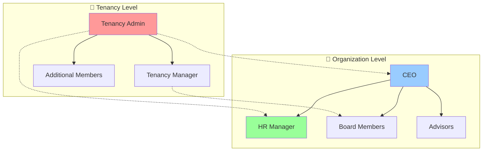
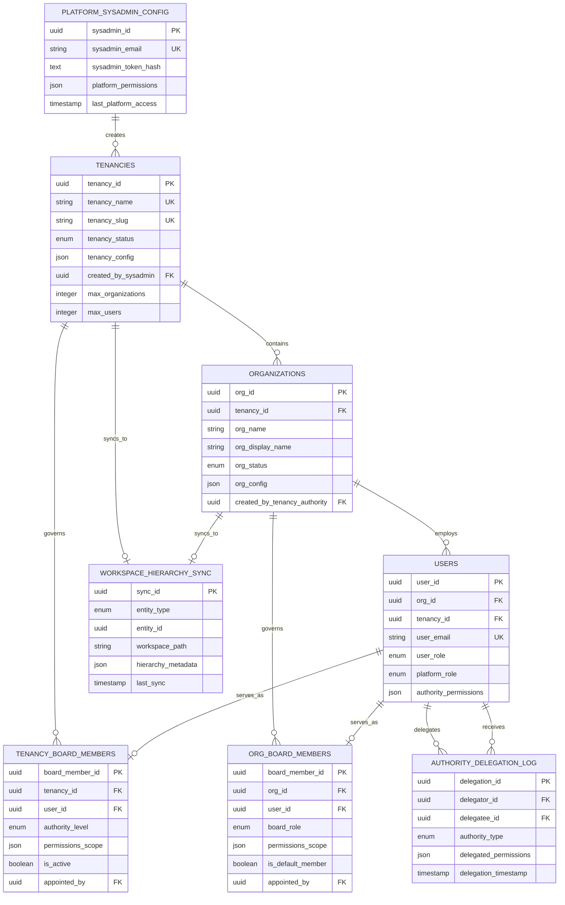

# HIERARCHY_DEFINITIONS.md

## 🏗️ Multi-Tenant Authority Hierarchy - Definitions & Concepts

**Project**: AI-HRMS-2025 v1.3.0
**Document Version**: 1.0
**Created**: September 19, 2025
**Focus**: Pure hierarchy concepts, authority delegation, and structural definitions

---

## 📋 Executive Summary

This document defines the fundamental hierarchy concepts, authority structures, and organizational patterns for the multi-tenant AI-HRMS-2025 system. It establishes the theoretical framework without implementation details, focusing on pure conceptual definitions and structural relationships.

---

## 🔗 Table of Contents

1. [Authority Hierarchy Structure](#-authority-hierarchy-structure)
2. [Permission Matrix & RBAC Concepts](#-permission-matrix--rbac-concepts)
3. [Board Members Architecture](#-board-members-architecture)
4. [Workspace Directory Organization](#-workspace-directory-organization)
5. [Database Schema Hierarchy](#-database-schema-hierarchy)
6. [Authority Validation Framework](#-authority-validation-framework)
7. [Audit Trail Concepts](#-audit-trail-concepts)
8. [Security Architecture Principles](#-security-architecture-principles)

---

## 🏗️ Authority Hierarchy Structure

### Three-Tier Authority Model

```mermaid
graph TD
    A[🔧 Platform SysAdmin] --> B[🏢 Tenancy Authority]
    B --> C[🏬 Organization Authority]
    C --> D[👥 Users/Employees]

    A -.-> A1[.credentials/.sysadmin.env]
    B -.-> B1[/workspaces/Tenancies/{TenancyName}/]
    C -.-> C1[/workspaces/Tenancies/{TenancyName}/Organizations/{OrgName}/]
    D -.-> D1[Individual Employee Profiles]

    style A fill:#ff4444,stroke:#333,stroke-width:3px,color:#fff
    style B fill:#4444ff,stroke:#333,stroke-width:2px,color:#fff
    style C fill:#44ff44,stroke:#333,stroke-width:2px,color:#000
    style D fill:#ffff44,stroke:#333,stroke-width:1px,color:#000
```

### Authority Delegation Principles

#### **1. Platform SysAdmin Authority (Level 999)**
```
🔧 PLATFORM SYSADMIN AUTHORITY
├── 🌐 Global System Control
│   ├── ✅ Creates and manages ALL tenancies
│   ├── ✅ Has override access to any organizational data
│   ├── ✅ Controls platform-wide settings and policies
│   └── ✅ Manages global security and compliance
├── 🏢 Tenancy Management
│   ├── ✅ Creates tenancy authorities
│   ├── ✅ Assigns tenancy board members
│   ├── ✅ Sets tenancy limits and quotas
│   └── ✅ Can revoke tenancy permissions
├── 🏬 Organization Oversight
│   ├── ✅ Cross-tenancy organization management
│   ├── ✅ Transfer organizations between tenancies
│   ├── ✅ Emergency organization intervention
│   └── ✅ Global organization policy enforcement
└── 👥 User Administration
    ├── ✅ Create users in any organization
    ├── ✅ Global user search and management
    ├── ✅ Password reset for any user
    └── ✅ Account suspension/activation globally
```

#### **2. Tenancy Authority (Level 100)**
```
🏢 TENANCY AUTHORITY
├── 🏬 Organization Management (Within Tenancy)
│   ├── ✅ Creates organizations within tenancy boundaries
│   ├── ✅ Assigns organization board members
│   ├── ✅ Sets organization-specific policies
│   └── ✅ Monitors organization compliance
├── 👥 Board Member Administration
│   ├── ✅ Appoints organization CEO and HR Manager (defaults)
│   ├── ✅ Creates additional organization board members
│   ├── ✅ Manages board member permissions
│   └── ✅ Oversees board member activities
├── 📊 Tenancy-Wide Operations
│   ├── 🔍 Views all users across tenancy organizations
│   ├── 📈 Generates tenancy-wide analytics and reports
│   ├── ⚙️ Configures tenancy-level settings
│   └── 🔍 Accesses tenancy-scoped audit logs
└── 🚫 Boundary Limitations
    ├── ❌ Cannot access other tenancies
    ├── ❌ Cannot modify platform-level settings
    ├── ❌ Cannot delete own tenancy
    └── ❌ Cannot override SysAdmin policies
```

#### **3. Organization Authority (Level 40)**
```
🏬 ORGANIZATION AUTHORITY
├── 👑 CEO Authority (Default Board Member)
│   ├── ✅ Full organization strategic control
│   ├── ✅ Manages all organization settings
│   ├── ✅ Appoints additional board members
│   └── ✅ Makes executive-level decisions
├── 👔 HR Manager Authority (Default Board Member)
│   ├── ✅ Complete employee lifecycle management
│   ├── ✅ HR policy implementation and enforcement
│   ├── ✅ Leave requests and performance management
│   └── ✅ Recruitment and onboarding processes
├── 💼 Additional Board Members
│   ├── 🎯 Custom role-based permissions
│   ├── 📋 Strategic consultation access
│   ├── 🔍 Department-specific oversight
│   └── ⚙️ Specialized administrative functions
├── 👥 Employee Management
│   ├── ✅ Create, update, delete employees
│   ├── ✅ Assign roles and departments
│   ├── ✅ Manage employee permissions
│   └── ✅ Access employee performance data
└── 🚫 Boundary Limitations
    ├── ❌ Cannot access other organizations
    ├── ❌ Cannot modify tenancy settings
    ├── ❌ Cannot create organizations
    └── ❌ Cannot override tenancy policies
```

### Delegation Chain Validation

```
AUTHORITY DELEGATION VALIDATION FLOW
┌─────────────────────────────────────────────────────────────────┐
│  🎯 DELEGATION REQUEST                                          │
│  ├── Source Authority Level                                    │
│  ├── Target Authority Level                                    │
│  ├── Requested Permissions Scope                              │
│  └── Organizational Context                                    │
└─────────────────────────┬───────────────────────────────────────┘
                          │
                          ▼
┌─────────────────────────────────────────────────────────────────┐
│  🔍 VALIDATION RULES                                           │
│  ├── Source authority ≥ Target authority                       │
│  ├── Permissions ⊆ Source available permissions               │
│  ├── Scope within Source boundary                             │
│  └── No privilege escalation                                  │
└─────────────────────────┬───────────────────────────────────────┘
                          │
                          ▼
┌─────────────────────────────────────────────────────────────────┐
│  ✅ DELEGATION OUTCOME                                         │
│  ├── ✅ Approved: Create authority relationship                │
│  ├── ❌ Denied: Log attempt and notify                        │
│  ├── ⏳ Pending: Requires higher authority approval           │
│  └── 📋 Audit: Record delegation decision                     │
└─────────────────────────────────────────────────────────────────┘
```

---

## 🔐 Permission Matrix & RBAC Concepts

### Comprehensive Permission Matrix

| Authority Level | Tenancy Management | Organization Management | User Management | System Access | Board Member Management |
|----------------|-------------------|----------------------|----------------|---------------|----------------------|
| 🔧 **Platform SysAdmin** | ✅✅✅ | ✅✅✅ | ✅✅✅ | ✅✅✅ | ✅✅✅ |
| 🏢 **Tenancy Authority** | 🔍✅❌ | ✅✅✅ | 🔍📊❌ | 🔍✅❌ | ✅✅✅ |
| 🏬 **Organization Authority** | ❌❌❌ | 🔍✅❌ | ✅✅✅ | 🔍✅❌ | 🔍✅✅ |
| 👤 **Standard Employee** | ❌❌❌ | ❌❌❌ | 🔍❌❌ | 🔍❌❌ | ❌❌❌ |

**Legend**: ✅ Full Access | 🔍 Read Only | 📊 Reports Only | ❌ No Access
**Permission Types**: Create | Update | Delete

### Role-Based Access Control (RBAC) Hierarchy

#### **Permission Inheritance Model**
```
🔧 SysAdmin (Level 999)
    ↓ Inherits ALL permissions below
🏢 Tenancy Authority (Level 100)
    ↓ Inherits organization-scoped permissions
🏬 Organization Authority (Level 40)
    ├── 👑 CEO (Level 40)
    ├── 👔 HR Manager (Level 30)
    └── 💼 Board Members (Level 35)
        ↓ Inherits employee-scoped permissions
👤 Standard Employees (Level 1-20)
    ├── 👥 Managers (Level 20)
    ├── 👨‍💼 Supervisors (Level 15)
    ├── 👩‍💻 Senior Staff (Level 10)
    └── 🎓 Junior Staff (Level 1)
```

#### **Permission Scope Definitions**

```
📊 PERMISSION SCOPE FRAMEWORK

┌─────────────────────────────────────────────────────────────────┐
│                      🌐 GLOBAL SCOPE                           │
│  ✓ Platform SysAdmin exclusive                                 │
│  ✓ Cross-tenancy operations                                    │
│  ✓ System-wide configuration                                   │
│  ✓ Global user management                                      │
└─────────────────────────┬───────────────────────────────────────┘
                          │ CONTAINS
                          ▼
┌─────────────────────────────────────────────────────────────────┐
│                     🏢 TENANCY SCOPE                           │
│  ✓ Tenancy Authority access                                    │
│  ✓ All organizations within tenancy                           │
│  ✓ Tenancy-wide reporting                                      │
│  ✓ Cross-organization user views                              │
└─────────────────────────┬───────────────────────────────────────┘
                          │ CONTAINS
                          ▼
┌─────────────────────────────────────────────────────────────────┐
│                  🏬 ORGANIZATION SCOPE                         │
│  ✓ Organization Authority access                               │
│  ✓ All users within organization                              │
│  ✓ Organization-specific settings                             │
│  ✓ Department and team management                             │
└─────────────────────────┬───────────────────────────────────────┘
                          │ CONTAINS
                          ▼
┌─────────────────────────────────────────────────────────────────┐
│                    👤 PERSONAL SCOPE                          │
│  ✓ Individual user access                                     │
│  ✓ Personal profile management                                │
│  ✓ Own data and preferences                                   │
│  ✓ Assigned task access                                       │
└─────────────────────────────────────────────────────────────────┘
```

### Permission Calculation Algorithm

```
PERMISSION_CHECK(user, action, resource) {
    // 1. Get user's authority level
    userLevel = getUserAuthorityLevel(user)

    // 2. Get required level for action
    requiredLevel = getActionRequiredLevel(action, resource)

    // 3. Check basic authority level
    if (userLevel < requiredLevel) return DENIED

    // 4. Check scope boundaries
    if (!isWithinUserScope(user, resource)) return DENIED

    // 5. Check specific permissions
    if (!hasSpecificPermission(user, action, resource)) return DENIED

    // 6. Check policy overrides
    if (hasPolicyRestriction(user, action, resource)) return DENIED

    return ALLOWED
}
```

---

## 👥 Board Members Architecture

### Board Member Governance Model

#### **Tenancy Board Members**
```
🏢 TENANCY BOARD STRUCTURE
├── 👤 Tenancy Admin (Primary)
│   ├── 🎯 Role: TENANCY_ADMIN
│   ├── 🔑 Authority: Organization creation/management
│   ├── 📊 Scope: All organizations within tenancy
│   └── ⚙️ Permissions: Full tenancy configuration
├── 👤 Tenancy Manager (Secondary)
│   ├── 🎯 Role: TENANCY_MANAGER
│   ├── 🔑 Authority: Organization oversight
│   ├── 📊 Scope: Read-only cross-organization
│   └── ⚙️ Permissions: Limited tenancy settings
└── 👤 Additional Members (Custom)
    ├── 🎯 Role: Custom role definitions
    ├── 🔑 Authority: Specialized permissions
    ├── 📊 Scope: Defined by appointing authority
    └── ⚙️ Permissions: Role-specific access
```

#### **Organization Board Members**
```
🏬 ORGANIZATION BOARD STRUCTURE
├── 👑 CEO (Default Board Member)
│   ├── 🎯 Role: CEO
│   ├── 🔑 Authority: Executive decisions
│   ├── 📊 Scope: Entire organization
│   ├── ⚙️ Permissions: Full organization control
│   └── 🔄 Appointment: By tenancy authority
├── 👔 HR Manager (Default Board Member)
│   ├── 🎯 Role: HR_MANAGER
│   ├── 🔑 Authority: Employee lifecycle
│   ├── 📊 Scope: All employees in organization
│   ├── ⚙️ Permissions: HR-specific operations
│   └── 🔄 Appointment: By tenancy authority
├── 💼 Board Members (Additional)
│   ├── 🎯 Role: BOARD_MEMBER
│   ├── 🔑 Authority: Strategic oversight
│   ├── 📊 Scope: Defined by role assignment
│   ├── ⚙️ Permissions: Custom board permissions
│   └── 🔄 Appointment: By organization authority
└── 🎯 Advisors (Consultative)
    ├── 🎯 Role: ADVISOR
    ├── 🔑 Authority: Consultation access
    ├── 📊 Scope: Read-only specified areas
    ├── ⚙️ Permissions: Information access only
    └── 🔄 Appointment: By organization authority
```

### Board Member Permission Inheritance



### Board Member Authority Matrix

| Board Role | User Management | Settings Access | Financial Data | Strategic Planning | HR Operations |
|-----------|----------------|----------------|---------------|-------------------|---------------|
| 👑 **CEO** | ✅ Full CRUD | ✅ All Settings | ✅ Full Access | ✅ Full Planning | ✅ Oversight |
| 👔 **HR Manager** | ✅ HR Scope | 🔍 HR Settings | 🔍 HR Budget | 📊 HR Planning | ✅ Full Control |
| 💼 **Board Member** | 🔍 View Only | 🔍 Read Only | 📊 Reports Only | ✅ Strategic Input | 🔍 View Only |
| 🎯 **Advisor** | 🔍 Limited View | ❌ No Access | 📊 Summary Only | 📊 Consultation | 🔍 Limited View |

---

## 📁 Workspace Directory Organization

### Hierarchical Workspace Structure

```
/workspaces/                                    # 🗂️ Root Workspace
├── Platform_Management/                        # 🔧 SysAdmin Domain
│   ├── .env.Platform/                         # 📄 Platform configuration
│   ├── Global_Policies/                       # 📋 System-wide policies
│   ├── Security_Center/                       # 🛡️ Security management
│   ├── Audit_Central/                         # 🔍 Global audit logs
│   ├── Backup_Management/                     # 💾 System backups
│   └── System_Monitoring/                     # 📊 Platform metrics
│
└── Tenancies/                                 # 🏢 Multi-Tenancy Root
    └── {TenancyName}/                         # 📁 Individual Tenancy
        ├── .env.{TenancyName}/                # 📄 Tenancy configuration
        ├── {TenancyName}_Board_Members/       # 👥 Tenancy governance
        │   ├── tenancy_admin.profile          # 👤 Primary admin
        │   ├── tenancy_manager.profile        # 👤 Secondary manager
        │   ├── board_authority_matrix.json    # 📋 Permission definitions
        │   └── governance_policies.json       # 📋 Tenancy policies
        ├── Tenancy_Analytics/                 # 📊 Tenancy-wide metrics
        ├── Tenancy_Audit/                     # 🔍 Tenancy audit logs
        ├── Cross_Org_Reports/                 # 📈 Multi-org reporting
        └── Organizations/                     # 🏬 Organizations Container
            └── {OrganizationName}/            # 📁 Individual Organization
                ├── .env.{OrganizationName}/   # 📄 Org configuration
                ├── {OrganizationName}_Board_Members/ # 👥 Org governance
                │   ├── ceo.profile            # 👑 Chief Executive
                │   ├── hr_manager.profile     # 👔 HR Manager
                │   ├── board_member_*.profile # 💼 Additional members
                │   ├── advisor_*.profile      # 🎯 Advisors
                │   └── governance_matrix.json # 📋 Org authority matrix
                ├── Departments/               # 🏛️ Departmental structure
                │   ├── Finance/               # 💰 Financial department
                │   ├── Human_Resources/       # 👥 HR department
                │   ├── Technology/            # 💻 IT department
                │   ├── Operations/            # 🔧 Operations department
                │   └── Sales_Marketing/       # 📈 Sales & Marketing
                ├── Employee_Data/             # 👤 Employee management
                │   ├── Active/                # ✅ Current employees
                │   ├── Pending/               # ⏳ Pending hires
                │   ├── Alumni/                # 🎓 Former employees
                │   └── Performance_Data/      # 📊 Performance metrics
                ├── Organization_Analytics/    # 📊 Org-specific metrics
                ├── Organization_Audit/        # 🔍 Org audit logs
                └── reports/                   # 📈 Generated reports
```

### Workspace Access Control Patterns

#### **Directory Permission Model**
```
📁 WORKSPACE ACCESS CONTROL

🔧 Platform_Management/
├── 🟢 SysAdmin: Full Read/Write/Execute
├── 🔴 Tenancy Authority: No Access
├── 🔴 Organization Authority: No Access
└── 🔴 Standard Users: No Access

🏢 Tenancies/{TenancyName}/
├── 🟢 SysAdmin: Full Read/Write/Execute
├── 🟢 Tenancy Authority: Full Read/Write (own tenancy)
├── 🔴 Tenancy Authority: No Access (other tenancies)
├── 🟡 Organization Authority: Read Only (own org path)
└── 🔴 Standard Users: No Access

🏬 Organizations/{OrganizationName}/
├── 🟢 SysAdmin: Full Read/Write/Execute
├── 🟡 Tenancy Authority: Read/Write (within own tenancy)
├── 🟢 Organization Authority: Full Read/Write (own org)
├── 🔴 Organization Authority: No Access (other orgs)
├── 🟡 Standard Users: Read Only (own profile path)
└── 🔴 Standard Users: No Access (other profiles)
```

### Workspace Synchronization Principles

```
WORKSPACE-DATABASE SYNC CONCEPTS

┌─────────────────────────────────────────────────────────────────┐
│  📋 ENTITY CREATION TRIGGERS                                   │
│  ├── Database Insert → Workspace Directory Creation            │
│  ├── Board Member Assignment → Profile File Generation         │
│  ├── Permission Update → Access Control Modification           │
│  └── Entity Deletion → Archive and Cleanup Process            │
└─────────────────────────┬───────────────────────────────────────┘
                          │
                          ▼
┌─────────────────────────────────────────────────────────────────┐
│  🔄 BIDIRECTIONAL SYNCHRONIZATION                             │
│  ├── Workspace Changes → Database Updates                      │
│  ├── Configuration Files → Settings Tables                    │
│  ├── Profile Updates → User Record Modifications              │
│  └── Access Log Files → Audit Database Entries               │
└─────────────────────────┬───────────────────────────────────────┘
                          │
                          ▼
┌─────────────────────────────────────────────────────────────────┐
│  ✅ CONSISTENCY VALIDATION                                     │
│  ├── Periodic workspace-database integrity checks             │
│  ├── Orphaned file detection and cleanup                      │
│  ├── Missing workspace reconstruction                         │
│  └── Permission consistency verification                      │
└─────────────────────────────────────────────────────────────────┘
```

---

## 🗄️ Database Schema Hierarchy

### Entity Relationship Hierarchy



### Hierarchical Data Relationships

#### **Authority Chain Foreign Keys**
```sql
-- Authority inheritance chain
TENANCIES.created_by_sysadmin → PLATFORM_SYSADMIN_CONFIG.sysadmin_id
ORGANIZATIONS.created_by_tenancy_authority → TENANCY_BOARD_MEMBERS.board_member_id
USERS.org_id → ORGANIZATIONS.org_id (organization membership)
USERS.tenancy_id → TENANCIES.tenancy_id (tenancy membership)

-- Board member relationships
TENANCY_BOARD_MEMBERS.tenancy_id → TENANCIES.tenancy_id
TENANCY_BOARD_MEMBERS.appointed_by → PLATFORM_SYSADMIN_CONFIG.sysadmin_id
ORG_BOARD_MEMBERS.org_id → ORGANIZATIONS.org_id
ORG_BOARD_MEMBERS.appointed_by → TENANCY_BOARD_MEMBERS.board_member_id

-- Workspace synchronization
WORKSPACE_HIERARCHY_SYNC.entity_id → {TENANCIES|ORGANIZATIONS|USERS}.{entity}_id
```

#### **Permission Inheritance Schema**
```sql
-- Authority level hierarchy
ENUM authority_levels {
    'platform_sysadmin': 999,
    'tenancy_admin': 100,
    'tenancy_manager': 90,
    'organization_ceo': 40,
    'organization_hr_manager': 30,
    'organization_board_member': 35,
    'organization_advisor': 25,
    'organization_manager': 20,
    'organization_employee': 1
}

-- Permission scope definitions
ENUM permission_scopes {
    'global': 'platform-wide access',
    'tenancy': 'tenancy-scoped access',
    'organization': 'organization-scoped access',
    'department': 'department-scoped access',
    'personal': 'individual user access'
}

-- Board member role hierarchy
ENUM board_roles {
    'TENANCY_ADMIN': 'Primary tenancy authority',
    'TENANCY_MANAGER': 'Secondary tenancy authority',
    'CEO': 'Organization chief executive',
    'HR_MANAGER': 'Organization human resources manager',
    'BOARD_MEMBER': 'Organization board member',
    'ADVISOR': 'Organization advisor'
}
```

---

## 🔍 Authority Validation Framework

### Multi-Layer Validation Architecture

```
🛡️ AUTHORITY VALIDATION PIPELINE

┌─────────────────────────────────────────────────────────────────┐
│  🎯 REQUEST AUTHENTICATION                                     │
│  ├── JWT Token Verification                                    │
│  ├── User Account Status Check                                 │
│  ├── Authority Level Extraction                               │
│  └── Session Validity Confirmation                            │
└─────────────────────────┬───────────────────────────────────────┘
                          │
                          ▼
┌─────────────────────────────────────────────────────────────────┐
│  🏗️ HIERARCHY VALIDATION                                      │
│  ├── Authority Chain Verification                             │
│  ├── Delegation Path Confirmation                             │
│  ├── Board Member Status Check                                │
│  └── Organizational Boundary Validation                       │
└─────────────────────────┬───────────────────────────────────────┘
                          │
                          ▼
┌─────────────────────────────────────────────────────────────────┐
│  🔐 PERMISSION AUTHORIZATION                                   │
│  ├── Action-Resource Permission Matrix Check                   │
│  ├── Scope Boundary Enforcement                               │
│  ├── Context-Specific Rule Application                        │
│  └── Policy Override Consideration                            │
└─────────────────────────┬───────────────────────────────────────┘
                          │
                          ▼
┌─────────────────────────────────────────────────────────────────┐
│  📊 AUDIT & RESPONSE                                          │
│  ├── Access Decision Logging                                  │
│  ├── Security Event Recording                                 │
│  ├── Response Generation (Allow/Deny)                         │
│  └── Activity Metrics Update                                  │
└─────────────────────────────────────────────────────────────────┘
```

### Authority Validation Rules

#### **Rule 1: Authority Level Precedence**
```
AUTHORITY_LEVEL_CHECK(requester, target_resource) {
    requesterLevel = getAuthorityLevel(requester)
    requiredLevel = getResourceRequiredLevel(target_resource)

    if (requesterLevel >= requiredLevel) {
        return CONTINUE_VALIDATION
    } else {
        return DENY_INSUFFICIENT_AUTHORITY
    }
}
```

#### **Rule 2: Organizational Boundary Enforcement**
```
BOUNDARY_CHECK(requester, target_resource) {
    requesterScope = getAuthorityScope(requester)
    resourceScope = getResourceScope(target_resource)

    switch (requesterScope) {
        case 'global':
            return ALLOW  // SysAdmin has global access
        case 'tenancy':
            return resourceScope.tenancy_id == requester.tenancy_id
        case 'organization':
            return resourceScope.org_id == requester.org_id
        default:
            return DENY_SCOPE_VIOLATION
    }
}
```

#### **Rule 3: Board Member Authority Verification**
```
BOARD_MEMBER_CHECK(requester, action, target) {
    if (!isBoardMember(requester)) {
        return APPLY_STANDARD_PERMISSIONS
    }

    boardRole = getBoardMemberRole(requester)
    boardPermissions = getBoardMemberPermissions(boardRole)

    if (action in boardPermissions) {
        return ALLOW_BOARD_AUTHORITY
    } else {
        return APPLY_STANDARD_PERMISSIONS
    }
}
```

### Authority Context Framework

```
📋 AUTHORITY CONTEXT MATRIX

Context Type         │ Platform │ Tenancy │ Organization │ Department │ Personal
────────────────────┼──────────┼─────────┼──────────────┼────────────┼─────────
🔧 SysAdmin         │    ✅     │    ✅    │      ✅       │     ✅      │    ✅
🏢 Tenancy Admin    │    ❌     │    ✅    │      ✅       │     ✅      │    🔍
🏢 Tenancy Manager  │    ❌     │    🔍    │      🔍       │     🔍      │    ❌
👑 CEO              │    ❌     │    ❌    │      ✅       │     ✅      │    🔍
👔 HR Manager       │    ❌     │    ❌    │      🔍       │     ✅      │    ✅
💼 Board Member     │    ❌     │    ❌    │      🔍       │     🔍      │    ❌
👥 Manager          │    ❌     │    ❌    │      ❌       │     ✅      │    🔍
👤 Employee         │    ❌     │    ❌    │      ❌       │     ❌      │    ✅

Legend: ✅ Full Control | 🔍 Read Only | ❌ No Access
```

---

## 🔍 Audit Trail Concepts

### Comprehensive Audit Architecture

#### **Audit Event Categories**
```
📊 AUDIT EVENT TAXONOMY

🔧 PLATFORM EVENTS
├── 🏢 Tenancy Operations
│   ├── Tenancy Creation/Deletion
│   ├── Tenancy Configuration Changes
│   ├── Tenancy Status Modifications
│   └── Cross-Tenancy Administrative Actions
├── 🛡️ Security Events
│   ├── SysAdmin Authentication
│   ├── Security Policy Changes
│   ├── System Configuration Modifications
│   └── Emergency Access Procedures
└── 📊 System Events
    ├── Platform Maintenance Operations
    ├── Global Setting Changes
    ├── System Health Monitoring
    └── Performance Optimization Activities

🏢 TENANCY EVENTS
├── 🏬 Organization Operations
│   ├── Organization Creation/Deletion
│   ├── Organization Transfer Between Tenancies
│   ├── Organization Configuration Changes
│   └── Cross-Organization Administrative Actions
├── 👥 Board Member Operations
│   ├── Board Member Appointments
│   ├── Authority Delegation
│   ├── Permission Modifications
│   └── Board Member Status Changes
└── 📈 Tenancy Management
    ├── Tenancy Settings Modifications
    ├── Policy Implementation
    ├── Resource Allocation Changes
    └── Compliance Activities

🏬 ORGANIZATION EVENTS
├── 👤 User Operations
│   ├── Employee Creation/Deletion
│   ├── Role Assignments and Changes
│   ├── Permission Modifications
│   └── Account Status Changes
├── 🏛️ Structure Operations
│   ├── Department Creation/Modification
│   ├── Organizational Hierarchy Changes
│   ├── Reporting Structure Updates
│   └── Workflow Configuration
└── 💼 Business Operations
    ├── HR Process Activities
    ├── Performance Management
    ├── Leave Request Processing
    └── Compliance Activities

👤 USER EVENTS
├── 🔐 Authentication Events
│   ├── Login/Logout Activities
│   ├── Password Changes
│   ├── Security Question Updates
│   └── Account Security Modifications
├── 📋 Profile Operations
│   ├── Personal Information Updates
│   ├── Preference Changes
│   ├── Contact Information Modifications
│   └── Privacy Setting Adjustments
└── 🎯 Activity Events
    ├── Feature Usage
    ├── Report Generation
    ├── Data Access Activities
    └── System Interaction Patterns
```

#### **Audit Trail Data Structure**
```
AUDIT_RECORD_SCHEMA {
    audit_id: UUID (Primary Key),
    event_timestamp: TIMESTAMP,
    event_type: ENUM(create, update, delete, access, login, logout, delegate, revoke),
    entity_type: ENUM(platform, tenancy, organization, user, board_member),
    entity_id: UUID,
    performed_by: {
        user_id: UUID,
        authority_level: ENUM,
        board_role: ENUM (nullable),
        session_id: UUID
    },
    context: {
        tenancy_id: UUID (nullable),
        organization_id: UUID (nullable),
        department_id: UUID (nullable),
        ip_address: INET,
        user_agent: TEXT,
        request_method: VARCHAR(10),
        endpoint: VARCHAR(255)
    },
    changes: {
        before_state: JSONB,
        after_state: JSONB,
        changed_fields: ARRAY[VARCHAR],
        change_reason: TEXT
    },
    security: {
        access_decision: ENUM(allowed, denied, restricted),
        risk_level: ENUM(low, medium, high, critical),
        compliance_flags: ARRAY[VARCHAR],
        policy_violations: ARRAY[VARCHAR]
    },
    metadata: {
        operation_duration_ms: INTEGER,
        affected_records_count: INTEGER,
        cascade_operations: ARRAY[UUID],
        parent_operation_id: UUID (nullable)
    }
}
```

### Audit Trail Access Control

```
🔍 AUDIT ACCESS HIERARCHY

🔧 Platform SysAdmin
├── ✅ Access ALL audit records across platform
├── ✅ Global security event monitoring
├── ✅ Cross-tenancy audit analysis
├── ✅ System-wide compliance reporting
└── ✅ Emergency audit trail investigation

🏢 Tenancy Authority
├── ✅ Access tenancy-scoped audit records
├── ✅ Organization-level audit oversight
├── ✅ Tenancy compliance monitoring
├── 🔍 Limited cross-organization audit views
└── ❌ No access to other tenancies' audits

🏬 Organization Authority
├── ✅ Access organization-scoped audit records
├── ✅ Employee activity monitoring
├── ✅ Organization compliance tracking
├── 🔍 Limited department-level audit views
└── ❌ No access to other organizations' audits

👤 Standard Users
├── ✅ Access personal audit records only
├── 🔍 View own authentication history
├── 🔍 Monitor personal data access
├── ❌ No access to other users' audit trails
└── ❌ No access to administrative audit records
```

---

## 🛡️ Security Architecture Principles

### Defense in Depth Model

```
🛡️ MULTI-LAYER SECURITY ARCHITECTURE

┌─────────────────────────────────────────────────────────────────┐
│                    🌐 PERIMETER SECURITY                       │
│ ✓ Network Firewalls    ✓ DDoS Protection    ✓ VPN Access      │
│ ✓ Geographic Blocking  ✓ Rate Limiting      ✓ IP Whitelisting │
└─────────────────────────────────────────────────────────────────┘
                              │
                              ▼
┌─────────────────────────────────────────────────────────────────┐
│                  🔐 AUTHENTICATION LAYER                       │
│ ✓ Multi-Factor Auth    ✓ Certificate-Based  ✓ SSO Integration │
│ ✓ Password Policies    ✓ Account Lockout    ✓ Session Mgmt    │
└─────────────────────────────────────────────────────────────────┘
                              │
                              ▼
┌─────────────────────────────────────────────────────────────────┐
│                  🏗️ AUTHORIZATION LAYER                       │
│ ✓ Role-Based Access    ✓ Hierarchy Validation ✓ Scope Control │
│ ✓ Permission Matrix    ✓ Context Awareness   ✓ Policy Engine  │
└─────────────────────────────────────────────────────────────────┘
                              │
                              ▼
┌─────────────────────────────────────────────────────────────────┐
│                    📊 DATA PROTECTION                          │
│ ✓ Encryption at Rest   ✓ Encryption Transit  ✓ Key Management │
│ ✓ Data Classification  ✓ Access Logging      ✓ Data Masking   │
└─────────────────────────────────────────────────────────────────┘
                              │
                              ▼
┌─────────────────────────────────────────────────────────────────┐
│                  🔍 MONITORING & DETECTION                     │
│ ✓ Real-time Monitoring ✓ Anomaly Detection   ✓ Threat Intel   │
│ ✓ Behavioral Analysis  ✓ Security Analytics  ✓ Incident Resp  │
└─────────────────────────────────────────────────────────────────┘
```

### Security Principle Definitions

#### **Principle 1: Least Privilege Access**
```
LEAST_PRIVILEGE_ENFORCEMENT {
    // Grant minimum required permissions
    userPermissions = calculateMinimumPermissions(userRole, userContext)

    // Time-bound authority delegation
    if (isTemporaryElevation) {
        setPermissionExpiry(userPermissions, maxDuration)
    }

    // Regular permission review
    schedulePermissionAudit(userPermissions, reviewInterval)

    // Automatic privilege reduction
    if (inactivityDetected) {
        reducePermissions(userPermissions, inactivityPolicy)
    }
}
```

#### **Principle 2: Zero Trust Architecture**
```
ZERO_TRUST_VALIDATION {
    // Never trust, always verify
    for (each request) {
        verifyUserIdentity(request.user)
        validateDeviceTrust(request.device)
        assessRequestContext(request.context)
        evaluateRiskLevel(request.riskFactors)

        if (riskLevel > threshold) {
            requireAdditionalAuthentication()
        }
    }
}
```

#### **Principle 3: Data Segregation**
```
DATA_SEGREGATION_ENFORCEMENT {
    // Tenancy isolation
    tenancyDataScope = isolateTenancyData(userTenancyId)

    // Organization boundaries
    organizationDataScope = isolateOrganizationData(userOrganizationId)

    // Role-based data filtering
    roleDataScope = applyRoleDataFilters(userRole, userPermissions)

    // Combined scope calculation
    finalDataScope = intersect(tenancyDataScope, organizationDataScope, roleDataScope)

    return finalDataScope
}
```

#### **Principle 4: Audit Everything**
```
COMPREHENSIVE_AUDIT_POLICY {
    // Log all access attempts
    auditLog(EVERY_REQUEST, {
        user: request.user,
        action: request.action,
        resource: request.resource,
        timestamp: now(),
        result: request.result,
        context: request.context
    })

    // Security event correlation
    correlateSecurityEvents(auditLog)

    // Real-time threat detection
    detectAnomalies(auditLog, behaviorBaseline)

    // Compliance reporting
    generateComplianceReports(auditLog, regulatoryRequirements)
}
```

---

## 📋 Conclusion

This document establishes the foundational hierarchy concepts for the AI-HRMS-2025 multi-tenant system. The three-tier authority model (Platform → Tenancy → Organization) with integrated board member governance provides a robust, scalable, and secure organizational structure.

### Key Conceptual Achievements:

1. **🏗️ Clear Authority Hierarchy**: Well-defined delegation chains with proper boundaries
2. **🔐 Comprehensive RBAC**: Role-based access control with permission inheritance
3. **👥 Board Member Integration**: Governance structure for both tenancies and organizations
4. **📁 Workspace Organization**: Hierarchical file system reflecting organizational structure
5. **🗄️ Database Schema**: Relational design supporting authority relationships
6. **🔍 Validation Framework**: Multi-layer authority verification system
7. **📊 Audit Architecture**: Comprehensive tracking of all hierarchical activities
8. **🛡️ Security Principles**: Defense-in-depth with zero-trust validation

### Implementation Foundation:

These hierarchy definitions provide the conceptual foundation for implementing the web interface management system. All structural relationships, permission models, and security frameworks are now clearly defined and ready for technical implementation.

**Next Phase**: Use these definitions as the blueprint for creating the `HIERARCHY_BASED_WEB_INTERFACE.md` implementation guide.

---

*Document Version: 1.0 | Last Updated: September 19, 2025 | Project: AI-HRMS-2025 v1.3.0*