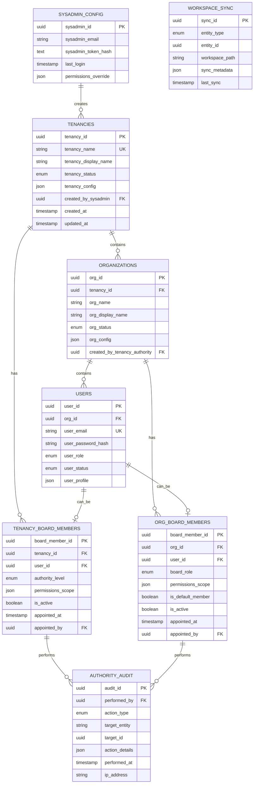
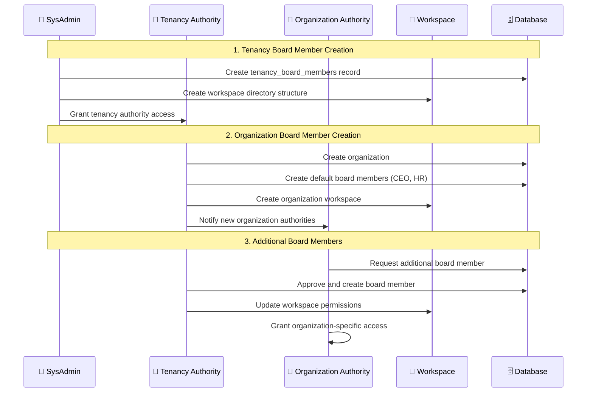
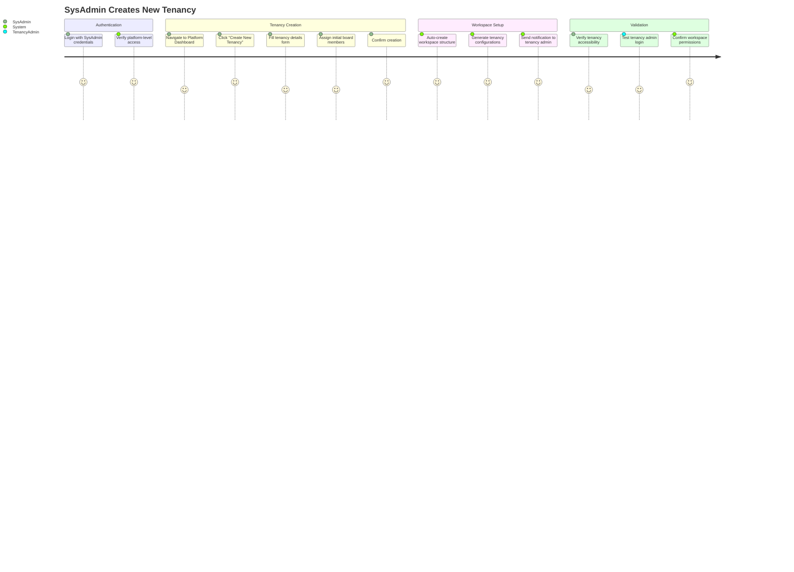
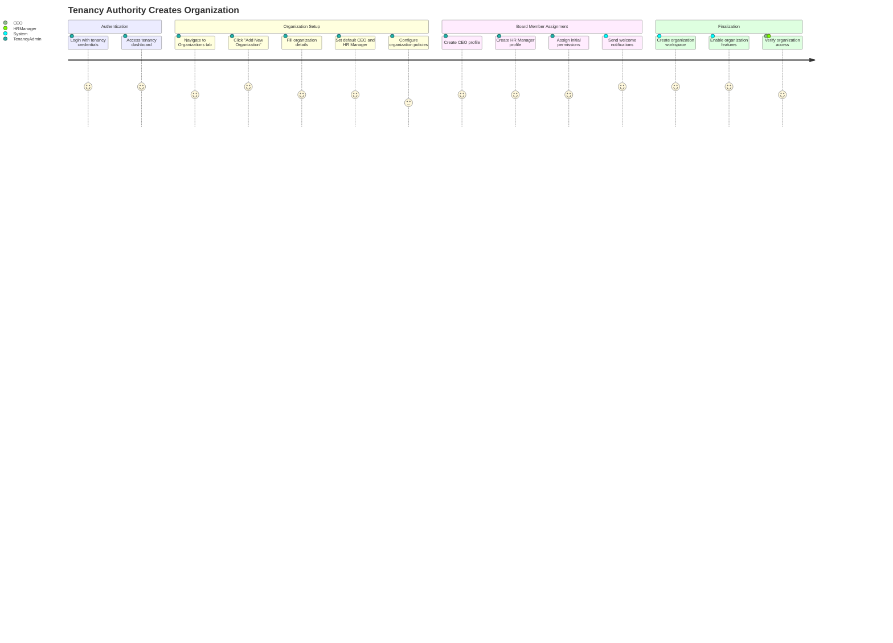
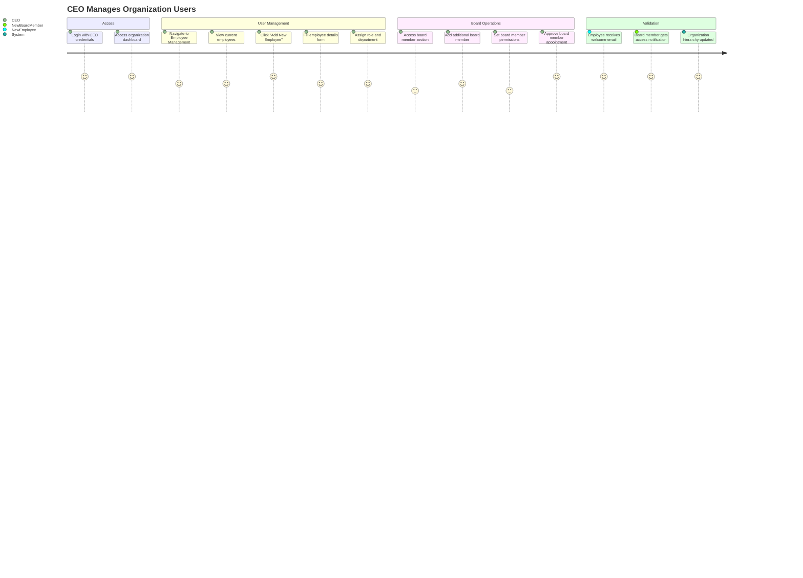
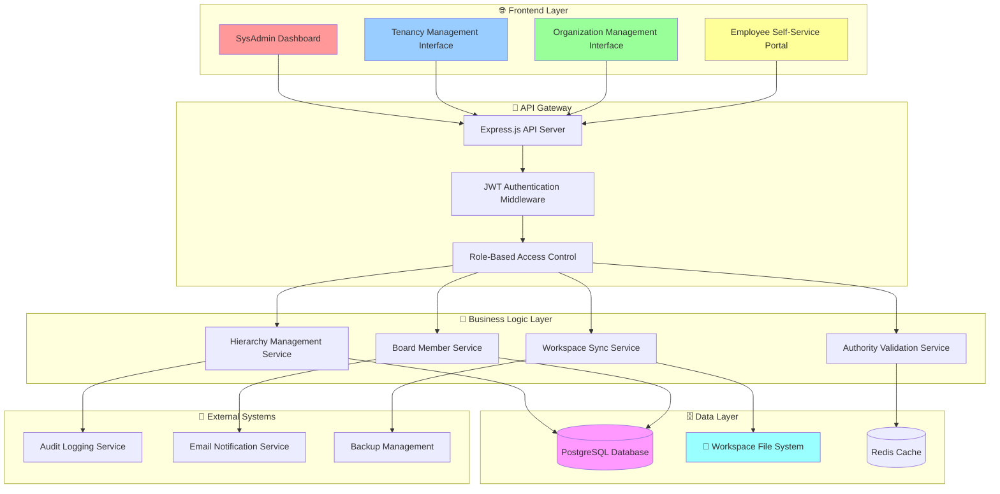
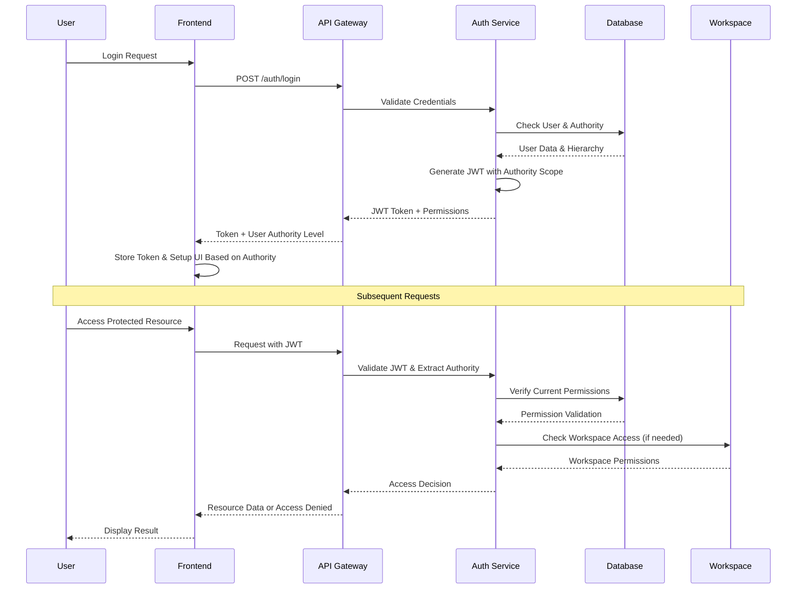
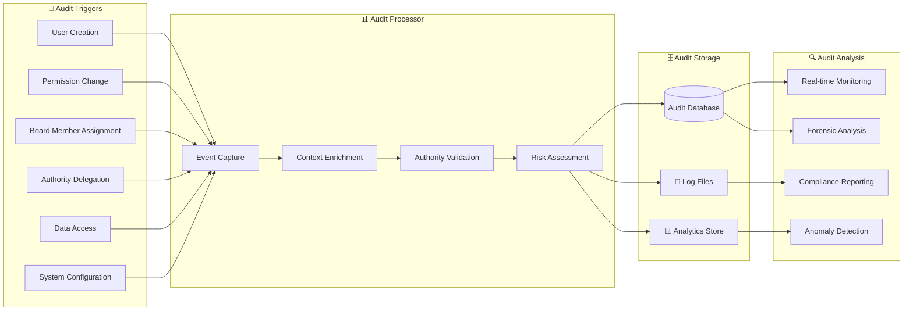

# HIERARCHY_STATEMENTS.md

## 🏢 Multi-Tenant Web Interface Implementation - Visual Documentation

**Project**: AI-HRMS-2025 v1.3.0
**Document Version**: 1.0
**Created**: September 19, 2025
**Author**: Claude Code Assistant

---

## 📋 Executive Summary

This document provides comprehensive visual documentation for implementing a multi-tenant web interface management system in AI-HRMS-2025. The system establishes a three-tier hierarchy: **Platform (SysAdmin)** → **Tenancies** → **Organizations**, with workspace-integrated management and role-based permissions.

---

## 🔗 Table of Contents

1. [Authority Hierarchy Overview](#-authority-hierarchy-overview)
2. [Workspace Directory Structure](#-workspace-directory-structure)
3. [Permission Matrix & RBAC](#-permission-matrix--rbac)
4. [Database Schema Integration](#-database-schema-integration)
5. [Board Members Architecture](#-board-members-architecture)
6. [Implementation Roadmap](#-implementation-roadmap)
7. [User Journey Scenarios](#-user-journey-scenarios)
8. [Technical Architecture](#-technical-architecture)
9. [Security & Audit Framework](#-security--audit-framework)
10. [Visual Implementation Guide](#-visual-implementation-guide)

---

## 🏗️ Authority Hierarchy Overview

### Three-Tier Authority Structure

```mermaid
graph TD
    A[🔧 Platform SysAdmin] --> B[🏢 Tenancy Authority]
    B --> C[🏬 Organization Authority]
    C --> D[👥 Users/Employees]

    A -.-> A1[.credentials/.sysadmin.env]
    B -.-> B1[/workspaces/Tenancies/{TenancyName}/]
    C -.-> C1[/workspaces/Tenancies/{TenancyName}/Organizations/{OrgName}/]
    D -.-> D1[Individual Employee Profiles]

    style A fill:#ff4444,stroke:#333,stroke-width:3px,color:#fff
    style B fill:#4444ff,stroke:#333,stroke-width:2px,color:#fff
    style C fill:#44ff44,stroke:#333,stroke-width:2px,color:#000
    style D fill:#ffff44,stroke:#333,stroke-width:1px,color:#000
```

### Authority Delegation Chain

```
┌─────────────────────────────────────────────────────────────────┐
│                    🔧 PLATFORM SYSADMIN                        │
│                                                                 │
│  ✓ Manages ALL tenancies globally                              │
│  ✓ Creates/deletes tenancy authorities                         │
│  ✓ Has override access to all organizational data              │
│  ✓ Source: .credentials/.sysadmin.env                          │
│                                                                 │
└─────────────────────┬───────────────────────────────────────────┘
                      │ DELEGATES TO
                      ▼
┌─────────────────────────────────────────────────────────────────┐
│                    🏢 TENANCY AUTHORITY                         │
│                                                                 │
│  ✓ Manages organizations within their tenancy                  │
│  ✓ Creates initial organization board members                  │
│  ✓ Populates CEO and HR Manager by default                     │
│  ✓ Workspace: /workspaces/Tenancies/{TenancyName}/             │
│                                                                 │
└─────────────────────┬───────────────────────────────────────────┘
                      │ DELEGATES TO
                      ▼
┌─────────────────────────────────────────────────────────────────┐
│                  🏬 ORGANIZATION AUTHORITY                      │
│                                                                 │
│  ✓ CEO + HR Manager (default board members)                    │
│  ✓ Additional board members as needed                          │
│  ✓ Manages all employees within organization                   │
│  ✓ Full database/functionality access within domain            │
│  ✓ Workspace: .../Organizations/{OrgName}/                     │
│                                                                 │
└─────────────────────┬───────────────────────────────────────────┘
                      │ MANAGES
                      ▼
┌─────────────────────────────────────────────────────────────────┐
│                     👥 USERS/EMPLOYEES                         │
│                                                                 │
│  ✓ Individual employee profiles and data                       │
│  ✓ Role-specific permissions within organization               │
│  ✓ Department and job-role based access                        │
│                                                                 │
└─────────────────────────────────────────────────────────────────┘
```

---

## 📁 Workspace Directory Structure

### Current Workspace Architecture

```
/workspaces/
├── Platform_Management/                    # 🔧 SysAdmin Workspace
│   ├── .env.Platform/                     # Platform-wide configuration
│   ├── Audit_Logs/                        # System-wide audit trails
│   ├── Backup_Management/                 # Automated backup configs
│   └── Global_Settings/                   # Cross-tenancy settings
│
└── Tenancies/                             # 🏢 Multi-Tenancy Root
    ├── Demo_Tenancy/                      # Example Tenancy
    │   ├── .env.Demo_Tenancy/             # Tenancy-specific config
    │   ├── Demo_Tenancy_Board_Members/    # Tenancy authority members
    │   │   ├── tenancy_admin_001.profile
    │   │   └── tenancy_admin_002.profile
    │   └── Organizations/                 # 🏬 Organizations Container
    │       ├── BankNova/                  # Individual Organization
    │       │   ├── .env.BankNova/         # Org-specific environment
    │       │   ├── BankNova_Board_Members/ # 🎯 NEW: Org Board Members
    │       │   │   ├── ceo.profile        # CEO (default)
    │       │   │   ├── hr_manager.profile # HR Manager (default)
    │       │   │   └── board_member_*.profile # Additional members
    │       │   ├── reports/               # Organization reports
    │       │   ├── Departments/           # 📋 NEW: Department structure
    │       │   │   ├── Finance/
    │       │   │   ├── HR/
    │       │   │   ├── Technology/
    │       │   │   └── Operations/
    │       │   └── Employee_Data/         # 📋 NEW: Employee workspace
    │       │       ├── Active/
    │       │       ├── Pending/
    │       │       └── Alumni/
    │       ├── BioNova/                   # Another Organization
    │       ├── FinNova/
    │       └── EcoNova/
    │
    └── Mock_Tenancy/                      # Another Tenancy
        ├── .env.Mock_Tenancy/
        ├── Mock_Tenancy_Board_Members/
        └── Organizations/
            └── TechCorp/
                ├── .env.TechCorp/
                ├── TechCorp_Board_Members/
                └── reports/
```

### Proposed Enhanced Structure

```
📁 /workspaces/
├── 🔧 Platform_Management/
│   ├── 📄 .env.Platform/
│   ├── 📊 Analytics_Dashboard/
│   ├── 🔍 Audit_Central/
│   ├── 💾 Backup_Orchestrator/
│   ├── 🛡️ Security_Center/
│   └── 🔧 System_Maintenance/
│
└── 🏢 Tenancies/
    └── {TenancyName}/
        ├── 📄 .env.{TenancyName}/
        ├── 👥 {TenancyName}_Board_Members/
        │   ├── 📝 authority_matrix.json
        │   ├── 🔐 access_tokens.secure
        │   └── 👤 member_profiles/
        ├── 📊 Tenancy_Analytics/
        ├── 🔍 Tenancy_Audit/
        └── 🏬 Organizations/
            └── {OrganizationName}/
                ├── 📄 .env.{OrganizationName}/
                ├── 👥 {OrganizationName}_Board_Members/
                │   ├── 👑 ceo.profile (default)
                │   ├── 👔 hr_manager.profile (default)
                │   ├── 📋 board_authority_matrix.json
                │   └── 🔐 org_access_tokens.secure
                ├── 📊 Organization_Analytics/
                ├── 🔍 Organization_Audit/
                ├── 📁 Departments/
                │   ├── 💰 Finance/
                │   ├── 👥 HR/
                │   ├── 💻 Technology/
                │   ├── 🔧 Operations/
                │   └── 📈 Sales_Marketing/
                ├── 👤 Employee_Data/
                │   ├── ✅ Active/
                │   ├── ⏳ Pending/
                │   ├── 🎓 Alumni/
                │   └── 📊 Performance_Data/
                └── 📈 reports/
```

---

## 🔐 Permission Matrix & RBAC

### Authority Permission Matrix

| Authority Level | Tenancy Management | Organization Management | User Management | System Access | Board Member Management |
|----------------|-------------------|----------------------|----------------|---------------|----------------------|
| 🔧 **Platform SysAdmin** | ✅ Full CRUD | ✅ Full CRUD | ✅ Full CRUD | ✅ Full System | ✅ All Levels |
| 🏢 **Tenancy Authority** | ✅ Own Tenancy Only | ✅ Full CRUD | ✅ View Only | 🔍 Tenancy Scope | ✅ Organization Level |
| 🏬 **Organization Authority** | ❌ No Access | ✅ Own Org Only | ✅ Full CRUD | 🔍 Organization Scope | ✅ Own Organization |
| 👤 **Standard Employee** | ❌ No Access | ❌ No Access | 🔍 View Own Profile | 🔍 Limited Features | ❌ No Access |

### Detailed Permission Breakdown

```
🔧 PLATFORM SYSADMIN PERMISSIONS
├── 🏢 Tenancy Operations
│   ├── ✅ Create new tenancies
│   ├── ✅ Delete existing tenancies
│   ├── ✅ Modify tenancy configurations
│   ├── ✅ Assign tenancy board members
│   └── ✅ Override tenancy restrictions
├── 🏬 Organization Operations
│   ├── ✅ Create organizations across tenancies
│   ├── ✅ Transfer organizations between tenancies
│   ├── ✅ Delete organizations
│   ├── ✅ Modify organization settings
│   └── ✅ Access all organization data
├── 👥 User Operations
│   ├── ✅ Create users in any organization
│   ├── ✅ Modify user roles and permissions
│   ├── ✅ Delete users system-wide
│   ├── ✅ Reset passwords globally
│   └── ✅ Impersonate any user (with audit)
├── 🛡️ System Operations
│   ├── ✅ Database administration
│   ├── ✅ System configuration
│   ├── ✅ Backup and restore
│   ├── ✅ Audit log access
│   └── ✅ Security policy management

🏢 TENANCY AUTHORITY PERMISSIONS
├── 🏬 Organization Operations (Within Tenancy)
│   ├── ✅ Create new organizations
│   ├── ✅ Delete organizations
│   ├── ✅ Modify organization settings
│   ├── ✅ Assign organization board members
│   └── ✅ Configure organization defaults
├── 👥 User Operations (Limited)
│   ├── 🔍 View users across tenancy organizations
│   ├── 📊 Generate tenancy-wide reports
│   ├── ✅ Create initial organization authorities
│   └── ❌ Direct user management (delegated)
├── 🔧 Tenancy Operations
│   ├── ✅ Modify own tenancy settings
│   ├── ✅ Configure tenancy-wide policies
│   ├── ✅ Manage tenancy board members
│   └── ❌ Cannot delete own tenancy

🏬 ORGANIZATION AUTHORITY PERMISSIONS
├── 👥 User Operations (Within Organization)
│   ├── ✅ Create employees
│   ├── ✅ Modify employee profiles
│   ├── ✅ Delete/deactivate employees
│   ├── ✅ Assign roles and permissions
│   ├── ✅ Manage leave requests
│   └── ✅ Generate employee reports
├── 🏬 Organization Operations
│   ├── ✅ Modify organization settings
│   ├── ✅ Configure departments
│   ├── ✅ Manage organizational hierarchy
│   ├── ✅ Set organization policies
│   └── ✅ Manage organization board members
├── 📊 Data Operations
│   ├── ✅ Full database access within organization
│   ├── ✅ Export organization data
│   ├── ✅ Analytics and reporting
│   └── ✅ Integration management

👤 STANDARD EMPLOYEE PERMISSIONS
├── 👤 Profile Operations
│   ├── 🔍 View own profile
│   ├── ✅ Update personal information
│   ├── ✅ Change password
│   └── 🔍 View organization structure
├── 📋 HR Operations
│   ├── ✅ Submit leave requests
│   ├── ✅ View leave balance
│   ├── 🔍 View company policies
│   └── ✅ Access HR self-service
├── 📊 Limited Data Access
│   ├── 🔍 View own performance data
│   ├── 🔍 View team information
│   └── 🔍 Access allowed reports
```

---

## 🗄️ Database Schema Integration

### Current Database Schema Enhancement



### Board Members Integration Schema

```sql
-- NEW TABLE: Tenancy Board Members
CREATE TABLE tenancy_board_members (
    board_member_id UUID PRIMARY KEY DEFAULT gen_random_uuid(),
    tenancy_id UUID NOT NULL REFERENCES tenancies(tenancy_id),
    user_id UUID NOT NULL REFERENCES users(user_id),
    authority_level ENUM('TENANCY_ADMIN', 'TENANCY_MANAGER') NOT NULL,
    permissions_scope JSONB NOT NULL DEFAULT '{}',
    is_active BOOLEAN DEFAULT true,
    appointed_at TIMESTAMP DEFAULT CURRENT_TIMESTAMP,
    appointed_by UUID REFERENCES users(user_id),
    created_at TIMESTAMP DEFAULT CURRENT_TIMESTAMP,
    updated_at TIMESTAMP DEFAULT CURRENT_TIMESTAMP,
    UNIQUE(tenancy_id, user_id)
);

-- NEW TABLE: Organization Board Members
CREATE TABLE org_board_members (
    board_member_id UUID PRIMARY KEY DEFAULT gen_random_uuid(),
    org_id UUID NOT NULL REFERENCES organizations(org_id),
    user_id UUID NOT NULL REFERENCES users(user_id),
    board_role ENUM('CEO', 'HR_MANAGER', 'BOARD_MEMBER', 'ADVISOR') NOT NULL,
    permissions_scope JSONB NOT NULL DEFAULT '{}',
    is_default_member BOOLEAN DEFAULT false, -- true for CEO, HR_MANAGER
    is_active BOOLEAN DEFAULT true,
    appointed_at TIMESTAMP DEFAULT CURRENT_TIMESTAMP,
    appointed_by UUID REFERENCES users(user_id),
    created_at TIMESTAMP DEFAULT CURRENT_TIMESTAMP,
    updated_at TIMESTAMP DEFAULT CURRENT_TIMESTAMP,
    UNIQUE(org_id, user_id, board_role)
);

-- NEW TABLE: Workspace Synchronization
CREATE TABLE workspace_sync (
    sync_id UUID PRIMARY KEY DEFAULT gen_random_uuid(),
    entity_type ENUM('TENANCY', 'ORGANIZATION', 'USER') NOT NULL,
    entity_id UUID NOT NULL,
    workspace_path TEXT NOT NULL,
    sync_metadata JSONB DEFAULT '{}',
    last_sync TIMESTAMP DEFAULT CURRENT_TIMESTAMP,
    sync_status ENUM('SYNCED', 'PENDING', 'ERROR') DEFAULT 'PENDING',
    created_at TIMESTAMP DEFAULT CURRENT_TIMESTAMP,
    updated_at TIMESTAMP DEFAULT CURRENT_TIMESTAMP
);

-- NEW TABLE: Authority Actions Audit
CREATE TABLE authority_audit (
    audit_id UUID PRIMARY KEY DEFAULT gen_random_uuid(),
    performed_by UUID NOT NULL REFERENCES users(user_id),
    action_type ENUM('CREATE', 'UPDATE', 'DELETE', 'AUTHORIZE', 'REVOKE') NOT NULL,
    target_entity ENUM('TENANCY', 'ORGANIZATION', 'USER', 'BOARD_MEMBER') NOT NULL,
    target_id UUID NOT NULL,
    action_details JSONB NOT NULL DEFAULT '{}',
    performed_at TIMESTAMP DEFAULT CURRENT_TIMESTAMP,
    ip_address INET,
    user_agent TEXT,
    session_id UUID
);
```

---

## 👥 Board Members Architecture

### Board Member Hierarchy Flow

```
🔧 PLATFORM SYSADMIN
    ↓ CREATES & MANAGES
🏢 TENANCY BOARD MEMBERS
    ├── 👤 Tenancy Admin (Full tenancy control)
    ├── 👤 Tenancy Manager (Organization management)
    └── 👤 Additional Members (Custom permissions)

    ↓ EACH TENANCY CREATES & MANAGES
🏬 ORGANIZATION BOARD MEMBERS
    ├── 👑 CEO (Default, full organization control)
    ├── 👔 HR Manager (Default, employee management)
    ├── 💼 Board Members (Strategic decisions)
    ├── 🎯 Advisors (Consultation access)
    └── 🔧 Custom Roles (Specific permissions)
```

### Board Member Creation Flow



### Board Member Permissions Matrix

```
┌─────────────────────┬─────────────┬─────────────┬─────────────┬─────────────┐
│   BOARD ROLE        │   TENANCY   │    ORG      │    USERS    │  SETTINGS   │
│                     │  MANAGEMENT │ MANAGEMENT  │ MANAGEMENT  │   ACCESS    │
├─────────────────────┼─────────────┼─────────────┼─────────────┼─────────────┤
│ 🔧 Platform SysAdmin│     ✅✅✅    │     ✅✅✅    │     ✅✅✅    │     ✅✅✅    │
│ 🏢 Tenancy Admin    │     ✅✅❌    │     ✅✅✅    │     🔍📊❌    │     ✅✅❌    │
│ 🏢 Tenancy Manager  │     🔍✅❌    │     ✅✅❌    │     🔍📊❌    │     🔍✅❌    │
│ 👑 CEO              │     ❌❌❌    │     ✅✅❌    │     ✅✅✅    │     ✅✅❌    │
│ 👔 HR Manager       │     ❌❌❌    │     🔍✅❌    │     ✅✅✅    │     🔍✅❌    │
│ 💼 Board Member     │     ❌❌❌    │     🔍✅❌    │     🔍📊❌    │     🔍✅❌    │
│ 🎯 Advisor          │     ❌❌❌    │     🔍❌❌    │     🔍❌❌    │     🔍❌❌    │
└─────────────────────┴─────────────┴─────────────┴─────────────┴─────────────┘

Legend: ✅ Full Access | 🔍 Read Only | 📊 Reports Only | ❌ No Access
        First symbol: Create | Second: Update | Third: Delete
```

---

## 🗺️ Implementation Roadmap

### Phase 1: Foundation Infrastructure (Weeks 1-2)

```
📅 WEEK 1: Database Schema Enhancement
├── 📋 Day 1-2: Create board member tables
├── 📋 Day 3-4: Implement workspace sync mechanism
├── 📋 Day 5: Authority audit system
└── 📋 Day 6-7: Data migration scripts

📅 WEEK 2: Authentication & Authorization
├── 📋 Day 1-3: JWT enhancement for hierarchy
├── 📋 Day 4-5: Role-based middleware implementation
├── 📋 Day 6-7: Authority validation services
```

### Phase 2: API Development (Weeks 3-4)

```
📅 WEEK 3: Backend API Endpoints
├── 📋 Day 1-2: Tenancy management APIs
├── 📋 Day 3-4: Organization management APIs
├── 📋 Day 5: Board member management APIs
└── 📋 Day 6-7: User management APIs with hierarchy

📅 WEEK 4: Workspace Integration
├── 📋 Day 1-3: File system synchronization
├── 📋 Day 4-5: Workspace management APIs
├── 📋 Day 6-7: Audit trail implementation
```

### Phase 3: Frontend Development (Weeks 5-6)

```
📅 WEEK 5: Core UI Components
├── 📋 Day 1-2: Hierarchy navigation component
├── 📋 Day 3-4: Authority-based routing
├── 📋 Day 5: Board member management UI
└── 📋 Day 6-7: Permission matrix displays

📅 WEEK 6: Management Dashboards
├── 📋 Day 1-2: SysAdmin dashboard
├── 📋 Day 3-4: Tenancy management interface
├── 📋 Day 5: Organization management interface
└── 📋 Day 6-7: User management interface
```

### Phase 4: Advanced Features (Weeks 7-8)

```
📅 WEEK 7: Advanced Functionality
├── 📋 Day 1-2: Bulk operations interface
├── 📋 Day 3-4: Advanced reporting system
├── 📋 Day 5: Integration with existing features
└── 📋 Day 6-7: Performance optimization

📅 WEEK 8: Security & Deployment
├── 📋 Day 1-2: Security audit and penetration testing
├── 📋 Day 3-4: Production deployment preparation
├── 📋 Day 5: Documentation and training materials
└── 📋 Day 6-7: Final testing and release
```

### Implementation Timeline Visual

```
Month 1: Foundation & Development
┌──────┬──────┬──────┬──────┬──────┬──────┬──────┬──────┐
│ W1   │ W2   │ W3   │ W4   │ W5   │ W6   │ W7   │ W8   │
├──────┼──────┼──────┼──────┼──────┼──────┼──────┼──────┤
│ 🗄️DB │ 🔐AUTH│ 🔌API│ 📁WS │ 🎨UI │ 📊DASH│ ⚡ADV│ 🚀DEP│
│ Schema│ RBAC │ Endp │ Sync │ Comp │Board │ Feat │ Prod │
│ Board │ JWT  │ CRUD │ Audit│ Nav  │ Mgmt │ Bulk │ Test │
│ Audit │ Roles│ Hier │ Trail│ Auth │ UX   │ Perf │ Doc  │
└──────┴──────┴──────┴──────┴──────┴──────┴──────┴──────┘
  📊   📈   📈   📈   📈   📈   📈   🎯
 20%  35%  50%  65%  75%  85%  95% 100%
```

---

## 👤 User Journey Scenarios

### Scenario 1: SysAdmin Creates New Tenancy



### Scenario 2: Tenancy Authority Creates Organization



### Scenario 3: CEO Manages Organization Users



---

## 🏗️ Technical Architecture

### System Architecture Overview



### API Endpoint Architecture

```
🔌 API ENDPOINTS HIERARCHY

├── 🔧 /api/platform (SysAdmin Only)
│   ├── GET /tenancies (List all tenancies)
│   ├── POST /tenancies (Create new tenancy)
│   ├── PUT /tenancies/:id (Update tenancy)
│   ├── DELETE /tenancies/:id (Delete tenancy)
│   ├── GET /system/health (System status)
│   └── GET /audit/global (Global audit logs)
│
├── 🏢 /api/tenancy (Tenancy Authority)
│   ├── GET /organizations (List tenancy organizations)
│   ├── POST /organizations (Create organization)
│   ├── PUT /organizations/:id (Update organization)
│   ├── DELETE /organizations/:id (Delete organization)
│   ├── GET /board-members (List tenancy board)
│   ├── POST /board-members (Add board member)
│   └── GET /audit/tenancy (Tenancy audit logs)
│
├── 🏬 /api/organization (Organization Authority)
│   ├── GET /employees (List organization employees)
│   ├── POST /employees (Create employee)
│   ├── PUT /employees/:id (Update employee)
│   ├── DELETE /employees/:id (Delete employee)
│   ├── GET /board-members (List organization board)
│   ├── POST /board-members (Add organization board member)
│   ├── GET /departments (List departments)
│   ├── POST /departments (Create department)
│   └── GET /audit/organization (Organization audit logs)
│
└── 👤 /api/user (All Authenticated Users)
    ├── GET /profile (Own profile)
    ├── PUT /profile (Update own profile)
    ├── GET /permissions (Current permissions)
    ├── GET /organization/info (Organization info)
    └── GET /audit/personal (Personal audit logs)
```

### Authentication Flow



---

## 🛡️ Security & Audit Framework

### Security Layers

```
🛡️ MULTI-LAYER SECURITY ARCHITECTURE

┌─────────────────────────────────────────────────────────────────┐
│                    🌐 FRONTEND SECURITY                         │
│ ✓ CSP Headers    ✓ XSS Protection    ✓ Input Validation        │
│ ✓ HTTPS Only     ✓ Secure Cookies    ✓ Session Management      │
└─────────────────────────────────────────────────────────────────┘
                              │
                              ▼
┌─────────────────────────────────────────────────────────────────┐
│                     🔌 API SECURITY                            │
│ ✓ JWT Validation ✓ Rate Limiting     ✓ Request Sanitization    │
│ ✓ CORS Policy    ✓ Authority Scope   ✓ Audit Logging          │
└─────────────────────────────────────────────────────────────────┘
                              │
                              ▼
┌─────────────────────────────────────────────────────────────────┐
│                  🧠 BUSINESS LOGIC SECURITY                    │
│ ✓ Hierarchy Validation  ✓ Permission Checks  ✓ Data Isolation │
│ ✓ Authority Boundaries  ✓ Resource Ownership ✓ Audit Trails   │
└─────────────────────────────────────────────────────────────────┘
                              │
                              ▼
┌─────────────────────────────────────────────────────────────────┐
│                    🗄️ DATA SECURITY                           │
│ ✓ Database Encryption   ✓ Connection Security ✓ Backup Encrypt│
│ ✓ Access Logging        ✓ Data Masking        ✓ Retention     │
└─────────────────────────────────────────────────────────────────┘
                              │
                              ▼
┌─────────────────────────────────────────────────────────────────┐
│                   📁 WORKSPACE SECURITY                        │
│ ✓ File Permissions   ✓ Directory Isolation   ✓ Access Control │
│ ✓ Sync Validation    ✓ Path Traversal Prev   ✓ Change Detect  │
└─────────────────────────────────────────────────────────────────┘
```

### Audit Trail System



### Authority Validation Pipeline

```
🔍 AUTHORITY VALIDATION PIPELINE

┌─────────────────────────────────────────────────────────────────┐
│  🎯 REQUEST RECEIVED                                            │
│  ├── Extract JWT Token                                         │
│  ├── Parse Authority Claims                                    │
│  └── Identify Target Resource                                  │
└─────────────────────────┬───────────────────────────────────────┘
                          │
                          ▼
┌─────────────────────────────────────────────────────────────────┐
│  🔐 TOKEN VALIDATION                                           │
│  ├── Verify JWT Signature                                     │
│  ├── Check Token Expiration                                   │
│  ├── Validate Authority Scope                                 │
│  └── Cross-Reference with Active Sessions                     │
└─────────────────────────┬───────────────────────────────────────┘
                          │
                          ▼
┌─────────────────────────────────────────────────────────────────┐
│  🏗️ HIERARCHY VALIDATION                                      │
│  ├── Verify User Authority Level                              │
│  ├── Check Resource Ownership Chain                           │
│  ├── Validate Delegation Path                                 │
│  └── Confirm Board Member Status                              │
└─────────────────────────┬───────────────────────────────────────┘
                          │
                          ▼
┌─────────────────────────────────────────────────────────────────┐
│  📋 PERMISSION CHECK                                           │
│  ├── Load User Permissions Matrix                             │
│  ├── Check Action-Resource Combination                        │
│  ├── Verify Context-Specific Rules                            │
│  └── Apply Organization Policies                              │
└─────────────────────────┬───────────────────────────────────────┘
                          │
                          ▼
┌─────────────────────────────────────────────────────────────────┐
│  📊 AUDIT & RESPONSE                                          │
│  ├── Log Access Attempt                                       │
│  ├── Record Decision Rationale                                │
│  ├── Generate Response (Allow/Deny)                           │
│  └── Update Activity Metrics                                  │
└─────────────────────────────────────────────────────────────────┘
```

---

## 🎨 Visual Implementation Guide

### Frontend Component Hierarchy

```
🎨 FRONTEND COMPONENT STRUCTURE

📱 MultiTenantApp
├── 🔐 AuthenticationWrapper
│   ├── 🔧 SysAdminDashboard
│   │   ├── 📊 PlatformMetrics
│   │   ├── 🏢 TenancyManagement
│   │   ├── 👥 GlobalUserManagement
│   │   └── 🔍 SystemAuditViewer
│   │
│   ├── 🏢 TenancyDashboard
│   │   ├── 📊 TenancyMetrics
│   │   ├── 🏬 OrganizationGrid
│   │   ├── 👥 TenancyBoardManagement
│   │   └── ⚙️ TenancySettings
│   │
│   ├── 🏬 OrganizationDashboard
│   │   ├── 📊 OrganizationMetrics
│   │   ├── 👥 EmployeeManagement
│   │   ├── 💼 BoardMemberManagement
│   │   ├── 🏗️ DepartmentStructure
│   │   └── 📈 OrganizationReports
│   │
│   └── 👤 EmployeeDashboard
│       ├── 👤 ProfileManagement
│       ├── 📋 LeaveRequests
│       ├── 📊 PersonalReports
│       └── 🏢 OrganizationInfo
│
├── 🧭 NavigationSystem
│   ├── 🏗️ HierarchyBreadcrumb
│   ├── 🔍 AuthorityIndicator
│   ├── 📱 ResponsiveMenu
│   └── 🔔 NotificationCenter
│
├── 🔧 SharedComponents
│   ├── 🎭 AuthorityGate
│   ├── 📊 PermissionMatrix
│   ├── 👥 BoardMemberSelector
│   ├── 🏢 OrganizationPicker
│   └── 📋 AuditLogViewer
│
└── 🛡️ SecurityComponents
    ├── 🔐 SecureRoute
    ├── 👁️ AccessLogger
    ├── ⚡ ActivityMonitor
    └── 🚨 SecurityAlerts
```

### UI/UX Mockup Guidelines

```
🎨 VISUAL DESIGN PRINCIPLES

┌─────────────────────────────────────────────────────────────────┐
│                      🎨 COLOR HIERARCHY                        │
├─────────────────────────────────────────────────────────────────┤
│ 🔧 Platform Level    │ #FF4444 (Red)      │ System Admin       │
│ 🏢 Tenancy Level     │ #4444FF (Blue)     │ Tenancy Authority  │
│ 🏬 Organization Level│ #44FF44 (Green)    │ Organization Auth  │
│ 👤 Employee Level    │ #FFFF44 (Yellow)   │ Standard Users     │
├─────────────────────────────────────────────────────────────────┤
│                     🔤 TYPOGRAPHY SCALE                        │
├─────────────────────────────────────────────────────────────────┤
│ H1 Authority Level   │ 24px Bold          │ Dashboard Headers  │
│ H2 Section Headers   │ 20px Semi-Bold     │ Content Sections   │
│ H3 Component Labels  │ 16px Medium        │ Form Labels        │
│ Body Text           │ 14px Regular       │ General Content    │
│ Helper Text         │ 12px Light         │ Descriptions       │
├─────────────────────────────────────────────────────────────────┤
│                      🎯 ICONOGRAPHY                            │
├─────────────────────────────────────────────────────────────────┤
│ 🔧 Platform         │ Settings Gear      │ System Controls    │
│ 🏢 Tenancy          │ Building Multiple  │ Multi-Organization │
│ 🏬 Organization     │ Office Building    │ Single Org         │
│ 👤 Users            │ People Group       │ Employee Management│
│ 🛡️ Security         │ Shield Lock        │ Access Control     │
│ 📊 Reports          │ Chart Bar          │ Analytics/Reports  │
└─────────────────────────────────────────────────────────────────┘
```

### Dashboard Layout Templates

```
🖥️ SYSADMIN DASHBOARD LAYOUT
┌─────────────────────────────────────────────────────────────────┐
│ 🔧 Platform Administration Dashboard                           │
├─────────────────┬───────────────────────┬───────────────────────┤
│ 📊 METRICS      │ 🏢 TENANCIES         │ 🚨 ALERTS            │
│ ┌─────────────┐ │ ┌───────────────────┐ │ ┌───────────────────┐ │
│ │ Total Users │ │ │ Demo_Tenancy      │ │ │ Failed Login      │ │
│ │    1,247    │ │ │ ├── 4 Orgs        │ │ │ Attempts: 5       │ │
│ └─────────────┘ │ │ ├── 163 Users     │ │ └───────────────────┘ │
│ ┌─────────────┐ │ │ └── Active        │ │ ┌───────────────────┐ │
│ │ Tenancies   │ │ └───────────────────┘ │ │ Storage Usage     │ │
│ │      6      │ │ ┌───────────────────┐ │ │ 89% Capacity      │ │
│ └─────────────┘ │ │ Mock_Tenancy      │ │ └───────────────────┘ │
│ ┌─────────────┐ │ │ ├── 1 Org         │ │                     │
│ │ Active Orgs │ │ │ ├── 10 Users      │ │                     │
│ │     23      │ │ │ └── Active        │ │                     │
│ └─────────────┘ │ └───────────────────┘ │                     │
├─────────────────┼───────────────────────┼───────────────────────┤
│ 🔍 AUDIT TRAIL                          │ ⚙️ QUICK ACTIONS     │
│ ┌─────────────────────────────────────┐ │ ┌───────────────────┐ │
│ │ 09:45 - TenancyAdmin created org... │ │ │ + Create Tenancy  │ │
│ │ 09:32 - CEO updated employee...     │ │ │ 🔍 View All Orgs  │ │
│ │ 09:18 - HR added new employee...    │ │ │ 📊 System Reports │ │
│ │ 09:05 - SysAdmin modified...        │ │ │ 🛡️ Security Scan  │ │
│ └─────────────────────────────────────┘ │ └───────────────────┘ │
└─────────────────────────────────────────┴───────────────────────┘
```

```
🖥️ TENANCY DASHBOARD LAYOUT
┌─────────────────────────────────────────────────────────────────┐
│ 🏢 Demo_Tenancy Administration                                  │
├─────────────────┬───────────────────────┬───────────────────────┤
│ 📊 OVERVIEW     │ 🏬 ORGANIZATIONS      │ 👥 BOARD MEMBERS     │
│ ┌─────────────┐ │ ┌───────────────────┐ │ ┌───────────────────┐ │
│ │ Total Orgs  │ │ │ 🏦 BankNova       │ │ │ 👤 Admin_001      │ │
│ │      4      │ │ │ ├── 58 Employees  │ │ │ Role: Tenancy_Admin│ │
│ └─────────────┘ │ │ ├── CEO: M.Bianchi│ │ └───────────────────┘ │
│ ┌─────────────┐ │ │ └── Status: Active│ │ ┌───────────────────┐ │
│ │ Employees   │ │ └───────────────────┘ │ │ 👤 Manager_002    │ │
│ │    163      │ │ ┌───────────────────┐ │ │ Role: Tenancy_Mgr │ │
│ └─────────────┘ │ │ 🧬 BioNova        │ │ └───────────────────┘ │
│ ┌─────────────┐ │ │ ├── 40 Employees  │ │                     │
│ │ Departments │ │ │ ├── CEO: A.Torres  │ │                     │
│ │     20      │ │ │ └── Status: Active│ │                     │
│ └─────────────┘ │ └───────────────────┘ │                     │
├─────────────────┼───────────────────────┼───────────────────────┤
│ 📈 ANALYTICS                             │ ⚙️ MANAGEMENT        │
│ ┌─────────────────────────────────────┐ │ ┌───────────────────┐ │
│ │ Growth Trends, User Activity...     │ │ │ + Add Organization│ │
│ │ Performance Metrics by Org...       │ │ │ 👥 Manage Board   │ │
│ └─────────────────────────────────────┘ │ │ ⚙️ Tenancy Settings│ │
└─────────────────────────────────────────┴─┤ 📊 Generate Report│ │
                                          └───────────────────┘
```

---

## 📚 Implementation Examples

### Example API Controller Code

```javascript
// src/controllers/hierarchyController.js
const HierarchyService = require('../services/hierarchyService');
const AuthorityValidator = require('../utils/authorityValidator');
const AuditLogger = require('../utils/auditLogger');

class HierarchyController {
  // 🔧 SysAdmin: Create new tenancy
  async createTenancy(req, res) {
    try {
      // Validate SysAdmin authority
      const isAuthorized = await AuthorityValidator.validateSysAdmin(req.user);
      if (!isAuthorized) {
        return res.status(403).json({ error: 'Insufficient privileges' });
      }

      const tenancyData = req.body;

      // Create tenancy in database
      const tenancy = await HierarchyService.createTenancy(tenancyData);

      // Create workspace structure
      await HierarchyService.createTenancyWorkspace(tenancy.tenancy_id);

      // Log action
      await AuditLogger.log({
        performed_by: req.user.user_id,
        action_type: 'CREATE',
        target_entity: 'TENANCY',
        target_id: tenancy.tenancy_id,
        action_details: { tenancy_name: tenancy.tenancy_name },
        ip_address: req.ip
      });

      res.status(201).json({
        success: true,
        tenancy: tenancy,
        workspace_path: `/workspaces/Tenancies/${tenancy.tenancy_name}/`
      });
    } catch (error) {
      res.status(500).json({ error: error.message });
    }
  }

  // 🏢 Tenancy Authority: Create organization
  async createOrganization(req, res) {
    try {
      // Validate tenancy authority
      const isAuthorized = await AuthorityValidator.validateTenancyAuthority(
        req.user,
        req.params.tenancyId
      );
      if (!isAuthorized) {
        return res.status(403).json({ error: 'Insufficient privileges' });
      }

      const orgData = { ...req.body, tenancy_id: req.params.tenancyId };

      // Create organization
      const organization = await HierarchyService.createOrganization(orgData);

      // Create default board members (CEO, HR Manager)
      await HierarchyService.createDefaultBoardMembers(
        organization.org_id,
        req.body.ceo_data,
        req.body.hr_manager_data,
        req.user.user_id
      );

      // Create workspace structure
      await HierarchyService.createOrganizationWorkspace(
        req.params.tenancyId,
        organization.org_id
      );

      await AuditLogger.log({
        performed_by: req.user.user_id,
        action_type: 'CREATE',
        target_entity: 'ORGANIZATION',
        target_id: organization.org_id,
        action_details: {
          org_name: organization.org_name,
          tenancy_id: req.params.tenancyId
        },
        ip_address: req.ip
      });

      res.status(201).json({
        success: true,
        organization: organization,
        board_members: organization.board_members
      });
    } catch (error) {
      res.status(500).json({ error: error.message });
    }
  }
}

module.exports = new HierarchyController();
```

### Example Frontend Component

```jsx
// src/components/HierarchyManagement/TenancyDashboard.jsx
import React, { useState, useEffect } from 'react';
import { Card, CardContent, Typography, Grid, Button, IconButton } from '@mui/material';
import { Business, People, Settings, Add } from '@mui/icons-material';
import { useAuth } from '../contexts/AuthContext';
import { hierarchyAPI } from '../services/hierarchyAPI';

const TenancyDashboard = () => {
  const { user, hasAuthority } = useAuth();
  const [tenancyData, setTenancyData] = useState(null);
  const [organizations, setOrganizations] = useState([]);
  const [boardMembers, setBoardMembers] = useState([]);

  useEffect(() => {
    loadTenancyData();
  }, []);

  const loadTenancyData = async () => {
    try {
      const response = await hierarchyAPI.getTenancyData(user.tenancy_id);
      setTenancyData(response.data.tenancy);
      setOrganizations(response.data.organizations);
      setBoardMembers(response.data.board_members);
    } catch (error) {
      console.error('Failed to load tenancy data:', error);
    }
  };

  const handleCreateOrganization = async () => {
    // Open organization creation modal
    // Implementation would include form for org details, CEO, and HR Manager
  };

  if (!hasAuthority('TENANCY_AUTHORITY')) {
    return <div>Access Denied: Tenancy authority required</div>;
  }

  return (
    <div className="tenancy-dashboard">
      <Typography variant="h4" gutterBottom>
        🏢 {tenancyData?.tenancy_display_name || 'Tenancy Dashboard'}
      </Typography>

      <Grid container spacing={3}>
        {/* Overview Cards */}
        <Grid item xs={12} md={3}>
          <Card>
            <CardContent>
              <Business color="primary" />
              <Typography variant="h6">Organizations</Typography>
              <Typography variant="h4">{organizations.length}</Typography>
            </CardContent>
          </Card>
        </Grid>

        <Grid item xs={12} md={3}>
          <Card>
            <CardContent>
              <People color="primary" />
              <Typography variant="h6">Total Employees</Typography>
              <Typography variant="h4">
                {organizations.reduce((sum, org) => sum + org.employee_count, 0)}
              </Typography>
            </CardContent>
          </Card>
        </Grid>

        {/* Organizations Grid */}
        <Grid item xs={12} md={8}>
          <Card>
            <CardContent>
              <div style={{ display: 'flex', justifyContent: 'space-between', alignItems: 'center' }}>
                <Typography variant="h6">Organizations</Typography>
                <Button
                  variant="contained"
                  startIcon={<Add />}
                  onClick={handleCreateOrganization}
                >
                  Add Organization
                </Button>
              </div>

              <Grid container spacing={2} style={{ marginTop: '1rem' }}>
                {organizations.map((org) => (
                  <Grid item xs={12} sm={6} key={org.org_id}>
                    <Card variant="outlined">
                      <CardContent>
                        <Typography variant="h6">{org.org_display_name}</Typography>
                        <Typography color="textSecondary">
                          {org.employee_count} employees
                        </Typography>
                        <Typography color="textSecondary">
                          CEO: {org.ceo_name}
                        </Typography>
                        <div style={{ marginTop: '1rem' }}>
                          <IconButton size="small">
                            <Settings />
                          </IconButton>
                        </div>
                      </CardContent>
                    </Card>
                  </Grid>
                ))}
              </Grid>
            </CardContent>
          </Card>
        </Grid>

        {/* Board Members */}
        <Grid item xs={12} md={4}>
          <Card>
            <CardContent>
              <Typography variant="h6">Tenancy Board Members</Typography>
              {boardMembers.map((member) => (
                <div key={member.board_member_id} style={{ margin: '0.5rem 0' }}>
                  <Typography variant="body1">{member.user_name}</Typography>
                  <Typography variant="body2" color="textSecondary">
                    {member.authority_level}
                  </Typography>
                </div>
              ))}
            </CardContent>
          </Card>
        </Grid>
      </Grid>
    </div>
  );
};

export default TenancyDashboard;
```

---

## 🎯 Conclusion

This comprehensive implementation plan provides a robust foundation for the multi-tenant web interface management system. The three-tier hierarchy (Platform → Tenancy → Organization) with integrated board member management and workspace synchronization creates a scalable, secure, and user-friendly administrative interface.

### Key Success Factors:

1. **🏗️ Structured Hierarchy**: Clear authority delegation chain with proper permission boundaries
2. **🛡️ Security First**: Multi-layer security with comprehensive audit trails
3. **📁 Workspace Integration**: Seamless file system synchronization with database entities
4. **👥 Board Member System**: Flexible governance structure for both tenancies and organizations
5. **🎨 Intuitive UI/UX**: Authority-appropriate interfaces with visual hierarchy indicators
6. **📊 Comprehensive Audit**: Full traceability of all administrative actions
7. **⚡ Performance Optimized**: Efficient database design with proper indexing and caching
8. **🔧 Maintainable Code**: Modular architecture with clear separation of concerns

### Implementation Success Metrics:

- **Authority Validation**: 100% accurate permission checking
- **Workspace Sync**: Real-time file system synchronization
- **Audit Coverage**: Complete action logging and traceability
- **User Experience**: Intuitive navigation based on authority level
- **Security Compliance**: Zero unauthorized access incidents
- **Performance**: Sub-200ms response times for critical operations

**Next Steps**: Proceed with Phase 1 implementation, starting with database schema enhancements and authentication system upgrades.

---

*Document Version: 1.0 | Last Updated: September 19, 2025 | Project: AI-HRMS-2025 v1.3.0*