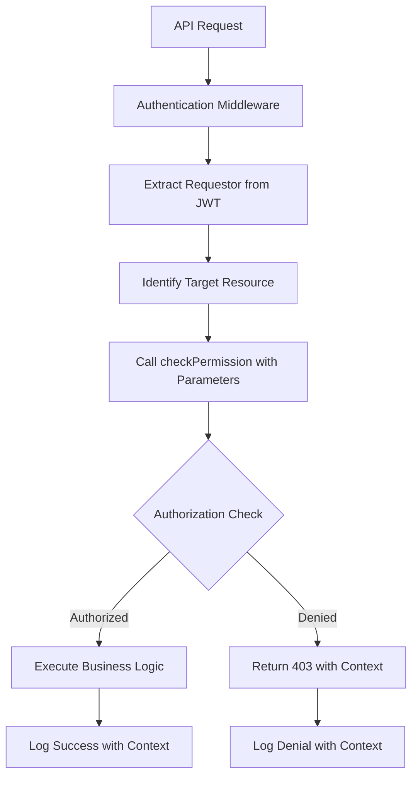

# Parameter-Based Authorization System Documentation

## 🛡️ **MANDATORY SECURITY ARCHITECTURE - AI-HRMS-2025**

**Version:** 1.0
**Last Updated:** 2025-09-18
**Status:** PRODUCTION STANDARD

---

## 🚨 **CRITICAL PRINCIPLE**

> **NO REQUESTOR SHALL BE HARDCODED. ALL AUTHORIZATION DECISIONS MUST BE PARAMETER-DRIVEN.**

Every function, route, and service that requires permission checking MUST follow the parameter-based authorization pattern where:
1. **Requestor** is passed as a parameter
2. **Target** resource/user is passed as a parameter
3. **Permission verification** is performed dynamically
4. **Authorization context** is fully logged

---

## 📋 **Table of Contents**

1. [Core Architecture](#core-architecture)
2. [Authorization Service API](#authorization-service-api)
3. [Implementation Patterns](#implementation-patterns)
4. [Permission Levels](#permission-levels)
5. [Route Implementation](#route-implementation)
6. [Service Layer Integration](#service-layer-integration)
7. [Testing Guidelines](#testing-guidelines)
8. [Migration Strategy](#migration-strategy)
9. [Security Compliance](#security-compliance)

---

## 🏗️ **Core Architecture**

### **Authorization Flow**


### **Parameter-Based Function Signature**
```javascript
async function checkPermission(
    requestor,    // User object making the request
    resource,     // Resource type ('user-folder', 'leave-request', etc.)
    action,       // Action type ('read', 'write', 'delete', 'admin')
    target,       // Target resource/user (optional)
    options       // Additional context (crossTenant, etc.)
)
```

---

## 🔧 **Authorization Service API**

### **Core Functions**

#### **1. checkPermission()**
Primary authorization function for all permission checks.

```javascript
const authResult = await checkPermission(
    req.user,           // Requestor (never hardcoded)
    'user-folder',      // Resource type
    'read',            // Action
    targetUser,        // Target (parameter)
    {                  // Options
        crossTenant: targetUser.tenant_id !== req.user.tenant_id,
        format: req.query.format
    }
);
```

**Returns:**
```javascript
{
    authorized: boolean,
    permissionLevel: number,
    requiredLevel: number,
    reason: string,
    context: object,
    bypass?: boolean    // For SysAdmin
}
```

#### **2. requirePermission() Middleware**
Route-level authorization middleware factory.

```javascript
router.get('/protected-route',
    authenticateToken,
    requirePermission('resource-type', 'action'),
    async (req, res) => {
        // Business logic here
        // req.authContext contains authorization details
    }
);
```

#### **3. getTargetUser()**
Helper function to resolve target users for authorization context.

```javascript
const targetUser = await getTargetUser(email, 'email');
```

---

## 🎯 **Implementation Patterns**

### **❌ WRONG - Hardcoded Authorization**
```javascript
// NEVER DO THIS - Hardcoded requestor checks
if (req.user.role === 'hr' || req.user.role === 'admin') {
    // Business logic
}

// NEVER DO THIS - Direct role comparison
if (requestorRole === 'manager' && targetEmail === managerEmail) {
    // Business logic
}
```

### **✅ CORRECT - Parameter-Based Authorization**
```javascript
// Correct pattern - All parameters passed explicitly
const authResult = await checkPermission(
    requestor,        // Parameter - never hardcoded
    resourceType,     // Parameter - dynamic resource
    actionType,       // Parameter - specific action
    targetResource,   // Parameter - target context
    options          // Parameter - additional context
);

if (authResult.authorized) {
    // Business logic with full audit trail
    logger.info('Action authorized', {
        requestorId: requestor.id,
        resource: resourceType,
        action: actionType,
        reason: authResult.reason,
        context: authResult.context
    });
} else {
    // Denial with detailed context
    return res.status(403).json({
        error: 'Access denied',
        reason: authResult.reason,
        permissionLevel: authResult.permissionLevel,
        requiredLevel: authResult.requiredLevel
    });
}
```

---

## 📊 **Permission Levels**

### **Hierarchical Permission System**
```javascript
const PERMISSION_LEVELS = {
    NONE: 0,
    READ_OWN: 1,           // Can read own data
    READ_TEAM: 2,          // Can read team member data
    READ_DEPARTMENT: 3,    // Can read department data
    READ_ORGANIZATION: 4,  // Can read organization data
    READ_ALL: 5,           // Can read cross-organization
    WRITE_OWN: 10,         // Can modify own data
    WRITE_TEAM: 20,        // Can modify team data
    WRITE_DEPARTMENT: 30,  // Can modify department data
    WRITE_ORGANIZATION: 40,// Can modify organization data
    WRITE_ALL: 50,         // Can modify cross-organization
    ADMIN: 100,            // Administrative privileges
    SYSADMIN: 999          // Universal access
};
```

### **Role-Based Permission Mapping**
```javascript
const ROLE_PERMISSIONS = {
    'employee': {
        'user-folder': PERMISSION_LEVELS.READ_OWN,
        'leave-request': PERMISSION_LEVELS.WRITE_OWN
    },
    'manager': {
        'user-folder': PERMISSION_LEVELS.READ_TEAM,
        'leave-request': PERMISSION_LEVELS.WRITE_TEAM,
        'performance': PERMISSION_LEVELS.READ_TEAM
    },
    'hr': {
        'user-folder': PERMISSION_LEVELS.READ_ORGANIZATION,
        'employee-management': PERMISSION_LEVELS.WRITE_ORGANIZATION
    },
    'admin': {
        'user-folder': PERMISSION_LEVELS.READ_ALL,
        'organization-management': PERMISSION_LEVELS.WRITE_ORGANIZATION
    },
    'sysadmin': {
        '*': PERMISSION_LEVELS.SYSADMIN
    }
};
```

---

## 🛣️ **Route Implementation**

### **Standard Route Pattern**
```javascript
/**
 * Standard parameter-based authorization route
 */
router.get('/resource/:id', authenticateToken, async (req, res) => {
    try {
        const requestor = req.user;                    // Extract requestor
        const targetId = req.params.id;               // Get target identifier

        // Resolve target resource
        const targetResource = await getTargetResource(targetId);

        if (!targetResource) {
            return res.status(404).json({
                error: 'Resource not found',
                code: 'RESOURCE_NOT_FOUND'
            });
        }

        // Parameter-based authorization check
        const authResult = await checkPermission(
            requestor,              // Requestor parameter
            'resource-type',        // Resource parameter
            'read',                // Action parameter
            targetResource,        // Target parameter
            {                      // Options parameter
                crossTenant: targetResource.tenant_id !== requestor.tenant_id
            }
        );

        if (!authResult.authorized) {
            logger.warn('Access denied', {
                requestorId: requestor.id,
                targetId: targetId,
                reason: authResult.reason
            });

            return res.status(403).json({
                error: 'Access denied',
                code: 'INSUFFICIENT_PERMISSIONS',
                reason: authResult.reason
            });
        }

        // Log authorized access
        logger.info('Resource access authorized', {
            requestorId: requestor.id,
            targetId: targetId,
            authReason: authResult.reason,
            permissionLevel: authResult.permissionLevel
        });

        // Execute business logic
        const result = await executeBusinessLogic(targetResource);

        res.json({
            success: true,
            data: result,
            authContext: authResult.context
        });

    } catch (error) {
        logger.error('Route error', { error: error.message });
        res.status(500).json({
            error: 'Internal server error',
            code: 'INTERNAL_ERROR'
        });
    }
});
```

### **Middleware-Based Pattern**
```javascript
/**
 * Using middleware for common authorization patterns
 */
router.get('/user-folder/:email',
    authenticateToken,
    async (req, res, next) => {
        // Resolve target user for authorization context
        req.targetUser = await getTargetUser(req.params.email, 'email');
        next();
    },
    requirePermission('user-folder', 'read'),
    async (req, res) => {
        // Business logic - authorization already verified
        const userFolder = await generateUserFolder(req.params.email);
        res.json(userFolder);
    }
);
```

---

## 🔧 **Service Layer Integration**

### **Service Function Pattern**
```javascript
/**
 * Service functions must accept requestor as parameter
 */
class UserService {
    /**
     * ✅ CORRECT - Parameter-based service method
     */
    async getUserProfile(requestor, targetUserId, options = {}) {
        // Authorization check within service
        const authResult = await checkPermission(
            requestor,
            'user-profile',
            'read',
            { id: targetUserId },
            options
        );

        if (!authResult.authorized) {
            throw new UnauthorizedError(authResult.reason);
        }

        // Service logic
        return await this.fetchUserProfile(targetUserId);
    }

    /**
     * ❌ WRONG - No requestor parameter
     */
    async getBadUserProfile(targetUserId) {
        // No way to verify who is requesting
        return await this.fetchUserProfile(targetUserId);
    }
}
```

### **Database Query Services**
```javascript
/**
 * Database services with authorization context
 */
class DatabaseService {
    async getUserData(requestor, targetEmail, includeFields = []) {
        // Verify permission for specific fields
        const authResult = await checkPermission(
            requestor,
            'user-data',
            'read',
            { email: targetEmail },
            { fields: includeFields }
        );

        if (!authResult.authorized) {
            throw new UnauthorizedError('Cannot access user data');
        }

        // Filter fields based on permission level
        const allowedFields = this.filterFieldsByPermission(
            includeFields,
            authResult.permissionLevel
        );

        return await this.queryUserData(targetEmail, allowedFields);
    }
}
```

---

## 🧪 **Testing Guidelines**

### **Authorization Test Patterns**
```javascript
describe('Parameter-Based Authorization', () => {
    describe('checkPermission function', () => {
        test('should authorize SysAdmin for any resource', async () => {
            const requestor = { role: 'sysadmin', isSysAdmin: () => true };
            const result = await checkPermission(
                requestor,
                'user-folder',
                'read',
                { id: 'target-user-id' }
            );

            expect(result.authorized).toBe(true);
            expect(result.permissionLevel).toBe(PERMISSION_LEVELS.SYSADMIN);
            expect(result.reason).toBe('SysAdmin universal access');
        });

        test('should deny access for insufficient permissions', async () => {
            const requestor = { role: 'employee', id: 'user1' };
            const target = { id: 'user2', email: 'other@company.com' };

            const result = await checkPermission(
                requestor,
                'user-folder',
                'read',
                target
            );

            expect(result.authorized).toBe(false);
            expect(result.reason).toContain('Insufficient permission level');
        });

        test('should allow self-access', async () => {
            const requestor = { role: 'employee', id: 'user1', email: 'user@company.com' };
            const target = { id: 'user1', email: 'user@company.com' };

            const result = await checkPermission(
                requestor,
                'user-folder',
                'read',
                target
            );

            expect(result.authorized).toBe(true);
            expect(result.reason).toBe('Self-access to own data');
        });
    });

    describe('Route authorization', () => {
        test('should reject requests without proper authorization', async () => {
            const response = await request(app)
                .get('/api/reports/user-folder/other@company.com')
                .set('Authorization', `Bearer ${employeeToken}`)
                .expect(403);

            expect(response.body.reason).toContain('Insufficient permission');
        });
    });
});
```

---

## 🔄 **Migration Strategy**

### **Phase 1: Core Service Implementation**
1. ✅ Create `authorizationService.js`
2. ✅ Update report routes with parameter-based auth
3. 🔄 Update leave management routes
4. ⏳ Update organization routes
5. ⏳ Update employee management routes

### **Phase 2: Service Layer Refactoring**
1. Update all service methods to accept `requestor` parameter
2. Add authorization checks to service methods
3. Remove hardcoded permission checks

### **Phase 3: Testing & Validation**
1. Add comprehensive authorization tests
2. Validate all permission scenarios
3. Performance testing for authorization overhead

### **Phase 4: Documentation & Training**
1. Complete documentation updates
2. Code review guidelines
3. Development team training

---

## 🔍 **Security Compliance**

### **Audit Requirements**
Every authorization decision MUST be logged with:
```javascript
{
    timestamp: ISO8601,
    requestorId: UUID,
    requestorEmail: string,
    requestorRole: string,
    resource: string,
    action: string,
    targetId: UUID,
    targetEmail: string,
    authorized: boolean,
    reason: string,
    permissionLevel: number,
    requiredLevel: number,
    context: object
}
```

### **Compliance Checklist**
- [ ] No hardcoded requestor checks
- [ ] All functions accept requestor as parameter
- [ ] Authorization context fully logged
- [ ] Permission levels properly enforced
- [ ] Cross-tenant access controlled
- [ ] Error messages don't leak sensitive data
- [ ] Authorization decisions are auditable

---

## 📚 **Code Examples**

### **Example 1: Leave Request Authorization**
```javascript
// Before (hardcoded)
if (req.user.role === 'hr' || req.user.role === 'manager') {
    // Approve leave
}

// After (parameter-based)
const authResult = await checkPermission(
    req.user,              // Requestor parameter
    'leave-request',       // Resource parameter
    'approve',            // Action parameter
    leaveRequest,         // Target parameter
    { urgency: 'normal' } // Options parameter
);
```

### **Example 2: Employee Data Access**
```javascript
// Before (hardcoded)
if (requestorEmail === targetEmail || requestorRole === 'hr') {
    // Return employee data
}

// After (parameter-based)
const authResult = await checkPermission(
    requestor,            // Parameter
    'employee-data',      // Parameter
    'read',              // Parameter
    targetEmployee,      // Parameter
    { fields: requestedFields } // Parameter
);
```

---

## ⚠️ **CRITICAL VIOLATIONS**

### **NEVER DO - Hardcoded Examples**
```javascript
// ❌ Hardcoded role checks
if (user.role === 'admin') { }

// ❌ Hardcoded email comparisons
if (req.user.email === target.email) { }

// ❌ Direct permission assignments
const canAccess = req.user.role === 'hr';

// ❌ Static authorization logic
function checkAccess() {
    return req.user.isAdmin;
}
```

### **ALWAYS DO - Parameter-Based Examples**
```javascript
// ✅ Parameter-based authorization
const authResult = await checkPermission(requestor, resource, action, target, options);

// ✅ Service with requestor parameter
await userService.getData(requestor, targetId, options);

// ✅ Logged authorization decisions
logger.info('Authorization granted', { requestor, target, reason });
```

---

## 🎯 **Implementation Checklist**

### **For Every Route:**
- [ ] Requestor extracted from `req.user`
- [ ] Target resource identified from parameters
- [ ] `checkPermission()` called with all parameters
- [ ] Authorization result properly handled
- [ ] Success/failure logged with context
- [ ] Error responses include appropriate detail level

### **For Every Service Method:**
- [ ] Accepts `requestor` as first parameter
- [ ] Performs authorization check
- [ ] Logs authorization decisions
- [ ] Returns appropriate errors for unauthorized access

### **For Every Permission Check:**
- [ ] No hardcoded roles or emails
- [ ] All context passed as parameters
- [ ] Proper permission levels used
- [ ] Cross-tenant access considered
- [ ] Audit trail created

---

## 📞 **Support & Contact**

**Security Team:** security@ai-hrms-2025.com
**Documentation:** [Authorization Wiki](link)
**Issues:** [GitHub Issues](link)

---

*This document is part of the AI-HRMS-2025 security architecture. Any violation of these patterns requires immediate security review and remediation.*