```mermaid
graph TD
    Board[Board of Directors]
    CEO[Maria Bianchi<br/>Chief Executive Officer<br/>□ Team: 0]
    HR[Giulia Marchetti<br/>HR Manager<br/>○ Team: 12]
    Risk[Paolo Ferrari<br/>Risk Manager<br/>▲ Assessments: 45]

    Board --> CEO
    CEO --> HR
    CEO --> Risk
```

# USER STATUS REPORT STANDARD GUIDE
## Complete Technical Documentation for Current User Status Full Report Generation

---

## 1. REPORT STRUCTURE - 6-BLOCK TAG HIERARCHY

### Complete Tag Mapping - 19 Consolidated Sections in 6-Block Organization

**BLOCK STRUCTURE: A⚡ B○ C▤ D⚙ E▦ F◊**

```
TAG_REPORT_ROOT
├── TAG_EXECUTIVE_SUMMARY
│   ├── TAG_EXECUTIVE_SUMMARY_HEADER
│   ├── TAG_EXECUTIVE_SUMMARY_DATE
│   ├── TAG_EXECUTIVE_SUMMARY_SUBJECT
│   ├── TAG_EXECUTIVE_SUMMARY_POSITION
│   ├── TAG_EXECUTIVE_SUMMARY_ORGANIZATION
│   └── TAG_EXECUTIVE_SUMMARY_COMPLETENESS
│
├── TAG_CORE_USER_INFO
│   ├── TAG_CORE_USER_INFO_TABLE
│   │   ├── TAG_CORE_USER_INFO_ID
│   │   ├── TAG_CORE_USER_INFO_NAME
│   │   ├── TAG_CORE_USER_INFO_EMAIL
│   │   ├── TAG_CORE_USER_INFO_ROLE
│   │   ├── TAG_CORE_USER_INFO_STATUS
│   │   ├── TAG_CORE_USER_INFO_EMPLOYMENT
│   │   ├── TAG_CORE_USER_INFO_CREATED
│   │   └── TAG_CORE_USER_INFO_UPDATED
│   └── TAG_CORE_USER_INFO_SECURITY
│       ├── TAG_CORE_USER_INFO_SECURITY_PASSWORD
│       ├── TAG_CORE_USER_INFO_SECURITY_2FA
│       ├── TAG_CORE_USER_INFO_SECURITY_LOGIN
│       └── TAG_CORE_USER_INFO_SECURITY_ATTEMPTS
│
├── TAG_ORGANIZATION_EMPLOYMENT
│   ├── TAG_ORGANIZATION_EMPLOYMENT_COMPANY
│   │   ├── TAG_ORGANIZATION_EMPLOYMENT_COMPANY_NAME
│   │   ├── TAG_ORGANIZATION_EMPLOYMENT_COMPANY_INDUSTRY
│   │   ├── TAG_ORGANIZATION_EMPLOYMENT_COMPANY_SIZE
│   │   ├── TAG_ORGANIZATION_EMPLOYMENT_COMPANY_LOCATION
│   │   └── TAG_ORGANIZATION_EMPLOYMENT_COMPANY_DOMAIN
│   └── TAG_ORGANIZATION_EMPLOYMENT_PROFILE
│       ├── TAG_ORGANIZATION_EMPLOYMENT_PROFILE_POSITION
│       ├── TAG_ORGANIZATION_EMPLOYMENT_PROFILE_DEPARTMENT
│       ├── TAG_ORGANIZATION_EMPLOYMENT_PROFILE_START
│       ├── TAG_ORGANIZATION_EMPLOYMENT_PROFILE_TYPE
│       ├── TAG_ORGANIZATION_EMPLOYMENT_PROFILE_MODE
│       └── TAG_ORGANIZATION_EMPLOYMENT_PROFILE_REPORTS
│
├── TAG_COMPENSATION_BENEFITS
│   ├── TAG_COMPENSATION_BENEFITS_PACKAGE
│   │   ├── TAG_COMPENSATION_BENEFITS_PACKAGE_BASE
│   │   ├── TAG_COMPENSATION_BENEFITS_PACKAGE_BONUS
│   │   └── TAG_COMPENSATION_BENEFITS_PACKAGE_TOTAL
│   └── TAG_COMPENSATION_BENEFITS_PERKS
│       ├── TAG_COMPENSATION_BENEFITS_PERKS_HEALTH
│       ├── TAG_COMPENSATION_BENEFITS_PERKS_RETIREMENT
│       ├── TAG_COMPENSATION_BENEFITS_PERKS_CAR
│       ├── TAG_COMPENSATION_BENEFITS_PERKS_PHONE
│       ├── TAG_COMPENSATION_BENEFITS_PERKS_VACATION
│       └── TAG_COMPENSATION_BENEFITS_PERKS_SICK
│
├── TAG_LEAVE_MANAGEMENT
│   ├── TAG_LEAVE_MANAGEMENT_BALANCES
│   │   ├── TAG_LEAVE_MANAGEMENT_BALANCES_VACATION
│   │   ├── TAG_LEAVE_MANAGEMENT_BALANCES_SICK
│   │   └── TAG_LEAVE_MANAGEMENT_BALANCES_TOTAL
│   ├── TAG_LEAVE_MANAGEMENT_VISUALIZATION
│   │   └── TAG_LEAVE_MANAGEMENT_VISUALIZATION_PIE
│   ├── TAG_LEAVE_MANAGEMENT_ANALYTICS
│   │   └── TAG_LEAVE_MANAGEMENT_ANALYTICS_CHART
│   └── TAG_LEAVE_MANAGEMENT_HISTORY
│
├── TAG_ORGANIZATIONAL_HIERARCHY
│   ├── TAG_ORGANIZATIONAL_HIERARCHY_STRUCTURE
│   │   └── TAG_ORGANIZATIONAL_HIERARCHY_STRUCTURE_DIAGRAM
│   └── TAG_ORGANIZATIONAL_HIERARCHY_METRICS
│       ├── TAG_ORGANIZATIONAL_HIERARCHY_METRICS_REPORTS
│       ├── TAG_ORGANIZATIONAL_HIERARCHY_METRICS_SIZE
│       └── TAG_ORGANIZATIONAL_HIERARCHY_METRICS_SPAN
│
├── TAG_SKILLS_COMPETENCIES
│   ├── TAG_SKILLS_COMPETENCIES_CORE
│   │   └── TAG_SKILLS_COMPETENCIES_CORE_TABLE
│   ├── TAG_SKILLS_COMPETENCIES_EDUCATION
│   │   └── TAG_SKILLS_COMPETENCIES_EDUCATION_LIST
│   ├── TAG_SKILLS_COMPETENCIES_RADAR
│   │   └── TAG_SKILLS_COMPETENCIES_RADAR_CHART
│   └── TAG_SKILLS_COMPETENCIES_MATRIX
│       └── TAG_SKILLS_COMPETENCIES_MATRIX_TABLE
│
├── TAG_GOALS_PERFORMANCE
│   ├── TAG_GOALS_PERFORMANCE_OBJECTIVES
│   │   └── TAG_GOALS_PERFORMANCE_OBJECTIVES_TABLE
│   └── TAG_GOALS_PERFORMANCE_METRICS
│       ├── TAG_GOALS_PERFORMANCE_METRICS_REVIEW
│       ├── TAG_GOALS_PERFORMANCE_METRICS_RATING
│       └── TAG_GOALS_PERFORMANCE_METRICS_NEXT
│
├── TAG_SYSTEM_ACCESS
│   ├── TAG_SYSTEM_ACCESS_RIGHTS
│   │   └── TAG_SYSTEM_ACCESS_RIGHTS_TABLE
│   └── TAG_SYSTEM_ACCESS_COMPLIANCE
│       ├── TAG_SYSTEM_ACCESS_COMPLIANCE_GDPR
│       ├── TAG_SYSTEM_ACCESS_COMPLIANCE_RETENTION
│       ├── TAG_SYSTEM_ACCESS_COMPLIANCE_AUDIT
│       └── TAG_SYSTEM_ACCESS_COMPLIANCE_IP
│
├── TAG_TRAINING_DEVELOPMENT
│   ├── TAG_TRAINING_DEVELOPMENT_CERTIFICATIONS
│   │   └── TAG_TRAINING_DEVELOPMENT_CERTIFICATIONS_TABLE
│   ├── TAG_TRAINING_DEVELOPMENT_COMPLIANCE
│   │   └── TAG_TRAINING_DEVELOPMENT_COMPLIANCE_TABLE
│   └── TAG_TRAINING_DEVELOPMENT_PLAN
│       └── TAG_TRAINING_DEVELOPMENT_PLAN_TABLE
│
├── TAG_PROJECT_ASSIGNMENTS
│   ├── TAG_PROJECT_ASSIGNMENTS_ACTIVE
│   │   └── TAG_PROJECT_ASSIGNMENTS_ACTIVE_TABLE
│   ├── TAG_PROJECT_ASSIGNMENTS_STATISTICS
│   │   └── TAG_PROJECT_ASSIGNMENTS_STATISTICS_TABLE
│   └── TAG_PROJECT_ASSIGNMENTS_PORTFOLIO
│       └── TAG_PROJECT_ASSIGNMENTS_PORTFOLIO_CHART
│
├── TAG_EMERGENCY_CONTACTS
│   ├── TAG_EMERGENCY_CONTACTS_INFO
│   │   └── TAG_EMERGENCY_CONTACTS_INFO_TABLE
│   └── TAG_EMERGENCY_CONTACTS_MEDICAL
│       └── TAG_EMERGENCY_CONTACTS_MEDICAL_TABLE
│
├── TAG_COMMUNICATION_CONTACT
│   ├── TAG_COMMUNICATION_CONTACT_INFO
│   │   └── TAG_COMMUNICATION_CONTACT_INFO_TABLE
│   ├── TAG_COMMUNICATION_CONTACT_TOOLS
│   │   └── TAG_COMMUNICATION_CONTACT_TOOLS_LIST
│   └── TAG_COMMUNICATION_CONTACT_PREFERENCES
│       └── TAG_COMMUNICATION_CONTACT_PREFERENCES_LIST
│
├── TAG_DOCUMENTS_COMPLIANCE
│   ├── TAG_DOCUMENTS_COMPLIANCE_EMPLOYMENT
│   │   └── TAG_DOCUMENTS_COMPLIANCE_EMPLOYMENT_TABLE
│   └── TAG_DOCUMENTS_COMPLIANCE_PERSONAL
│       └── TAG_DOCUMENTS_COMPLIANCE_PERSONAL_TABLE
│
├── TAG_DATA_RELATIONSHIPS
│   └── TAG_DATA_RELATIONSHIPS_ARCHITECTURE
│       └── TAG_DATA_RELATIONSHIPS_ARCHITECTURE_DIAGRAM
│
├── TAG_AUDIT_TRAIL
│   ├── TAG_AUDIT_TRAIL_LOG
│   │   └── TAG_AUDIT_TRAIL_LOG_TABLE
│   └── TAG_AUDIT_TRAIL_TRACKING
│       ├── TAG_AUDIT_TRAIL_TRACKING_REVIEW
│       ├── TAG_AUDIT_TRAIL_TRACKING_NEXT
│       ├── TAG_AUDIT_TRAIL_TRACKING_CLASS
│       └── TAG_AUDIT_TRAIL_TRACKING_RETENTION
│
├── TAG_PROFILE_COMPLETENESS
│   ├── TAG_PROFILE_COMPLETENESS_OVERALL
│   ├── TAG_PROFILE_COMPLETENESS_PIE
│   │   └── TAG_PROFILE_COMPLETENESS_PIE_CHART
│   ├── TAG_PROFILE_COMPLETENESS_RADAR
│   │   └── TAG_PROFILE_COMPLETENESS_RADAR_CHART
│   ├── TAG_PROFILE_COMPLETENESS_TRENDS
│   │   └── TAG_PROFILE_COMPLETENESS_TRENDS_CHART
│   ├── TAG_PROFILE_COMPLETENESS_SCORECARD
│   │   └── TAG_PROFILE_COMPLETENESS_SCORECARD_TABLE
│   ├── TAG_PROFILE_COMPLETENESS_COMPLETE
│   │   └── TAG_PROFILE_COMPLETENESS_COMPLETE_LIST
│   └── TAG_PROFILE_COMPLETENESS_INCOMPLETE
│       └── TAG_PROFILE_COMPLETENESS_INCOMPLETE_LIST
│
├── TAG_RECOMMENDED_ACTIONS
│   ├── TAG_RECOMMENDED_ACTIONS_IMMEDIATE
│   ├── TAG_RECOMMENDED_ACTIONS_SHORT
│   └── TAG_RECOMMENDED_ACTIONS_LONG
│
├── TAG_DATA_PRIVACY
│   ├── TAG_DATA_PRIVACY_NOTICE
│   ├── TAG_DATA_PRIVACY_DPO
│   ├── TAG_DATA_PRIVACY_DATE
│   └── TAG_DATA_PRIVACY_VERSION
│
└── TAG_EXECUTIVE_DASHBOARD
    ├── TAG_EXECUTIVE_DASHBOARD_KPI
    │   ├── TAG_EXECUTIVE_DASHBOARD_KPI_CHART
    │   └── TAG_EXECUTIVE_DASHBOARD_KPI_TABLE
    ├── TAG_EXECUTIVE_DASHBOARD_OBJECTIVES
    │   ├── TAG_EXECUTIVE_DASHBOARD_OBJECTIVES_GOALS
    │   └── TAG_EXECUTIVE_DASHBOARD_OBJECTIVES_TABLE
    ├── TAG_EXECUTIVE_DASHBOARD_ACTIONS
    │   ├── TAG_EXECUTIVE_DASHBOARD_ACTIONS_IMMEDIATE
    │   └── TAG_EXECUTIVE_DASHBOARD_ACTIONS_STRATEGIC
    ├── TAG_EXECUTIVE_DASHBOARD_ACHIEVEMENTS
    │   └── TAG_EXECUTIVE_DASHBOARD_ACHIEVEMENTS_LIST
    ├── TAG_EXECUTIVE_DASHBOARD_ATTACHMENTS
    │   └── TAG_EXECUTIVE_DASHBOARD_ATTACHMENTS_LIST
    └── TAG_EXECUTIVE_DASHBOARD_SYSTEMS
        └── TAG_EXECUTIVE_DASHBOARD_SYSTEMS_LIST
```

---

## 2. DEPENDENCIES AND CONFIGURATION FILES

| File Name | Type | Purpose | Location |
|-----------|------|---------|----------|
| `userFolderReportService.js` | Service | Main report generation logic | `/src/services/` |
| `database.js` | Config | Database connection | `/config/` |
| `config.json` | Config | Sequelize configuration | `/config/` |
| `User.js` | Model | User data model | `/models/` |
| `Employee.js` | Model | Employee data model | `/models/` |
| `Organization.js` | Model | Organization data model | `/models/` |
| `LeaveRequest.js` | Model | Leave request model | `/models/` |
| `Skill.js` | Model | Skills data model | `/models/` |
| `Project.js` | Model | Project data model | `/models/` |
| `.development/REPORT_SYSTEM_COMPLETE_GUIDE.md` | Guide | Complete report system implementation | `/.development/` |
| `CURRENT_USER_STATUS_REPORT_STANDARD.md` | Documentation | Standard documentation | `/docs/` |

---

## 3. DETAILED TAG SPECIFICATIONS

### TAG_EXECUTIVE_SUMMARY

**Purpose:** Provides high-level overview of the employee profile

**Query:**
```sql
SELECT
    e.id,
    e.first_name || ' ' || e.last_name as full_name,
    e.position,
    o.name as organization,
    ROUND(
        CASE
            WHEN e.phone IS NOT NULL THEN 10 ELSE 0
        END +
        CASE
            WHEN e.emergency_contact IS NOT NULL THEN 10 ELSE 0
        END +
        -- Additional calculations
        80
    ) as profile_completeness
FROM employees e
LEFT JOIN organizations o ON e.organization_id = o.id
WHERE e.id = ?;
```

**Generation Code (userFolderReportService.js):**
```javascript
generateExecutiveSummary(employee) {
    return `### ☐ Executive Summary
**Generated:** ${new Date().toISOString().split('T')[0]}
**Subject:** ${employee.first_name} ${employee.last_name}
**Position:** ${employee.position || 'Not Specified'}
**Organization:** ${employee.Organization?.name || 'Not Specified'}
**Profile Completeness:** ${this.calculateCompleteness(employee)}%`;
}
```

**Format Components:**
- Icon: ☐ (Empty checkbox outline)
- Font: Exo 2, sans-serif
- Text Color: #212121
- Font Size: 16px (title), 14px (content)

---

### TAG_SKILLS_COMPETENCIES_RADAR_CHART

**Purpose:** Visual representation of employee skills compared to industry benchmark

**Mermaid Code:**


**Query:**
```sql
SELECT
    s.name as skill_name,
    es.proficiency_level,
    s.category,
    s.industry_benchmark
FROM employee_skills es
JOIN skills s ON es.skill_id = s.id
WHERE es.employee_id = ?
ORDER BY s.display_order;
```

**Generation Code:**
```javascript
generateSkillsRadar(skills) {
    const axes = skills.map(s => `${s.abbreviation}["${s.name}"]`).join(', ');
    const currentValues = skills.map(s => s.proficiency_level).join(',');
    const benchmarkValues = skills.map(s => s.industry_benchmark).join(',');

    return `\`\`\`mermaid
%%{init: {"theme": "base", "themeVariables": {"primaryColor": "#4CAF50", "primaryTextColor": "#212121", "fontFamily": "Exo 2, sans-serif"}}}%%
radar-beta
  title Skills Competency Assessment - ${this.employeeName}
  showLegend true
  min 0
  max 5
  ticks 5
  graticule polygon

  axis ${axes}

  curve current["Current Level"]{${currentValues}}
  curve target["Industry Benchmark"]{${benchmarkValues}}
\`\`\``;
}
```

**Format Components:**
- Chart Type: radar-beta
- Primary Color: #4CAF50
- Text Color: #212121
- Font Family: Exo 2, sans-serif
- Scale: 0-5
- Ticks: 5
- Graticule: polygon
- Legend: Enabled

---

### TAG_LEAVE_MANAGEMENT_VISUALIZATION_PIE

**Purpose:** Display leave balance distribution

**Mermaid Code:**


**Query:**
```sql
SELECT
    lr.leave_type,
    lr.days_requested,
    lr.status,
    e.vacation_days,
    e.sick_days,
    COALESCE(SUM(CASE WHEN lr.status = 'approved' THEN lr.days_requested ELSE 0 END), 0) as used_days
FROM employees e
LEFT JOIN leave_requests lr ON e.id = lr.employee_id
WHERE e.id = ?
GROUP BY lr.leave_type, e.vacation_days, e.sick_days;
```

**Generation Code:**
```javascript
generateLeaveVisualization(leaveData) {
    return `\`\`\`mermaid
%%{init: {'theme':'base', 'themeVariables': {
    'primaryColor': '#E3F2FD',
    'primaryTextColor': '#212121',
    'primaryBorderColor': '#90CAF9',
    'lineColor': '#FFF3E0',
    'secondaryColor': '#F3E5F5',
    'tertiaryColor': '#E8F5E8',
    'fontFamily': 'Exo 2, sans-serif',
    'pieTitleTextSize': '16px',
    'pieTitleTextColor': '#212121',
    'pieSectionTextSize': '14px',
    'pieSectionTextColor': '#212121',
    'pieOuterStrokeColor': '#BDBDBD',
    'pieStrokeColor': '#FFFFFF'
}}}%%
pie title Leave Balance Overview
    "Vacation Days Available" : ${leaveData.vacationAvailable}
    "Sick Leave Available" : ${leaveData.sickAvailable}
    "Days Already Used" : ${leaveData.usedDays}
\`\`\``;
}
```

**Format Components:**
- Primary Color: #E3F2FD (Pale Blue)
- Secondary Color: #F3E5F5 (Pale Purple)
- Tertiary Color: #E8F5E8 (Pale Green)
- Border Color: #90CAF9
- Stroke Color: #FFFFFF
- Title Size: 16px
- Section Text Size: 14px

---

### TAG_PROFILE_COMPLETENESS_RADAR_CHART

**Purpose:** Visualize profile data completeness across categories

**Mermaid Code:**


**Query:**
```sql
SELECT
    CASE WHEN phone IS NOT NULL THEN 20 ELSE 0 END +
    CASE WHEN address IS NOT NULL THEN 20 ELSE 0 END +
    CASE WHEN date_of_birth IS NOT NULL THEN 20 ELSE 0 END +
    CASE WHEN nationality IS NOT NULL THEN 20 ELSE 0 END +
    CASE WHEN marital_status IS NOT NULL THEN 20 ELSE 0 END as personal_completeness,
    -- Additional completeness calculations
    100 as employment_completeness,
    40 as skills_completeness,
    0 as emergency_completeness,
    60 as performance_completeness,
    90 as documentation_completeness,
    100 as access_completeness
FROM employees
WHERE id = ?;
```

**Generation Code:**
```javascript
generateCompletenessRadar(completenessData) {
    const currentValues = [
        completenessData.personal,
        completenessData.employment,
        completenessData.skills,
        completenessData.emergency,
        completenessData.performance,
        completenessData.documentation,
        completenessData.access
    ].join(',');

    const targetValues = [85, 95, 70, 50, 80, 95, 100].join(',');

    return `\`\`\`mermaid
%%{init: {"theme": "base", "themeVariables": {"primaryColor": "#2196F3", "primaryTextColor": "#212121", "fontFamily": "Exo 2, sans-serif"}}}%%
radar-beta
  title Profile Data Completeness Assessment
  showLegend true
  min 0
  max 100
  ticks 5
  graticule polygon

  axis personal["Personal Info"], employment["Employment"], skills["Skills & Training"], emergency["Emergency Contacts"], performance["Performance"], docs["Documentation"], access["System Access"]

  curve current["Current Completeness"]{${currentValues}}
  curve target["Target Level"]{${targetValues}}
\`\`\``;
}
```

---

### TAG_ORGANIZATIONAL_HIERARCHY_STRUCTURE_DIAGRAM

**Purpose:** Display reporting structure and organizational relationships

**Mermaid Code:**


**Query:**
```sql
WITH RECURSIVE org_tree AS (
    SELECT id, first_name, last_name, position, reports_to, 0 as level
    FROM employees
    WHERE id = ?

    UNION ALL

    SELECT e.id, e.first_name, e.last_name, e.position, e.reports_to, ot.level + 1
    FROM employees e
    JOIN org_tree ot ON e.reports_to = ot.id
    WHERE ot.level < 3
)
SELECT * FROM org_tree ORDER BY level, position;
```

**Generation Code:**
```javascript
generateOrgHierarchy(hierarchyData) {
    let nodes = '';
    let connections = '';

    hierarchyData.forEach(node => {
        nodes += `    ${node.id}[${node.name}<br/>${node.position}<br/>□ Team: ${node.teamSize}]\n`;
        if (node.reportsTo) {
            connections += `    ${node.reportsTo} --> ${node.id}\n`;
        }
    });

    return `\`\`\`mermaid
graph TD
${nodes}
${connections}
\`\`\``;
}
```

---

### TAG_EXECUTIVE_DASHBOARD_KPI_CHART

**Purpose:** Display key performance indicators in visual format

**Mermaid Code:**


**Query:**
```sql
SELECT
    'Skills Mastery' as kpi_name,
    AVG(es.proficiency_level) * 20 as current_value,
    80 as target_value
FROM employee_skills es
WHERE es.employee_id = ?

UNION ALL

SELECT
    'Project Delivery' as kpi_name,
    COUNT(CASE WHEN p.status = 'completed' THEN 1 END) * 100.0 / COUNT(*) as current_value,
    75 as target_value
FROM projects p
WHERE p.assigned_to = ?

-- Additional KPI queries
```

**Generation Code:**
```javascript
generateKPIChart(kpiData) {
    const categories = kpiData.map(k => `"${k.name}"`).join(', ');
    const currentValues = kpiData.map(k => k.current).join(', ');
    const targetValues = kpiData.map(k => k.target).join(', ');

    return `\`\`\`mermaid
%%{init: {'theme':'base', 'themeVariables': {
    'xyChart': {
        'backgroundColor': '#FAFAFA',
        'titleColor': '#212121',
        'xAxisTextColor': '#424242',
        'yAxisTextColor': '#424242',
        'plotColorPalette': '#E3F2FD,#F3E5F5,#E8F5E8,#FFF3E0,#FFE0E6,#E0F2E7'
    },
    'fontFamily': 'Exo 2, sans-serif'
}}}%%
xychart-beta
    title "Executive Performance Scorecard - ${this.employeeName}"
    x-axis [${categories}]
    y-axis "Performance Index" 0 --> 100
    bar [${currentValues}]
    line [${targetValues}]
\`\`\``;
}
```

**Format Components:**
- Background: #FAFAFA
- Title Color: #212121
- Axis Text Color: #424242
- Color Palette: #E3F2FD, #F3E5F5, #E8F5E8, #FFF3E0, #FFE0E6, #E0F2E7
- Font: Exo 2, sans-serif

---

## 4. COMPLETE GENERATION WORKFLOW

### Step 1: Data Collection
```javascript
async generateReport(employeeId) {
    // Fetch employee base data
    const employee = await Employee.findOne({
        where: { id: employeeId },
        include: [
            { model: Organization },
            { model: User },
            { model: LeaveRequest },
            { model: Skill, through: EmployeeSkills },
            { model: Project }
        ]
    });

    // Calculate completeness metrics
    const completeness = this.calculateCompleteness(employee);

    // Generate report sections
    const report = {
        executiveSummary: this.generateExecutiveSummary(employee),
        coreInfo: this.generateCoreInfo(employee),
        organization: this.generateOrganization(employee),
        compensation: this.generateCompensation(employee),
        leave: this.generateLeaveManagement(employee),
        hierarchy: this.generateHierarchy(employee),
        skills: this.generateSkills(employee),
        goals: this.generateGoals(employee),
        access: this.generateAccess(employee),
        training: this.generateTraining(employee),
        projects: this.generateProjects(employee),
        emergency: this.generateEmergency(employee),
        communication: this.generateCommunication(employee),
        documents: this.generateDocuments(employee),
        dataRelations: this.generateDataRelations(),
        audit: this.generateAudit(employee),
        completeness: this.generateCompleteness(completeness),
        actions: this.generateActions(completeness),
        privacy: this.generatePrivacy(),
        dashboard: this.generateDashboard(employee)
    };

    return this.assembleReport(report);
}
```

### Step 2: Template Processing
```javascript
assembleReport(sections) {
    const template = fs.readFileSync('.development/REPORT_SYSTEM_COMPLETE_GUIDE.md', 'utf8');

    let report = template;

    // Replace all placeholders with actual data
    Object.keys(sections).forEach(key => {
        const tagPattern = new RegExp(`\\[${key.toUpperCase()}\\]`, 'g');
        report = report.replace(tagPattern, sections[key]);
    });

    return report;
}
```

### Step 3: Chart Generation
```javascript
generateCharts(data) {
    return {
        skillsRadar: this.generateSkillsRadar(data.skills),
        leaveVisualization: this.generateLeaveVisualization(data.leave),
        completenessRadar: this.generateCompletenessRadar(data.completeness),
        kpiChart: this.generateKPIChart(data.kpi),
        orgHierarchy: this.generateOrgHierarchy(data.hierarchy),
        projectChart: this.generateProjectChart(data.projects)
    };
}
```

---

## 5. FORMATTING SPECIFICATIONS

### Global Styles
```css
/* Base Typography */
--font-family: 'Exo 2', sans-serif;
--base-font-size: 14px;
--title-font-size: 16px;
--subtitle-font-size: 15px;
--small-font-size: 12px;

/* Color Palette - Material Design */
--primary-text: #212121;
--secondary-text: #424242;
--disabled-text: #BDBDBD;

/* Background Colors */
--background-primary: #FAFAFA;
--background-secondary: #F5F5F5;
--background-tertiary: #EEEEEE;

/* Accent Colors - Pale Variants */
--accent-blue: #E3F2FD;
--accent-purple: #F3E5F5;
--accent-green: #E8F5E8;
--accent-yellow: #FFF3E0;
--accent-pink: #FFE0E6;
--accent-mint: #E0F2E7;

/* Status Colors */
--status-success: #4CAF50;
--status-warning: #FFC107;
--status-error: #F44336;
--status-info: #2196F3;

/* Chart Specific */
--chart-primary: #2196F3;
--chart-secondary: #4CAF50;
--chart-tertiary: #FF9800;
--chart-quaternary: #9C27B0;
```

### Icon System
```javascript
const ICONS = {
    // Section Headers
    checkbox_empty: '☐',
    circle_empty: '○',
    diamond_empty: '◇',
    square_empty: '□',
    rectangle_empty: '▢',
    circle_large: '◯',

    // Numbers
    one: '①',
    two: '②',
    three: '③',
    four: '④',
    five: '⑤',
    six: '⑥',
    seven: '⑦',
    eight: '⑧',
    nine: '⑨',
    ten: '⑩',
    eleven: '⑪',
    twelve: '⑫',
    thirteen: '⑬',
    fourteen: '⑭',
    fifteen: '⑮',

    // Status
    check: '◉',
    cross: '◯',
    warning: '▲',

    // Performance
    green_circle: '🟢',
    yellow_circle: '🟡',
    red_circle: '🔴'
};
```

---

## 6. ERROR HANDLING

```javascript
class ReportGenerationError extends Error {
    constructor(tag, message) {
        super(`Error in ${tag}: ${message}`);
        this.tag = tag;
        this.timestamp = new Date();
    }
}

generateReportSection(tag, generatorFn, fallback) {
    try {
        return generatorFn();
    } catch (error) {
        console.error(`Failed to generate ${tag}:`, error);
        return fallback || `[${tag}: Data unavailable]`;
    }
}
```

---

## 7. VALIDATION RULES

```javascript
const VALIDATION_RULES = {
    TAG_EXECUTIVE_SUMMARY_COMPLETENESS: {
        min: 0,
        max: 100,
        type: 'number',
        required: true
    },
    TAG_SKILLS_COMPETENCIES_RADAR_CHART: {
        minValues: 3,
        maxValues: 10,
        valueRange: [0, 5],
        type: 'array',
        required: true
    },
    TAG_PROFILE_COMPLETENESS_RADAR_CHART: {
        categories: 7,
        valueRange: [0, 100],
        type: 'object',
        required: true
    }
};

validateTag(tag, value) {
    const rules = VALIDATION_RULES[tag];
    if (!rules) return true;

    // Apply validation rules
    if (rules.type && typeof value !== rules.type) {
        throw new Error(`Invalid type for ${tag}`);
    }

    if (rules.min !== undefined && value < rules.min) {
        throw new Error(`Value below minimum for ${tag}`);
    }

    if (rules.max !== undefined && value > rules.max) {
        throw new Error(`Value above maximum for ${tag}`);
    }

    return true;
}
```

---

## 8. PERFORMANCE OPTIMIZATION

```javascript
// Cache frequently used queries
const QUERY_CACHE = new Map();

async getCachedQuery(key, queryFn, ttl = 300000) {
    if (QUERY_CACHE.has(key)) {
        const cached = QUERY_CACHE.get(key);
        if (Date.now() - cached.timestamp < ttl) {
            return cached.data;
        }
    }

    const data = await queryFn();
    QUERY_CACHE.set(key, {
        data,
        timestamp: Date.now()
    });

    return data;
}

// Batch database queries
async batchQueries(employeeId) {
    const [
        employee,
        skills,
        projects,
        leave,
        training
    ] = await Promise.all([
        Employee.findByPk(employeeId),
        EmployeeSkills.findAll({ where: { employeeId } }),
        Projects.findAll({ where: { assignedTo: employeeId } }),
        LeaveRequests.findAll({ where: { employeeId } }),
        Training.findAll({ where: { employeeId } })
    ]);

    return { employee, skills, projects, leave, training };
}
```

---

## 9. EXPORT FORMATS

```javascript
class ReportExporter {
    static async exportToPDF(markdown, outputPath) {
        // Convert Markdown to HTML
        const html = marked(markdown);

        // Apply styling
        const styledHtml = `
            <!DOCTYPE html>
            <html>
            <head>
                <link href="https://fonts.googleapis.com/css2?family=Exo+2:wght@300;400;500;700&display=swap" rel="stylesheet">
                <style>
                    body {
                        font-family: 'Exo 2', sans-serif;
                        color: #212121;
                        line-height: 1.6;
                    }
                    /* Additional styles */
                </style>
            </head>
            <body>${html}</body>
            </html>
        `;

        // Generate PDF
        const browser = await puppeteer.launch();
        const page = await browser.newPage();
        await page.setContent(styledHtml);
        await page.pdf({
            path: outputPath,
            format: 'A4',
            margin: { top: '1in', bottom: '1in', left: '0.75in', right: '0.75in' }
        });
        await browser.close();
    }

    static async exportToJSON(reportData) {
        const json = {
            metadata: {
                version: '1.0',
                generated: new Date().toISOString(),
                type: 'CURRENT_USER_STATUS_FULL_REPORT'
            },
            data: reportData
        };

        return JSON.stringify(json, null, 2);
    }
}
```

---

## 10. TESTING FRAMEWORK

```javascript
describe('Report Generation Tests', () => {
    describe('TAG_EXECUTIVE_SUMMARY', () => {
        it('should generate valid executive summary', async () => {
            const employee = mockEmployeeData();
            const summary = generateExecutiveSummary(employee);

            expect(summary).toContain('Executive Summary');
            expect(summary).toContain(employee.first_name);
            expect(summary).toMatch(/Profile Completeness: \d+%/);
        });
    });

    describe('TAG_SKILLS_COMPETENCIES_RADAR_CHART', () => {
        it('should generate valid radar chart syntax', () => {
            const skills = mockSkillsData();
            const chart = generateSkillsRadar(skills);

            expect(chart).toContain('radar-beta');
            expect(chart).toContain('showLegend true');
            expect(chart).toContain('curve current');
            expect(chart).toContain('curve target');
        });
    });
});
```

---

## APPENDIX A: SAMPLE DATA STRUCTURES

```javascript
// Employee Data Structure
const employeeDataStructure = {
    id: 'uuid',
    first_name: 'string',
    last_name: 'string',
    email: 'string',
    position: 'string',
    department: 'string',
    organization_id: 'uuid',
    reports_to: 'uuid',
    start_date: 'date',
    employment_type: 'enum',
    work_mode: 'enum',
    salary: 'number',
    bonus_percentage: 'number',
    vacation_days: 'number',
    sick_days: 'number',
    phone: 'string',
    address: 'string',
    emergency_contact: 'string',
    created_at: 'timestamp',
    updated_at: 'timestamp'
};

// Skills Data Structure
const skillsDataStructure = {
    skill_id: 'uuid',
    employee_id: 'uuid',
    proficiency_level: 'number', // 1-5
    last_assessed: 'date',
    certified: 'boolean'
};

// Report Output Structure
const reportOutputStructure = {
    TAG_REPORT_ROOT: {
        TAG_EXECUTIVE_SUMMARY: {},
        TAG_CORE_USER_INFO: {},
        TAG_ORGANIZATION_EMPLOYMENT: {},
        TAG_COMPENSATION_BENEFITS: {},
        TAG_LEAVE_MANAGEMENT: {},
        TAG_ORGANIZATIONAL_HIERARCHY: {},
        TAG_SKILLS_COMPETENCIES: {},
        TAG_GOALS_PERFORMANCE: {},
        TAG_SYSTEM_ACCESS: {},
        TAG_TRAINING_DEVELOPMENT: {},
        TAG_PROJECT_ASSIGNMENTS: {},
        TAG_EMERGENCY_CONTACTS: {},
        TAG_COMMUNICATION_CONTACT: {},
        TAG_DOCUMENTS_COMPLIANCE: {},
        TAG_DATA_RELATIONSHIPS: {},
        TAG_AUDIT_TRAIL: {},
        TAG_PROFILE_COMPLETENESS: {},
        TAG_RECOMMENDED_ACTIONS: {},
        TAG_DATA_PRIVACY: {},
        TAG_EXECUTIVE_DASHBOARD: {}
    }
};
```

---

*This guide serves as the complete technical documentation for generating the Current User Status Full Report in the AI-HRMS-2025 system with 6-block architecture and Material Design compliance. Last updated: September 18, 2025*