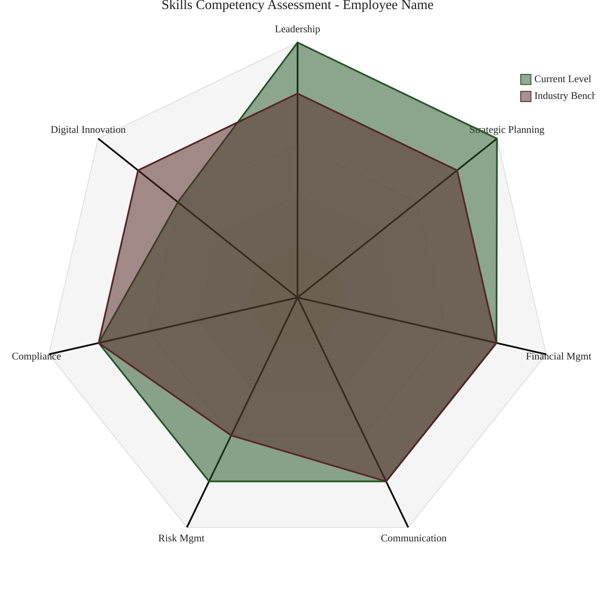
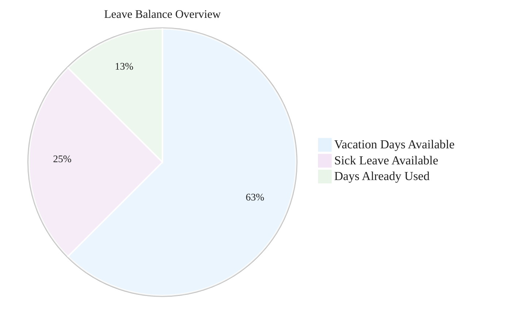
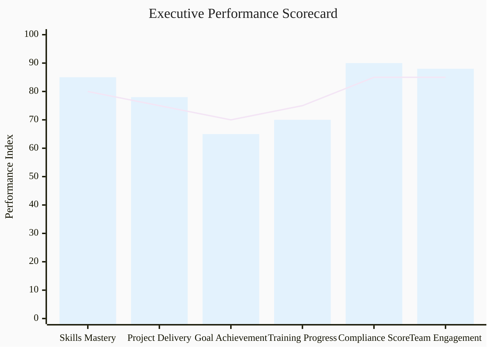

# Mermaid Chart Guidelines - AI-HRMS-2025
## Professional Standards for Report Visualizations

## Overview

This document establishes the mandatory standards for all Mermaid charts within the AI-HRMS-2025 system, ensuring consistent visual presentation, Material Design compliance, and professional appearance across all generated reports.

## Mandatory Configuration Standards

### Base Configuration Template

**ALL MERMAID CHARTS MUST USE THIS CONFIGURATION:**

```yaml
%%{init: {
  'theme': 'base',
  'themeVariables': {
    'fontFamily': 'Exo 2, sans-serif',
    'primaryColor': '#E3F2FD',
    'primaryTextColor': '#212121',
    'primaryBorderColor': '#90CAF9',
    'lineColor': '#FFF3E0',
    'secondaryColor': '#F3E5F5',
    'tertiaryColor': '#E8F5E8'
  }
}}%%
```

### Chart-Specific Configurations

#### 1. Pie Charts

```yaml
%%{init: {
  'theme': 'base',
  'themeVariables': {
    'primaryColor': '#E3F2FD',
    'primaryTextColor': '#212121',
    'primaryBorderColor': '#90CAF9',
    'lineColor': '#FFF3E0',
    'secondaryColor': '#F3E5F5',
    'tertiaryColor': '#E8F5E8',
    'fontFamily': 'Exo 2, sans-serif',
    'pieTitleTextSize': '16px',
    'pieTitleTextColor': '#212121',
    'pieSectionTextSize': '14px',
    'pieSectionTextColor': '#212121',
    'pieOuterStrokeColor': '#BDBDBD',
    'pieStrokeColor': '#FFFFFF'
  }
}}%%
pie title Chart Title Here
    "Section 1" : 45.5
    "Section 2" : 34.2
    "Section 3" : 20.3
```

#### 2. Radar Charts (radar-beta)

```yaml
%%{init: {
  'theme': 'base',
  'themeVariables': {
    'primaryColor': '#4CAF50',
    'primaryTextColor': '#212121',
    'fontFamily': 'Exo 2, sans-serif'
  }
}}%%
radar-beta
  title Chart Title Here
  showLegend true
  min 0
  max 5
  ticks 5
  graticule polygon

  axis axis1["Label 1"], axis2["Label 2"], axis3["Label 3"]

  curve current["Current Level"]{3,4,2}
  curve target["Target Level"]{4,4,3}
```

#### 3. XY Bar Charts (xychart-beta)

```yaml
%%{init: {
  'theme': 'base',
  'themeVariables': {
    'xyChart': {
      'backgroundColor': '#FAFAFA',
      'titleColor': '#212121',
      'xAxisTextColor': '#424242',
      'yAxisTextColor': '#424242',
      'plotColorPalette': '#E3F2FD,#F3E5F5,#E8F5E8,#FFF3E0,#FFE0E6,#E0F2E7'
    },
    'fontFamily': 'Exo 2, sans-serif'
  }
}}%%
xychart-beta
    title "Chart Title Here"
    x-axis ["Category 1", "Category 2", "Category 3"]
    y-axis "Value Label" 0 --> 100
    bar [45, 67, 23]
    line [50, 60, 30]
```

#### 4. Flowcharts and Diagrams

```yaml
%%{init: {
  'theme': 'base',
  'themeVariables': {
    'primaryColor': '#212121',
    'primaryTextColor': '#212121',
    'primaryBorderColor': '#424242',
    'lineColor': '#616161',
    'secondaryColor': '#424242',
    'tertiaryColor': '#BDBDBD',
    'fontFamily': 'Exo 2, sans-serif',
    'fontSize': '14px'
  }
}}%%
graph TD
    A[Node A] --> B[Node B]
    B --> C[Node C]
```

## Color Palette Standards

### Primary Colors
```css
--primary-blue: #E3F2FD         /* Background primary */
--primary-green: #4CAF50        /* Success/positive */
--primary-text: #212121         /* Text primary */
```

### Secondary Colors
```css
--secondary-blue: #2196F3       /* Accent blue */
--secondary-purple: #F3E5F5     /* Background secondary */
--secondary-orange: #FF9800     /* Warning/attention */
```

### Extended Palette for Multi-Series Charts
```css
--chart-1: #E3F2FD  /* Pale blue */
--chart-2: #F3E5F5  /* Pale purple */
--chart-3: #E8F5E8  /* Pale green */
--chart-4: #FFF3E0  /* Pale orange */
--chart-5: #FFE0E6  /* Pale pink */
--chart-6: #E0F2E7  /* Pale mint */
```

## Chart Type Guidelines

### When to Use Each Chart Type

#### Pie Charts
- **Use for:** Percentage distributions, completion ratios
- **Max segments:** 6 segments maximum
- **Labels:** Include percentage values
- **Example:** Leave balance distribution, profile completeness

#### Radar Charts
- **Use for:** Multi-dimensional comparisons, skill assessments
- **Max axes:** 8 axes maximum
- **Scale:** 0-5 for skills, 0-100 for percentages
- **Legend:** Always show legend for multiple curves

#### XY Bar Charts
- **Use for:** Trend analysis, performance metrics, KPI tracking
- **Categories:** 3-8 categories maximum
- **Colors:** Use sequential colors from palette
- **Overlay:** Line charts for targets/benchmarks

#### Flowcharts
- **Use for:** Process flows, hierarchies, system architecture
- **Nodes:** Keep text concise (max 3 lines)
- **Styling:** Use CSS classes for consistent appearance

## Typography Standards

### Font Requirements
- **Primary Font:** Exo 2, sans-serif (mandatory)
- **Fallback:** sans-serif
- **Size Guidelines:**
  - Titles: 16px
  - Body text: 14px
  - Small text: 12px

### Text Formatting
```yaml
'pieTitleTextSize': '16px'
'pieSectionTextSize': '14px'
'fontSize': '14px'
```

## Material Design Compliance

### Icon Usage in Charts
- **Use only:** Material Design outline icons
- **Forbidden:** Colored emojis, custom icons
- **Examples:**
  - ⚡ (bolt outline) for performance
  - ○ (person outline) for users
  - ▦ (assessment outline) for analytics

### Status Indicators
```yaml
STATUS_COMPLETE: "◉"      # Success/Complete
STATUS_PENDING: "◯"       # Pending/Missing
STATUS_WARNING: "▲"       # Warning/Attention
STATUS_INFO: "◐"          # Information/In Progress
```

## Chart Quality Standards

### Data Visualization Best Practices

#### 1. Data Integrity
- Round percentages to 1 decimal place
- Ensure pie chart segments sum to 100%
- Use consistent scales across similar charts
- Validate data ranges before rendering

#### 2. Accessibility
- Maintain sufficient color contrast (WCAG 2.1 AA)
- Provide text alternatives for chart data
- Use patterns/textures when color alone conveys information

#### 3. Performance
- Limit chart complexity to ensure fast rendering
- Use appropriate data aggregation for large datasets
- Consider chart size and mobile responsiveness

## Implementation Examples

### Complete Skill Assessment Radar


### Leave Balance Distribution


### KPI Performance Dashboard


## Validation & Testing

### Pre-Deployment Checklist
- [ ] Exo 2 font family specified in configuration
- [ ] Color palette matches Material Design standards
- [ ] No emoji violations or non-standard icons
- [ ] Chart renders correctly in target environments
- [ ] Text size and contrast meet accessibility standards
- [ ] Data values are accurate and properly formatted

### Testing Environments
- **Markdown Renderers:** GitHub, GitLab, VS Code
- **Report Viewers:** Browser-based report interfaces
- **Export Formats:** PDF, HTML static exports

## Error Handling

### Common Issues & Solutions

| Issue | Cause | Solution |
|-------|-------|----------|
| Font not rendering | Missing font specification | Add 'fontFamily': 'Exo 2, sans-serif' |
| Colors inconsistent | Wrong color values | Use approved color palette |
| Chart not displaying | Syntax errors | Validate Mermaid syntax |
| Poor readability | Wrong contrast | Adjust to WCAG standards |

### Fallback Strategies
- Provide table format as backup for complex charts
- Use simplified chart versions for mobile/small screens
- Include text descriptions for accessibility

## Maintenance & Updates

### Version Control
- Document any chart template changes
- Test updates across all chart types
- Maintain backwards compatibility where possible

### Review Schedule
- **Monthly:** Color palette compliance check
- **Quarterly:** Font and typography review
- **Annually:** Full standard revision

---

**Version:** 1.0
**Last Updated:** September 18, 2025
**Compliance Status:** ◉ Material Design Compliant
**Next Review:** December 18, 2025

---

*This document establishes the mandatory standards for all Mermaid charts in the AI-HRMS-2025 system. Adherence to these guidelines ensures professional, consistent, and accessible data visualizations across all reports and interfaces.*