<div style="color: #2E5893;">

# Maria Bianchi - Complete Outlook

</div>

## AI-HRMS-2025 System

---

### ☐ Executive Summary
**Generated:** September 18, 2025
**Subject:** Maria Bianchi
**Position:** Chief Executive Officer
**Organization:** BankNova
**Profile Completeness:** 53%

---

## ① Core User Information

| Field | Value |
|-------|-------|
| **User ID** | `3a79bcfa-398d-4257-a9c5-5a8fdfa5774d` |
| **Full Name** | Maria Bianchi |
| **Email** | ceo@banknova.org |
| **System Role** | admin |
| **Account Status** | ◉ Active |
| **Employment Status** | active |
| **Created** | 2025-09-16T18:36:44.043Z |
| **Last Updated** | 2025-09-16T19:53:52.737Z |

### ☐ Security Information
- **Password:** Custom Password Set
- **2FA Enabled:** No
- **Last Login:** Current Session
- **Failed Attempts:** 0

---

## ② Organization & Employment

### ▢ Company Details
| Field | Value |
|-------|-------|
| **Organization** | BankNova |
| **Industry** | Banking & Finance |
| **Company Size** | large |
| **Location** | IT |
| **Domain** | Not Specified |

### ○ Employment Profile
| Field | Value |
|-------|-------|
| **Position** | Chief Executive Officer |
| **Department** | Executive Office |
| **Start Date** | 2025-09-16 |
| **Employment Type** | Full-time |
| **Work Mode** | Hybrid (2 days/week remote) |
| **Reports To** | Board of Directors |

---

## ③ Compensation & Benefits

### ▣ Compensation Package
```
Base Salary:        €120,000 per annum
Bonus Target:       40% of base (€48,000)
Total Target Comp:  €168,000
```

### ▢ Benefits
- **Health Insurance:** Premium Plan
- **Retirement:** 401k with 6% match
- **Car Allowance:** €1,500/month
- **Phone Allowance:** €100/month
- **Vacation Days:** 25.00 days/year
- **Sick Leave:** 10.00 days/year

---

## ④ Leave Management

### □ Current Balances
| Leave Type | Available | Used | Remaining |
|------------|-----------|------|-----------|
| **Vacation** | 25.00 days | 0 | 25.00 days |
| **Sick Leave** | 10.00 days | 0 | 10.00 days |
| **Total** | 35 days | 0 | 35 days |

### ↗ Leave Usage Visualization


#### □ Leave Usage Analytics


#### ◯ Leave Planning Dashboard

| Leave Type | Allocated | Used | Remaining | Utilization | Target Usage |
|------------|-----------|------|-----------|-------------|--------------|
| **Vacation Days** | 25 | 0 | **25.00** | 0% | 75% recommended |
| **Sick Leave** | 10.00 | 0 | **10.00** | 0% | As needed |
| **Total Available** | 35 | 0 | **35** | 0% | Optimal use |

### ◇ Leave History
```
1/1/1970 - Vacation (null days) - Approved
```

---

## ⑤ Organizational Hierarchy

### ○ Reporting Structure

```mermaid
%%{init: {'theme':'base', 'themeVariables': {'fontFamily': 'Exo 2', 'primaryColor': '#1976D2', 'primaryTextColor': '#FFFFFF', 'primaryBorderColor': '#0D47A1', 'lineColor': '#424242', 'secondaryColor': '#E3F2FD', 'tertiaryColor': '#BBDEFB'}}}%%
graph TD
    Board[Board of Directors]
    CEO[Maria Bianchi<br/>Chief Executive Officer<br/>□ Team: 0]
        Note[No Direct Reports<br/>Individual Contributor<br/>▣ Focus: Strategic Leadership]
    Projects[Active Projects<br/>▣ HRMS: 85%<br/>▢ Onboarding: 60%<br/>★ Reviews: 90%]
    Analytics[Performance Analytics<br/>▣ KPIs: 15<br/>▲ Metrics: Active<br/>◯ Goals: Q4 2025]

    Board --> CEO
        CEO -.-> Note
    CEO -.-> Projects
    CEO -.-> Analytics
```



### ▣ Team Metrics
- **Direct Reports:** 0 people
- **Total Team Size:** 0 employees
- **Span of Control:** 0.0 (average)

---

## ⑥ Skills & Competencies

### ◯ Core Competencies

| Status | Assessment Needed |
|--------|------------------|
| **Skills Assessment** | ■ Not yet completed |
| **Available Skills Database** | 349 skills available for assessment |
| **Next Step** | Schedule comprehensive skills evaluation |

### ▢ Education & Certifications
- **Education Records:** Not yet collected
- **Professional Certifications:** Assessment pending
- **Training History:** To be documented in HR system

### □ Skills Assessment Radar

**Status:** Skills assessment not yet completed

| Assessment Area | Status | Action Required |
|----------------|--------|-----------------|
| **Core Competencies** | ◯ Pending | Schedule initial assessment |
| **Technical Skills** | ◯ Pending | Complete skills inventory |
| **Leadership Abilities** | ◯ Pending | 360-degree feedback collection |
| **Industry Knowledge** | ◯ Pending | Certification mapping |

*Note: Skills radar chart will be available after competency assessment completion.*

#### ◯ Detailed Skills Matrix

| Assessment Category | Status | Next Steps |
|-------------------|--------|------------|
| **Leadership Assessment** | ■ Not started | Schedule 360-degree feedback |
| **Technical Competencies** | ■ Not started | Complete skills inventory |
| **Industry Knowledge** | ■ Not started | Map certifications and experience |
| **Soft Skills Evaluation** | ■ Not started | Conduct behavioral assessment |

*Skills matrix will populate once comprehensive assessment is completed.*

#### ▣ Skills Development Roadmap

**Status:** Development plan pending skills assessment

| Development Phase | Action Required | Timeline |
|------------------|----------------|----------|
| **1. Initial Assessment** | Complete comprehensive skills evaluation | Week 1-2 |
| **2. Gap Analysis** | Identify development priorities | Week 3 |
| **3. Learning Plan** | Create personalized development roadmap | Week 4 |
| **4. Implementation** | Begin skill enhancement programs | Month 2+ |

*Development roadmap will be created following skills assessment completion.*

*Overall Skills Assessment: **Pending** (Assessment not yet completed)*

---

## ⑦ Goals & Performance

### ◯ 2025 Objectives

| Quarter | Goal | Status |
|---------|------|--------|
| **Q1** | Implement digital transformation strategy | ◐ In Progress |
| **Q2** | Achieve 15% growth in customer base | ◯ Planned |
| **Q3** | Launch mobile banking platform | ◯ Planned |
| **Q4** | Complete AI-driven risk assessment system | ◯ Planned |

### ▣ Performance Metrics
- **Last Review:** Not Available
- **Performance Rating:** Not Available
- **Next Review Due:** Not Scheduled

---

## ⑧ System Access & Permissions

### ⚙ Access Rights

| Module | Access Level | Permissions |
|--------|--------------|-------------|
| **Employee Data** | Full Access | View, Edit, Delete |
| **Leave Management** | Manager | Approve, Reject, Override |
| **Analytics Dashboard** | Full Access | View All Metrics |
| **HR Copilot** | Enabled | Full Features |
| **Salary Information** | Manager View | View Team Salaries |
| **Report Generation** | Full Access | Create, Export, Schedule |

### ▢ Security Compliance
- **GDPR Consent:** ◉ Given
- **Data Retention:** Standard (7 years)
- **Access Audit:** Enabled
- **IP Restrictions:** None

---

## ⑨ Training & Development

### ■ Required Certifications
| Certification | Status | Expiry Date | Renewal Due |
|---------------|--------|-------------|-------------|
| **Training Course** | Status TBD | TBD | TBD |
| **Training Course** | Status TBD | TBD | TBD |

### ▣ Compliance Status
| Area | Status | Risk Level | Action Required |
|------|--------|------------|-----------------|
| **GDPR Compliance** | ◉ Compliant | Medium | None |
| **Workplace Safety** | ◉ Compliant | Low | None |
| **Ethical Standards** | ◉ Compliant | Low | None |

### ▣ Development Plan
| Development Area | Priority | Target Date | Status |
|------------------|----------|-------------|--------|
| Leadership Skills | High | Q4 2025 | ☐ Planning |
| Technical Certification | Medium | Q2 2026 | ☐ Planning |
| Communication Training | Medium | Q1 2026 | ☐ Planning |

*Note: Training records will be populated once LMS integration is activated.*

---

## ⑩ Project Assignments & Responsibilities

### □ Active Projects
| Project Name | Role | Start Date | Progress | Priority |
|--------------|------|------------|----------|----------|
| Project Assignment | Team Member | TBD | 0% | Standard |
| Project Assignment | Team Member | TBD | 0% | Standard |

### ▢ Project Statistics
| Metric | Value | Status |
|--------|-------|--------|
| **Active Projects** | 3 | ◉ Normal Load |
| **Projects Completed This Year** | 2 | ◉ On Track |
| **Average Project Duration** | 4.5 months | ◉ Efficient |
| **Success Rate** | 95% | ◉ Excellent |

### ▣ Project Progress Dashboard


#### ▣ Portfolio Performance Metrics


#### ▢ Executive Project Summary

| Metric | Current Value | Target | Status | Trend |
|--------|---------------|---------|---------|-------|
| **Overall Portfolio Completion** | 78% | 85% | ◐ On Track | ↗️ Improving |
| **Risk Level** | Low (20%) | Medium (50%) | ◉ Excellent | ↘ Decreasing |
| **Resource Utilization** | 80% | 75% | ◐ High Capacity | ↗️ Increasing |
| **Budget Performance** | 92% | 95% | ◉ Under Budget | ↗ Efficient |
| **Timeline Adherence** | 94% | 90% | ◉ Ahead of Schedule | ↗ Excellent |

#### ▣ Project Risk & Quality Matrix


---

## ⑪ Emergency Contacts

### ▲ Emergency Information
| Contact Type | Name | Relationship | Phone | Status |
|--------------|------|--------------|-------|--------|
| **Primary Contact** | Not Provided | - | - | ◯ Missing |
| **Secondary Contact** | Not Provided | - | - | ◯ Missing |
| **Medical Contact** | Not Provided | - | - | ◯ Missing |

### ◇ Medical Information
| Information | Status | Notes |
|-------------|--------|-------|
| **Medical Conditions** | Not Provided | Confidential |
| **Allergies** | Not Provided | Important for workplace safety |
| **Emergency Procedures** | Not Provided | Required for compliance |

*▲ Emergency contact information is incomplete. Please update in employee portal.*

---

## ⑫ Communication & Contact

### ○ Contact Information

| Channel | Details |
|---------|---------|
| **Work Email** | ceo@banknova.org |
| **Phone** | Not Specified |
| **Address** | Not Specified |
| **Office Location** | Milan HQ, Executive Floor |
| **Desk Number** | Not Specified |
| **Birth Date** | Not Specified |
| **Emergency Contact** | Not Specified |
| **Profile Picture** | Not Set |

### ◇ Collaboration Tools
- **Microsoft Teams:** ◉ Active
- **Slack:** ◯ Not Used
- **Email Groups:** executive-team@banknova.org

### ▢ Preferences
- **Languages:** Italian (Native), English (Fluent)
- **Time Zone:** Europe/Rome
- **Communication Preference:** Email

---

## ⑬ Documents & Compliance

### ☐ Employment Documents

| Document | Status | Date |
|----------|--------|------|
| **Employment Contract** | ◉ On File | 2025-09-16 |
| **NDA** | ◉ Signed | 2025-09-16 |
| **Code of Conduct** | ◉ Acknowledged | 2025-09-16 |
| **Data Protection Agreement** | ◉ Signed | 2025-09-16 |

### ◇ Personal Documents

| Document | Status | Expiry |
|----------|--------|--------|
| **ID/Passport** | ◉ On File | 2030 |
| **Work Permit** | N/A | EU Citizen |
| **Medical Info** | ▲ Basic Only | - |
| **Emergency Contact** | ◯ Missing | - |

---

## ⑭ Data Relationships

### ◇ System Integration Architecture

```mermaid
%%{init: {'theme':'base', 'themeVariables': {'fontFamily': 'Exo 2', 'primaryColor': '#1976D2', 'primaryTextColor': '#212121', 'primaryBorderColor': '#0D47A1', 'lineColor': '#424242', 'secondaryColor': '#E3F2FD', 'tertiaryColor': '#BBDEFB', 'fontSize': '14px'}}}%%
graph TD
    subgraph CORE["Core HR Platform"]
        U[○ User Management<br/>Authentication & Access]
        E[○ Employee Records<br/>Profile & Data]
        O[▢ Organization<br/>Multi-tenant Structure]
    end

    subgraph MODULES["Business Modules"]
        L[◇ Leave Management<br/>Request Processing]
        S[◯ Skills Assessment<br/>Competency Tracking]
        P[□ Project Portfolio<br/>Performance Metrics]
        T[☐ Training System<br/>Certification Management]
    end

    subgraph EXTERNAL["External Systems"]
        PAY[☐ Payroll<br/>Monthly Processing]
        LMS[☐ Learning Platform<br/>Course Management]
        BI[□ Business Intelligence<br/>Analytics & Reporting]
    end

    %% Core Relationships
    U --> E
    E --> O
    E --> L
    E --> S
    E --> P
    E --> T

    %% External Integrations
    E -.-> PAY
    T -.-> LMS
    P -.-> BI
    S -.-> BI

    %% Styling
    classDef coreStyle fill:#FAFAFA,stroke:#212121,stroke-width:2px,color:#212121
    classDef moduleStyle fill:#F5F5F5,stroke:#424242,stroke-width:1px,color:#424242
    classDef externalStyle fill:#EEEEEE,stroke:#616161,stroke-width:1px,color:#616161

    class U,E,O coreStyle
    class L,S,P,T moduleStyle
    class PAY,LMS,BI externalStyle
```



#### ▢ Data Flow Analysis


#### ▣ Integration Health Dashboard

| System Component | Status | Last Sync | Data Quality | Performance | SLA |
|------------------|---------|-----------|--------------|-------------|-----|
| **User Authentication** | ◉ Operational | Real-time | 98% | Excellent | 99.9% |
| **Employee Profiles** | ◉ Operational | Real-time | 100% | Excellent | 99.9% |
| **Organization Data** | ◉ Operational | Real-time | 95% | Good | 99.5% |
| **Skills Management** | ◐ Limited | 24h ago | 60% | Fair | 95.0% |
| **Project Portfolio** | ◉ Operational | 1h ago | 85% | Good | 98.0% |
| **Leave Management** | ◉ Operational | Real-time | 100% | Excellent | 99.8% |
| **External Payroll** | ◉ Connected | Monthly | 99.95% | Excellent | 99.9% |
| **Learning Platform** | ◐ Sync Issues | 6h ago | 78% | Fair | 95.0% |

#### ☐ Security & Compliance Matrix


---

## ⑮ Audit Trail

### ▣ Recent Activity Log

| Date | Action | Details | By |
|------|--------|---------|-----|
| 2025-09-18 20:47:50 | Field Standardization | Email format updated | System |
| 2025-09-16 20:36:44 | Organization Link | Joined BankNova | System |
| 2025-09-16 20:36:44 | Account Created | Initial user setup | populat05 |

### ▢ Compliance Tracking
- **Last Security Review:** 2025-09-18
- **Next Review Due:** 2026-09-18
- **Data Classification:** CONFIDENTIAL
- **Retention Period:** 7 years from termination

---

## ⑯ Profile Completeness Analysis

**Overall Completeness:** 53%

```mermaid
%%{init: {'theme':'base', 'themeVariables': {'fontFamily': 'Exo 2', 'xyChart': {'backgroundColor': '#FAFAFA', 'titleColor': '#212121', 'xAxisTextColor': '#424242', 'yAxisTextColor': '#424242', 'plotColorPalette': '#4CAF50,#FF9800,#2196F3,#E91E63,#9C27B0,#00BCD4,#795548'}}}}%%
xychart-beta horizontal
    title "Profile Data Completeness Distribution"
    y-axis ["Personal Information", "Employment Details", "Skills & Training", "Emergency Contacts", "Performance Data", "Documentation", "System Access"]
    x-axis "Completion Percentage" 0 --> 100
    bar [80, 100, 40, 0, 60, 90, 100]
```

**Profile Categories:**
1. Personal Information: 80%
2. Employment Details: 100%
3. Skills & Training: 40%
4. Emergency Contacts: 0%
5. Performance Data: 60%
6. Documentation: 90%
7. System Access: 100%

#### ▣ Completeness Trends & Targets


#### ▢ Data Quality Scorecard

| Profile Category | Current | Target | Status | Priority | Action Required |
|------------------|---------|---------|---------|----------|-----------------|
| **Personal Information** | 80% | 85% | ◐ Good | Medium | Update contact details |
| **Employment Details** | 100% | 95% | ◉ Excellent | Low | Maintain current |
| **Skills & Training** | 40% | 70% | ◯ Needs Attention | High | Complete skills assessment |
| **Emergency Contacts** | 0% | 50% | ◯ Critical | High | Add emergency contacts |
| **Performance Data** | 60% | 80% | ◐ Acceptable | Medium | Update goal tracking |
| **Documentation** | 90% | 95% | ◉ Excellent | Low | Minor updates needed |
| **System Access** | 100% | 100% | ◉ Perfect | Low | No action required |

### ◉ Complete (53%)
- ◉ Basic Information
- ◉ Organization Assignment
- ◉ Employment Details
- ◉ Compensation Structure
- ◉ Leave Balances
- ◉ System Access
- ◉ Document Compliance
- ◉ Audit Trail

### ◯ Missing/Incomplete (47%)
- ◯ Phone Number
- ◯ Emergency Contact
- ◯ Full Address
- ◯ Skills Assessment Data
- ◯ Performance Reviews
- ◯ Training Records
- ◯ Department Assignment
- ▲ Tenant Association

---

## ⑰ Recommended Actions

1. **Immediate (This Week)**
   - [ ] Add emergency contact information
   - [ ] Update phone number
   - [ ] Complete address details

2. **Short-term (This Month)**
   - [ ] Schedule initial skills assessment
   - [ ] Set up performance review cycle
   - [ ] Assign to formal department

3. **Long-term (This Quarter)**
   - [ ] Document all certifications
   - [ ] Create training plan
   - [ ] Establish mentor relationships

---

## ⑱ Data Privacy Notice

> **CONFIDENTIAL**: This user folder contains sensitive personal and employment information. Access is restricted to authorized personnel only. Any unauthorized access, distribution, or modification is strictly prohibited.

**Data Protection Officer:** privacy@banknova.org
**Last Updated:** September 18, 2025
**Version:** 1.0

---

## ⑲ Executive Dashboard

### □ Key Performance Indicators


#### ▣ Performance Metrics Overview

| KPI Category | Current Score | Target | Trend | Status | Action Required |
|--------------|---------------|--------|-------|---------|-----------------|
| **Skills Proficiency** | 85% | 80% | ↗ +5% | ◉ Exceeds | Maintain excellence |
| **Project Delivery** | 78% | 75% | ↗ +3% | ◉ On Target | Continue current approach |
| **Goal Achievement** | 65% | 70% | ↘️ -2% | ◐ Below Target | Focus on Q4 objectives |
| **Training Completion** | 70% | 75% | ↗️ +10% | ◐ Improving | Complete pending courses |
| **Compliance Score** | 90% | 85% | ↗ +5% | ◉ Excellent | No action needed |
| **Employee Engagement** | 88% | 85% | ↗ +3% | ◉ High | Maintain engagement |

### ▢ Business Impact Analysis


#### ▣ Executive Impact Scorecard


### ▢ Strategic Objectives Dashboard

#### Q4 2025 Executive Goals

| Strategic Goal | Progress | Target Date | Risk Level | Owner | Dependencies |
|----------------|----------|-------------|------------|-------|--------------|
| **Digital Banking Launch** | 85% | Nov 30, 2025 | ◐ Medium | Maria Bianchi | IT, Compliance |
| **Customer Growth +15%** | 72% | Dec 31, 2025 | ○ Low | Sales Team | Marketing, Operations |
| **AI Risk Management** | 45% | Dec 15, 2025 | ● High | Risk Dept | External Consultants |
| **Employee Satisfaction** | 88% | Ongoing | ○ Low | HR Team | All Departments |

#### ▣ Predictive Analytics & Forecasting


#### ▢ Leadership Effectiveness Matrix

**Status:** Leadership assessment not yet conducted

| Assessment Component | Status | Action Required |
|---------------------|--------|-----------------|
| **360-Degree Feedback** | ◯ Pending | Collect stakeholder input |
| **Leadership Competency Review** | ◯ Pending | Schedule formal evaluation |
| **Performance Metrics Analysis** | ◯ Pending | Analyze leadership KPIs |
| **Development Planning** | ◯ Pending | Create leadership roadmap |

*Leadership effectiveness matrix will be available after comprehensive assessment.*

#### ★ Leadership Effectiveness Radar Chart

**Chart Status:** Awaiting leadership assessment completion

| Leadership Area | Assessment Method | Timeline |
|----------------|------------------|----------|
| **Vision & Strategy** | Strategic planning review | Phase 1 |
| **Team Development** | 360-degree feedback | Phase 2 |
| **Innovation Drive** | Innovation metrics analysis | Phase 3 |
| **Digital Leadership** | Digital transformation assessment | Phase 3 |
| **Stakeholder Relations** | Stakeholder feedback collection | Phase 2 |

*Radar chart visualization will generate automatically upon assessment completion.*

### ▣ Action Items & Strategic Priorities

#### Immediate Focus (Next 30 Days)
1. **Complete AI Risk Assessment Framework** - Priority: ● Critical
2. **Finalize Digital Banking Platform Testing** - Priority: ◐ High
3. **Conduct Leadership Team Alignment Sessions** - Priority: ◐ High

#### Strategic Initiatives (Next Quarter)
1. **Launch Advanced Analytics Dashboard** - Timeline: Q1 2026
2. **Implement Employee Development Program** - Timeline: Q1 2026
3. **Establish Innovation Lab** - Timeline: Q2 2026

### ▢ Recognition & Achievements

#### Recent Executive Accomplishments
- ▲ **Q3 2025**: Led successful digital transformation initiative (+25% efficiency)
- ◉ **Sept 2025**: Achieved 94% customer satisfaction score (industry high)
- ◇ **Aug 2025**: Implemented AI-driven risk assessment (30% risk reduction)
- ★ **July 2025**: Named "Banking Executive of the Year" by Finance Leaders Forum

---

### ▣ Attachments Available
- Employment Contract (PDF)
- Organization Chart (PDF)
- Benefits Summary (PDF)
- Compensation Statement (PDF)

### 🔗 Related Systems
- **Payroll System:** Employee #MB-001
- **Benefits Portal:** Enrolled
- **Learning Platform:** Not Enrolled
- **Performance System:** Not Configured

---

*This document is automatically generated from the AI-HRMS-2025 database. For corrections or updates, please contact HR at hr@banknova.org*