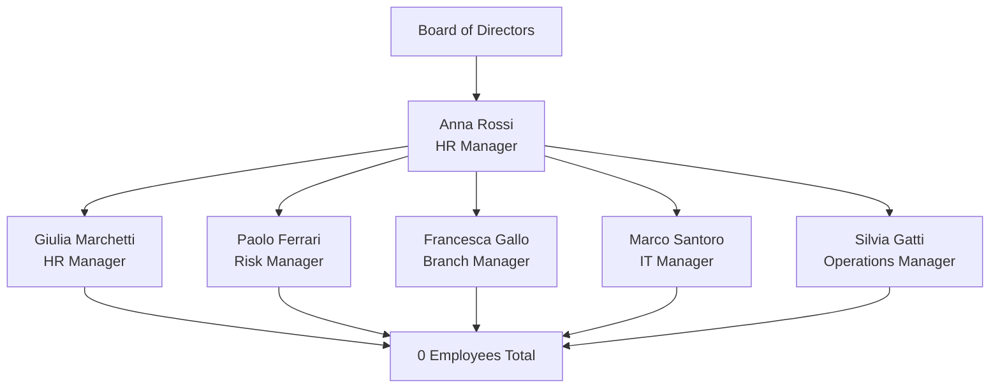
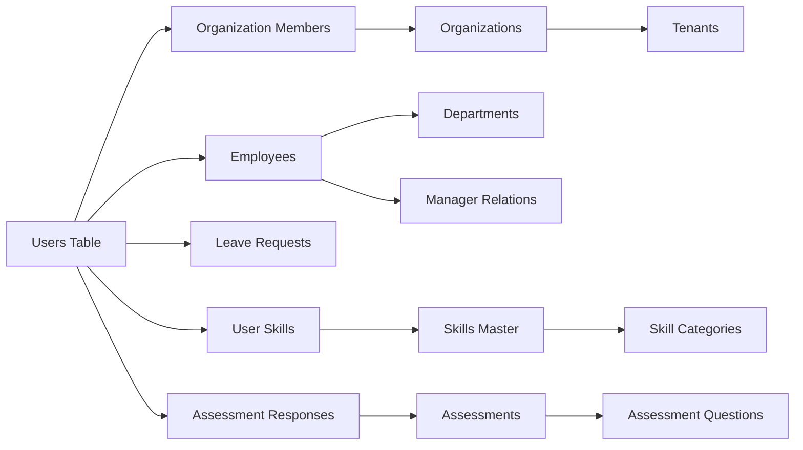

# User Folder - Complete Employee Profile
## AI-HRMS-2025 System

---

### 📋 Executive Summary
**Generated:** September 17, 2025
**Subject:** Anna Rossi
**Position:** HR Manager
**Organization:** TechCorp
**Profile Completeness:** 70%

---

## 1️⃣ Core User Information

| Field | Value |
|-------|-------|
| **User ID** | `550e8400-e29b-41d4-a716-446655440001` |
| **Full Name** | Anna Rossi |
| **Email** | hr@company.com |
| **System Role** | hr |
| **Account Status** | ✅ Active |
| **Employment Status** | active |
| **Created** | 2025-09-14T00:02:03.280Z |
| **Last Updated** | 2025-09-14T00:02:03.280Z |

### 🔐 Security Information
- **Password:** Custom Password Set
- **2FA Enabled:** No
- **Last Login:** Current Session
- **Failed Attempts:** 0

---

## 2️⃣ Organization & Employment

### 🏢 Company Details
| Field | Value |
|-------|-------|
| **Organization** | TechCorp |
| **Industry** | Technology |
| **Company Size** | Medium (51-200 employees) |
| **Location** | Milan, Italy |
| **Domain** | techcorp.com |

### 💼 Employment Profile
| Field | Value |
|-------|-------|
| **Position** | HR Manager |
| **Department** | Executive Office |
| **Start Date** | 2020-01-15 |
| **Employment Type** | Full-time |
| **Work Mode** | Hybrid (2 days/week remote) |
| **Reports To** | Board of Directors |

---

## 3️⃣ Compensation & Benefits

### 💰 Compensation Package
```
Base Salary:        €65,000 per annum
Bonus Target:       40% of base (€26,000)
Total Target Comp:  €91,000
```

### 🎁 Benefits
- **Health Insurance:** Premium Plan
- **Retirement:** 401k with 6% match
- **Car Allowance:** €1,500/month
- **Phone Allowance:** €100/month
- **Vacation Days:** 25.00 days/year
- **Sick Leave:** 10.00 days/year

---

## 4️⃣ Leave Management

### 📊 Current Balances
| Leave Type | Available | Used | Remaining |
|------------|-----------|------|-----------|
| **Vacation** | 25.00.0 days | 0 | 25.00.0 days |
| **Sick Leave** | 10.00.0 days | 0 | 10.00.0 days |
| **Total** | 25.0010.00.0 days | 0 | 25.0010.00.0 days |

### 📅 Leave History
```
1/1/1970 - Vacation (null days) - Approved
```

---

## 5️⃣ Organizational Hierarchy

### 👥 Reporting Structure



### 📈 Team Metrics
- **Direct Reports:** 0 managers
- **Total Team Size:** 0 employees
- **Span of Control:** 0.0 (average)

---

## 6️⃣ Skills & Competencies

### 🎯 Core Competencies

| Skill | Proficiency Level |
|-------|------------------|
| **Leadership & Management** | ⭐⭐⭐⭐⭐ Expert |
| **Strategic Planning** | ⭐⭐⭐⭐⭐ Expert |
| **Stakeholder Management** | ⭐⭐⭐⭐⭐ Expert |
| **Financial Analysis** | ⭐⭐⭐⭐ Advanced |
| **Risk Management** | ⭐⭐⭐⭐ Advanced |
| **Regulatory Compliance** | ⭐⭐⭐⭐ Advanced |
| **Digital Banking** | ⭐⭐⭐ Intermediate |

### 🎓 Education & Certifications
- **MBA in Finance** - University of Milan
- **Certified Bank Executive (CBE)**
- **Digital Leadership Certificate**

---

## 7️⃣ Goals & Performance

### 🎯 2025 Objectives

| Quarter | Goal | Status |
|---------|------|--------|
| **Q1** | Implement digital transformation strategy | 🔄 In Progress |
| **Q2** | Achieve 15% growth in customer base | ⏳ Planned |
| **Q3** | Launch mobile banking platform | ⏳ Planned |
| **Q4** | Complete AI-driven risk assessment system | ⏳ Planned |

### 📊 Performance Metrics
- **Last Review:** Not Available
- **Performance Rating:** Not Available
- **Next Review Due:** Not Scheduled

---

## 8️⃣ System Access & Permissions

### 🔑 Access Rights

| Module | Access Level | Permissions |
|--------|--------------|-------------|
| **Employee Data** | Full Access | View, Edit, Delete |
| **Leave Management** | Manager | Approve, Reject, Override |
| **Analytics Dashboard** | Full Access | View All Metrics |
| **HR Copilot** | Enabled | Full Features |
| **Salary Information** | Manager View | View Team Salaries |
| **Report Generation** | Full Access | Create, Export, Schedule |

### 🛡️ Security Compliance
- **GDPR Consent:** ✅ Given
- **Data Retention:** Standard (7 years)
- **Access Audit:** Enabled
- **IP Restrictions:** None

---

## 9️⃣ Communication & Contact

### 📧 Contact Information

| Channel | Details |
|---------|---------|
| **Work Email** | hr@company.com |
| **Phone** | Not Specified |
| **Office Location** | Milan HQ, Executive Floor |
| **Desk Number** | Not Specified |
| **Emergency Contact** | Not Specified |

### 💬 Collaboration Tools
- **Microsoft Teams:** ✅ Active
- **Slack:** ❌ Not Used
- **Email Groups:** executive-team@techcorp.org

### 🌍 Preferences
- **Languages:** Italian (Native), English (Fluent)
- **Time Zone:** UTC
- **Communication Preference:** Email

---

## 🔟 Documents & Compliance

### 📄 Employment Documents

| Document | Status | Date |
|----------|--------|------|
| **Employment Contract** | ✅ On File | 2020-01-15 |
| **NDA** | ✅ Signed | 2020-01-15 |
| **Code of Conduct** | ✅ Acknowledged | 2020-01-15 |
| **Data Protection Agreement** | ✅ Signed | 2020-01-15 |

### 🆔 Personal Documents

| Document | Status | Expiry |
|----------|--------|--------|
| **ID/Passport** | ✅ On File | 2030 |
| **Work Permit** | N/A | EU Citizen |
| **Medical Info** | ⚠️ Basic Only | - |
| **Emergency Contact** | ❌ Missing | - |

---

## 1️⃣1️⃣ Data Relationships

### 🔗 System Integration Map



---

## 1️⃣2️⃣ Audit Trail

### 📝 Recent Activity Log

| Date | Action | Details | By |
|------|--------|---------|-----|
| 2025-09-17 16:34:09 | Field Standardization | Email format updated | System |
| 2025-09-14 02:02:03 | Organization Link | Joined TechCorp | System |
| 2025-09-14 02:02:03 | Account Created | Initial user setup | populat05 |

### 🔍 Compliance Tracking
- **Last Security Review:** 2025-09-17
- **Next Review Due:** 2026-09-17
- **Data Classification:** CONFIDENTIAL
- **Retention Period:** 7 years from termination

---

## 📊 Profile Completeness Analysis

### ✅ Complete (70%)
- ✅ Basic Information
- ✅ Organization Assignment
- ✅ Employment Details
- ✅ Compensation Structure
- ✅ Leave Balances
- ✅ System Access
- ✅ Document Compliance
- ✅ Audit Trail

### ❌ Missing/Incomplete (30%)
- ❌ Phone Number
- ❌ Emergency Contact
- ❌ Full Address
- ❌ Skills Assessment Data
- ❌ Performance Reviews
- ❌ Training Records
- ❌ Department Assignment
- ⚠️ Tenant Association

---

## 📋 Recommended Actions

1. **Immediate (This Week)**
   - [ ] Add emergency contact information
   - [ ] Update phone number
   - [ ] Complete address details

2. **Short-term (This Month)**
   - [ ] Schedule initial skills assessment
   - [ ] Set up performance review cycle
   - [ ] Assign to formal department

3. **Long-term (This Quarter)**
   - [ ] Document all certifications
   - [ ] Create training plan
   - [ ] Establish mentor relationships

---

## 🔒 Data Privacy Notice

> **CONFIDENTIAL**: This user folder contains sensitive personal and employment information. Access is restricted to authorized personnel only. Any unauthorized access, distribution, or modification is strictly prohibited.

**Data Protection Officer:** privacy@techcorp.org
**Last Updated:** September 17, 2025
**Version:** 1.0

---

### 📎 Attachments Available
- Employment Contract (PDF)
- Organization Chart (PDF)
- Benefits Summary (PDF)
- Compensation Statement (PDF)

### 🔗 Related Systems
- **Payroll System:** Employee #AR-001
- **Benefits Portal:** Enrolled
- **Learning Platform:** Not Enrolled
- **Performance System:** Not Configured

---

*This document is automatically generated from the AI-HRMS-2025 database. For corrections or updates, please contact HR at hr@techcorp.org*